---
title: 2021年8月秋招复习笔记
---


[TOC]

# Java基础复习（JDK1.8）


## 容器篇

### 1.ArrayList

关键源码

```java
    /**
     * Default initial capacity.
     */
		// 默认初识容量为10
    private static final int DEFAULT_CAPACITY = 10;

    /**
     * Shared empty array instance used for empty instances.
     */
    private static final Object[] EMPTY_ELEMENTDATA = {};

    /**
     * Shared empty array instance used for default sized empty instances. We
     * distinguish this from EMPTY_ELEMENTDATA to know how much to inflate when
     * first element is added.
     */
    private static final Object[] DEFAULTCAPACITY_EMPTY_ELEMENTDATA = {};

    transient Object[] elementData; // non-private to simplify nested class access

		// 调用空参数构造方法之后，列表还是一个空的列表
    public ArrayList() {
        this.elementData = DEFAULTCAPACITY_EMPTY_ELEMENTDATA;
    }

	    /**
     * The maximum size of array to allocate.
     * Some VMs reserve some header words in an array.
     * Attempts to allocate larger arrays may result in
     * OutOfMemoryError: Requested array size exceeds VM limit
     */
		// 最大可库容的容量阈值， 当容量超过这个值的时候，ArrayList的最大容量为Integer.MAX_VALUE
    private static final int MAX_ARRAY_SIZE = Integer.MAX_VALUE - 8;

		// 添加元素
    public boolean add(E e) {
        ensureCapacityInternal(size + 1);  // Increments modCount!!
        elementData[size++] = e;
        return true;
    }
    private void ensureCapacityInternal(int minCapacity) {
        ensureExplicitCapacity(calculateCapacity(elementData, minCapacity));
    }
    private static int calculateCapacity(Object[] elementData, int minCapacity) {
        if (elementData == DEFAULTCAPACITY_EMPTY_ELEMENTDATA) {
            return Math.max(DEFAULT_CAPACITY, minCapacity);
        }
        return minCapacity;
    }
    private void ensureExplicitCapacity(int minCapacity) {
        modCount++;

        // overflow-conscious code
        if (minCapacity - elementData.length > 0)
            grow(minCapacity);
    }
		// 扩容关键性代码
    private void grow(int minCapacity) {
        // overflow-conscious code
        int oldCapacity = elementData.length;
        int newCapacity = oldCapacity + (oldCapacity >> 1);  // 每次扩容为原来的1.5倍
        if (newCapacity - minCapacity < 0)
            newCapacity = minCapacity; //扩容后如果不够，那么就直接扩容为当前容量+1
        if (newCapacity - MAX_ARRAY_SIZE > 0)
            newCapacity = hugeCapacity(minCapacity);
        // minCapacity is usually close to size, so this is a win:
        elementData = Arrays.copyOf(elementData, newCapacity);  // 通过拷贝数据中的元素到新的数组，进行扩容
    }
		// 判断是否超过最大的扩容阈值
    private static int hugeCapacity(int minCapacity) {
        if (minCapacity < 0) // overflow
            throw new OutOfMemoryError();
        return (minCapacity > MAX_ARRAY_SIZE) ?
            Integer.MAX_VALUE :
            MAX_ARRAY_SIZE;
    }
```

**总结：**

- ArrayList底层是通过数组实现的
- ArrayList的默认容量为10；
- ArrayList为懒加载，只有在添加了第一个元素之后才会真正分配空间
- 扩容时，每次扩容为原来容量的1.5倍：原来的容量值+容量值>>1
- 如果扩容后容量超过Integer.MAX_VALUE-8，ArrayList的容量就为Integer的最大值
- 每次扩容时，是通过将旧的数组中的元素拷贝到扩容后的新的数组中
- 查询、更新元素效率高


### 2.LinkedList

- LinkedList底层是通过双向链表实现的
- 可以当成Stack与Queue来实现
- 插入，删除元素效率高


### 3.HashMap

[HashMap原理](https://editor.csdn.net/md/?articleId=113561579)

小总结：

- 初识主数组长度：16（1<<4）
- 主数组最大长度：2^30
- 默认的负载因子0.75
- 链表树化阈值1：8
- 链表树化阈值2：主数组table长度超过64
- 红黑树退化成链表阈值：树节点少于6

> HashMap的主数组长度需要满足2的幂次方
>
> 比如输入为1，table长度为2
>
> 输入长度为15，table长度为16

#### HashMap插入元素底层原理

1. 插入元素前对key的HashCode进行扰动函数hash()计算

   1. > 现获取key的hashCode的值h，然后将h与h的高16位进行异或运算
      >
      > 其目的是在进行路由寻址的时候，能够保证在元素个数较少的情况下，路由地址会同时保持高16位和低16位的共同特征

2. 插入元素

   1. > **路由公式： i=hash & (table.length - 1)**
      >
      > 为什么是table.length - 1，而不是table.length呢？
      >
      > 因为table.length为2的幂次方计算出来（1000000000），0多1少
      >
      > 直接与hash进行&运算的时候，都会变为0，更容易发生hash冲突
      >
      > -1的目的就是将众多的0变为1，*与运算之后的值更不容易相同，缓解hash冲突。*

   2. >路由地址计算出来后，就要插入元素
      >
      >**插入情景1**：主数组i位置为null（没有冲突），直接插入元素
      >
      >**插入情景2**：主数组i位置存在元素，且key值相同，就新的value值覆盖旧的value值
      >
      >**插入情景3**：主数组i位置存在元素，且没有树化，尾插法插入链表
      >
      >​                      如果链表长度超过8，同时主数组长度打到64， 才开始树化
      >
      >**插入情景4**：主数组i位置存在元素，且已经树化成红黑树，向红黑树中插入元素

3. 元素插入达到阈值，进行扩容

   1. > 阈值计算：当前主数组长度 * 负载因子

   2. 主数组每次扩容原来的一倍：通过向左移位来实现（避免经过乘法器，耗性能）

   3. 扩容情景：

      1. 主数组对应的slot内没有元素（null），不做处理

      2. 主数组对应的slot内有元素，但是没有链化，直接用改元素的扰动值hash直接与（新的数组长度-1）进行&运算，计算出新的位置

      3. 主数组对应的slot内有元素，但是已经链化了

         1. > 这时就需要进行高低链分链
            >
            > 用key的hash值（扰动后的）与扩容前的旧容量进行&运算，如果为0，即为低链；不为0,即为高链
            >
            > 低链的元素扩容后还在**原索引**位置；高链的元素扩容后在**原索引+旧容量**处

         2. 如果是红黑树进行分链的时候，可能元素会少于6个，这个时候就需要退化成链表

<font color=red>HashMap在高并发的情况下，链表会出现环形链表</font>

<font color=green>这里提及一道经典面试题：如何判断一个链表是否有环？？？</font>

使用快慢指针（double pointer）

slow和fast：slow每次走一步，fast每次走两步；如果两个指针能相遇，一定存在环儿；

（<font color=blue>生活中的例子：两个人跑圈，快的人在第二圈的时候一定会遇到慢的那个人</font>）

### 4.线程安全的容器

上述提及的容器类都是线程不安全的容器类，在并发环境下应该避免使用

#### 线程安全的List

```java
List list = new ArrayList<>(); // 效率高，不支持并发


List list = new Vector<>(); // 线程安全，但是效率低
/**
vector 在添加元素的一些操作的方法，添加了synchronized关键，进行上锁，效率比较低
*/

List list = Collections.synchronizedList(new ArrayList<>()); // 线程安全，小数量完全可以
/*
synchronizedList内部是通过在具体的操作上包裹synchronized关键字，而不是粗暴的同步整个方法

*/


List list = new CopyOnWriteArrayList<>(); // 线程安全，JUC包下的类（写时复制）,适用于多线程环境

/*
每次添加元素的时候，先将集合中的元素复制到一个长度+1的新的数组中，然后将新增的元素添加到新的数组中，然后再将数组引用指向新的数组中。

这就保证了：读和写是在不同的对象上进行的，所以不存在资源竞争关系，不需要加锁
					读写分离思想
*/
```

#### 线程安全的HashMap

```java
// Collections.synchronizedMap
Map<Object, Object> synchronizedMap = Collections.synchronizedMap(new HashMap<>());

// ConcurrentHashMap
ConcurrentHashMap<Object, Object> map = new ConcurrentHashMap<>();
```

##### ConCurrentHashMap

1.7 [ConCurrentHashMap小灰漫画](https://zhuanlan.zhihu.com/p/31614308)

https://blog.csdn.net/ZOKEKAI/article/details/90051567：ConcurrentHashMap详解

`sizeCtl`:

> 默认值为0；
>
>  -1:表示table正在初始化；通过CAS赋值sizeCtl为-1，然后控制只有一个线程来完成初始化操作，其他线程都需要让出CPU`Thread.yield`
>
> -N:表示有N-1个线程正在扩容；
>
> 其它情况：
>
> - 如果table未初始化，表示table需要初始化的大小
> - 如果table初始化完成，表示table的容量，默认是table大小的0.75倍；

扩容时，是从后向前进行元素的**迁移**

多线程扩容，每个线程负责主数组16个slot，小于16的使用单线程即可


**什么是lastRun节点？**

lastRun是在迁移一个链表的数据时，保证后面的节点与自己的取余值相同，避免后面没有必要的循环。

其本质就是作为**低位链**或者**高位链**的头结点，这个节点后边的元素可以不进行循环计算，而前面的节点需要挨个进行hash&运算，如果是**低位链**或者**高位链**的节点，就采用<font color=green>头插法</font>将其节点插入到链表中。剩余的元素就是**高位链**或者**低位链**的元素。


## JVM篇

JVM：java虚拟机，能够识别.class文件，能够将class文件中的字节码指令进行识别并调用操作系统向上的API完成动作。

JRE：Java运行时环境。主要包括两个部分：JVM的标准实现和java的一些基本类库。相对于jvm来说，jre多出来一部分java类库

JDK：Java开发工具包。是整个Java开发的核心，继承了jre和一些好用的小工具。

### 1.JVM的内存构成

JAVA内存构成包括：**堆、java栈**、本地方法栈、程序计数器

jdk1.8之后，方法区（元空间并不在jvm中了，而是使用本地内存）

#### 1.1 程序计数器（PC寄存器）

##### 作用

- 字节码解释器通过改变程序计数器来一次读取指令，从而实现代码的流程控制
- 在多线程情况下，程序计数器记录的是当前线程执行的位置，从而当线程切换回来时，就知道上次执行到哪了。

##### 特点

- 是一块较小的内存空间
- 线程私有，每条线程都有自己的程序计数器
- 生命周期：随着线程的创建而创建，随着线程的结束而销毁
- 是唯一一个不会出现OutOfMemroyError的内存区域

#### 1.2 Java虚拟机栈（Java栈）

##### 定义

Java虚拟机栈是描述Java方法运行过程的内存模型

Java虚拟机栈会为每一个即将运行的Java方法创建一块叫做“栈帧”的区域，用于存放该方法运行过程中的一些信息，如：

- 局部变量表
- 操作数栈
- 动态链接
- 方法出口信息
- .......


##### 压栈出栈过程

当方法运行过程中需要创建局部变量时，就将局部变量的值存入栈帧中的局部变量表中。

Java虚拟机栈的栈顶的栈帧是当前正在执行的活动栈，也就是当前正在执行的方法，PC寄存器也会指向这个地址。只有这个活动的栈帧的本地变量可以被操作数栈使用，当在这个栈帧中调用另一个方法，与之对应的栈帧又会被创建，新创建的栈帧压入栈顶，变为当前的活动栈帧。

方法结束之后，当前栈帧被移除，栈帧的返回值变成新的活动栈帧中操作数栈的一个操作数。如果没有返回值，那么新的活动栈帧中操作数栈的操作数没有变化。

> 由于Java虚拟机栈是线程对应的，数据不是线程共享的，因此不同关系数据一致性问题，也不会存在同步锁的问题。

##### Java栈的特点

- 局部变量表随着栈帧的创建而创建，它的大小在编译时确定，创建时只需分配事先规定的大小即可。在方法运行过程中，局部变量表的大小不会发生改变。
- Java栈会出现两种异常：`StackOverFlowError` 和 `OutOfMemoryError`
  - StackOverFlowError若Java虚拟机栈的大小不允许动态扩展，那么当线程请求栈的深度超过当前Java虚拟机栈的最大深度时，抛出StackOverFlowError异常
  - OutOfMemoryError若允许动态扩展，那么当线程请求栈时内存用完了，无法再动态扩展时，抛出OutOfMemoryError异常。
- Java栈也是线程私有的，随着线程的创建而创建，随着线程的结束而销毁。

> 出现StackOverFlowError时，内存空间可能还有很多。

#### 1.3 本地方法栈（C栈）

##### 本地方法栈的定义：

本地方法栈是为JVM运行Native方法准备的空间，由于很多Native方法都是用C语言实现的，所以它通常又叫做C栈。它与Java虚拟机栈实现的功能类似，只不过本地方法栈是描述本地方法运行过程的内存模型。

##### 栈帧变化过程

本地方法被执行时，在本地方法栈也会创建一块栈帧，用于存放该方法的局部变量表、操作数栈、动态链接、方法出口信息等。

方法执行结束后，相应的栈帧也会出栈，并释放本地内存空间。也会抛出`StackOverFlowError`和`OutOfMemoryError`异常。

> 如果Java虚拟机本身不支持Native方法，或者本身不依赖与传统栈，那么可以不提供本地方法栈。如果本地支持方法栈，那么这个栈一般会在线程创建的时候按线程分配。

#### 1.4 Java堆Heap

##### 定义

堆是用来存放对象的内存空间，几乎所有的对象都存储在堆中

##### 特点

- 线程共享，整个Java虚拟机只有一个堆，所有的线程都访问同一个堆。而程序计数器、Java栈、本地方法栈都是一个线程对应一个。
- 在虚拟机启动时创建。
- 是垃圾回收的主要场所
- 进一步可分为：新生代（Eden区， From Survivor、To Survivor）、老年代

不同的区域存放不同生命周期的对象，这样可以根据不同的区域使用不同的垃圾回收算法，更具有针对性。

堆的大小既可以固定也可以扩展，但对于主流的虚拟机，堆的大小是可扩展的，因为当线程请求分配内存，但堆已满，且内存已无法再扩展时，就抛出`OutOfMemoryError`

> Java堆所使用的内存不需要保证是连续的。而由于堆是被所有线程共享的，所以对它的访问需要注意同步问题，方法和对应的属性都需要保证一致性。

##### 堆的划分


**逻辑上：**

- 新生代（Young）
  - Eden
  - 幸存区：From 和To
- 老年代（Old）
- 元空间

**物理上：**

物理上分为 **新生代+老年代**，而元空间使用的是直接内存

##### 内存分配策略

###### 1. 对象优先分配在Eden区

大多数情况下，对象在新生代Eden区中分配。当Eden去没有足够空间进行分配时，虚拟机将发起一次Minor GC。

👇**Minior GC vs Major GC**

- Minior GC：回收新生代（包括Eden和Survivor区域），因为Java对象大多都具备朝生夕灭的特性，所以Minior GC非常频繁，一般回收速度也比较快。
- Major GC：回收老年代，Major GC的速度一般会比Minor GC慢10倍以上。

###### 2.大对象直接进入老年代

大对象是指需要大量连续内存空间的Java对象，如很长的字符串或数据。

虚拟机提供了一个`-XX:PretenureSizeThreshold`参数，令大于这个设置值的对象直接在老年代分配，这样做的目的是避免在Eden以及两个Survivor区之间发生大量的内存复制。

> 只要分配的对象的内存大小大于这个参数的时候就会直接分配到老年代

###### 3. 长期存活的对象将进入老年代（默认15）

JVM给每个对象定义了一个对象年龄计数器。当新生代发生一次Minor GC后，存活下来的对象年龄+1，当年龄超过`-XX:MaxTenuringThreshold, 默认为15`设置的值时，就将超过该值的所有对象转移到老年代中。

###### 4. 动态年龄判定

Survivor空间中相同年龄所有对象大小的总和大于Survivor空间的一半

（`-XX:TargetSurvivorRatio 默认值为50， 意味Survivor区对象使用率阈值为50%` ），年龄大于或等于该年龄的对象直接进入老年代。

##### 老年代空间分配担保

什么是空间分配担保？

> 在发生Minor GC之前，虚拟机会检查老年代最大可用的连续空间是否大于新生代所有对象的总空间：
>
> ​	如果大于，则此次Minor GC是安全的
>
> ​	如果小于, 则虚拟机会查看HandlePromotionFailure设置值是否允许担保失败。
>
> ​			如果`HandlePromotionFailure=true`，那么会继续检查老年代最大可用连续空间是否大于`历次晋升到老年代的对象的平均大小`，如果大于，则尝试进行一次Minor GC，但是这次Minor GC 依然是有风险的（<font color=green>因为Minor Gc之后，再次进入到老年代的对象的总大小有可能超过老年代最大可用连续空间</font>）
>
> ​			如果小于或者`HandlePromotionFailure=false`则改为进行一次Full GC

为什么要进行空间担保？

> 是因为新生代采用**复制收集算法**，假如大量对象在Minor GC后仍然存活（最极端情况为内存回收后新生代中所有对象均存活），而Survivor空间是比较小的，这时就需要老年代进行分配担保，把Survivor无法容纳的对象放到老年代。**老年代要进行空间分配担保，前提是老年代得有足够空间来容纳这些对象**，但一共有多少对象在内存回收后存活下来是不可预知的，**因此只好取之前每次垃圾回收后晋升到老年代的对象大小的平均值作为参考**。使用这个平均值与老年代剩余空间进行比较，来决定是否进行Full GC来让老年代腾出更多空间。

总结起来：新生代存在大量存活的对象，Survivor无法容纳这些对象，老年代要进行空间分配担保；担保前要判断自生有没有能力，如果没有能力就需要触发Full GC。

#### 1.5 方法区

##### 方法区定义

Java虚拟机规范中定义方法区是堆的一个逻辑部分。方法区存放一下信息：

- 已经被虚拟机加载的类信息
- 常量
- 静态变量
- 即时编译器编译后的代码

##### 方法区的特点

- 线程共享。方法区是堆的一个逻辑部分，因此和堆一样，都是线程共享的。整个虚拟机中只有一个方法区。
- 内存回收效率低。方法区中的信息一般需要长期存在，回收一遍之后可能只有少量信息无效。主要回收目标是：对常量池的回收；对类型的卸载

##### 运行时常量池

方法区中存放：**类信息、常量、静态变量、即时编译器编译后的代码**。常量就存放在运行时常量池中


### 2. 垃圾收集策略&算法

#### 2.1 判断对象是否存活

1. **引用计数法**

> 在对象头维护着一个counter计数器，对象被引用一次则计数器+1；若引用失效则计数器-1.当计数器为0时，就认为该对象无效了。
>
> 引用计数算法的实现简单，判定效率也很高，在大部分情况下它都是一个不错的算法。但是主流的 Java 虚拟机里没有选用引用计数算法来管理内存，主要是因为它很难解决对象之间循环引用的问题。
>
> > 举个栗子👉对象 objA 和 objB 都有字段 instance，令 objA.instance = objB 并且 objB.instance = objA，由于它们互相引用着对方，导致它们的引用计数都不为 0，于是引用计数算法无法通知 GC 收集器回收它们。

2. **可达性分析（GC Roots）**

基本思路就是通过一些列名为”GC Roots“的对象作为起始点，开始向下搜索，如果一个对象到GCRoots没有任何引用链，就说明这个对象已经没有引用了，就可以作为垃圾。

也即给定一个集合的引用作为根出发，通过引用关系遍历对象图，能被遍历到的（可达到的）对象就被判定为存活，没有被遍历到的就自然判定为死亡对象。

###### 哪些对象可以作为GC Roots

- **虚拟机栈中的引用的对象**
- **方法区中的类静态属性引用的对象**
- **方法区中的常量引用的对象**
- **synchronized同步的对象**

GC Roots并不包括堆中对象引用的对象，这样就不会有循环引用的问题。


#### 2.1 垃圾收集算法

###### 标记-清除算法


缺点：内存会产生碎片化


###### 标记-复制


缺点：预留一半的内存区域；整个内存空间只有一半可以使用


###### 标记-整理


缺点：标记整理虽然可以解决内存碎片化问题，也不存在内存空间浪费，但是需要移动存活的对象，但是，当内存中存活对象多，并且都是一些微小对象，而且垃圾对象较少时，要移动大量的存活对象才能换取少量的内存空间。


###### 分代收集算法

一块独立的内存区域只能使用一种垃圾回收算法，根据对象生命周期特征，将其划分到不同的区域，再对特定区域使用特定的垃圾回收算法，只有这样才能将垃圾回收算法的优点发挥到极致，这种组合的垃圾回收算法称之为：分代收集算法（分代回收算法）

根据对象存活周期的不同，将内存划分为几块。一般是把 Java 堆分为新生代和老年代，针对各个年代的特点采用最适当的收集算法。

- 新生代：复制算法
- 老年代：标记-清除算法、标记-整理算法


### 3. HotSpot垃圾收集器（7种）

#### 3.1 新生代垃圾收集器

##### 1. Serial GC收集器


> 单线程，只会使用一个cpu或一条线程去完成垃圾收集工作，这也意味着在进行垃圾收集时，必须暂停其他所有的工作线程，直到它收集结束为止（<font color=red>臭名昭著的Stop The World</font>）
>
> **收集算法**：复制算法
>
> 与用户线程串行执行，单线程地好处就是减少上下文切换，减少系统资源的开销。但这种方式的缺点也很明显，在GC的过程中，会暂停程序的执行。若GC不是频繁发生，这或许是一个不错的选择，否则将会影响程序的执行性能。 对于新生代来说，区域比较小，停顿时间短，所以比较使用。
>
> **参数**：`-XX:+UseSerialGC` 
>
> 在JDK Client模式，不指定JVM参数，默认是串行垃圾收集器

##### 2. ParNew收集器

ParNew收集器是Serial GC的多线程版本，除了使用多线程进行垃圾收集外，其余行为包括Serial收集器可用的所有控制参数、收集算法(复制算法)、Stop The World、对象分配规则、回收策略等与Serial收集器完全相同，两者共用了相当多的代码。


ParNew收集器除了使用了多线程收集外，其他与Serial收集器相比并无太多创新之外，但是它是许多运行在Server模式下的虚拟机首选的新生代收集器，其中有一个与性能无关的重要原因是，除了Serial收集器外，目前只有它能和CMS收集器配合工作。

> **算法**：复制算法
>
> 用于新生代
>
> GC时需要暂停所有用户线程，直到GC结束
>
> **参数**：
>
> ​	`-XX:+UseConcMarkSweepGC`：指定使用CMS后，会默认使用ParNew作为新生代收集器
>
> ​	`-XX:+UseParNewGC`：强制指定使用ParNew
>
> ​	`-XX:ParallelGCThreads`：指定垃圾收集的线程数量，ParNew默认开启的收集线程与CPU的数量相同

##### 3. Parallel Scavenge收集器（吞吐量优先）

Parallel收集器同样也采用了复制算法，并行回收和STW机制；和ParNew不同之处在于，Parallel收集器的目标则是达到一个可控制的吞吐量，也被称为吞吐量优先的垃圾收集器。


> 参数：
>
> `-XX:MaxGCPauseMillis` 设置最大停顿时间STW，这参数设置的越小，停顿时间可能会缩短，但也会导致吞吐量下降，当值垃圾收集发生的更频繁。
>
> `-XX:GCtimeRatio` 垃圾收集时间占时间总比   用于衡量吞吐量
>
> ​	垃圾收集执行时间占应用程序执行时间的比例计算方法：`1/(n+1)`
>
> ​	例如`-XX:GCTimeRatio=19`,那么设置了垃圾收集时间占总时间的5% = 1/(19+1);
>
> ​	默认值是99，即1%；
>
> `-XX:UseAdaptiveSizePolicy` 设置Parallel收集器具有自适应调节功能；开启这个参数后，就不用手工指定一些细节参数了，如`新生代大小 -Xmn`、`Eden与Survivor区的比例 -XX:SurvivorRation`、`晋升老年代的对象年龄 -XX:MaxTenuringThreshold`

JVM会根据当前系统运行情况收集性能监控信息，动态调整这些参数，以提供最合适的停顿时间或最大的吞吐量，这种调节方式称为GC自适应的调节策略(GC Ergonomiscs)；

另外值得注意的一点是，Parallel Scavenge收集器无法与CMS收集器配合使用，所以在JDK 1.6推出Parallel Old之前，如果新生代选择Parallel Scavenge收集器，老年代只有Serial Old收集器能与之配合使用。


#### 3.2 老年代垃圾收集器

##### 1. Serial Old收集器


> **算法**：标记-整理
>
> 可作为CMS收集器的后备预案，并在CMS发生”Concurrent Mode Failure“ 时使用。


##### 2. Parallel Old


Parallel Scavenge收集器的老年代版本，并行收集器，吞吐量优先

> **算法**：标记-整理
>
> **参数**：`-XX:UseparallelOldGC` 指定使用Parallel Old收集器


##### 3. CMS并发清除（Concurrent Mark Sweep）

这个收集器有与工作线程执行**并发**的能力。

> **算法**：标记-清除
>
> **特点**：收集过程中不需要暂停用户线程，以获取最短回收停顿时间为目标


CMS GC过程分四步：

1. **初始标记**（initial mark）

   > 单线程执行， 需要STW，但仅仅把GC Roots的直接关联可达的对象给标记一下，由于直接关联对象比较小，所以这里的速度非常快。

2. **并发标记**（Concurrent mark）

   > 对于初识标记过程所标记的初识标记对象，进行并发跟踪标记
   >
   > 此时其他线程仍可以继续工作。此处时间较长，但不停顿，并不能保证可以标记出所有的存活对象；
   >
   > **与用户线程并发执行**

3. **重新标记**（remark）

   > 在并发标记的过程中，由于可能还会产生新的垃圾，所以此时需要重新标记新产生的垃圾。
   >
   > 此处执行**并行标记**，与用户线程不并发，所以依然是STW
   >
   > 且停顿时间比初识标记稍长，但远比并发标记短。

4. **并发清除**（Concurrent sweep）

   >  并发清除之前所有标记的垃圾；
   >
   >  其他用户线程仍可以工作，不需要停顿。
   >
   >  **与用户线程并发执行**

Tips：初始标记和重新标记仍然需要STW

**初始标记**仅仅标记一下GC Roots能直接关联到的对象，速度很快；

**并发标记**就是进行GC Roots Tracing的过程；

而**重新标记**阶段则是为了修正并发标记期间因用户程序继续运行而导致标记产生变动的那一部分对象的标记记录，这个阶段的停顿时间一般会比初始标记阶段长，但远比并发标记的时间短。

由于整个过程中耗时最长的并发标记和并发清除过程，收集器线程都可以与用户线程一起工作，所以整体上说，CMS收集器的内存回收过程是与用户线程一共并发执行的。

> **参数**：
>
> `-XX:+UseConcMarkSweepGC`：使用CMS收集器
>
> `-XX:+UseCMSCompactAtFullCollection`：Full GC后，进行一次碎片整理；整理过程是独占的，会引起停顿时间变长。
>
> `-XX:+CMSFullGCsBeforeCompaction`：设置进行几次Full GC后，进行一次碎片整理
>
> `-XX:ParallelCMSThreads`：设置CMS的线程数量（一般情况约等于可用CPU数量）

**优点**：

总体来说，与Parallel Old垃圾收集器相比，CMS减少了执行老年代垃圾收集时应用暂停的时间；但却增加了新生代垃圾收集时应用暂停的时间，降低了吞吐量而且需要占用更大的堆空间；

由于耗时的**并发标记**和**并发清除**阶段都不需要暂停工作，所以整体的回收是低停顿的。

由于CMS以上特性，缺点也是比较明显的。

**缺点**：

1. 对CPU资源非常敏感

2. 浮动垃圾

   由于CMS并发清理阶段用户线程还在运行着，伴随程序运行自然就还会有新的垃圾不断产生，这一部分垃圾出现在标记过程之后，CMS无法在当次收集中处理掉它们，只好留待下一次GC时再清理掉。这一部分垃圾就称为“浮动垃圾”。

   由于在垃圾收集阶段用户线程还需要运行，那就还需要预留有足够的内存空间给用户线程使用，因此CMS收集器不能像其他收集器那样等到老年代几乎完全被填满了再进行收集，也可以认为CMS所需要的空间比其他垃圾收集器大；

   `-XX:CMSInitiatingOccupancyFraction`: 设置CMS预留内存空间

3. ”Concurrent Mode Failure“失败

   如果如果CMS运行期间预留的内存无法满足程序需要，就会出现一次“Concurrent Mode Failure”失败，这时虚拟机将启动后备预案：临时启用Serial Old收集器来重新进行老年代的垃圾收集，这样会导致另一次Full GC的产生。这样停顿时间就更长了，代价会更大，所以 `-XX:CMSInitiatingOccupancyFraction`不能设置得太大。

4. 产生大量内存碎片

   这个问题并不是CMS的问题，而是算法的问题。由于CMS基于"标记-清除"算法，清除后不进行压缩操作，所以会产生碎片

   "标记-清除"算法介绍时曾说过：

   产生大量不连续的内存碎片会导致分配大内存对象时，无法找到足够的连续内存，从而需要提前触发另一次Full GC动作。

   **碎片解决方法：**

   -  `-XX:+UseCMSCompactAtFullCollection`

     - 使得CMS出现上面这种情况时不进行Full GC，而开启内存碎片的合并整理过程；但合并整理过程无法并发，停顿时间会变长；

   - `-XX:+CMSFullGCsBeforeCompation`

     - 设置执行多少次不压缩的Full GC后，来一次压缩整理

     - 为减少合并整理过程的停顿时间；

       默认为0，也就是说每次都执行Full GC，不会进行压缩整理；

       由于空间不再连续，CMS需要使用可用"空闲列表"内存分配方式，这比简单使用"碰撞指针"分配内存消耗大；

       

#### 3.3 G1收集器

G1(Garbage - First)名称的由来是G1跟踪各个Region里面的垃圾堆的价值大小(回收所获得的空间大小以及回收所需时间的经验值)，在后台维护一个优先列表，每次根据允许的收集时间，优先回收价值最大的Region。

注意：G1与前面的垃圾收集器有很大不同，它把新生代、老年代的划分取消了！

这样我们再也不用单独的空间对每个代进行设置了，不用担心每个代内存是否足够。

取而代之的是，G1算法将堆划分为若干个区域(Region)，它仍然属于分代收集器。不过，这些区域的一部分包含新生代，新生代的垃圾收集依然采用暂停所有应用线程的方式，将存活对象拷贝到老年代或者Survivor空间。老年代也分成很多区域，G1收集器通过将对象从一个区域复制到另外一个区域，完成了清理工作。这就意味着，在正常的处理过程中，G1完成了堆的压缩(至少是部分堆的压缩)，这样也就不会有CMS内存碎片问题的存在了。


G1收集器运作过程


1. 初识标记

   - 初始标记仅仅只是标记一下GC Roots能直接关联到的对象，速度很快

2. 并发标记

   - 进行GC Roots Tracing的过程，从刚才产生的集合中标记出存活对象；(也就是从GC Roots 开始对堆进行可达性分析，找出存活对象。)

     耗时较长，但应用程序也在运行；

     并不能保证可以标记出所有的存活对象；

3. 最终标记

   - 最终标记和CMS的重新标记阶段一样，也是为了修正并发标记期间因用户程序继续运作而导致标记产生变动的那一部分对象的标记记录，

     这个阶段的停顿时间一般会比初始标记阶段稍长一些，但远比并发标记的时间短，

     也需要“Stop The World”。(修正Remebered Set)

4. 筛选回收

   - 首先排序各个Region的回收价值和成本
   - 然后根据用户期望的GC停顿时间来制定回收计划；
   - 最后按计划回收一些价值高的Region中垃圾对象

   回收时采用”复制算法“，从一个或多个Region复制存活对象到堆上的另一个空间Region，并且在此过程中压缩和释放内存；

   可以并发进行，降低停顿时间，并增加吞吐量

   > **参数**：
   >
   > `-XX:+UseG1GC`：指定使用G1收集器
   >
   > `-XX:InitiatingHeapOccupancyPercent`: 当整个Java堆的占用率达到参数值时，开始并发标记阶段；默认为45；
   >
   > `-XX:MaxGCPauseMillis`： 为G1设置暂停时间目标，默认值为200毫秒；
   >
   > `-XX:G1HeapRegionSize`：设置每个Region大小，范围1MB到32MB；目标是在最小Java堆时可以拥有约2048个

#### 小结：


### 2.类加载过程

类从被加载到虚拟机内存中开始，到卸载出内存位置，他的整个生命周期如下如：


1. **加载**
   - 通过一个类的全限定名来获取定义此类的二进制字节流
   - 将这个字节流所代表的静态存储结构转化为方法区的运行时数据结构
   - 在Java堆中生成一个代表这个类的java.lang.Class对象，作为方法区数据的访问入口
2. **验证**
   - 验证阶段作用是保证Class文件的字节流包含的信息是否符合JVM规范，不会给JVM造成危害。如果验证失败，就会抛出一个java.lang.VerifyError异常或子类异常。验证过程分为四个阶段：
     - 文件格式验证：验证字节流文件是否符合Class文件格式的规范，并且能被当前虚拟机正确的处理
     - 元数据验证：是对字节码描述的信息进行语义分析，以保证其描述信息符合Java语言的规范
     - 字节码验证：主要是进行数据流和控制流的分析，保证被校验类的方法在运行时不会危害JVM
     - 符号引用验证：符号引用验证发生在虚拟机将符号引用转化为直接引用的时候，这个转化动作将在解析阶段中发生。

<font color=green>符号引用（Symbolic References）说明</font>

> 符号引用以一组符号来描述所引用的目标，符号引用与虚拟机的内存布局无关，引用的目标不一定加载到内存中。
>
> <font color=blue>在java中，一个java类将会编译成一个class文件。在编译时，java类并不知道所引用的类的实际地址，因此只能使用符号引用来代替</font>
>
> 比如org.simple.People类引用了org.simple.Language类，在编译时People类并不知道Language类的实际内存地址，因此只能使用符号org.simple.Language（假设是这个，当然实际中是由类似于CONSTANT_Class_info的常量来表示的）来表示Language类的地址。各种虚拟机实现的内存布局可能有所不同，但是它们能接受的符号引用都是一致的，因为符号引用的字面量形式明确定义在Java虚拟机规范的Class文件格式中。

3. **准备**

   - 准备阶段为变量分配内存并设置类变量的初始化。在这个阶段分配的仅为类的变量（static修饰的变量），而不包括类的实例变量（实例变量在new 的时候初始化）。对已非final的变量，JVM会将其设置成”零值“，而不是其赋值语句的值：

     ```java
     private static int size = 12;
     ```

     那么这个阶段，size的值为0，而不是12。final修饰的类变量将会赋值成真实的值。

4. **解析**

   - 解析过程是将常量池内的**符号引用**替换成**直接引用**。主要包括四种类型引用的解析。**类或接口的解析**、**字段解析**、**方法解析**、**接口方法解析**。

5. **初始化**

   - 在准备阶段，类变量已经经过一次初始化了，在这个阶段，则是根据程序员通过程序制定的计划去初始化类的变量和其他资源。这些资源有static{}块，构造函数，父类的初始化等。

6. **使用**

7. **卸载**


### 3. 双亲委派机制


**java中的四种类加载器**

1. 启动（Bootstrap）类加载器

   > 启动类加载器是本地代码实现的类加载器，它负责将<JavaRuntimeHome>/lib下面的类库加载到内存中。由于启动类加载器涉及到虚拟机本地实现细节，开发者无法直接取到启动类加载器的引用。

2. 标准扩展（Extension）类加载器

   > 扩展类加载器负责将<JavaRuntimeHome>/lib/ext或者系统变量java.ext.dir指定位置中的类库加载到内存中。开发者可以直接使用标准扩展类加载器

3. 应用程序（Application）类加载器

   > 应用程序类加载器负责加载用户路径（classpath）上的类库


**双亲委派机制**

> 当一个类收到类加载请求时，它首先不会尝试自己去加载这个类，而是把这个请求`委派给父类加载器`去完成，每一层的类加载器都是如此，因此所有的加载请求都应该传送到启动类加载器中，只有当父类加载器反馈自己无法完成这个请求的时候（在它的加载路径下没有找到所需加载的Class）（从最顶层的BootStrap -》Extension-》Application-》自己定义的类加载器），子类加载器才会尝试自己加载。

**双亲委派机制的作用**

> 为了保证自己写的代码不污染java出厂自带的源代码。如果有人想替换系统级别的类：如String.java.篡改它的实现，但是在这种机制下这些系统的类已经被Bootstrap ClassLoader加载过了，所以并不会再去加载，从一定程度上**防止了危险代码的植入**。
>
> 1. **防止重复加载用一个.class。通过委托去上层，加载过了，就不用再加载一遍**。保证数据安全
> 2. 保证了使用不同的类加载器最终得到的都是同一个Object对象。


### 3.创建（new）对象的过程

1. **检查类是否已经被加载**
   - 当JVM遇到一条字节码new指令时，首先检查该引用指向的类是否能够在常量池中被找到（也就是检查方法区中有没有该类的信息），如果没有，先加载这个类；有的话就执行下一步，为对象分配内存
2. **为对象分配内存空间**
   - 类加载检查通过后，接下来虚拟机会为对象分配内存。对象需要多大的内存在类加载完成后便可完全确定，为对象分配内存就是把一块确定大小的内存块从堆上划分出来。
3. **为对象字段设置零值**
   - 分配完内存后，需要对对象的字段进行零值初始化，（也就是对象的实例数据部分，对象的内存布局被分为三个部分：**对象头**、**实例数据**、**对齐填充**），对象头除外，零值初始化意思就是对对象的字段赋0值，或者null值。
4. **设置对象头**
   - 虚拟机需要对这个将要创建出来的对象，进行信息标记，包括是否为新生代/老年代，对象的hash码，元数据信息，这些标记存放在对象头信息中。
5. **执行构造方法**
   - 执行对象的构造方法，初始化对象，这样一个对象才算被成功创建。

### 4.对象的内存布局

> 提问：`Object o = new Object();` 请问一个object对象占多少内存空间？

Java对象的内存布局：**对象头（Header）**、**实例数据（Instance Data）**和**对齐填充（Padding）**，**8字节对齐**。


- **Mark Word**
  - 存储对象的hashCode、GC分代年龄、锁状态标志、线程持有的锁、偏向线程ID、偏向时间戳
- **Class Pointer**
  - 指向对象对应的Class对象（类对象）的内存地址
- **Instance Date**
  - 具体的数据大小，如对象含有一个int成员变量，即为4字节
- **Padding**
  - 8字节对齐

在64bit的JVM中，MarkWord为64bit-8字节，这样一个`Object`对象占有**16个字节**


### 5. 四大引用类型


#### 1. 强引用

`StrongReference`是java的默认引用形式，使用时不需要显示定义。任何通过强引用所使用的对象，不管jvm内存是否充足，Java GC都不会主动回收具有强引用的对象。

> 如果一个对象具有强引用，那么垃圾收集器不会回收它
>
> 当JVM内存空间不足时，Java虚拟机宁愿抛出OurOfMemoryError错误，使程序异常终止，也不会回收强引用对象。

#### 2. 软引用

`SoftReference<String[]> softArr = new SoftReference<String[]>(new String[] {"a", "b", "c"});`

软引用在内存充足时，GC不会回收；如果内存不足时，GC会回收这个对象。

**应用场景**

> 实现内存敏感的高速缓存，比如网页缓存，图片缓存等。使用软引用能防止内存泄漏


#### 3. 弱引用

`WeakReference<String[]> weakArr=new WeakReference<String[]>(new String[]{"a","b","c"});`

如果一个对象只具有弱引用，无论内存充足与否，Java GC后对象都会被回收。

**应用场景**

> ThreadLocal

##### ThreadLocal 弱引用造成的数据泄漏问题

`ThreadLocalMap`内部Entry类

```java
static class Entry extends WeakReference<ThreadLocal<?>> {
  /** The value associated with this ThreadLocal. */
  Object value;

  Entry(ThreadLocal<?> k, Object v) {
    super(k);
    value = v;
  }
}
```

可以看出，ThreadLocal内部每个线程维护的本地变量map中的Entry的<font color=red>key是弱引用类型`WeakReference`,不管JVM内存空间是否充足，在GC的时候，都会回收里面的key</font>。

<font color=red>但是value依然是强引用类型</font>，这就会造成这种情况：GC回收的时候，把key进行了回收，变为了`null`,但是其对应的value还有值存在，但是无法被引用到了，这就造成了**`内存泄漏`**,因此，在实际使用ThreadLocal的过程中，使用完毕后需要及时调用`remove()`方法，避免造成数据泄漏。


#### 4. 虚引用

虚引用需要配合引用队列`ReferenceQueue`联合使用。当执行Java GC时如果一个对象只有虚引用，就会把这个对象加入到与之关联的`ReferenceQueue`中。

```java
//虚引用PhantomReference
    //必须和引用队列联合使用
    ReferenceQueue<String[]> rqueue = new ReferenceQueue<>();
    PhantomReference<String[]> phanArr = new PhantomReference<String[]>(new String[]{"a","b"},rqueue);
    /**
     *
     * 应用场景：
     *大多被用于引用销毁前的处理工作
     *
     */
```

当垃圾回收期准备回收一个对象时，如果发现它还有虚引用，就会在回收对象的内存之前，把这个虚引用加入到与之关联的引用队列中。

程序可以通过判断引用队列中是否已经加入了虚引用，来了解引用的对象是否将要被垃圾回收。程序如果发现某个虚引用已经被加入到引用队列中，那么就可以在所引用的对象的内存被回收之前采取必要的行动。


### 6. JVM常用调优参数

[Oracle关于JVM参数配置参考表](https://www.oracle.com/java/technologies/javase/vmoptions-jsp.html)

| 配置参数                             | 功能                                                         | 备注 |
| ------------------------------------ | ------------------------------------------------------------ | ---- |
| `-Xms`                               | 初识堆大小。如`-Xms256m`                                     |      |
| `-Xmx`                               | 最大堆大小。如`-Xmx1024m`                                    |      |
| `-Xmn`                               | 新生代大小。通常为`Xmx`的1/3或1/4.<br />新生代=Eden+2个Survivor空间。<br />实际可用空间为=Eden+1个Survivor，即90% |      |
| `-Xss`                               | 每个线程堆栈大小，默认为1M                                   |      |
| `-XX:NewRatio`                       | 老年代/新生代的比例，默认`-XX:NewRatio=2`,代表老年代：新生代=2：1 |      |
| `-XX:SurvivorRatio`                  | 新生代中Eden与Survivor的比值。默认值为8  `-XX:SurvivorRatio=8` |      |
| `java -XX:+PrintFlagsFinal -version` | 查看jvm所有参数选项的值                                      |      |
| `-XX:MaxTenuringThreshold`           | 新生代晋升老年的的年龄<br />默认值`-XX:MaxTenuringThreshold=15` |      |
| `-XX:MetaspaceSize`                  | 元空间大小                                                   |      |
| `-XX:MaxMetaspaceSize`               | 元空间最大空间大小                                           |      |
| `-XX:PretenureSizeThreshold`         | 大对象所占空间超过这个阈值，直接分配到老年代                 |      |
| `-XX:+PrintGCDetails`                | 打印GC信息                                                   |      |
| `关于设置垃圾收集器`                 |                                                              |      |
| `-XX:+UseSerialGC`                   | 新生代使用Serial GC， 老年代使用Serial old                   |      |
| `-XX:+UseParNewGC`                   | 新生代使用ParNew收集器，老年代使用Serial Old                 |      |
| `-XX:+UseConcMarkSweepGC`            | 新生代使用ParNew收集器，老年代使用CMS                        |      |
| `-XX:ParallelGCThreads=8`            | 这个参数指定并行GC线程的数量，<br />一般最好和cpu核心数相当。 |      |
| `-XX:+UseParallelOldGC`              | 新生代使用ParallelGC收集器，<br />老年代使用ParallelOldGC收集器 |      |
| `-XX:ConcGCThreads`                  | 设置CMS并发线程数                                            |      |
| `-XX:+UseG1GC`                       | 开启G1收集器                                                 |      |
| `关于锁`                             |                                                              |      |
| `-XX:+UseSpinning`                   | 启用自旋锁优化，jdk1.6之后默认开启                           |      |
| `-XX:PreBlockSpin`                   | 设置自旋多少次后升级为重量级锁；默认`-XX:PreBlockSpin=10`    |      |
|                                      |                                                              |      |


## 并发与多线程篇

### 1. 进程与线程

进程是程序的一次执行过程，是系统运行程序的基本单位，因此进程是动态的。系统运行一个程序即是一个进程从创建，运行到消亡的过程。同时，每个进程还占有某些系统资源如CPU时间，内存空间，文件，输入输出设备的使用权等等。

**进程与进程之间的通信方式**

1. **管道pipe**
   - 通常指无名管道，**unix**系统IPC最古老的形式
   - 只能用于具有亲缘关系的进程之间的通信（父子进程，兄弟进程）
2. **命名管道FIFO**
   - 在磁盘上有对应的节点，但是没有数据块。一旦建立，任何进程都可以通过文件名将其打开和进行读写，而不局限于父子进程，当然前提是进程对FIFO有适当的访问权。当不再被进程使用时，FIFO在内存中释放，但磁盘节点仍然存在。
3. **消息队列MessageQueue**
   - 消息队列，就是一个消息的链表，是一系列保存在内核中消息的列表。用户进程可以向消息队列添加消息，也可以从消息队列读取消息。
   - 消息队列与管道通信相比，其优势是对每个消息指定特定的消息类型，接收的时候不需要按照队列次序，而是可以根据自定义条件接收特定类型的消息。
   - 进程间通过消息队列通信，主要是：创建或打开消息队列，添加消息，读取消息和控制消息队列
4. **共享存储SharedMemory**
   - 共享内存允许两个或多个进程共享一个给定的存储区，这一段存储区可以被两个或两个以上的进程映射至自身的地址空间中，一个进程写入共享内存的信息，可以被其他使用这个共享内存的进程，通过一个简单的内存读取策略读出，从而实现了进程间的通信。
   - 采用共享内存进行通信的一个主要好处是**效率高**，因为进程可以直接读写内存，而不需要任何数据的拷贝，对于像管道和消息队列等通信方式，则需要在内核和用户空间进行四次的数据拷贝，而共享内存则只拷贝两次：` 一次从输入文件到共享内存`和 `一次从共享内存输出文件`
5. **信号量Semaphore**
   - 信号量用于实现进程间的互斥与同步，而不是用于存储进程间通信数据。
6. **套接字Socket**
   - 适合同一主机的不同进程间和不同主机的进程间进行全双工网络通信
7. 信号（sinal）


#### 线程的几种状态

`Thread.State`枚举类查看线程的各种状态

1. **NEW（新建）**
2. **RUNNABLE（就绪）**
3. **BLOCKED（阻塞）**
4. **WAITING（等待）**
5. **TIMED_WAITING（超时等待）**
6. **TERMINATED（终止）**


**wait/sleep都会导致线程的阻塞，有什么区别？**

- **wait**放开手去睡，放开手里的锁
- **sleep**握紧手去睡，醒了手里还有锁


#### Java中实现多线的方式

1. 继承Thread类，实现run方法
2. 实现Runnable接口，实现run方法
3. 实现Callable接口，实现call方法。注意：新建Thread的时候，Thread的构造方法中没有接收Callable的。（中间商赚差价！！！）所有我们需要找到一个既可以联系Runnable接口又联系Callable接口的类（FutureTask））
   - `FutureTask`中的`get()`方法会阻塞线程，一直等待线程计算完成后才执行下面的后续代码。一般放在最后。
   - 同一个futureTask对象只能被线程调用一次，当有新的线程调用了已经被调用过的futuretask对象时，这次只会复用上一次的结果，不会再执行一次。
4. 线程池`ExecutorService`(ThreadPoolExecutor类)


### 2. JUC

#### JUC强大的辅助类：

##### 1. CountDownLatch类

计数器不为0，`countDownLatch.await(); `方法后面的代码都被一直阻塞

每调用一个线程，就需要执行`countDownLatch.countDown()`,将其计数器减一

##### 2. CyclicBarrier

一句话：集齐七颗龙，召唤神龙。

没调用一个线程，就需要执行`cyclicBarrier.await()`,将计数器加1

**CyclicBarrier类与CountDownLatch类的区别**

| CountDownLatch                                               | CyclicBarrier                                                |
| ------------------------------------------------------------ | ------------------------------------------------------------ |
| 减计数方式                                                   | 加计数方式                                                   |
| 计算为0时释放所有等待的线程                                  | 计数达到指定值时释放所有等待线程                             |
| 计数为0时，无法重置                                          | 计数达到指定值时，计数置为0重新开始                          |
| 调用countDown()方法计数减一，调用await()方法只进行阻塞，对计数没任何影响 | 调用await()方法计数加1，若加1后的值不等于构造方法的值，则线程阻塞 |
| 不可重复利用                                                 | 可重复利用                                                   |

##### 信号量：Semaphore类（类似于PV操作）

两个关键性操作：

1. `semaphore.acquire()` 请求资源
2. `semaphore.release() ` 释放资源

> acquire：当一个线程调用acquire操作时，它要么成功，获取信号量（信号量-1）；要么一直等待下去，直到有线程释放了信号量，或者超时
>
> release：实际上会将信号量的值加1，然后唤醒等待的线程。

信号量的主要作用：

> 用于**对多个共享资源的互斥使用**
>
> 用于**并发线程数的控制**


### 阻塞队列（BlockingQueue）


线程1往阻塞队列中生产元素，线程2 从阻塞队列中消费元素。

阻塞队列满了，生产线程阻塞；

阻塞队列空了，消费线程阻塞。

***阻塞队列的用处***

> 在多线程领域：所谓阻塞，在某些情况下会 挂起 线程（即阻塞），一旦满足条件，被挂起的线程又会被自动唤醒。
> 为什么需要BlockingQueue，好处是我们不需要关心什么时候 需要阻塞线程，什么时候需要唤醒线程因为这一切BlockingQueue都给你一手包办了


| 实现类                                     | 说明                                                         |
| ------------------------------------------ | ------------------------------------------------------------ |
| <font color=red>ArrayBlockingQueue</font>  | 由数组结构组成的有界阻塞队列                                 |
| <font color=red>LinkedBlockingQueue</font> | 由链表结构组成的有界（但大小默认值为integer.MAX_VALUE）阻塞队列 |
| <font color=red>SynchrousQueue</font>      | 不存储元素的阻塞队列，也即单个元素的阻塞队列                 |
| PriorityBlockingQueue                      | 支持优先级排序的无界阻塞队列                                 |
| DelayQueue                                 | 使用优先级队列实现的延迟无界阻塞队列                         |
| LinkedTransferQueue                        | 由链表组成的无界阻塞队列                                     |
| LinkedBlockingDeque                        | 由链表组成的双向阻塞队列                                     |


### 3. 线程池

```java
public ThreadPoolExecutor(
  												// 常驻核心线程数
  												int corePoolSize,
  												// 最大线程数
                          int maximumPoolSize,
  												// 空闲线程的存活时间，
                          long keepAliveTime,
  												// 时间单位
                          TimeUnit unit,
  												// 阻塞队列：用于存放被提交但尚未被执行的任务，类似于银行的候客区：窗口已经满了，需要排队等待
                          BlockingQueue<Runnable> workQueue,
  												// 线程池中工作线程的线程工厂，用于创建线程。
                          ThreadFactory threadFactory,
  												// 拒绝策略（阻塞队列满了，无法再容纳更多的线程任务）
                          RejectedExecutionHandler handler) {
  if (corePoolSize < 0 ||
      maximumPoolSize <= 0 ||
      maximumPoolSize < corePoolSize ||
      keepAliveTime < 0)
    throw new IllegalArgumentException();
  if (workQueue == null || threadFactory == null || handler == null)
    throw new NullPointerException();
  this.acc = System.getSecurityManager() == null ?
    null :
  AccessController.getContext();
  this.corePoolSize = corePoolSize;
  this.maximumPoolSize = maximumPoolSize;
  this.workQueue = workQueue;
  this.keepAliveTime = unit.toNanos(keepAliveTime);
  this.threadFactory = threadFactory;
  this.handler = handler;
}
```


#### 线程池拒绝策略

| 拒绝策略                                     | 说明                                                         | 备注 |
| -------------------------------------------- | ------------------------------------------------------------ | ---- |
| **`ThreadPoolExecutor.AbortPolicy(默认)`**   | 直接抛出RejectedExecutionException异常阻止系统正常运行       |      |
| **`ThreadPoolExecutor.CallerRunsPolicy`**    | **调用者运行**机制：该策略既不会抛弃任务，也不会抛出异常，而是将某些任务回退到调用者，从而降低新任务的流量（谁让你找我的，你回去找谁去） |      |
| **`ThreadPoolExecutor.DiscardOldestPolicy`** | 抛弃队列中等待最久的任务，然后把当前任务加入队列中尝试再次提交当前任务。 |      |
| **`ThreadPoolExecutor.DiscardPolicy`**       | 该策略默默地丢弃无法处理的任务，不予任何处理也不抛出异常。如果任务允许丢失，这是最好的一种策略。 |      |


### 4. volatile&JMM内存模型


#### JMM内存模型


> JMM是java的内存模型，JMM定义了程序中各个共享变量的访问规则，即在虚拟机中奖变量存储到内存和从内存读取变量这样的底层细节。
>
> 设计JMM主要的目的是：屏蔽各种硬件和操作系统的内存访问差异，以实现让Java程序在各种平台下都能达到一致的内存访问效果。
>
> 由于JVM运行程序的实体是线程，而每个线程创建时JVM都会为其创建一个工作内存（有些地方成为栈空间），工作内存是每个线程私有的数据区域，而Java内存模型中规定所有变量都存储在主存中，主存是共享内存区域，所有线程都可以访问。
>
> 但是线程对变量的操作（读取赋值等）必须在工作内存中进行，首先要将变量先从主存拷贝到线程自己的工作内存空间，然后对变量进行操作，操作完成后再将变量写回主存。
>
> 不能直接操作主存中的变量，各个线程中的工作内存中存储着主存中的变量副本，因此不同线程间无法访问对方的工作内存，线程间的通信（传值）必须通过主存来完成。


#### volatile

##### volatile特性：

1. **可见性**

   - 保证了不同线程对这个变量进行操作时的可见性，即一个线程修改了某个变量的值，这新值对其他线程来说是立即可见的

   - > **volatile底层实现可见性的原理**
     >
     > 以两核CPU为例（双核）
     >
     > 由于cpu的速度要比内存快的多，为了弥补这个性能差异，cpu内核都会有自己的高速缓冲区，当内核运行线程执行一段代码时，首先将这段代码的指令集进行缓存行填充到高速缓存，如果非volatile变量，当CPU执行修改了此变量之后，会将修改后的值回写到高速缓存，然后再刷新到内存中。如果刷新回内存之前，由于是共享变量，那么core2中的线程执行的代码也用到了这个变量，这时变量的值依然是旧的。
     >
     > volatile关键字就会解决这个问题
     >
     > > 首先被volatile关键字修饰的共享变量在转换成汇编语言时，会加上一个lock为前缀的指令，当cpu发现这个指令时，立即做两件事：
     > >
     > > 1. <font color=green>将当前内核高速缓存行的数据立刻回写到内存；</font>
     > > 2. <font color=green>使其他内核里缓存了该内存地址的高速缓存中的数据无效。重写从主存中读取该数据</font>

2. **禁止指令重排**

   - volatile内存区的读写，通过加屏障来禁止指令重排列
   - LoadLoad屏障：对于这样的语句`Load1; LoadLoad; Load2`, 在`Load2`以及后续读取操作要读取的数据被访问前，要保证`Load1`要读取的数据被读取完毕。
   - StoreStore屏障：对于这样的语句`Store1;StoreStore;Store2`, 在`Store2`以及后续写入操作执行前，保证`Store1`的写入操作对其它处理器可见。
   - LoadStore屏障：对于这样的语句`Load1;LoadStore;Store2`,在`Store2`以及后续写入操作被刷出前，保证`Load1`要读取的数据被读取完毕
   - StoreLoad屏障：对于这样的语句`Store1;StoreLoad;Load2`,在`Load2`以及后续所有读取操作执行前，保证`Store1`的写入对所有处理器可见。

3. **不保证原子性**


### 5. synchronized原理

[深入分析Synchronized原理](https://www.cnblogs.com/aspirant/p/11470858.html)

```java
public class SynchronizedDemo {

    public synchronized void method(){
        synchronized (this){
            System.out.println(
                    "Synchronized Demo"
            );
        }
    }

    public static void main(String[] args) {
    }
}
```

上述代码通过 `javap -c -l -p .class`反编译成字节码结果如下：

``` java
Compiled from "SynchronizedDemo.java"
public class SynchronizedDemo {
  public SynchronizedDemo();
    descriptor: ()V
    Code:
       0: aload_0
       1: invokespecial #1                  // Method java/lang/Object."<init>":()V
       4: return
    LineNumberTable:
      line 1: 0
    LocalVariableTable:
      Start  Length  Slot  Name   Signature
          0       5     0  this   LSynchronizedDemo;

  public synchronized void method();
    descriptor: ()V
    Code:
       0: aload_0
       1: dup
       2: astore_1
       3: monitorenter			// 一次 monitorenter
       4: getstatic     #2                  // Field java/lang/System.out:Ljava/io/PrintStream;
       7: ldc           #3                  // String Synchronized Demo
       9: invokevirtual #4                  // Method java/io/PrintStream.println:(Ljava/lang/String;)V
      12: aload_1
      13: monitorexit			// 两次monitorexit
      14: goto          22
      17: astore_2
      18: aload_1	
      19: monitorexit			// 两次monitorexit
      20: aload_2
      21: athrow
      22: return
    Exception table:
       from    to  target type
           4    14    17   any
          17    20    17   any
    LineNumberTable:
      line 4: 0
      line 5: 4
      line 8: 12
      line 9: 22
    LocalVariableTable:
      Start  Length  Slot  Name   Signature
          0      23     0  this   LSynchronizedDemo;

  public static void main(java.lang.String[]);
    descriptor: ([Ljava/lang/String;)V
    Code:
       0: return
    LineNumberTable:
      line 12: 0
    LocalVariableTable:
      Start  Length  Slot  Name   Signature
          0       1     0  args   [Ljava/lang/String;
}

```

1. `monitorenter`：每个对象都是一个监视器锁（**monitor**）。当**monitor**被占用时就会处于锁定状态，线程执行`monitorenter`指令时，尝试获取**monitor**的所有权，过程如下：

> 1. 如果**monitor**的进入数为0，则该线程进入**monitor**，然后将进入数设置为1，该线程即为**monitor**的所有者；
> 2. 如果线程已经占有该**monitor**，只是重新进入，则进入**monitor**的进入数加1；
> 3. 如果其他线程已经占用了**monitor**，则该线程进入阻塞状态，直到**monitor**的进入数为0，再重新尝试获取**monitor**的所有权

2. `monitorexit`:执行`monitorexit`的线程必须是`objectref`所对应的`monitor`的所有者。指令执行时，`monitor`的进入数减1，如果减1后进入数为0，那线程退出`monitor`，不再是这个`monitor`的所有者。其他被这个`monitor`阻塞的线程可以尝试去获取这个`monitor`的所有权

> <font color=red>monitorexit指令出现了两次，第1次为同步正常退出释放锁；第2次为发生异常退出释放锁；</font>

**Synchronized**的语义底层是通过一个monitor的对象来完成的。


### 6.锁&锁升级

[浅谈偏向锁、轻量级锁、重量级锁](https://www.jianshu.com/p/36eedeb3f912)

Synchronized加锁时，进程会从**用户态**转换成**内核态**，让操作系统帮忙调度。用户态与内核态的转换是非常耗时的，所以说Synchronized是重要级的锁。

**关于Synchronized的升级**

参考文献https://blog.csdn.net/steven2xupt/article/details/108047270

由于synchronized性能问题在JDK1.6前饱受诟病，同时和@author Doug Lea大神写的目前在JUC下的AQS实现的锁差距太大，synchronized开发人员感觉脸上挂不住，所以在1.6版本进行了大幅改造升级，于是就出现了现在常通说的锁升级或锁膨胀的概念,整体思路就是能不打扰操作系统大哥就不打扰大哥，能在用户态解决的就不经过内核。


**升级过程**

1. 无锁态
2. 偏向锁
3. 轻量级锁（自旋锁：CAS）
4. 重量级锁


**MarkWord**


简单来说：

| 状态       | 标志位 | 存储内容                             |
| ---------- | ------ | ------------------------------------ |
| 未锁定     | 01     | 对象哈希码、对象分代年龄             |
| 轻量级锁定 | 00     | 指向锁记录的指针                     |
| 重量级锁定 | 10     | 执行重量级锁定的指针                 |
| GC标记     | 11     | 空(不需要记录信息)                   |
| 偏向锁     | 01     | 偏向线程ID、偏向时间戳、对象分代年龄 |


对象内存布局中的markWord会记录当前只有锁的线程id，如果一个线程获取到锁，那么这个线程线程的id会被记录到markword中。

**锁升级的大致过程：**

> 从**无锁态**，如果有对象尝试获取锁，则进入**偏向锁状态**（这时只有一个线程在使用资源）；
>
> 如果下一次还是这个线程使用资源，（尝试获取锁），先会比较markword中的线程id是否为这个线程，如果是，直接获得**偏向锁**。
>
> 如果有竞争（就是不同线程争抢锁），就会升级到**轻量级锁**（自旋锁CAS）；
>
> 如果竞争激烈，自旋了好久（**默认10次**）都没有竞争到锁，那么就会升级为**重量级锁**，然后**挂起此线程**，等待资源的释放后**重新竞争锁**

>  JDK1.6引入了自适应自旋锁，所谓自适应自旋锁，就意味着自旋的次数不再是固定的，具体规则如下：
>
> 自旋次数通常由前一次在同一个锁上的自旋时间及锁的拥有者的状态决定。如果线程【T1】自旋成功，自旋次数为17次，那么等到下一个线程【T2】自旋时，也会默认认为【T2】自旋17次成功，
>
> 如果【T2】自旋了5次就成功了，那么此时这个自旋次数就会缩减到5次。
>
> 自适应自旋锁随着程序运行和性能监控信息，从而使得虚拟机可以预判出每个线程大约需要的自旋次数


### 7.AQS（AbstractQueuedSynchronizer）：抽象队列同步器

[AQS参考贴子](https://blog.csdn.net/qq_21040559/article/details/112388069)

AQS是用来构建锁或者其他同步器组件的**重量级基础框架及整个JUC体系的基石**，通过内置的FIFO队列来完成资源获取线程的排队工作，并通过一个**int类型的变量**表示**持有锁的状态**。

**锁**：面向锁的使用者

**同步器**：面向锁的实现者

#### CLH

AQS是JUC的核心，而CLH锁又是AQS的基础，说核心也不为过，因为AQS就是用了变种的CLH锁。如果要学好Java并发编程，那么必定要学好JUC；学好JUC，必定要先学好AQS；学好AQS，那么必定先学好CLH。因此，这就是我们为什么要学习CLH的原因。


CLH：AQS中的队列是CLH变体的虚拟双向队列FIFO。

相关说明：

> 抢到资源的线程直接使用处理业务逻辑，抢不到资源的必然涉及一种排队等候机制。抢占资源失败的线程继续去等待（类似于银行业务办理窗口都满了，暂时没有受理窗口的顾客只能去候客区排队等待），但等待线程仍然保留获取锁的可能且获取锁流程仍在继续（候客区的顾客也在等着叫号，轮到了再去受理窗口办理业务）。
>
> 既然说到了<font color=red>排队等候机制</font>,那么就一定会有某种队列来管理，这个队列就是我们所说的**CLH**
>
> 如果共享资源被占用，就需要一定的阻塞等待唤醒机制来保证锁的分配。这个机制主要用的是CLH队列的变体实现的。将暂时获取不到锁🔐的线程加入到队列中，这个队列就是AQS的抽象表现。它将请求共享资源的线程封装成队列的节点（Node），通过CAS，自旋以及`LockSupport.park()`方式，维护state变量的状态，使并发达到同步的控制效果。
>
> <font color=green>Node</font>有两种模式：**SHARED**：共享模式；**EXCLUSIVE**：排他模式
>
> 队列中的每个节点<font color=green>Node</font>中有一个字段`waitStatus`代表当前节点在CLH中的状态：
>
> - **0**：当前一个Node被初始化的时候的默认值
> - **CANCELLED**（1）：表示线程获取锁的请求已经取消了，不想等了，直接取消了
> - **CONDITION**（-2）：表示节点在等待队列中，节点线程等待唤醒（等待Condition唤醒）
> - **PROPAGATE**（-3）：当前线程处在SHARED情况下，该字段才会使用
> - **SIGNAL**（-1）：表示线程已经准备好了，等待资源释放

#### AQS初步

##### AQS初识

AQS使用一个`volatile`的`int`类型的成员变量来表示同步状态，通过内置的`FIFO`队列来完成资源获取的排队工作将每条要去抢占资源的线程封装成一个Node节点来实现锁的分配，通过CAS来完成对`State`值的修改。

##### AQS内部体系架构


**相关说明**

当AQS中的状态为State为0的时候，说明此时没有资源竞争，那么当前线程占用当前资源，同时State状态位+1;如果State大于等于1时（大于1时表示重入锁🔐），就说明当前资源又线程被占用，其它线程需要进行等待，其它线程会被封装成Node节点，然后放入到CLH中。

在CLH中，双向链表中的第一个节点时一个<font color=red>傀儡节点</font>, 起到站位的作用，其实际并不存储任何信息。真正存储数据的节点是从第二个开始的。因此**`傀儡节点（哨兵节点）中的Thread=null`**.

没到CLH中的线程节点争抢到资源的时候，那么之前的<font color=red>傀儡节点</font>将会被断开引用，然后挣抢到资源的线程所在节点的`Thread字段置为空`,然后这个节点成为新的<font color=red>傀儡节点</font>


**AQS = CLH + State**


**串插一个面试题**

智力题-找机器
十个机器，其中九个机器生产的货物是5g，只有一个机器生产的货物是4g，给你一个称，如何一次找出那个生产4g货物的机器。

解题：
将10个机器依次进行编号，分别为1-10。1号机器生产1个货物，2号机器生产2个货物，以此类推，10号机器生产10个货物，共计55个货物。
假设每个机器生产的货物都是5g，则这55个货物的总重量为275g。因此，275g - 实际的重量 = 机器的编号。
原因：假设是n号机器生产的货物为4g，则n号机器总共生产n个货物，即重量减少了ng。


## 常用设计模式


### 1.单例模式


### 2.工厂模式


### 3.模板模式


### 4.代理模式


```java
public class ProxyTest {
    public static void main(String[] args) {
        Proxy proxy = new Proxy();
        proxy.Request();
    }
}
//抽象主题
interface Subject {
    void Request();
}
//真实主题
class RealSubject implements Subject {
    public void Request() {
        System.out.println("访问真实主题方法...");
    }
}
//代理
class Proxy implements Subject {
    private RealSubject realSubject;
    public void Request() {
        if (realSubject == null) {
            realSubject = new RealSubject();
        }
        preRequest();
        realSubject.Request();
        postRequest();
    }
    public void preRequest() {
        System.out.println("访问真实主题之前的预处理。");
    }
    public void postRequest() {
        System.out.println("访问真实主题之后的后续处理。");
    }
}
```


### 5.建造者模式


### 6.观察者模式


### 7. 原型设计模式


原型（Prototype）模式的定义如下：用一个已经创建的实例作为原型，通过复制该原型对象来创建一个和原型相同或相似的新对象。在这里，原型实例指定了要创建的对象的种类。用这种方式创建对象非常高效，根本无须知道对象创建的细节。例如，Windows 操作系统的安装通常较耗时，如果复制就快了很多。在生活中复制的例子非常多，这里不一一列举了。

#### 原型模式的优点：

- [Java](http://c.biancheng.net/java/) 自带的原型模式基于内存二进制流的复制，在性能上比直接 new 一个对象更加优良。
- 可以使用深克隆方式保存对象的状态，使用原型模式将对象复制一份，并将其状态保存起来，简化了创建对象的过程，以便在需要的时候使用（例如恢复到历史某一状态），可辅助实现撤销操作。

#### 原型模式的缺点：

- 需要为每一个类都配置一个 clone 方法
- clone 方法位于类的内部，当对已有类进行改造的时候，需要修改代码，违背了开闭原则。
- 当实现深克隆时，需要编写较为复杂的代码，而且当对象之间存在多重嵌套引用时，为了实现深克隆，每一层对象对应的类都必须支持深克隆，实现起来会比较麻烦。因此，深克隆、浅克隆需要运用得当。

#### 原型模式的实现


由于 Java 提供了对象的 clone() 方法，所以用 Java 实现原型模式很简单。

原型模式包含以下主要角色。

1. 抽象原型类：规定了具体原型对象必须实现的接口。
2. 具体原型类：实现抽象原型类的 clone() 方法，它是可被复制的对象。
3. 访问类：使用具体原型类中的 clone() 方法来复制新的对象。

```java
//具体原型类
class Realizetype implements Cloneable {
    Realizetype() {
        System.out.println("具体原型创建成功！");
    }
    public Object clone() throws CloneNotSupportedException {
        System.out.println("具体原型复制成功！");
        return (Realizetype) super.clone(); // 浅拷贝
    }
}
//原型模式的测试类
public class PrototypeTest {
    public static void main(String[] args) throws CloneNotSupportedException {
        Realizetype obj1 = new Realizetype();
        Realizetype obj2 = (Realizetype) obj1.clone();
        System.out.println("obj1==obj2?" + (obj1 == obj2));
    }
}
```


[Java中的深浅拷贝（clone）](https://www.cnblogs.com/xzwblog/p/7230788.html)


## 列举Java几个异常

1. ` java.lang.OutOfMemoryError`
   - 当可用内存不足以让Java虚拟机分配给一个对象时抛出该错误。
2. ` java.lang.StackOverflowError`
   - 当一个应用递归调用的层次太深而导致堆栈溢出或者陷入死循环时抛出该错误
3. `java.lang.CloneNotSupportedException`
   - clone方法所在类没有继承Cloneable接口
4. `java.util.ConcurrentModificationException` 


# Linux 复习

## 常用命令

```bash
# 查看磁盘情况
df -h 

# 查看目录，或文件使用磁盘情况
du

# 查看内存使用情况
free -h

# http 工具

curl URL

# 进程
ps -ef

top

htop 交互式top命令


# 远程同步
scp

rsync   # 同步，同步之间会比较之前的文件，只会同步更改的内容


# 比较两个文件的差异
diff 文件1 文件2 -y -W

# 查看历史命令
history


# 服务管理命令

service

# 管理systemd的资源Unit
systemctl


```


### top详解

```shell
# 当前时间、系统已运行时间、当前登录用户的数量、最近5、10、15分钟内的平均负载
# load average数据是每隔5秒钟检查一次活跃的进程数，然后按特定算法计算出的数值。如果这个数除以逻辑CPU的数量，结果高于5的时候就表明系统在超负荷运转了
top - 15:56:34 up 46 days, 20:13,  0 users,  load average: 8.20, 9.77, 10.36
# tasks 统计，系统现在共有34个任务，1个正在运行，33
Tasks:  34 total,   1 running,  33 sleeping,   0 stopped,   0 zombie
# CPU 使用情况 
# us：用户空间占用情况
# sy：内核空间占用情况
# ni：改变过优先级的进程占用CPU的百分比
# id：空闲CPU百分比
# wa： IO等待占用CPU的百分比
# hi：硬中断占用cpu百分比
# si：软中断占用cpu百分比
%Cpu(s):  5.2 us,  5.1 sy,  0.6 ni, 89.0 id,  0.0 wa,  0.0 hi,  0.0 si,  0.0 st
KiB Mem : 26390454+total, 18626068 free, 18532243+used, 59956032 buff/cache
KiB Swap:        0 total,        0 free,        0 used. 47536756 avail Mem 
```


# MySql复习


## 1. 数据库三范式

1. **第一范式：每个列不可再分**
2. **第二范式：不存在部分函数依赖**
3. **第三范式：不存在传递函数依赖**


## 2.MySql存储引擎

MySql中的数据，索引以及其他对象是如何存储的，是一套文件系统实现的（Storage Engine）

MY_SQL存储引擎有以下几种：

- MRG_MYISAM
- MyISM
- BLACKHOLE
- CSV
- MEMORY
- ARCHIVE
- InnoDB
- PERFORMANCE_SCHEMA


**InnoDB引擎**：InnoDB引擎提供了对数据库ACID事务的支持。并且还提供了行级锁和外键的约束。它的设计的目标就是处理大数据容量的数据库系统。

**MyISAM引擎**：不提供事务的支持，也不支持行级锁和外键

**Memory引擎**：所有的数据都在内存中，数据的处理速度快，但是安全性不搞。


**常见的*MyISAM*与*InnoDB*的比较**

|                                                              | MyISAM                                                       | InnoDB                                                       |
| ------------------------------------------------------------ | ------------------------------------------------------------ | ------------------------------------------------------------ |
| 存储结构                                                     | 每张表被存放在三个文件：<br />frm-表格定义<br />MYD（MYData）-数据文件<br />MYI（MYIndex）-索引文件 | 所有的表都保存在同一个数据文件中<br />（也可能是多个文件，或者是独立的表空间文件）<br />InnoDB表的大小只受限于操作系统文件的大小，<br />一般为2GB |
| 存储空间                                                     | MyISAM可被压缩，存储空间较小                                 | InnoDB的表需要更多的内存和存储，<br />它会在主内存中建立专用的缓冲池<br />用于高速缓冲数据和索引 |
| 可移植性、备份及恢复                                         | 由于MyISAM的数据是以文件的形式存储，所以在跨平台的数据转移中会很方便。<br />在备份和恢复时可单独针对某个表进行操作。 | 数据和索引都是集中存储的                                     |
| 记录存储顺序                                                 | 按记录插入顺序保存                                           | 按主键大小有序插入                                           |
| 外键                                                         | **不支持**                                                   | **支持**                                                     |
| 事务                                                         | **不支持**                                                   | **支持**                                                     |
| 锁支持（锁是避免资源争用的一个机制，MySql锁对用户几乎是透明的） | **表级锁定**                                                 | **行级锁定**，**表级锁定**，锁定粒度小并发能力高             |
| SELECT                                                       | MyIsam更有                                                   |                                                              |
| INSERT、UPDATE、DELETE                                       |                                                              | InnoDB更优                                                   |
| 索引的实现方式                                               | B+树索引，myisam是堆表                                       | B+树索引，InnoDB是索引组织表                                 |
| 哈希索引                                                     | 不支持                                                       | 支持                                                         |
| 全文索引                                                     | 支持                                                         | 不支持                                                       |

**MyISAM索引与InnoDB索引的区别**

- InnoDB索引是聚簇索引（索引的存储顺序与实际的数据物理存储顺序保持一致），MyIsam索引是非聚簇索引
- InnoDB的主键索引的叶子结点存储着行数据，因此主键索引非常高效
- MyISAM索引的叶子结点存储的是行数据地址，需要再寻址一次才能得到数据
- InnoDB非主键索引的叶子结点存储的是主键和其他索引的列数据，因此查询时做到覆盖索引会非常高效。


## 3. 索引

### 3.1 什么是索引？

索引是一种数据结构。数据库索引，是数据库管理系统中一个排序的数据结构，以协助快速查询、更新数据库表中数据。索引的实现通常使用B树及其变种B+树。

### 3.2 索引的优点

- 可以大大加快数据的检索速度，这就是创建索引的最主要的原因
- 通过使用索引，可以在查询的过程中，使用优化器，提高系统的性能

### 3.3 索引的缺点

- 时间方面：创建索引和维护索引要耗费时间，具体地，当对表中的数据进行增加，删除和修改的时候，索引也要动态的维护，会降低增删改的执行效率。
- 空间方面：索引需要占物理空间


### 3.4 索引使用注意事项

索引虽好，但是索引使用不恰当就会造成索引失效

**索引使用口诀：**

1. **全值匹配我最爱**
   - 就是查询的列都是索引（覆盖索引，这中情况不需要查询实际的物理数据，只需要查询索引树即可）
2. **最佳左前缀法则**
   - 如果索引了多列，在使用时就要遵守最左前缀法则
     - 带头大哥不能死
     - 中间兄弟不能断
3. **索引列上不计算**
   - 使用sum，avg等计算或者 自动(手动)类型转换，都会导致索引失效
4. **范围之后全失效**
5. **%加在like右边**
6. **字符串里有引号**
   - 字符转不加单引号，会导致索引失效
7. 其他
   - 使用**!=，<>, is null； is not null ；or**都会导致索引失效


**非聚簇索引一定会产生回表吗？**

不一定。如果查询语句中的的列全部命中索引，那就不必再进行回表查询了。


## 4. MySql日志

MariaDB/MySql中日志包括：

1. 错误日志（Error log）：记录mysql服务启动时正确和错误的信息，还记录启动、停止、运行过程中的错误信息
2. 查询日志（general log）：记录建立的客户端连接和执行的语句。
3. 二进制日志（binlog）：记录所有更改数据的语句，可用于数据复制
4. 慢查询日志（show log）：记录所有执行时间超过long_query_time的所有查询或不使用索引的查询
5. 中继日志（relay log）：主从复制时使用的日志。
6. InnoDB引擎还有事务日志


### 4.1 二进制日志

[事务日志详解](https://www.cnblogs.com/f-ck-need-u/archive/2018/05/08/9010872.html)

MySql支持statement、row、mixed三种形式的记录方式。

- statement
  - 将所有的相关操作记录为SQL语句的形式
  - 这样的记录方式对某些特殊信息无法同步记录，例如uuid，now()等这样的动态变化的值。
- row
  - 基于行来记录，将相关行的每一列的值都在日志中保存下来
  - 这样的结果会导致日志文件变得非常大，但是保证了动态值的确定性。
- mixed
  - statement与row混合形式
  - 默认采用statement的方式记录，只有以下几种情况会采用row的形式来记录日志
    - 表的存储引擎为NDB，这是对表的DML操作都会以row的格式记录
    - 使用了uuid(), user(), current_user(), found_rows(), row_cuount()等不确定函数。但是测试发现对now()函数仍然会以statement格式记录，而sysdate()函数会以row格式记录。
    - 使用了insert delay语句
    - 使用了临时表


### 4.2 事务日志

InnoDB存储引擎的事务日志包括：undo log 和 redo log

redo log 通常是物理日志，记录的是数据页的物理页修改，而不是某一行或某几行修改成怎么样，它用来恢复提交后的物理数据页（恢复数据页，且只能恢复到最后一次提交的位置）

undo用来回滚行记录到某个版本。undo log一般是逻辑日志，根据每行记录进行记录。

#### 1. redo log

redo log不是二进制日志。虽然二进制日志也记录了innodb表的很多操作，也能实现重做的功能，但是他们之间有很大区别。

1. 二进制日志是在**存储引擎的上层**产生的，不管是什么存储引擎，对数据库进行了修改都会产生二进制日志。而redo log是innodb层产生的，只记录该存储引擎中表的修改。**并且二进制日志先于redo log被记录**。具体的见后文group commit小结。
2. 二进制日志记录操作的方法是逻辑性的语句。即便它是基于行格式的记录方式，其本质也还是逻辑的SQL设置，如该行记录的每列的值是多少。而redo log是在物理格式上的日志，它记录的是数据库中每个页的修改。
3. 二进制日志只在每次事务提交的时候一次性写入缓存中的日志"文件"(对于非事务表的操作，则是每次执行语句成功后就直接写入)。而redo log在数据准备修改前写入缓存中的redo log中，然后才对缓存中的数据执行修改操作；而且保证在发出事务提交指令时，先向缓存中的redo log写入日志，写入完成后才执行提交动作。
4. 因为二进制日志只在提交的时候一次性写入，所以二进制日志中的记录方式和提交顺序有关，且一次提交对应一次记录。而redo log中是记录的物理页的修改，redo log文件中同一个事务可能多次记录，最后一个提交的事务记录会覆盖所有未提交的事务记录。例如事务T1，可能在redo log中记录了 T1-1,T1-2,T1-3，T1* 共4个操作，其中 T1* 表示最后提交时的日志记录，所以对应的数据页最终状态是 T1* 对应的操作结果。而且redo log是并发写入的，不同事务之间的不同版本的记录会穿插写入到redo log文件中，例如可能redo log的记录方式如下：` T1-1,T1-2,T2-1,T2-2,T2*,T1-3,T1* `。
5. 事务日志记录的是物理页的情况，它具有幂等性，因此记录日志的方式极其简练。幂等性的意思是多次操作前后状态是一样的，例如新插入一行后又删除该行，前后状态没有变化。而二进制日志记录的是所有影响数据的操作，记录的内容较多。例如插入一行记录一次，删除该行又记录一次。

**Redo log的基本概念**

redo log包括两部分：一是内存中的日志缓冲(redo log buffer)，该部分日志是易失性的；二是磁盘上的重做日志文件(redo log file)，该部分日志是持久的。

在概念上，innodb通过***force log at commit\***机制实现事务的持久性，即在事务提交的时候，必须先将该事务的所有事务日志写入到磁盘上的redo log file和undo log file中进行持久化。

为了确保每次日志都能写入到事务日志文件中，在每次将log buffer中的日志写入日志文件的过程中都会调用一次操作系统的fsync操作(即fsync()系统调用)。因为MariaDB/MySQL是工作在用户空间的，MariaDB/MySQL的log buffer处于用户空间的内存中。要写入到磁盘上的log file中(redo:ib_logfileN文件,undo:share tablespace或.ibd文件)，中间还要经过操作系统内核空间的os buffer，调用fsync()的作用就是将OS buffer中的日志刷到磁盘上的log file中。


**redo log的格式**

因为InnoDB存储引擎数据的单元是页，所以redo log也是基于页的格式来记录的。InnoDB的页大小是16kb，一个页可以存放非常多的log blcok（512字节），而log block中记录的有时数据页的变化。


**InnoDB的恢复行为**

在启动InnoDB的时候，不管上次是正常关闭还是异常关闭，总是会进行恢复操作。

因为redo log记录的是数据页的物理变化，因此恢复的时候速度比逻辑日志（比如binlog）要快很多。而且，InnoDB自身也做了一定程度的优化，让恢复速度变得更快。


#### 2. undo log

undo log有两个作用：提供回滚和多个行版本控制（MVCC）

在数据修改的时候，不仅记录了redo，还记录了相应的undo，如果因为某些原因导致事务失败或回滚，可以借助该undo进行回滚。

undo log 和 redo log记录物理日志不一样，它是逻辑日志。<font color=red>可以认为当delete一条记录时，undo log中会记录一条对应的insert记录，反之亦然，当update一条记录时，它记录一条对应相反的update记录。</font>

当执行rollback时，就可以从undo log中的逻辑读取到相应的内容并进行回滚。有时候应用到行版本控制的时候，也是通过undo log来实现的：当读取的某一行被其他事务锁定时，它可以从undo log中分析出该行记录以前的数据是什么，从而提供该行版本信息，让用户实现非锁定一致性读取。

<font color=red>undo log 是采用段（segment）的方式来记录的，每个undo操作在记录的时候占用一个undo log segment。</font>

另外，undo log也会产生redo log，因为undo log也要实现持久性保护。

**undo log 的存储方式**

InnoDB存储引擎对undo 的管理采用段的方式。rollback segment称为回滚段，每个混滚段中有1024个undo log segment。


另一篇帖子中的介绍：http://www.llbiancheng.com/5623.html

**Undo**：意为取消，以撤销操作为目的，返回指定某个状态的操作。

**Undo Log**：数据库事务提交之前，会将事务修改数据的镜像（即修改前的旧版本）存放到 undo 日志里，当事务回滚时，或者数据库奔溃时，可以利用 undo 日志，即旧版本数据，撤销未提交事务对数据库产生的影响。。

- 对于 insert 操作，undo 日志记录新数据的 PK(ROW_ID)，回滚时直接删除；
- 对于 delete/update 操作，undo 日志记录旧数据 row，回滚时直接恢复；
- 他们分别存放在不同的buffer里。

**Undo Log 是为了实现事务的原子性而出现的产物。**

**Undo Log 实现事务原子性**：事务处理过程中，如果出现了错误或者用户执行了 ROLLBACK 语句，MySQL 可以利用 Undo Log 中的备份将数据恢复到事务开始之前的状态。

InnoDB 发现可以基于 Undo Log 来实现多版本并发控制。

**Undo Log 在 MySQL InnoDB 存储引擎中用来实现多版本并发控制。**

**Undo Log 实现多版本并发控制**：事务未提交之前，Undo Log 保存了未提交之前的版本数据，Undo Log 中的数据可作为数据旧版本快照供其他并发事务进行快照读。

关于Undo log是怎么实现MVCC的，请参考上篇文章：[吃透MySQL（九）：MVCC多版本并发控制](https://blog.csdn.net/u013277209/article/details/114360409)


**Redo**：顾名思义就是重做。以恢复操作为目的，重现操作。

**Redo Log**：指事务中操作的任何数据，将最新的数据备份到一个地方（Redo Log）。

**Redo Log 的持久化**：不是随着事务的提交才写入的，而是在事务的执行过程中，便开始写入 Redo Log 中，具体的落盘策略可以进行配置。

**Redo Log 是为了实现事务的持久性而出现的产物。**

**Redo Log 实现事务持久性**：防止在发生故障的时间点，缓冲池（buffer pool）尚有脏页未写入表的 IBD 文件中，在重启 MySQL 服务的时候，根据 Redo Log 进行重做，从而达到事务的未入磁盘数据进行持久化这一特性。

一旦事务成功提交且数据从缓冲池（buffer pool）持久化到表的 IBD 文件中之后，此时 Redo Log 中的对应事务数据记录就失去了意义，所 以 Redo Log 的写入是日志文件循环写入的过程，也就是覆盖写的过程。


### 4. 事务

#### 4.1 什么是事务？

事务是一个不可分割的数据库操作序列，也是数据库并发控制的基本单位，其执行的结果必须使数据库从一种一致性状态变到另一种一致性状态。事务是逻辑上的一组操作，要么都执行，要么都不执行。

#### 4.2 事务的四大特性（ACID）

- **原子性**（Atomicity）
- **一致性**（Consistency）
- **隔离性**（Isolation）
- **持久性**（Durability）


[参考文章](https://www.cnblogs.com/kismetv/p/10331633.html)

##### 4.2.1 原子性

原子性是指一个事务是一个不可分割的工作单位，其中的操作要么都做，要么都不做；如果事务中一个sql语句执行失败，则已执行的语句也必须回滚，数据库退回到事务前的状态。

- 实现原理：undo log

##### 4.2.2 持久性

持久性是指事务一旦提交，它对数据库的改变就应该是永久性的。就下来的其他操作或故障不应该对其有任何影响。

- 实现原理：redo log

##### 4.2.3 隔离性

与原子性、持久性侧重于研究事务本身有所不同，隔离性研究的是不同事务之间的相互影响。隔离性是指，事务内部的操作与其他事务是隔离的，并发执行的各个事务之间不能互相干扰。

隔离性追求的是并发情形下事务之间互不干扰。

隔离性探讨的问题主要分为两方面：

- （一个事务）写操作对（另一个事务）写操作的影响：锁机制保证隔离性
- （一个事务）写操作对（另一个事务）读操作的影响：MVCC保证隔离性

首先来看两个事务的写操作之间的相互影响。隔离性要求同一时刻只能有一个事务对数据进行写操作，InnoDB通过锁机制来保证这一点。

锁机制的基本原理可以概括为：事务在修改数据之前，需要先获得相应的锁；获得锁之后，事务便可以修改数据；该事务操作期间，这部分数据是锁定的，其他事务如果需要修改数据，需要等待当前事务提交或回滚后释放锁。

**行锁与表锁**

按照粒度，锁可以分为表锁、行锁以及其他位于二者之间的锁。表锁在操作数据时会锁定整张表，并发性能较差；行锁则只锁定需要操作的数据，并发性能好。但是由于加锁本身需要消耗资源(获得锁、检查锁、释放锁等都需要消耗资源)，因此在锁定数据较多情况下使用表锁可以节省大量资源。MySQL中不同的存储引擎支持的锁是不一样的，例如MyIsam只支持表锁，而InnoDB同时支持表锁和行锁，且出于性能考虑，绝大多数情况下使用的都是行锁。


**脏读、不可重复读和幻读**


并发情况下，读操作可能存在的三类问题：

1. 脏读：当前事务A可以读到其他事务B未提交的数据（脏数据），这种现象为脏读

   > 
   >
   > 

2. 不可重复读：在事务A中先后两次读取同一个数据，两次读取的结果不一样，这种现象称为不可重复读。

   - 脏读与不可重复读的区别在于：前者读到的是其他事务未提交的数据，后者读到的是其他事务已提交的数据

   > 

3. 幻读：在事务A中按照某个条件先后两次查询数据库，两次查询结果的条数不同，这种现象称为幻读。

   - 不可重复读与幻读的区别在于：前者是数据变了，后者是数据的行变了

   > 

**事务的隔离级别**

SQL标准中定义了四种隔离级别，并规定了每种隔离级别下上述几个问题是否存在。一般来说，隔离级别越低，系统开销越低，可支持的并发越高，但隔离性也越差。隔离级别与读问题的关系如下：


- Read UnCommitted 读取未提交内容
  - 在这个隔离级别，所有事务都可以“看到”为提交事务的执行结果。（会造成脏读、不可重复读、幻读）
- Read Committed 读取提交内容
  - 一个事务从开始到提交前，所做的任何数据改变都是不可见的，除非已经提交了。（解决了脏读，但是没有解决不可重复读  和 幻读）
- Repeatable Read 可重复读
  - MySql数据库默认的隔离级别
  - 它保证同一事务的多个实例在并发读取事务时，会“看到同样的”数据行。（解决了 脏读 和 不可重复读，但是没有解决  幻读）
- Serializable 可串行化
  - 该级别是最高级别的隔离级。它通过强制事务排序，使之不可能相互冲突，从而解决幻读问题。简而言之，SERIALIZABLE是在每个读的数据行上加锁。在这个级别，可能导致大量的超时`Timeout`和锁竞争`Lock Contention`现象，实际应用中很少使用到这个级别，但如果用户的应用为了数据的稳定性，需要强制减少并发的话，也可以选择这种隔离级


**MVCC多版本并发控制**

MVCC可以解决幻读

<font color=green>InnoDB的MVCC实现机制</font>

- InnoDB的MVCC实现，是通过保存数据在某个时间点的快照实现的。
- 一个事务，不管其执行多长时间，其内部看到的数据是一致的。事务在执行过程中不会相互影响

MySql中，每条实际的行数据除了我们定义的字段外，还有几个隐藏的列，其中有关于MVCC的重要字段有两个：**DATA_TRX_ID**和**DELETE_BIT**

- DATA_TRX_ID 标记了最新更新这条行记录的transaction id，每处理一个事务，其值自动+1

- DELETE_BIT 用于标识该记录是否被删除，这里的不是真正的删除数据，而是标志出来的删除。真正意义的删除是在commit的时候。


下面分别以select、delete、insert、update语句来说明：

- **INSERT**
  - InnoDB为每个新增行记录当前系统版本号（事务ID）作为创建ID（DATA_TRX_ID）
- **DELETE**
  - InnoDB为每个删除行记录当前系统版本号（事务ID）作为删除ID（DELETE_BIT）
- **UPDATE**
  - InnoDB复制了一行。这个新行的版本号使用了系统版本号。它也把系统版本号作为了删除行的版本。
- **SELECT**
  - InnoDB检查每行数据，确保他们符合两个标准
    - InnoDB只查找早于当前事务版本的数据行（也就是数据行的版本必须小于等于事务的版本），这确保当前事务读取的行都是事务之前已经存才的，或者是由当前事务创建或修改的行。
    - 行的删除操作的版本一定是未定义的或者大于当前事务版本号，确定了当前事务开始之前，行没有被删除
  - 符合了以上两点则返回查询结果

InnoDB中的MVCC实现方式：

- 事务以排它锁的形式修改原始数据
- 把修改前的数据存放于undo log，通过回滚指针与主数据关联
- 修改成功（commit）啥都不做，失败则恢复undo log中的数据（rollback）


二者最本质的区别是，当修改数据时是否要排他锁定，如果锁定了还算不算是MVCC？ 

 

Innodb的实现真算不上MVCC，因为并没有实现核心的多版本共存，undo log中的内容只是串行化的结果，记录了多个事务的过程，不属于多版本共存。但理想的MVCC是难以实现的，当事务仅修改一行记录使用理想的MVCC模式是没有问题的，可以通过比较版本号进行回滚；但当事务影响到多行数据时，理想的MVCC据无能为力了。

 

比如，如果Transaciton1执行理想的MVCC，修改Row1成功，而修改Row2失败，此时需要回滚Row1，但因为Row1没有被锁定，其数据可能又被Transaction2所修改，如果此时回滚Row1的内容，则会破坏Transaction2的修改结果，导致Transaction2违反ACID。

 

理想MVCC难以实现的根本原因在于企图通过乐观锁代替二段提交。修改两行数据，但为了保证其一致性，与修改两个分布式系统中的数据并无区别，而二提交是目前这种场景保证一致性的唯一手段。二段提交的本质是锁定，乐观锁的本质是消除锁定，二者矛盾，故理想的MVCC难以真正在实际中被应用，Innodb只是借了MVCC这个名字，提供了读的非阻塞而已。


##### 4.2.4 一致性

一致性是指事务执行结束后，**数据库的完整性约束没有被破坏，事务执行的前后都是合法的数据状态**。数据库的完整性约束包括但不限于：实体完整性（比如行的主键存在且唯一）、列完整性（如字段的类型，大小，长度要符合要求）、外键约束、用户自定义完整性。

可以说，一致性是事务追求的最终目标：前面提到的原子性，持久性和隔离性，都是为了保证数据库状态的一致性。此外，除了数据库层面的保障，一致性的实现也需要应用层面进行保障。


实现一致性的措施：

- 保证原子性、持久性和隔离，如果这些特性无法保证，事务的一致性也无法保证。
- 数据库本身提供保障，例如不允许向整型列插入字符串值，字符串长度不能超过列的限制等
- 应用层面进行保障，例如如果转账操作只扣除转账者的余额，而没有增加接受者的余额，无论数据库实现的多么完美，也无法保证状态的一致性。

​			


## 5. 锁

MySQL里面的锁大致可以分成 **全局锁**、**表级锁**和**行级锁**这三类。

### 全局锁

全局锁就是对整个数据库实例加锁。

**全局锁的典型使用场景：做全库逻辑备份**，也就是把整库每个表都select出来存成文本。

但是全局锁会导致整个库进入只读状态，在实际的线上任务中，这很危险。


### 表级锁

Mysql中的表级别的锁有两种：

- 表锁

  - MyISAM引擎
    - **表共享读锁**
      - 不会阻塞其他线程对同一个表的读操作请求，但会阻塞其他线程的写操作请求；
    - **表独占写锁**
      - 一旦表被加上独占写锁，那么无论其他线程是读操作还是写操作，都会被阻塞。

  默认情况下，写锁比读锁具有更高的优先级；当一个锁释放后，那么它会优先相应写锁等待队列中的请求，然后再是读锁中等待的获取锁的请求。

  - InnoDB引擎
    - 表锁---------**-意向锁**
      - 由于表锁和行锁虽然作用范围不同，但是会相互冲突。当你要加表锁时，势必要先遍历表的所有记录，判断是否有**排它锁**。这种遍历检查的方式显然是一种低效的方式。InnoDB引入了**意向锁**，来检测表锁和行锁的冲突。
      - 意向锁也是表级锁，分为**读意向锁(IS)**，和**写意向锁(IX)**。当事务要在记录上加行锁时，要首先在表上加意向锁。这样判断表中是否有记录正在加锁就很简单了，只要看下表上是否有意向锁就行了。从而就能提升效率。
      - 意向锁之间不会产生冲突，它只会阻塞表级读锁或写锁。意向锁不与行锁发生冲突。

- 元数据锁（MDL）

  - 元数据锁MDL是系统默认加的
  - 当表的结构发生变化时，这个锁就会生效

> 表锁不会出现死锁，发生锁的冲突几率高，并发低
>
> MyISAM在执行查询语句（select）前，会自动给涉及的所有表加读锁，在执行insert、delete和update前，会自动给涉及的表加写锁。
>
> 读锁会阻塞写，写锁会阻塞读和写
>
> - MyISAM表的读操作，不会阻塞其他线程对同一表的读请求，但会阻塞对同一表的写请求。只有当读锁释放后，才会执行其他进程的写操作。
> - 对MyISAM表的写操作，会阻塞其他进程对同一表的读和写操作，只有当写锁释放后，才会执行其他进程的读写操作。
>
> MyISAM引擎不适合做写为主表的引擎，因为写锁后，其他线程不能做任何操作，大量的更新会使查询很难得到锁，从而造成永远阻塞。


### 行锁

**InnoDB中的行锁**

InnoDB实现了一下两种类型的行锁：

- 共享锁（S）：加了锁的记录，所有事务都能去读取但不能修改，同时阻止其他事务获得相同数据集的排它锁
- 排它锁（X）：允许已经获得排它锁的事务去更新数据，阻止其他事务获得相同数据集的共享锁和排它锁。

**锁模式的兼容矩阵**

下面表显示了了各种锁之间的兼容情况：

|      | X    | IX   | S    | IS   |
| ---- | ---- | ---- | ---- | ---- |
| X    |      |      |      |      |
| IX   |      | 兼容 |      | 兼容 |
| S    |      |      | 兼容 | 兼容 |
| IS   |      | 兼容 | 兼容 | 兼容 |

（注意上面的X与S是说表级的X锁和S锁，意向锁不和行级锁发生冲突）

如果一个事务请求的锁模式与当前的锁兼容，InnoDB就将请求的锁授予该事务；如果两者不兼容，那么该事务就需要等待锁的释放。


<font color=red>注意：</font>

<font color=green>InnoDB的行锁是作用在索引上的，哪怕建表的时候没有定义一个索引，InnoDB也会创建一个聚簇索引并将其作为锁作用的索引。</font>

<font color=green>行锁必须有索引才能实现，否则会自动锁全表。</font>

- 两个事务不能锁同一个索引
- insert，delete，update在事务中都会自动默认加上排它锁

## 6. 性能分析与优化

### Exlain查询执行计划

```sql
explain select 
								id
								,name
								,addr
				from		t1
        where		t1.id = 20
```

通过在sql前面添加explain关键字即可查询sql的执行计划


如上图，sql的执行计划共有10个字段

1. **id**

   > 表的查询顺序，需要越大表就越先被查询，相同id，表从上之下依次执行

2. **select_type**

   > 查询类型：
   >
   > **SIMPLE**：不带有任何复杂查询
   >
   > **PRIMARY**：查询中若包含任何复杂的子部分，最外层查询则被标记为PRIMARY
   >
   > **SUBQUERY**：在select或where列表中包含了子查询
   >
   > **DERIVED**衍生：在from列表中包含的子查询标记为DERIVEN（MySql会递归执行这些子查询，把结果放在临时表里）
   >
   > **UNION**：若第二个select出现在union之后，则被标记为UNION
   >
   > ​				若UNION包含在from子句的子查询中，外层select将被标记为：DERIVED
   >
   > **UNION RESULT**：从UNION表获取结果的select

3. **table**

   - 显示这一行数据是关于哪张表的

4. **type**

   > **查询的访问类型**
   >
   > 常见的访问类型：system--const--eq_ref--ref--range--index--ALL
   >
   > 1. **System**:表中只有一行记录，这是const类型的特例
   > 2. **const**：表示通过索引一次就找到了，const用于比较primary key 或者unique索引，因为只匹配一行数据，所以很快
   > 3. **eq_ref**：唯一性索引扫描，对于每个索引键，表中只用一条记录与之匹配。常见于主键或唯一性索引
   > 4. **ref**：非唯一性索引扫描，返回匹配某个单独值的所有行，本质上也是一种索引访问。
   > 5. **range**：指索引给定范围的行，使用一个索引来选择行；between、<、>和in等的查询
   > 6. **index**：出现index是sql使用了索引但是没有通过索引进行过滤，一般是使用了覆盖索引或者利用索引进行排序，分组等。
   > 7. **ALL**：全表扫描
   >
   > index 与 ALL的区别：都是全表扫描，但是index遍历的只有索引树，而ALL是从硬盘中读取全部的表数据，前者的速度要快于后者。

   一般情况下，查询至少达到range级别，最好达到ref级别

   5. **possible_keys**

      > 显示可能应用在这张表中的索引，一个或者多个
      >
      > 查询涉及到的字段若存在索引，该索引将被列出
      >
      > **但是不一定被查询实际使用**

   6. **key**

      > 实际使用的索引。如果为NULL，则没有使用索引
      >
      > 查询中若使用了覆盖索引，则该索引仅出现在key列表中

   7. **key_len**

      > 表示索引中使用的字节数，通过该列计算查询中使用的索引长度，在不损失精确性的情况下，长度越短越好。
      >
      > key_len显示的值为索引字段的最大可能长度，并非实际使用长度，即key_len是根据表定义计算而得，不是通过表内检索出的。

   8. **ref**

      > 显示索引的哪一列被使用了，如果可能的话，是一个常数，哪些列或常量被用于查找索引列上的值

   9. **rows**

      > 根据表统计信息即索引选取情况，大致估算出找到所需的记录所需要读取的行数

   10. **Extra**

       1. **using filesort**
          - 说明mysql会对数据使用一个外部的索引排序，而不是按照表内的索引顺序进行读取
          - mysql中无法利用索引完成的排序操作称为：“文件排序”
       2. **using temporary**
          - 使用了临时表保存中间结果，mysql在对查询结果排序时，使用临时表。常见于排序order by和分组查询group by
       3. **using index**
          - using index表示相应的select操作中使用了覆盖索引，避免访问了表的数据行，效率不错！
          - 如果同时出现using where，表名索引被用来执行索引键值的查找；如果没有同时出现using where，表名索引只是用来读取数据而非利用索引执行查找
          - 利用索引进行了排序或者查找
       4. **using where**
       5. **using join buffer**


## 7. Mysql主从复制 & 集群


### 7.1 MySql主从复制

[docker 搭建mysql主从复制](https://blog.csdn.net/weixin_44617722/article/details/111996883)

[mysql授权用户](https://www.cnblogs.com/felix-h/p/11072743.html)

MySQL主从复制是指数据可以从一个MySQL数据库服务器主节点复制到一个或多个从节点。

MySQL主从复制默认采用异步复制方式，这样从节点不用一直访问主服务器来更新自己的数据，数据的更新可以在远程连接上进行，从节点可以复制主数据库中的所有数据库或者特定的数据，或者特定的表。

**Mysql主从复制原理**

1. master服务器将数据的改变记录到二进制日志binlog日志，当master上的数据发生改变时，则将其改变写入二进制日志中；
2. slave服务器会在一定时间间隔内对master二进制日志进行探测其是否发生改变，如果发生改变，则开始一个I/O Thread请求master二进制事件。
3. 同时主节点为每个I/O线程启动一个dump线程，用于向其发送二进制事件，并保存至从节点本地的**中继日志中（relay log）**，从节点将启动SQL线程从中继日志中读取二进制日志，在本地重放，似的其数据和主节点的保持一致，最后I/O Thread和SQL Thread将进入睡眠，等待下一下被唤醒。


- 从库会生成两个线程：一个I/O线程，一个SQL线程
- I/O线程会去请求主库的binlog，并将得到的binlog写到本地的relay-log（中继日志）文件中
- 主库会生成一个log dump线程，用来给从库I/O线程传binlog；
- SQL线程会读取relay log文件中的日志，并解析成sql语句逐一执行；

**注意**

1. master将操作语句记录到binlog日志中，然后授予slave远程连接的权限（master一定要开启binlog二进制日志功能；通常为了数据安全考虑，slave也开启binlog功能）。
2. slave开启两个线程：IO线程和SQL线程。其中：IO线程负责读取master的binlog内容到中继日志relay log里；SQL线程负责从relay log日志里读出binlog内容，并更新到slave的数据库里，这样就能保证slave数据和master数据保持一致了。 
3. Mysql复制至少需要两个Mysql的服务，当然Mysql服务可以分布在不同的服务器上，也可以在一台服务器上启动多个服务。
4. Mysql复制最好确保master和slave服务器上的Mysql版本相同（如果不能满足版本一致，那么要保证master主节点的版本低于slave从节点的版本）
5. master和slave两节点间时间需同步


具体细节

1. 从库通过手工执行change master to 语句连接主库，提供了连接的用户一切条件（user 、password、port、ip），并且让从库知道，二进制日志的起点位置（file名 position 号）； start slave
2. 从库的IO线程和主库的dump线程建立连接。
3. 从库根据change master to 语句提供的file名和position号，IO线程向主库发起binlog的请求。
4. 主库dump线程根据从库的请求，将本地binlog以events的方式发给从库IO线程。
5. 从库IO线程接收binlog events，并存放到本地relay-log中，传送过来的信息，会记录到[master.info](https://link.zhihu.com/?target=http%3A//master.info)中
6. 从库SQL线程应用relay-log，并且把应用过的记录到[relay-log.info](https://link.zhihu.com/?target=http%3A//relay-log.info)中，默认情况下，已经应用过的relay 会自动被清理purge

**主从复制优缺点**

- 读写分离：一主多从，主写，从读，分散压力。
- 缺点
  - 数据库服务存在单点故障（主库所在机器可能宕机）
  - 数据库服务器资源无法满足增长的读写请求
  - 高峰时数据库连接数经常超过上线
  - 同步机制为**异步**

### 7.2 Mysql集群


## 8. 补充


### 8.1 SQL的生命周期


1. 首先客户端向服务器提交要执行的SQL；

   客户端需要通过**连接器**连接到**Server**，并验证这个客户端的权限等

2. 连接建立完成后，就可以执行sql，执行逻辑的第二步就是要**查询缓存**，如果缓存中有之前查询的结果，就直接返回给客户端。（缓存中类似于Key-Value的形式）

3. 如果缓存没有命中，接下来就需要**分析器**，经过*词法分析*，*语法分析*，来分析这个sql语句是否符合sql语法规范。

4. 对于可以执行的sql要经过**优化器**进行优化

5. 优化后的sql就会到**执行器**中，执行这个sql逻辑

   - 开始执行的时候，要先判断一下客户端对这个表有没有执行查询的权限，如果没有，就会返回权限错误。
   - 如果有权限，就打开表继续执行。打开表的时候，执行器就会根据表的引擎定义，去使用这个引擎提供的接口。


# Hadoop复习


## 1. 分布式文件存储系统HDFS

### 1.1 HDFS的机架感知策略

- 机架：存放服务器的架子，也叫机柜。一般来说一个机房有很多机柜，每个机柜有很多服务器

**副本存放策略**

HDFS分布式文件系统的内部有一个副本存放策略：以默认的副本数=3为例：

1. 第一个副本块存本机
2. 第二个副本块存放在跟本机同机架内的其他服务器节点
3. 第三个副本块存放在不同于本机架的一个服务器节点上

==好处：==

1. 如果本机数据损坏或者丢失，那么客户端可以从同机架的相邻节点获取数据，速度肯定要比跨机架获取数据要快。
2. 如果本机所在的机架出现问题，那么之前在存储的时候没有把所有副本都放在一个机架内，这就能保证数据的安全性，此种情况出现，就能保证客户端也能取到数据。

HDFS为了降低整体的网络带宽消耗和读取延时，HDFS集群一定会让客户端尽量去读取近的副本，那么按照以上解释的副本存放策略：

1. 如果在本机有数据，那么直接读取；
2. 如果在跟本机同机架的服务器节点中有该数据块，则直接读取
3. 如果该HDFS集群跨多个数据中心，那么客户端也一定会优先读取本数据中心的数据。

但是HDFS是如何确定两个节点是否属于同一个机架，如何确定不同服务器跟客户端的远近呢？那就是**机架感知**


### 1.2 **NameNode & DataNode & Secondary NameNode**

整个HDFS集群由Namenode和Datanode构成master-worker（主从）模式。Namenode负责构建命名空间，管理文件的元数据等，而Datanode负责实际存储数据，负责读写工作。

#### **NameNode**

NameNode存放文件系统树以及所有文件、目录的元数据。

元数据持久化为2种形式：

- namespace image
- edit log

在HDFS中，Namenode可能成为集群的单点故障，Namenode不可用时，整个文件系统是不可用的。HDFS针对单点故障提供了2种解决机制： 
1）**备份持久化元数据** 
将文件系统的元数据同时写到多个文件系统， 例如同时将元数据写到本地文件系统及NFS。这些备份操作都是同步的、原子的。

2）**Secondary Namenode** 
Secondary节点定期合并主Namenode的namespace image和edit log， 避免edit log过大，通过创建检查点checkpoint来合并。它会维护一个合并后的namespace image副本， 可用于在Namenode完全崩溃时恢复数据。

Secondary Namenode通常运行在另一台机器，因为合并操作需要耗费大量的CPU和内存。其数据落后于Namenode，因此当Namenode完全崩溃时，会出现数据丢失。 通常做法是拷贝NFS中的备份元数据到Second，将其作为新的主Namenode。 
在HA（High Availability高可用性）中可以运行一个Hot Standby，作为热备份，在Active Namenode故障之后，替代原有Namenode成为Active Namenode。

#### 1.3 **SecondaryNameNode工作原理**

[别扯了，Secondary NameNode工作原理就看这家](https://blog.csdn.net/u010848845/article/details/118491365)


1 ）**第一阶段： NameNode 启动**

（ 1 ）第一次启动 NameNode 格式化后，创建 Fsimage 和 Edits 文件。如果不是第一次启动，直接加载编辑日志和镜像文件到内存。
（ 2 ）客户端对元数据进行增删改的请求。
（ 3 ） NameNode 记录操作日志，更新滚动日志。
（ 4 ） NameNode 在内存中对元数据进行增删改。

2 ）**第二阶段： Secondary NameNode 工作**

（ 1 ） Secondary NameNode 询问 NameNode 是否需要 CheckPoint 。直接带回 NameNode
是否检查结果。
（ 2 ） Secondary NameNode 请求执行 CheckPoint 。
（ 3 ） NameNode 滚动正在写的 Edits 日志。
（ 4 ）将滚动前的编辑日志和镜像文件拷贝到 Secondary NameNode 。
（ 5 ） Secondary NameNode 加载编辑日志和镜像文件到内存，并合并。
（ 6 ）生成新的镜像文件 fsimage.chkpoint 。
（ 7 ）拷贝 fsimage.chkpoint 到 NameNode 。
（ 8 ） NameNode 将 fsimage.chkpoint 重新命名成 fsimage 。

### 1.4 DataNode

数据节点负责存储和提取Block，读写请求可能来自nameNode，也可能直接来自客户端。数据节点周期性向NameNode汇报自己节点上所有存储的BLock相关信息。


### 1.5 HDFS 设计目标

- 存储非常大的文件
- 采用流式的数据访问方式

**不适合的应用类型：**

- 低延时的数据访问
  - 对延时要求在毫秒级别的应用，不适合采用HDFS。
- 大量小文件
  - 文件的元数据（如目录结构，文件block的节点列表，block-node mapping）保存在NameNode的内存中，整个文件系统的文件数量会受限于NameNode的内存大小。
- 多方读写，需要任意的文件修改
  - HDFS采用追加的方法写入数据，不支持文件任意offset修改。不支持多个写入器。

### 1.6 HDFS的文件存储格式

[HDFS的文件存储格式](https://www.cnblogs.com/wqbin/p/14635480.html)

可分为**行式存储**和**列式存储**两大类。


#### 行式存储

同一行的数据存储在一起，即连续存储。例如：`SequenceFile`,  `MapFile`, `Avro`, `Datafile`等格式都是使用行式存储的。

如果只需要访问行的一小部分列数据，也需要将整行的数据读入内存。举个例子：一行中有十列的数据，取数的时候只需要取两列的数据，那么就需要把整个行中的所有数据都需要读取出来。

- **SequenceFile**
- **MapFile**
- **Avro**
- **DataFile**

#### 列式存储

整个文件被切割为若干列数据，每一列数据一起存储。`Parquet`, `RCFile`, `ORCFile`.面对列式存储的数据，可以跳过不需要的列，适合于只处理行的一小部分字段的情况。但是这种格式的读写需要更多的内存空间，因为需要缓存行在内存中（为了获取多行中的某一列）。

同时不适合流失写入，因为一旦写入失败，当前文件无法恢复，而面对行的数据在写入失败时，可以重新同步到最后一个同步点。

- **Parquet**
- **RCFile**
- **ORCFile**


一般情况下，离线处理中的宽表会有很多的字段，而在进行分析的时候，只需要一小部分字段即可，所以实际生产中，列式存储的情况比较多。


**Parquet与ORC的对比**


小总结：ORC的压缩能力强，支持ACID，支持更新，删除等操作。但是嵌套式结构实现比较复杂。


### 1.7 HDFS的读写流程

#### 1.7.1 HDFS 的 写流程


客户端发起写请求到NameNode，NameNode返回可用的资源，客户端根据资源使用情况对要写如的数据分块，逐一上传块到DataNode，DataNode获取上传块数据并写入磁盘，完成后报告给NameNode块信息，同时也告诉客户端写入成功，客户端继续后续块的写入，在此期间NameNode接受到DataNode块写入完成信息之后备份数直到满。

1. 首先客户端发起写请求到NameNode，NameNode检查目录是否存在，父目录是否存在。
2. NameNode通知客户端是否可以上传
3. client长传时，先对文件进行分块，默认block为128M。client向NameNode请求第一个block需要传输到哪个DataNode上。
4. NameNode接受到请求，返回可用的DataNode。假设备份副本数为3，那么就返回三个可用的DataNode。（client同机器d1,同机架的另一台服务器的d2， 不同机架的另一台服务器的d3）
5. client请求一台DataNode建立block传输管道，第一个datanode接受到请求后会继续调用第二个datanode，然后第二个datanode调用第三个datanode，将整个pipeline建立完成，逐级返回客户端（这个过程是串联的）
6. 三个datanode逐级应答客户端。
7. 客户端开始往d1节点上传第一个block，然后上传到d2，接下来是d3
8. 当第一个block传输完后，客户端再次请求namenode上传第二个接收的block的datanode节点，直到最后一个block上传完成为止。

#### 1.7.2 HDFS 的 读流程


客户端发起读请求到NameNode，NameNode返回可使用的DataNode，客户端根据返回的资源到对应的DataNode上读取块数据，客户端合并文件数据。

1. client和namenode通信查询元数据（block所在的datanode节点），找到所在的datanode服务器
2. 挑选一台datanode（就近原则，然后随机）服务器请求建立socket流
3. datanode发送数据，从磁盘读取数据放入流，以packet为单位来做校验。
4. 客户端以packet为单位接收，先在本地缓存，然后写入目标文件，最后合并文件。


## 2. 分布式计算框架MapReduce


### 2.1 MapReduce工作流程

#### 2.1.1 MapTask工作机制


1. MapTask收集Mapper中的map()方法每次输出的key-value值，放入到环形缓冲区中。

   环形缓冲区默认大小100M

   环形缓冲区双向写入，一侧记录索引值，一侧记录真是的数据

2. 环形缓冲区中的数据达到80%的时候，开始进行反向溢写

3. 从缓冲区溢写出来的数据会根据**分区器**进行分区，且每个分区内，会通过**快速排序**，对key排序，保证每个分区中的数据是有序的。

4. 接下来将缓冲区本次溢写出来的且分区内有序的数据落盘（多临时小文件），待数据都处理完后，多个溢出文件会被合并成大的溢出文件（这个过程通过**归并排序**，使得这个大的溢出文件内部也是有序的）。

5. 如果MapTask开启了**Combiner**预聚合功能，那么在缓冲区溢出数据分区排序完之后，每个分区内会做一次预聚合的操作，将相同key的记录按照一定的规则进行聚合，然后落盘，合并。（开启预聚合功能可在一定程度上缓解数据倾斜带来的问题）

6. 每个MapTask所在机器上都会输出对应的Map阶段的结果。


#### 2.1.2 ReduceTask工作机制


1. 每个**ReduceTask**从上阶段的各个MapTask所在机器上拷贝**当前ReduceTask负责的分区数据**到自己的缓冲区中（如果数据超过缓存区大小，则写到磁盘上）
2. 对于来自多个MapTask上的数据进行**归并排序**，合并成一个文件，将具有相同key的数据排列在一起，这样就实现了按照key进行分组，也可称之为局部排序
3. 每组数据经过reduce()方法进行处理
4. 最终将计算结果写到HDFS上。


### 2.2 Shuffle机制


MapReduce整个Shuffle阶段横跨了MapTask和ReduceTask这两个任务阶段。


## 3. 集群资源管理器Yarn

### Yarn的基本架构


Yarn主要有ResourceManager、NodeManager、ApplicationMaster和Container等组件

1. ResourceManager
   - 处理客户端请求
   - 监控NodeManager
   - 启动或监控ApplicationMaster
   - 资源的分配与调度
2. NodeManager
   - 管理单个节点上的资源
   - 处理来自ResourceManager的命令
   - 处理来自ApplicationMaster的命令
3. ApplicationMaster
   - 负责数据的切分
   - 为应用程序申请资源并分配给内部的任务
   - 任务的监控与容错
4. Container
   - Container是Yarn中的资源抽象，它封装了某个节点上的多维资源，如内存，CPU，磁盘，网络等。


### Yarn工作机制


1. 作业提交
   1. Client调用job.waitForCompletion方法，向整个集群提交MapReduce作业。
   2. Client回向RM申请一个Application
   3. RM给Client返回该job资源的提交和作业id
   4. Client提交jar包，切片信息和配置文件到指定的资源提交路径。
   5. Client提交完资源后，向RM申请运行ApplicationMaster。ApplicationMaster运行在刚刚申请的Container中。
2. 作业初始化
   6. 当RM收到Client的请求后，将请求封装成task，将该job添加到容量调度器中
   7. 某个空闲的NM领取到该Job，创建Container，并产生ApplicationMaster
   8. 下载Client提交的资源到NM本地
3. 任务分配
   9. ApplicationMaster向RM申请运行多个MapTask任务资源。
   10. RM将运行MapTask任务分配给另外两个NodeManager，另外两个NodeManager分别领取到任务并创建容器。
4. 任务运行
   11. MR向接收到任务的NodeManager发送程序启动脚本，这两个NodeManager分别启动MapTask，MapTask对数据分区排序。
   12. ApplicationMaster等待所有MapTask运行完毕后，向RM申请容器，运行ReduceTask
   13. ReduceTask向MapTask获取相应分区的数据。
   14. 程序运行完毕后，MR会向RM申请注销自己。
5. 进度和状态更新
   15. Yarn中的任务将其进度和状态（包括counter）返回给应用管理器，客户端每秒向应用管理器请求进度更新，展示给用户。
6. 作业完成
   16. 除了向应用管理器请求作业进度外, 客户端每5秒都会通过调用waitForCompletion()来检查作业是否完成。时间间隔可以通过mapreduce.client.completion.pollinterval来设置。作业完成之后, 应用管理器和Container会清理工作状态。作业的信息会被作业历史服务器存储以备之后用户核查。

## 4. 补充

### 4.1 Hadoop中的常用端口号


| 服务 | 节点名            | 默认端口 | 配置                                | 说明                                      |      |
| ---- | ----------------- | -------- | ----------------------------------- | ----------------------------------------- | ---- |
| HDFS | NameNode          | 50070    | dfs.namenode.http-address           | NameNode Web UI端口                       |      |
| HDFS | NameNode          | 8020     | fs.defaultFS                        | NameNode API连接默认端口                  |      |
| HDFS | NameNode          | 9870     | fs.defaultFS                        | 3.0版本后8020==>9870                      |      |
| HDFS | DataNode          | 50010    | dfs.datanode.address                | DAataNode初始化时向NameNode发送心跳       |      |
| HDFS | DataNode          | 50020    | dfs.datanode.ipc.address            | DataNode ipc服务器地址和端口              |      |
| HDFS | DataNode          | 50075    | dfs.datanode.http.address           | DataNode http服务器地址和端口             |      |
| HDFS | DataNode          | 50475    | dfs.datanode.https.address          | DataNode https服务器地址和端口            |      |
| Yarn | ResourceManager   | 8088     | yarn.resourcemanager.webapp.address | RM Web应用程序的http地址和端口            |      |
| YARN | JobHistory Server | 19888    | mapreduce.jobhistory.webapp.address | MapReduce JobHistory服务器WebUI的IP和端口 |      |


# Spark复习


## 1. Spark Core

### 1.1 转换算子

1. `map()`
   - 一进一出，每来一个元素执行一次map中的逻辑
2. `mapPartitions()`
   - 每个分区调用一次，会把每个分区中的元素包装成Iterator
3. `mapPartitionsWithIndex()`
   - 带有分区信息的`mapPartitions()`
4. `flatMap()`
   - 功能与 map类似，但是可以将集合进行 扁平化，可实现一进多出的或者不出的map
5. `glom()`
   - 将每个分区内的元素合并成一个数组
6. `groupBy(func)`
   - 按照func返回的值进行分组，将对应的值放入一个迭代器中Iterable；
7. `filter(func)`
   - 根据func返回的布尔值进行过滤
8. `sample(withReplacement, fraction, seed)`
   - 以指定的随机种子抽样出比例为`fraction`的数据（抽取到的数是`size*fraction`）, 需要注意的是得到的结果并不能保证准确的比例。
   - `withReplacement`表示时抽出的数据是否放回，（`true  or  false`）
   - `seed`用于指定随机数生成器 种子。一般用默认的，或者传入的当前的时间戳。

9. `distinct()`

   -  对RDD中的元素执行去重操作。

10. `coalesce(numPartitions)`

    - 缩减分区数到执行的数量，用哦关于大数据集过滤后，提高小数据集的执行效率

11. `replacePartition(numPartitions)`

    - 重新分区，底层调用coalesce，但是会指定shuffle，而coalesce默认不会进行shuflle。

12. `sortBy(func,[ascending], [numTasks])`

    - 使用func先对数据进行处理，按照处理后的结果进行排序，默认为升序。

    - ```scala
      rdd1.sortBy(x=>x, false) # 按照x进行降序排序。
      ```

13. `pipe(command)`

    - 把RDD中的每个元素通过管道的方式传递给shell脚本或命令。一个分区执行一次这个命令。
    - `rdd1.pipe("/pipe")`

14. 双Value型转换算则

    1. 并集`union`

       - rdd1.union(rdd2)

    2. 差集`subtract(otherDataSet)`

    3. 交集`intersection(otherDataset)`

    4. 笛卡尔积`cartesian(otherDataset)`

    5. 拉链`zip(otherDataSet)`

       - 拉链操作，需要注意的是，在Spark中，两个RDD的元素的数量和分区数都必须相同，否则会抛出异常，其实质上就是要求每个分区的元素的数量相同。

       - ```scala
         scala> val rdd1 = sc.parallelize(1 to 5)
         rdd1: org.apache.spark.rdd.RDD[Int] = ParallelCollectionRDD[34] at parallelize at <console>:24
         
         scala> val rdd2 = sc.parallelize(11 to 15)
         rdd2: org.apache.spark.rdd.RDD[Int] = ParallelCollectionRDD[35] at parallelize at <console>:24
         
         scala> rdd1.zip(rdd2).collect
         res17: Array[(Int, Int)] = Array((1,11), (2,12), (3,13), (4,14), (5,15))
         
         ```

**key-value型转换算子**

1. `reduceByKey(func, [numTasks])`
   - 按照key进行聚合运算
2. `groupByKey()`
   - 按照key进行分组

`reduceByKey 与 groupByKey`的区别

- reduceByKey按照key进行聚合，在shuffle之前有combine（预聚合的操作），结果是RDD[K, V]
- groupByKey按照key进行分组，直接进行shuffle，没有预聚合的操作。

3. `foldByKey`(默认为left)
   - 可以指定初始值的聚合操作
   - 返回值的RDD类型与初始值类型保持一致

reduceByKey与foldByKey的聚合逻辑（分区内的聚合逻辑和分区间的聚合逻辑都是一致的）

4. `aggregateByKey(zero)(seqOP, combOp,[numTasks])`

   - 可以指定初始值，指定分区内的聚合逻辑和分区间的聚合逻辑
   - **但是初始值还是需要人为来指定，**

5. `combineByKey`

   - 既可以动态指定零值，还可以指定分区内的聚合逻辑和分区间的聚合逻辑。

   - ```scala
       /**
        * Simplified version of combineByKeyWithClassTag that hash-partitions the resulting RDD using the
        * existing partitioner/parallelism level. This method is here for backward compatibility. It
        * does not provide combiner classtag information to the shuffle.
        *
        * @see [[combineByKeyWithClassTag]]
        */
       def combineByKey[C](
           createCombiner: V => C,
           mergeValue: (C, V) => C,
           mergeCombiners: (C, C) => C): RDD[(K, C)] = self.withScope {
         combineByKeyWithClassTag(createCombiner, mergeValue, mergeCombiners)(null)
       }
     ```

   - 一个函数是 根据第一个 元素的value的值进行初始值的设定；

   - 一个函数是，定义分区内元素聚合逻辑；

   - 一个函数是，定义分区间元素聚合逻辑。

6. `sortByKey()`
   - 按照key值进行排序
7. `cogroup`算子
   - cogroup算子 操作两个Key-Value形式的RDD， 最后将两个RDD合并成一个RDD，这个RDD的形式：RDD[(K, (Iterable[V], Iterable[W]))]

8. `join`

   ```scala
   import org.apache.spark.rdd.RDD
   import org.apache.spark.{SparkConf, SparkContext}
   
   object Join {
   	def main(args: Array[String]): Unit = {
   		val conf = new SparkConf().setMaster("local[*]").setAppName("AggregateByKey")
   		val sc = new SparkContext(conf)
   		val rdd1: RDD[(Int, String)] = sc.parallelize(Array((1, "a"), (1, "b"), (2, "c"), (4, "d")))
   		val rdd2: RDD[(Int, String)] = sc.parallelize(Array((1, "aa"), (1, "dd"), (3, "bb"), (2, "cc")))
   		//TODO 1.内连接
   		val rdd_join: RDD[(Int, (String, String))] = rdd1.join(rdd2)
   		//TODO 2.左外连接
   		val rdd_leftOuterJoin: RDD[(Int, (String, Option[String]))] = rdd1.leftOuterJoin(rdd2)
   		//TODO 3.右外连接
   		val rdd_rightOuterJoin: RDD[(Int, (Option[String], String))] = rdd1.rightOuterJoin(rdd2)
   		//TODO 4.全外连接
   		val rdd_fullOuterJoin: RDD[(Int, (Option[String], Option[String]))] = rdd1.fullOuterJoin(rdd2)
   		println(rdd_join.collect().toList)
   		println(rdd_leftOuterJoin.collect().toList)
   		println(rdd_rightOuterJoin.collect().toList)
   		println(rdd_fullOuterJoin.collect().toList)
   	}
   }
   结果：
   内连接：
   List((1,(a,aa)), (1,(a,dd)), (1,(b,aa)), (1,(b,dd)), (2,(c,cc)))
   左外连接：
   List((1,(a,Some(aa))), (1,(a,Some(dd))), (1,(b,Some(aa))), (1,(b,Some(dd))), (2,(c,Some(cc))), (4,(d,None)))
   右外连接：
   List((1,(Some(a),aa)), (1,(Some(a),dd)), (1,(Some(b),aa)), (1,(Some(b),dd)), (2,(Some(c),cc)), (3,(None,bb)))
   外连接（全外连接）：
   List((1,(Some(a),Some(aa))), (1,(Some(a),Some(dd))), (1,(Some(b),Some(aa))), (1,(Some(b),Some(dd))), (2,(Some(c),Some(cc))), (3,(None,Some(bb))), (4,(Some(d),None)))
   ```


### 1.2 行动算子

1. `collect()`
   - 以数组的形式返回RDD中所有的元素
2. `count()`
   - n返回RDD中元素的个数
3. `take(n)`
   - 返回RDD中前n个元素组成的数组
4. `first`
   - 返回RDD中的第一个元素，类似于`take(1)`
5. `takeOrder(n, [ordering])`
   - 返回排序后的前n个元素，默认是升序排列
6. `foreach`与`foreachPartition`
   - foreach用一般用于与外部存储进行通讯， 这里的foreach与scala中的foreach函数是不同的，Spark中的foreach是在Executor中进行遍历的， 而不是Driver端。
7. `countByKey()`
   - 统计每个key 的个数，底层是将key转换成(key,1)的形式
8. `reduce(func)`
   - 通过func函数聚集RDD中的所有元素，先聚集分区内数据，再聚合分区间数据。
9. `fold(zero)(func)`
10. `aggregate(zero)(分区内逻辑，分区间逻辑)`
    - 行动算子aggregate与转换算子aggregateByKey最大的区别在于，aggregate中的零值参与计算的次数不同，分区内会参与一次，分区间也会参与一次。
11. 各种saveAs...


## 2. RDD的依赖关系

1. 窄依赖
2. 宽依赖

### 1. 窄依赖


父RDD中的一个分区，至多只有一个子RDD的分区使用。

### 2. 宽依赖


父RDD中的一个分区，被子RDD的多个分区使用，这种依赖关系称为宽依赖。

会引起宽依赖的算子:`groupByKey`, `reduceByKey`, `join`,  `sortByKey`


### 3. Spark Job的划分

Spark的应用程序都是懒加载的，每调用一个action算子之后，调度器就创建一个执行图和启动一个Spark Job，每个job由多个stage组成。每个stage由多个tasks组成。而task就表示每个并行计算，并且会在多个执行器上执行。

#### job

Spark job 处于 Spark 执行层级结构中的最高层. 每个 Spark job 对应一个 action, 每个 action 被 Spark 应用中的驱动所程序调用.

可以把 Action 理解成把数据从 RDD 的数据带到其他存储系统的组件(通常是带到驱动程序所在的位置或者写到稳定的存储系统中)

只要一个 action 被调用, Spark 就不会再向这个 job 增加新的东西.

#### stages

从整体来看, 一个 stage 可以任务是“计算(task)”的集合, 这些每个“计算”在各自的 Executor 中进行运算, 而不需要同其他的执行器或者驱动进行网络通讯. 换句话说, 当任何两个 workers 之间开始需要网络通讯的时候, 这时候一个新的 stage 就产生了, 例如: shuffle 的时候.

这些创建 stage 边界的依赖称为 *ShuffleDependencies*. shuffle 是由宽依赖所引起的, 比如: sort, groupBy, 因为他们需要在分区中重新分发数据. 那些窄依赖的转换会被分到同一个 stage 中.

#### Tasks

stage 由 tasks 组成. 在执行层级中, task 是最小的执行单位. 每一个 task 表现为一个本地计算.

**一个 stage 中的所有 tasks 会对不同的数据执行相同的代码.(程序代码一样, 只是作用在了不同的数据上)**

一个 task 不能被多个执行器来执行, 但是, 每个执行器会动态的分配多个 slots 来执行 tasks, 并且在整个生命周期内会并行的运行多个 task. 每个 stage 的 task 的数量对应着分区的数量, 即每个 Partition 都被分配一个 Task .

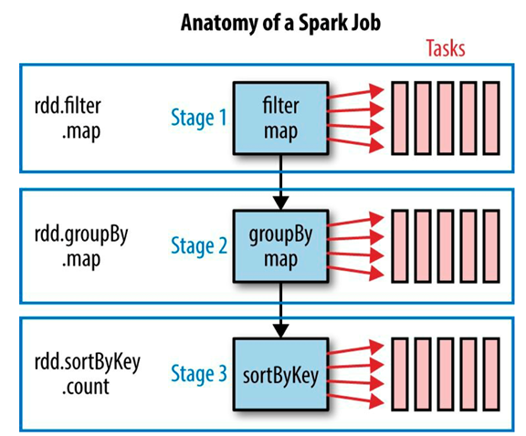

在大多数情况下，每个stage的所有task在下一个stage开启之前必须全部完成。


### 4. RDD的持久化

没碰到一个Action就会产生一个job，每个job开始计算的时候，总是从这个job最开始的RDD开始计算。

每个job总是从它血缘的开始开始计算，难免会有计算过程重复执行的情况。比如（中间过程产生了一些列的RDD，最终有两个action的时候，这两个action依赖同一个RDD，这样每次执行action的时候，就会重复计算）

如果整个RDD依赖的DAG图的血缘关系过长，就很可能出现分区数据损坏或丢失，则又要从头开始计算来达到容错的目的。

<font color=red>每个 job 都会重新进行计算, 在有些情况下是没有必要, 如何解决这个问题呢?</font>

Spark 一个重要能力就是可以持久化数据集在内存中. 当我们持久化一个 RDD 时, 每个节点都会存储他在内存中计算的那些分区, 然后在其他的 action 中可以重用这些数据. 这个特性会让将来的 action 计算起来更快(通常块 10 倍). 对于迭代算法和快速交互式查询来说, 缓存(Caching)是一个关键工具.

可以使用方法`persist()`或者`cache()`来持久化一个 RDD. 在第一个 action 会计算这个 RDD, 然后把结果的存储到他的节点的内存中. Spark 的 Cache 也是容错: 如果 RDD 的任何一个分区的数据丢失了, Spark 会自动的重新计算.

RDD 的各个 Partition 是相对独立的, 因此只需要计算丢失的部分即可, 并不需要重算全部 Partition

另外, 允许我们对持久化的 RDD 使用不同的存储级别.

例如: 可以存在磁盘上, 存储在内存中(堆内存中), 跨节点做复本.

可以给`persist()`来传递存储级别. `cache()`方法是使用默认存储级别(`StorageLevel.MEMORY_ONLY`)的简写方法.

**RDD的持久化级别**

| Storage Level                           | Meaning                                                      |
| --------------------------------------- | ------------------------------------------------------------ |
| MEMORY_ONLY                             | Store RDD as  deserialized Java objects in the JVM. If the RDD does not fit in memory, some  partitions will not be cached and will be recomputed on the fly each time  they’re needed. This is the default level. |
| MEMORY_AND_DISK                         | Store RDD as  deserialized Java objects in the JVM. If the RDD does not fit in memory,  store the partitions that don’t fit on disk, and read them from there when  they’re needed. |
| MEMORY_ONLY_SER  (Java and Scala)       | Store RDD as *serialized* Java objects (one byte  array per partition). This is generally more space-efficient than  deserialized objects, especially when using a [fast serializer](http://spark.apache.org/docs/2.1.1/tuning.html),  but more CPU-intensive to read. |
| MEMORY_AND_DISK_SER  (Java and Scala)   | Similar to  MEMORY_ONLY_SER, but spill partitions that don’t fit in memory to disk  instead of recomputing them on the fly each time they’re needed. |
| DISK_ONLY                               | Store the RDD  partitions only on disk.                      |
| MEMORY_ONLY_2,  MEMORY_AND_DISK_2, etc. | Same as the  levels above, but replicate each partition on two cluster nodes. |
| OFF_HEAP  (experimental)                | Similar to  MEMORY_ONLY_SER, but store the data in [off-heap   memory](http://spark.apache.org/docs/2.1.1/configuration.html#memory-management). This requires off-heap memory to be enabled. |

有一点需要说明的是, 即使我们不手动设置持久化, Spark 也会自动的对一些 shuffle 操作的中间数据做持久化操作(比如: reduceByKey). 这样做的目的是为了当一个节点 shuffle 失败了避免重新计算整个输入. 当时, 在实际使用的时候, 如果想重用数据, 仍然建议调用persist 或 cache

#### 检查点checkpoint

Spark 中对于数据的保存除了持久化操作之外，还提供了一种检查点的机制,检查点（本质是通过将RDD写入Disk做检查点）是为了通过 Lineage 做容错的辅助

Lineage 过长会造成容错成本过高，这样就不如在中间阶段做检查点容错，如果之后有节点出现问题而丢失分区，从做检查点的 RDD 开始重做 Lineage，就会减少开销。

检查点通过将数据写入到 HDFS 文件系统实现了 RDD 的检查点功能。

为当前 RDD 设置检查点。该函数将会创建一个二进制的文件，并存储到 checkpoint 目录中，该目录是用 SparkContext.setCheckpointDir()设置的。在 checkpoint 的过程中，该RDD 的所有依赖于父 RDD中 的信息将全部被移除。

对 RDD 进行 checkpoint 操作并不会马上被执行，必须执行 Action 操作才能触发, 在触发的时候需要对这个 RDD 重新计算.

#### 持久化与checkpoint的区别

1. 持久化只是将数据保存在BlockManager中，而RDD的Lineage是不变的。但是`checkpoint`执行完后，RDD已经没有之前所谓的依赖RDD了，而只有一个强行为其设置的`checkpoint`，RDD的Lineage改变了。
2. 持久化的数据丢失可能性更大，磁盘，内存都有可能存在数据丢失的情况。但是`checkpoint`的数据通常是存储在如HDFS等容错、高可用的文件系统，数据丢失的可能性较小。
3.  **注意:** 默认情况下，如果某个 RDD 没有持久化，但是设置了checkpoint，会存在问题. 本来这个 job 都执行结束了，但是由于中间 RDD 没有持久化，checkpoint job 想要将 RDD 的数据写入外部文件系统的话，需要全部重新计算一次，再将计算出来的 RDD 数据 checkpoint到外部文件系统。 所以，**建议对 checkpoint()的 RDD 使用持久化, 这样 RDD 只需要计算一次就可以了**.

## 3. Key-Value类型RDD的数据分区器

### 3.1 HashPartitioner

对于给定的key，计算key的hashCode，并除以分区的个数取余，最后返回值就是这个key所属的分区的ID

**HashPartitioner的弊端**： 可能导致每个分区中的数据量不均匀。容易出现数据倾斜。


### 3.2 RangePartitioner范围分区器

是将一定范围内的数据映射到某一个分区内，尽量保证每个分区中数据量的均匀，而且分区与分区之间是有序的，一个分区中的元素肯定都是比另一个分区内的元素小或者大。但是分区内的元素是不能保证顺序的。简单的说就是将一定范围内的数映射到某一个分区内。实现过程为：

1. 先从整个RDD中抽取样本数据（每个分区都要进行抽样），将样本数据排序，计算出每个分区的最大key值，形成一个Array[KEY]类型的数组变量rangeBounds（边界数组）。
2. 判断key在rangeBounds中所处的范围，给出该key值在下一个RDD中的分区id的下标；该分区器要求RDD中的KEY类型必须是可以排序的。

**范围分区器的核心**：

- 蓄水池抽样算法
- 边界数组
- 分区号的计算


**蓄水池抽样算法：**

给定一个数据流，数据流长度N很大，且N知道处理完所有数据之前都不可知，请问如何在只遍历一遍数据（O(N)）的情况下，能够随机选取出m个不重复的数据。

核心代码：

```java
int[] reservoir = new int[m];
//init, 先读取前m个数据
for(int i=0;i<m;i++){
    reservoir[i] = dataStream[i];
}
// 接下来处理剩余数据
for(int i=m;i<dataStream.length;i++){
    // 先获取一个[0,i]内的随机整数
    int d = rand.nextInt(i+1);
    //如果随机整数落在了[0, m-1]范围内，则替换蓄水池中的元素
    if(d<m){
        reservoir[d] = dataStream[i];
    }
}
```


**边界数组RangeBounds**

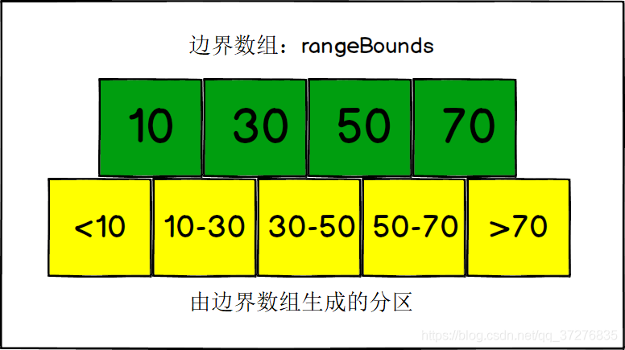


假设一个数组中有4个元素，且有序。例如上图中的10,30,50,70。
那么根据这个数组中的4个元素，我们可以划分出5个区间：

> 0：小于10
> 1： 10-30
> 2：30-50
> 3：50-70
> 4：大于70

这样，我们就分出了5个相应的分区。这样的数组我们就叫它为边界数组。
一个边界数组中的元素**必须是有序的**，因此在RangePartitioner范围分区内需要对边界数组进行排序。
其 **边界数组长度+1 = 最后的分区数**


**分区号的计算**

1. 边界数组的长度小于等于128
   - 这个时候，没来一个key，轮询的方式遍历数组中的每个元素，然后确定分区号
2. 边界数组的长度大于128的时候
   - 通过二分查找来快速定位分区号。

## 4. 共享变量

正常情况下，传递给spark算子的（比如map，reduce等）的函数都是在远程的集群节点上执行，函数中用到的所有变量都是独立的拷贝。这些变量被拷贝到集群上的每个节点上 ，这些变量的更改不会传递回驱动程序。

但是Spark提供了两个可以跨task的共享变量：

- 累加器
- 广播变量

#### 累加器

累加器用来对信息进行聚合，通常在向 Spark 传递函数时，比如使用 map() 函数或者用 filter() 传条件时，可以使用驱动器程序中定义的变量，但是集群中运行的每个任务都会得到这些变量的一份新的副本，所以更新这些副本的值不会影响驱动器中的对应变量。

如果我们想实现所有分片处理时更新共享变量的功能，那么累加器可以实现我们想要的效果。

累加器是一种变量, 仅仅支持“add”, 支持并发. 累加器用于去实现计数器或者求和. Spark 内部已经支持数字类型的累加器, 开发者可以添加其他类型的支持.

1. 内置累加器`sc.LongAccumulator`
2. 自定义累加器`继承AccumulatorV2`

#### 广播变量

广播变量是在每个节点上保存一个只读的变量缓存，而不用给每个task来传一个copy。

```scala
scala> val broadcastVar = sc.broadcast(Array(1, 2, 3))
broadcastVar: org.apache.spark.broadcast.Broadcast[Array[Int]] = Broadcast(0)

scala> broadcastVar.value
res0: Array[Int] = Array(1, 2, 3)
```

1. 通过对一个类型T的对象调用SparkContext.broadcast创建出一个Broadcast[T]对象。任何可序列化的类型都可以这么实现。

2. 通过value属性访问该对象的值(在Java中为value()方法)。

3. 变量只会被发到各个节点一次，应作为只读值处理(修改这个值不会影响到别的节点)

## 2. SparkSQL

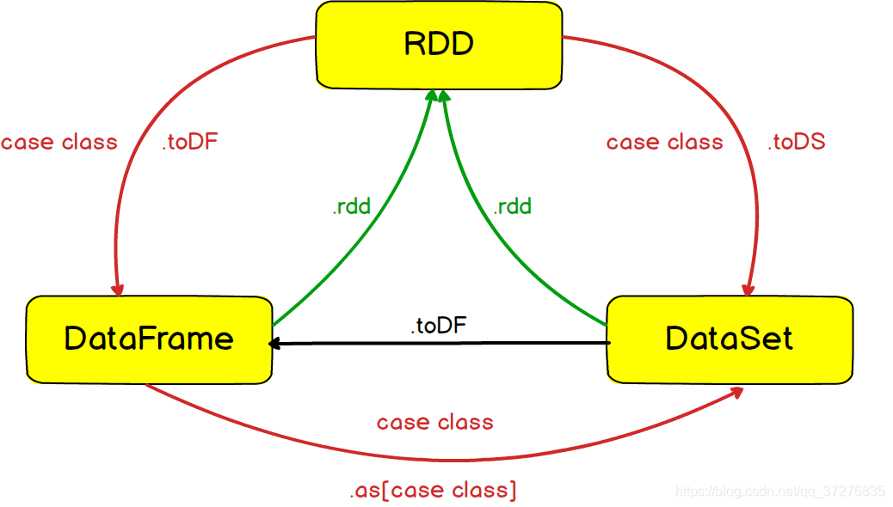


### RDD， DataFrame和DataSet之间的关系

在SparkSQL中，Spark为我们提供了两个新的抽象，分别是DataFrame和DataSet。

RDD (Spark1.0) —> Dataframe(Spark1.3) —> Dataset(Spark1.6)

同样的数据得到这三种不同的数据结构，经过计算得到的结果相同，但是执行效率和执行方式不同。

#### RDD，DataFrame和DataSet三者的共性

1. RDD、DataFrame、DataSet全都是Spark平台下的分布式弹性数据集，为处理超大型数据提供便利。
2. 三者都是惰性机制，在进行创建、转换，如map方法时，不会立即执行，只有在遇到Action如foreach时，三者才会开始遍历运算。
3. 三者都会根据Spark的内存情况自动缓存运算，这样即使数据量跟大，也不会担心内存溢出。
4. 三者都有partition的概念
5. 三者有许多共同的函数，如map，filter，排序等。
6. 在对Dataframe和DataSet进行操作许多操作都需要`import spark.implicits._`这个包的支持
7. DataFrame和DataSet均可使用模式匹配获取各个字段的值和类型。

#### 三者的区别

**RDD**

1. RDD一般和spark mlib同时使用
2. RDD不支持sparkSql操作

**DataFrame**

1. 与RDD和DataSet不同，DataFrame每一行的类型固定为Row，每一列的值没法直接访问，只有通过解析才能获取各个字段的值。
2. DataFrame与DataSet一般不与spark mlib同时使用
3. DataFrame与DataSet均支持SparkSql的操作，比如select， groupby之类，还能注册临时表/视图，进行sql语句操作
4. DataFrame与DataSet支持一些特别方便的保存方式，比如保存csv，可以带上表头，这样每一列的字段名一目了然

**DataSet**

DataSet和DataFrame拥有完全相同的成员函数，区别只是每一行的数据类型不同。DataFrame其实是DataSet的一个特例。
DataFrame也可以叫DataSet[Row]，每一行的类型都是Row，不解析，每一行究竟有哪些字段，各个字段又是什么类型都无从得知，只能用上面的getAs方法或者模式匹配拿住特定的字段。而DataSet中，每一行是什么类型是不一定的，在自定义了case class之后可以很自由的获得每一行的信息。


### **Spark on Hive 与 Hive on Spark**

- Spark on Hive通过Spark-SQL使用hive语句，操作hive，底层运行的还是spark rdd
- Hive on Spark是把hive查询从mapreduce 的mr (Hadoop计算引擎)操作替换为spark rdd（spark 执行引擎） 操作。


## 3. Spark 内核

### Spark提交任务流程

#### 1. Yarn Cluster 模式

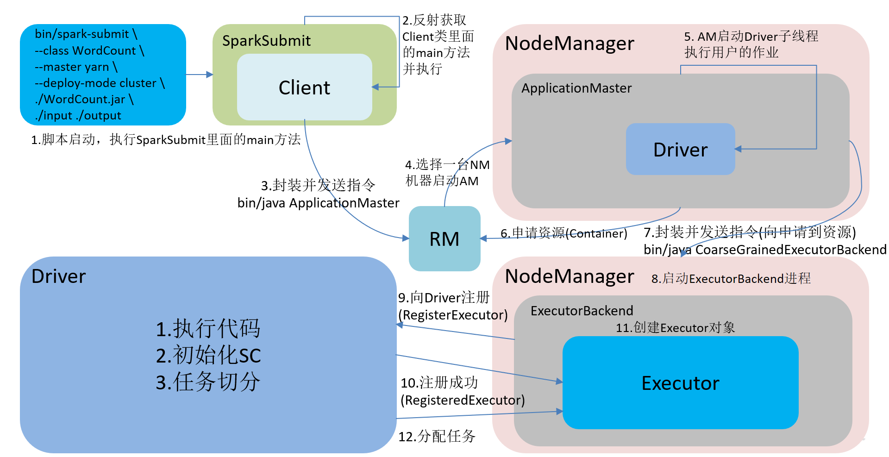


1. 执行`spark-submit`脚本提交任务，实际是启动一个SparkSubmit的JVM进程；
2. SparkSubmit类中的main方法反射调用Client的main方法；
3. Client创建Yarn客户端，然后想Yarn发送执行指令`bin/java ApplicationMaster` 请求启动一个AM；
4. Yarn框架收到指令后，RM会选择一台可用的NM，并在其中启动ApplicationMaster（进程）；
5. `ApplicationMaster进程运行(此时RM还不知道AM启动与否，所以AM需要向RM注册)`，同时会启动一个`Driver子线程`，用于执行用户的作业（执行代码，初始化sc，任务切分）；
6. AM向RM进行注册（证明AM已经启动了），AM还要向RM申请资源`Container`
7. 获取到资源后，AM会向资源所在的NM（获取到的资源，可能在不同的机器上）发送指令`bin/java CoarseGrainedExecutorBackend`,启动一个粗粒度的ExecutorBackend
8. 相应的NodeManager上会启动相应的`ExecutorBackend进程`, 并向`Driver`进行反向注册
9. `Driver`上注册成功后，会向相应的NM返回注册成功信息，然后`ExecutorBackend`进程会创建一个`Executor`对象。
10. Driver内部指定用户提交作业的main方法，初始化sc，并进行任务的切分，然后分配给ExecutorBackend任务，并监控任务的执行。

#### Yarn Client模式

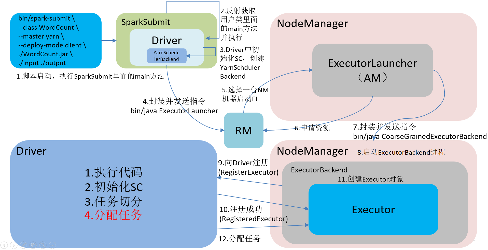

### 

1. 执行spark-submit脚本提交任务，实际启动一个SparkSubmit的JVM进程
2. SparkSubmit伴生对象中的main方法反射调用用户代码（就是我们自己所编写的代码）的main方法。
3. 启动Driver（在SparkSubmit进程的main线程中运行，此时的Driver就不是一个子线程了），执行用户的作业，并创建`ScheduleBackend`与Yarn进行通信。
4. `YarnClientScheduleBackend`向RM发送指令`bin/java ExecutorLauncher`(底层本质就是`ApplicationMaster`)启动ExecutorLauncher进程
5. RM收到指令后会在指定的NM中启动ExecutorLauncher，实质上还是调用的ApplicationMaster的main方法。
6. ExecutorLauncher向AM注册，申请资源
7. 获取资源后ExecutorLauncher向相应的NM发送指令`bin/java CoarseGrainedExecutorBackend`启动一个粗粒度的ExecutorBackend；
8. 后面和cluster模式一致

**注意：**

driver不是一个子线程了，而是直接运行在SparkSubmit进程的main线程中，所以sparkSubmit进程不能退出。

而Cluster模式下，Driver是运行在远程集群上的，SparkSubmit进程提交完作业后即可以关闭。


## 4. Spark任务调度机制

### 4.1 Spark 任务调度概述

在介绍任务调度之前，先来明确一下Spark中几个重要的概念。

- **Job**
  - Job是以Action算子为界限，遇到一个Action算子则触发一个Job
- **Stage**
  - Stage是Job的子集，以RDD宽依赖（即Shuffle）为界限，遇到Shuffle做一次划分
- **Task**
  - Task是Stage的子集，以并行度（分区数）来衡量，这个Stage的分区数有多少，则这个Stage就有多少个Task，每个Stage中的多个Task运行同样的逻辑，但是作用在不同的数据上。


Spark的任务调度总体来说分为两路进行：一路是Stage级别的调度；一路是Task级别的调度。


Spark RDD通过其Transactions操作，形成了RDD血缘关系图DAG，最后通过Action的调用，出发Job并调执行。

`DAGScheduler`负责Stage级别的调度，主要是将Job切分成若干`Stages`，并将每个Stage打包成`TaskSet`交给`TaskScheduler`调度。

`TaskScheduler`负责Task级别的调度，将DAGScheduler传过来的`TaskSet`按照指定的调度策略分发到`Executor`上执行，调度过程中`SchedulerBackend`负责提供可用资源，其中`SchedulerBackend`有多种实现，分别对接不同的资源管理系统。

`Driver`初始化`SparkContext`过程中，会分别初始化`DAGScheduler`、`TaskScheduler`、`SchedulerBackend`以及`HeartbeatReceiver`，并启动`SchedulerBackend`以及`HeartbeatReceiver`。


`SchedulerBackend`通过`ApplicationMaster`申请资源，并不断从`TaskScheduler`中拿到合适的Task分发到`Executor`执行。

`HeartBeatReceiver`负责接收`Executor`的心跳信息，监控`Executor`的存活状态，并通知到`TaskScheduler`。


### 4.2 Spark Stage级别的调度

Spark的任务调度是从DAG切割开始，主要是由`DAGScheduler`来完成。当遇到一个Action操作后就会触发一个Job的计算，并交给`DAGScheduler`来提交。


1. Job由最终的RDD和Action方法封装而成；
2. `SparkContext`将Job交给`DAGScheduler`提交，它会根据RDD的血缘关系构成的DAG进行切分，将一个Job划分为若干Stages；
   - 具体划分策略是：由最终的RDD不断通过依赖回溯判断父依赖是否是**宽依赖**，即以`Shuffle`为界，划分Stage，窄依赖的RDD之间被划分到同一个Stage中，可以进行pipeline式的计算。
   - **划分的Stages分两类**：
     - 一类叫做`ResultStage`，为DAG最下游的Stage，由Action方法决定；
     - 一类叫做`ShuffleMapStage`，为下游的Stage准备数据。
3. Submit stage 提交阶段
   - `DAGScheduler.handleJobSubmitted`方法创建好`ResultStage`后会提交这个stage（submitStage方法），在提交一个`stage`的时候，会要先提交它的`parent stage`，也是通过递归的形式，直到一个`stage`的所有父阶段-`parent stage`都被提交了，才会提交本阶段，如果一个stage的parent还没有完成，则会把这个stage加入到`waitingStages`。也就是说，DAG图中前面的stage会被先提交。当一个stage的parent都准备好了，也就是执行完毕之后，它才会进入`submitMissingTasks`的环节。
   - stage的划分是<font color=green>从后向前</font>进行划分的，而真正的任务执行是<font color=green>从前向后</font>执行的。

4. Subimit task

   - `Stage`中的`Task`是在`DAGScheduler`（不是TaskScheduler）的`submitMissingTasks`方法中创建的，包括`ShuffleMapTask`和`ResultTask`，与`Stage`对应。归属于同一个stage的这批Task组成一个`TaskSet集合`,最后提交给`TaskScheduler`的就是这个`TaskSet`。

     

Stage级调度的整体流程：

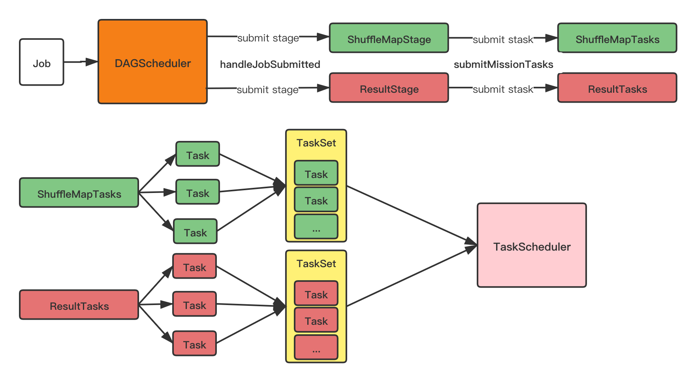

<font color=red>注意:</font>

task的创建是在DAGScheduler的submitMissingTasks方法中创建的，而`TaskScheduler`负责Task的调度，不负责Task 的创建。

### 4.3 Spark Task级别的调度

Task的调度是由`TaskScheduler`与`SchedulerBackend`紧密合作，共同完成的。

`TaskScheduler`是task级别的调度器，主要作用是管理task的调度和提交，是Spark底层的调度器。

`SchedulerBackend`是`TaskScheduler`的后端服务，有独立的线程，所有的`Executor`都会注册到`SchedulerBackend`，主要作用是进行资源的分配、将`Task`分配给`Executor`等。

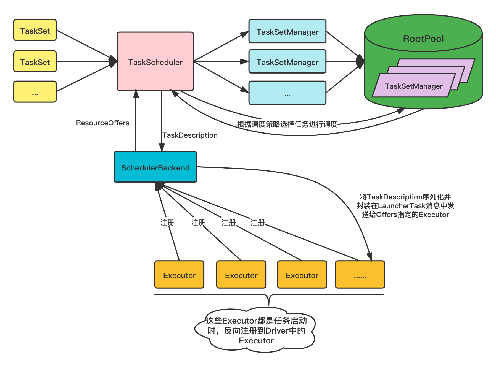

**TaskSetManager**负责监控管理同一个stage中的Tasks，TaskScheduler就是以TaskSetManager为单元来调度任务。包括任务推断、Task本地性，并对Task进行资源分配。

**具体工作流程**


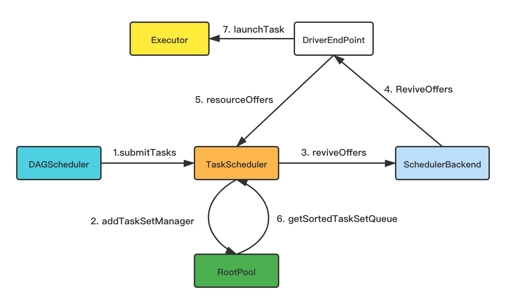

1. `DAGScheduler`(`submitMissingTasks`方法中)调用`TaskScheduler.submitTask()`创建并TaskSet给`TaskScheduler`；

2. `TaskScheduler`拿到`TaskSet`后会创建一个`TaskSetManager`来管理它，并且把`TaskSetManager`添加到**rootPool**调度池中；

3. 调用`SchedulerBackend.revivieOffers()`方法

4. `SchedulerBackend`发送`ReviveOffers`消息给`DriverEndPoint`；

5. `DriverEndPoint`接收到`ReviveOffers`消息后，会调用`makeOffers()方法`创建`WorkerOffer`，并通过`TaskScheduler.resourceOffer()`返回Offer；

6. **TaskScheduler**会从**rootPool**资源调度池中按照特定的调度算法取出一个**TaskSetManager**，逐个给**TaskSet**的**Task**分配**WorkerOffer**，并将其封装成**TaskDescription**（包含Offer信息）

7. 调用`SchedulerBackend.DriverEndPoint`的**launchTasks**方法，将**TaskDescription**序列化并封装在**LaunchTask**消息中，发送给**Offer**指定的**Executor**。

   **LaunchTask**消息被**ExecutorBackend**接收到后，会将**Task**信息反序列化，传给`Executor.launTask()`,最后使用**Executor的线程池**中的线程来执行这个**Task**。

### 4.4 调度策略

TaskScheduler支持两种调度策略：**FIFO**和**FAIR**

- **FIFO**:先进入到rooPool资源池中的TaskSetManager优先被调度

- **FAIR**：公平调度

### 4.5 本地化调度

因为每个Stage中的task负责处理不同分区的数据，所以在task被分配到Executor上时，尽量保证Task与处理的数据保持较近的距离，这样可以避免一定的数据传输开销。

**TaskScheduler**从调度队列中拿到**TaskSetManager**后，那么接下来的工作就是**TaskSetManager**按照一定的规则一个个取出task给**TaskScheduler**，**TaskScheduler**再交给**SchedulerBackend**去发到**Executor**上执行。

**TaskSetManager**会根据每个Task的优先位置，确定`Task的本地化调度级别：Locality`， Locality一共有五种，优先级由高到低顺序：

| 名称          | 名称       | 备注                                                         |
| ------------- | ---------- | ------------------------------------------------------------ |
| PROCESS_LOCAL | 进程本地化 | task和数据在同一个Executor中，性能最好。                     |
| NODE_LOCAL    | 节点本地化 | task和数据在同一个节点中，但是task和数据不在同一个Executor中，数据需要在进程间进行传输 |
| RACK_LOCAL    | 机架本地化 | task和数据在同一个机架的两个不同的节点上，数据需要通过网络在节点之间进行传输。 |
| NO_PREF       |            | 对于task来说，从哪里获取数据都一样，没有好坏之分             |
| ANY           |            | task和数据可以在集群的任何地方，而且不在一个机架中，性能最差 |

在调度执行时，Spark调度总是会尽量让每个task以最高的本地级别来启动，当一个task以本地性级别启动，但是该本地性级别对应的所有节点都没有空闲资源而启动失败，此时并不会立马降低本地性级别启动，而是在某个时间长度内再次以本地性级别来启动该task，若超过限时时间则降级启动，去尝试下一个本地性级别。

可以通过调大每个类别的最大容忍延迟时间，在等待阶段对应的Executor可能就会有相应的资源去执行次task，这就在一定程度上提升了运行性能。

**失败重试和黑名单**

除了选择合适的Task调度运行外，还需要监控Task的执行状态，前面也提到，与外部打交道的是SchedulerBackend，Task被提交到Executor启动执行后，Executor会将执行状态上报给SchedulerBackend，SchedulerBackend则告诉TaskScheduler，TaskScheduler找到该Task对应的TaskSetManager，并通知到该TaskSetManager，这样TaskSetManager就知道Task的失败与成功状态，对于失败的Task，会记录它失败的次数，如果失败次数还没有超过最大重试次数，那么就把它放回待调度的Task池子中，否则整个Application失败。

在记录Task失败次数过程中，会记录它上一次失败所在的Executor Id和Host，这样下次再调度这个Task时，会使用黑名单机制，避免它被调度到上一次失败的节点上，起到一定的容错作用。黑名单记录Task上一次失败所在的Executor Id和Host，以及其对应的“拉黑”时间，

“拉黑”时间是指这段时间内不要再往这个节点上调度这个Task了。


## 5. Spark Shuffle解析


Spark中会根据俄宽依赖来划分Stage。

在划分Stage时，最后一个Stage称为`ResultStage`, 前面所有的Stage被称为`ShuffleMapStage`

**ShuffleMapStage**的结束伴随着shuffle文件的写磁盘（**ShuffleWrite**）

**ResultStage**的开始会先进行shuffle文件的读磁盘（**ShuffleRead**）

（在MapReduce计算框架中，只要发生Shuffle就会伴随着数据落盘，而在Spark中，只有ShuffleMapStage结束时才会伴随着数据落盘）

### 5.1 HashShuffle

在spark-1.6之前默认的shuffle方式是hash，在spark-1.6版本之后使用sort-BaseShuflle，因为HashShuffle存在不足所以就替换了HashShuffle。Spark2.0之后，从源码中完全移除了HashShuffle。

#### 5.1.1 未优化的HashShuffle


如上图所示：假设共有三个ReduceTask在等待MapTask落盘的数据文件。

每个MapTask处理完后的数据，会根据key的hash被分到不同的缓冲区中，进行将数据落盘。

如果采用未优化的HashShuffle，那么每个MapTask都会产生相应ReduceTask数据量的小文件。

**缺点**

1. map任务的中间结果首先存入内存（缓存），然后才写入磁盘，这对于内存的开销很大，当一个节点上的Map任务的输出结果集很大时，很容易导致内存紧张，发生OOM；
2. 生成很多的小文件。假设有M个MapTask，有N个ReduceTask，则会创建M*N个小文件，磁盘I/O将成为性能的瓶颈。

#### 5.1.2 优化后的HashShuffle


优化的HashShuffle过程就是启用合并机制，合并机制就是复用Buffer。在同一个进程中（一个core中），无论是有多少个task（），都只会有相应ReduceTask数量的一份数据（例如上述就是3个）

每一个MapTask所在的进程中，分别写入共同进程中的3分本地文件，上述图中有4个Task，但是只有两个Core，所以总共输出是 `2个Core * 3个分类文件 = 6 个本地小文件`

### 5.2 SortShuffle

#### 5.2.1 普通的SortShuffle

每个进程中只有一块缓冲区

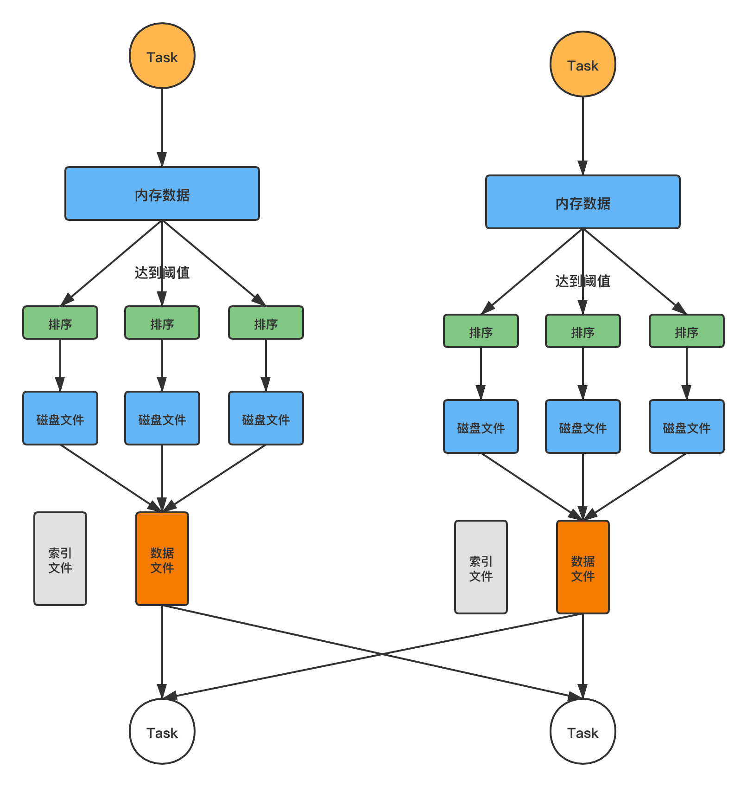


在该模式下，数据会先写入一个数据结构，reduceByKey写入Map，一边通过Map局部聚合，一边写入内存。

如果内存中的数据达到**阈值**，就会将内存中的数据结构写入到磁盘，清空内存数据结构。

在**溢写磁盘**前，现根据**key进行排序**，排序过后的数据，会分批写入到磁盘文件中。默认批次为10000条，数据会以每批一万条写入到磁盘文件。写入磁盘文件通过缓冲区溢写的方式，每次溢写都会产生一个磁盘文件，也就是说一个Task过程会产生多个临时文件。

最后在每个Task中，将**所有的临时文件合并**，这就是**merge**过程，此过程将所有临时文件读取出来，一次写入到最终文件。意味着一个**Task**的所有数据都在这一个文件中。同时单独写一份索引文件，标识下游各个Task的数据在文件中的索引，Start offset和End offset。

#### 5.2.2 bypassSortShuffle

每个进程中有多个缓冲区

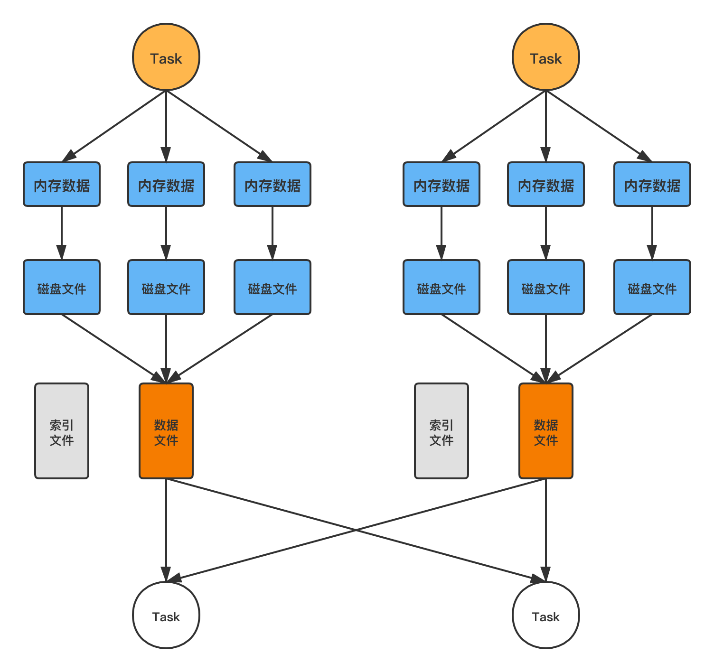

bypass运行机制的出发条件（<font color=red>必须同时满足</font>）：

1. shuffle map task数量小于`spark.shuffle.sort.bypassMergeThreshold=200`参数的值，默认为200；
2. 不是聚合类的`shuffle`算子（没有预聚合功能的，比如：groupByKey）

该过程的磁盘写机制其实跟未经优化的`HashShuffleManager`是一模一样的，因为多要创建数据量惊人的磁盘文件，只是在最后一个磁盘文件的合并而已。因此少量的最终磁盘文件，也让该机制相对未经优化的HashShuffleManager来说，Shuffle read的性能会更好。（同时也是采用缓冲区溢写的方法落盘小文件，解决了HashShuffle中内存的问题）

而该机制与普通的SortShuffleManager运行机制的不同在于：不会进行排序。也就是说，启动该机制的最大好处在于，shuffle write过程中，不需要进行数据的排序操作，也就节省掉了这部分的性能开


## 6. Spark内存管理


Spark将内存从逻辑上区分为堆内内存和堆外内存，称为内存模型（MemoryMode）

- 这里的堆内内存不能与JVM中的Java堆直接画等号，它只是JVM堆内存的一部分，由JVM统一管理。
- 堆外内存则是Spark使用`sun.misc.Unsafe`的API直接在工作节点（Executor）的系统内存中开辟的空间。


内存池：对上述两种内存进行资源管理


**堆外内存**：为了进一步优化内存的使用以及提高Shuffle时排序的效率，Spark引入了堆外（Off-heap）内存，使之可以直接在工作节点的系统内存中开辟空间，存储经过序列化的二进制数据。

堆外内存意味着把 内存对象分配在Java虚拟机以外的内存，这些内存直接受操作系统管理（而不是虚拟机）。这样做的结果就是能保持一个较小的堆，以减少垃圾收集对应用的影响。

利用 JDK Unsafe API，Spark 可以直接操作系统堆外内存，减少了不必要的内存开销，以及频繁的 GC 扫描和回收，提升了处理性能。

堆外内存可以被精确地申请和释放（堆外内存之所以能够被精确的申请和释放，是由于内存的申请和释放不再通过JVM机制，而是直接向操作系统申请，JVM对于内存的清理是无法准确指定时间点的，因此无法实现精确的释放），而且序列化的数据占用的空间可以被精确计算，所以相比堆内内存来说降低了管理的难度，也降低了误差。


### 内存空间分配

#### 1.  静态内存管理

在 Spark1.6之前采用的静态内存管理机制下，存储内存、执行内存和其他内存的大小在 Spark 应用程序运行期间均为固定的，但用户可以在应用程序启动前进行配置.

##### 1.1 堆内内存管理


- **Storage内存**（存储内存）：主要用于存储Spark的cache数据，例如RDD的缓存、Broadcast变量，Unroll数据等。（**默认占用系统内存的60%**）
- **Execution内存**（执行内存）：主要用于存放Shuffle、Join、Sort、Aggregation等计算过程中的临时数据。（**默认占用系统内存的20%**）

- **Other**（有时也叫做用户内存）：主要用于存储RDD转换操作所需的数据，例如RDD依赖等信息。（**默认占用系统内存的20%**）
- **预留内存**（Reserved Memory）：系统预留内存，会用来存储Spark内部对象，防止OO

##### 1.2 堆外内存管理

堆外的空间分配较为简单，只有存储内存和执行内存。

可用的执行内存和存储内存占用的空间大小直接由参数 spark.memory.storageFraction 决定，由于堆外内存占用的空间可以被精确计算，所以无需再设定保险区域。


静态内存管理机制实现起来较为简单，但如果用户不熟悉 Spark 的存储机制，或没有根据具体的数据规模和计算任务或做相应的配置，很容易造成“一半海水，一半火焰”的局面，即存储内存和执行内存中的一方剩余大量的空间，而另一方却早早被占满，不得不淘汰或移出旧的内容以存储新的内容。

由于新的内存管理机制的出现，这种方式目前已经很少有开发者使用，出于兼容旧版本的应用程序的目的，Spark 仍然保留了它的实现。


#### 2. 统一内存管理

Spark 1.6 之后引入的统一内存管理机制，与静态内存管理的区别在于存储内存和执行内存共享同一块空间，可以动态占用对方的空闲区域.

##### 2.1 统一堆内内存管理


**存储内存**与**执行内存**共占系统内存的**60%**，Other（用户内存占**40%**），预留内存：**300M**

统一内存管理最重要的优化在于**动态占用机制**，其规则如此下：

1. 设定基本的存储内存和执行内存区域`spark.storage.storageFraction`,该设定确定了双方各自拥有的空间的范围。
2. 双方空间都不足时，则存储到硬盘。若己方内存空间不足而对方空余时，可借用对方的空间。
3. 执行内存的空间被存储内存占用后，可让存储内存将占用的部分数据转存到硬盘，然后“归还”借用的空间。
4. 存储内存的空间被执行内存占用后，无法让运行内存“归还”，因为需要考虑Shuffle过程中的诸多因素，实现起来比较复杂。（<font color=red>执行优先，不能执行一半就把内存还回去了，得等此次执行完后才可返还内存</font>）


##### 2.2 统一堆外内存管理


### 存储内存管理

RDD 作为 Spark 最基本的数据抽象, 是分区记录(partition)的只读集合, 只能基于在稳定物理存储中的数据集上创建, 或者在其他已有的 RDD 上执行转换(Transformation)操作产生一个新的 RDD.

转换后的 RDD 与原始的 RDD 之间产生的依赖关系, 构成了血统(Lineage). 凭借血统, Spark 可以保证每一个 RDD 都可以被重新恢复.

但 RDD 的所有转换都是惰性的, 即只有当行动(Action)发生时, Spark 才会创建任务读取 RDD, 然后才会真正的执行转换操作.

Task 在启动之初读取一个分区的时, 会先判断这个分区是否已经被持久化, 如果没有则需要检查 Checkpoint 或按照血统重新计算.

如果要在一个 RDD 上执行多次行动, 可以在第一次行动中使用 persis 或 cache 方法, 在内存或磁盘中持久化或缓存这个 RDD, 从而在后面的Action 时提示计算速度.

事实上, cache 方法是使用默认的 MEMORY_ONLY的存储级别将 RDD 持久化到内存, 所以缓存是一种特殊的持久化.

堆内内存和堆外内存的设计, 便可以对缓存 RDD 时使用的内存做统一的规划和管理。


### 执行内存管理


## 7. Spark性能优化

### 7.1 Spark 常用配置参数

执行`submit`脚本的时候，可以指定一些配置参数，

例如：

```shell
/usr/local/spark/bin/spark-submit\
--class spark.WordCount \
--num-executor 80 \
...
/usr/locla/spark/spark.jar
```


下面列举几个常用的参数：

| 参数名                | 参数说明                              |
| --------------------- | ------------------------------------- |
| `num-executors`       | 设置executor的数量                    |
| `driver-memory`       | 设置driver端的内存大小                |
| `executor-memory`     | 设置每个executor的内存大小            |
| `executor-cores`      | 设置每个executor的cpu核心数           |
| `master yarn`         | 设置集群模式为Yarn                    |
| `deploy-mode cluster` | 设置yarn的部署模式为cluster（client） |

### 7.2 常规性能调优一：RDD复用

- 在对RDD进行算子时，要避免相同的算子和计算逻辑之下对 RDD 进行重复的计算:

                                 

  对上图中的RDD计算架构进行修改:

  

### 7.2 常规性能调优二：RDD持久化

- - 在Spark中，当多次对同一个 RDD 执行算子操作时，每一次都会对这个 RDD 的祖先 RDD 重新计算一次，这种情况是必须要避免的，对同一个RDD的重复计算是对资源的极大浪费，因此，必须对多次使用的RDD进行持久化，通过持久化将公共RDD的数据缓存到内存/磁盘中，之后对于公共RDD的计算都会从内存/磁盘中直接获取RDD数据。 对于RDD的持久化，有两点需要说明： 
  - RDD的持久化是可以进行序列化的，当内存无法将RDD的数据完整的进行存放的时候，可以考虑使用序列化的方式减小数据体积，将数据完整存储在内存中。
  - 如果对于数据的可靠性要求很高，并且内存充足，可以使用副本机制，对RDD数据进行持久化。当持久化启用了复本机制时，对于持久化的每个数据单元都存储一个副本，放在其他节点上面，由此实现数据的容错，一旦一个副本数据丢失，不需要重新计算，还可以使用另外一个副本。
- **RDD尽可能尽早的filter操作**


- 

### 7.3 常规性能调优三：并行度调节

`set spark.default.parallelism=500;`

```scala
val conf=new SparkConf().set("spark.default.parallelism", "500");
```

<font color=green>一般情况下，task数量应该设置为Spark作业总CPU Core数量的2~3倍。</font>

之所以没有推荐task数量与CPU core总数相等，是因为task的执行时间不同，有的task执行速度快而有的task执行速度慢，如果task数量与CPU core总数相等，那么执行快的task执行完成后，会出现CPU core空闲的情况。如果task数量设置为CPU core总数的2~3倍，那么一个task执行完毕后，CPU core会立刻执行下一个task，降低了资源的浪费，同时提升了Spark作业运行的效率。


### 7.4 常规性能调优四：广播大变量

默认情况下，task 中的算子中如果使用了外部的变量，每个 task 都会获取一份变量的复本，这就造成了内存的极大消耗。 - 一方面，如果后续对 RDD 进行持久化，可能就无法将 RDD 数据存入内存，只能写入磁盘，磁盘IO将会严重消耗性能； - 另一方面，task在创建对象的时候，也许会发现堆内存无法存放新创建的对象，这就会导致频繁的GC，GC会导致工作线程停止，进而导致Spark暂停工作一段时间，严重影响Spark性能。

假设当前任务配置了20个Executor，指定500个task，有一个20M的变量被所有task共用，此时会在500个task中产生500个副本，耗费集群10G的内存，如果使用了广播变量， 那么每个Executor保存一个副本，一共消耗400M内存，内存消耗减少了5倍。

广播变量在每个Executor保存一个副本，此Executor的所有task共用此广播变量，这让变量产生的副本数量大大减少。

在初始阶段，广播变量只在Driver中有一份副本。task在运行的时候，想要使用广播变量中的数据，此时首先会在自己本地的Executor对应的BlockManager中尝试获取变量，如果本地没有，BlockManager就会从Driver或者其他节点的BlockManager上远程拉取变量的复本，并由本地的BlockManager进行管理；之后此Executor的所有task都会直接从本地的BlockManager中获取变量。

### 7.5 算子调优

#### 1. mapPartitions

普通的 map 算子对 RDD 中的每一个元素进行操作，而 mapPartitions 算子对 RDD 中每一个分区进行操作。

如果是普通的map算子，假设一个 partition 有 1 万条数据，那么 map 算子中的 function 要执行1万次，也就是对每个元素进行操作。

如果是 mapPartition 算子，由于一个 task 处理一个 RDD 的partition，那么一个task只会执行一次function，function一次接收所有的partition数据，效率比较高。

mapPartitions算子也存在一些缺点：对于普通的map操作，一次处理一条数据，如果在处理了2000条数据后内存不足，那么可以将已经处理完的2000条数据从内存中垃圾回收掉；但是如果使用mapPartitions算子，但数据量非常大时，function一次处理一个分区的数据，如果一旦内存不足，此时无法回收内存，就可能会OOM，即内存溢出。

因此，mapPartitions算子适用于数据量不是特别大的时候，此时使用mapPartitions算子对性能的提升效果还是不错的。（当数据量很大的时候，一旦使用mapPartitions算子，就会直接OOM） 在项目中，应该首先估算一下RDD的数据量、每个partition的数据量，以及分配给每个Executor的内存资源，如果资源允许，可以考虑使用mapPartitions算子代替map。


#### 2. foreachPartition优化数据库操作

使用了foreachPartition算子后，可以获得以下的性能提升：

1. 对于我们写的function函数，一次处理一整个分区的数据
2. 对于一个分区的数据，创建唯一的数据库连接
3. 只需要向数据发送一次SQL语句和多组参数

在生产环境中，全部都会使用foreachPartition算子完成数据库操作。foreachPartition算子存在一个问题，与mapPartitions算子类似，如果一个分区的数据量特别大，可能会造成OOM，即内存溢出。


#### 3. filter与coalesce的配合使用


在Spark任务中我们经常会使用filter算子完成RDD中数据的过滤，在任务初始阶段，从各个分区中加载到的数据量是相近的，但是一旦进过filter过滤后，每个分区的数据量有可能会存在较大差异。

在上图中, 第二个分区的数据过滤后只剩100条，而第三个分区的数据过滤后剩下800条，在相同的处理逻辑下，第二个分区对应的task处理的数据量与第三个分区对应的task处理的数据量差距达到了8倍，这也会导致运行速度可能存在数倍的差距，这也就是**数据倾斜问题**。

可以通过repartition与coalesce都可以进行重分区，其中repartition只是coalesce接口中shuffle为true的简易实现，coalesce默认情况下不进行shuffle。

> 可以在filter操作之后，使用coalesce算子针对每个partition的数据量各不相同的情况，压缩partition的数量，而且让每个partition的数据量尽量均匀紧凑，以便于后面的task进行计算操作，在某种程度上能够在一定程度上提升性能。


#### 4. repartition 解决SparkSQL低并行度问题

`set spark.default.parallelism=500;`对于SparkSQL是不生效的，用户设置的并行度只对于SparkSQL以外的所有Spark的stage生效。

Spark SQL的并行度不允许用户自己指定，Spark SQL自己会默认根据 hive 表对应的 HDFS 文件的 split 个数自动设置 Spark SQL 所在的那个 stage 的并行度，用户自己通spark.default.parallelism参数指定的并行度，只会在没Spark SQL的stage中生效。

由于Spark SQL所在stage的并行度无法手动设置，如果数据量较大，并且此stage中后续的transformation操作有着复杂的业务逻辑，而Spark SQL自动设置的task数量很少，这就意味着每个task要处理为数不少的数据量，然后还要执行非常复杂的处理逻辑，这就可能表现为第一个有 Spark SQL 的 stage 速度很慢，而后续的没有 Spark SQL 的 stage 运行速度非常快。

为了解决SparkSQL无法设置并行度和task数量的问题，可以使用repartition算子。


Spark SQL这一步的并行度和task数量肯定是没有办法去改变了，但是，对于Spark SQL查询出来的RDD，立即使用repartition算子，去重新进行分区，这样可以重新分区为多个partition，从repartition之后的RDD操作，由于不再涉及 Spark SQL，因此 stage 的并行度就会等于你手动设置的值，这样就避免了 Spark SQL 所在的 stage 只能用少量的 task 去处理大量数据并执行复杂的算法逻辑。

#### 5. reduceByKey预聚合

实际生产中，尽量使用带有预聚合的算子，而避免使用（groupByKey这类没有预聚合的算子）

所谓预聚合：就是在map端就进行一次combine操作。


### 7.6 Shuffle调优

#### 1. 调节map端缓冲区大小

在 Spark 任务运行过程中，如果 shuffle 的map端处理的数据量比较大，但是map端缓冲的大小是固定的，可能会出现map端缓冲数据频繁spill溢写到磁盘文件中的情况，使得性能非常低下，通过调节map端缓冲的大小，可以避免频繁的磁盘 IO 操作，进而提升 Spark 任务的整体性能。

map端缓冲的默认配置是`32KB`, 如果每个task处理640KB的数据，那么会发生640/32 = 20次溢写，如果每个task处理64000KB的数据，机会发生64000/32=2000此溢写，这对于性能的影响是非常严重的。

```scala
val conf = new SparkConf().set("spark.shuffle.file.buffer", "64");
```

#### 2. 调节reduce端缓冲区大小

Spark Shuffle 过程中，shuffle reduce task 的 buffer缓冲区大小决定了reduce task 每次能够缓冲的数据量，也就是每次能够拉取的数据量，如果内存资源较为充足，适当增加拉取数据缓冲区的大小，可以减少拉取数据的次数，也就可以减少网络传输的次数，进而提升性能。

reduce端数据拉取缓冲区的大小可以通过spark.reducer.maxSizeInFlight参数进行设置，默认为48MB

```scala
val conf=new SparkConf().set("spark.reducer.maxSizeInFlight", "96");
```

#### 3. 调节reduce端拉取数据重试次数

```scala
val conf = new SparkConf().set("spark.shuffle.io.maxRetries", "6");
```

Spark Shuffle 过程中，reduce task 拉取属于自己的数据时，如果因为网络异常等原因导致失败会自动进行重试。对于那些包含了特别耗时的 shuffle 操作的作业，建议增加重试最大次数（比如60次），以避免由于 JVM 的full gc 或者网络不稳定等因素导致的数据拉取失败。在实践中发现，对于针对超大数据量（数十亿~上百亿）的shuffle 过程，调节该参数可以大幅度提升稳定性。

reduce 端拉取数据重试次数可以通过spark.shuffle.io.maxRetries参数进行设置，该参数就代表了可以重试的最大次数。如果在指定次数之内拉取还是没有成功，就可能会导致作业执行失败，默认为3，

#### 4. 调节reduce端拉取数据等待间隔

Spark Shuffle 过程中，reduce task 拉取属于自己的数据时，如果因为网络异常等原因导致失败会自动进行重试，在一次失败后，会等待一定的时间间隔再进行重试，可以通过加大间隔时长（比如60s），以增加shuffle操作的稳定性。

reduce端拉取数据等待间隔可以通过spark.shuffle.io.retryWait参数进行设置，默认值为5s，

```scala
val conf = new SparkConf()
  .set("spark.shuffle.io.retryWait", "60s")
```

#### 5. 调节SortShuffle排序操作阈值

对于SortShuffleManager，如果shuffle reduce task的数量小于某一阈值则shuffle write过程中不会进行排序操作，而是直接按照未经优化的HashShuffleManager的方式去写数据，但是最后会将每个task产生的所有临时磁盘文件都合并成一个文件，并会创建单独的索引文件。

当你使用SortShuffleManager时，如果的确不需要排序操作，那么建议将这个参数调大一些，大于shuffle read task的数量，那么此时map-side就不会进行排序了，减少了排序的性能开销，但是这种方式下，依然会产生大量的磁盘文件，因此shuffle write性能有待提高。 SortShuffleManager排序操作阈值的设置可以通过spark.shuffle.sort. bypassMergeThreshold这一参数进行设置，默认值为200，

```scala
val conf=new SparkConf().set("spark.shuffle.sort.bypassMergeThreshold", "400");
```

### 7.7 内存调优

增大堆外内存`--conf spark.executor.memoryOverhead=2048;`


## 8. Spark数据倾斜解决方案

Spark 中的数据倾斜问题主要指shuffle过程中出现的数据倾斜问题，是由于不同的key对应的数据量不同导致的不同task所处理的数据量不同的问题。

例如，reduce点一共要处理100万条数据，第一个和第二个task分别被分配到了1万条数据，计算5分钟内完成，第三个task分配到了98万数据，此时第三个task可能需要10个小时完成，这使得整个Spark作业需要10个小时才能运行完成，这就是数据倾斜所带来的后果。

注意，要区分开数据倾斜与数据量过量这两种情况，数据倾斜是指少数task被分配了绝大多数的数据，因此少数task运行缓慢；数据过量是指所有task被分配的数据量都很大，相差不多，所有task都运行缓慢。

数据倾斜的表现：

1. Spark 作业的大部分 task 都执行迅速，只有有限的几个task执行的非常慢，此时可能出现了数据倾斜，作业可以运行，但是运行得非常慢；

2. Spark 作业的大部分task都执行迅速，但是有的task在运行过程中会突然报出OOM，反复执行几次都在某一个task报出OOM错误，此时可能出现了数据倾斜，作业无法正常运行。

### 8.1 聚合原数据

1. 避免shuffle过程
   - 可以在hive端直接将每个key对应的数据拼接成一个大大的字符串，避免shuffle
2. 缩小key的粒度（增大数据倾斜的可能性，降低每个task的数据量）
3. 增大key的粒度（减少数据倾斜的可能性，增大每个task的数据量）

### 8.2 过滤掉导致倾斜的key

有些时候，导致数据倾斜的key可能为null，提前将这个无用的导致的倾斜的key过滤掉。

如果有真实的key导致了数据倾斜，我们可以单独抽取出来这个key，通过拼接随机数后缀，将key进行打散，进而可以在一定程度上缓解数据倾斜所带来的问题。

### 8.3 提高shuffle操作中的reduce并行度

当方案一和方案二对于数据倾斜的处理没有很好的效果时，可以考虑提高shuffle过程中的reduce端并行度，reduce端并行度的提高就增加了reduce端task的数量，那么每个task分配到的数据量就会相应减少，由此缓解数据倾斜问题。

对于Spark SQL中的shuffle类语句，比如group by、join等，需要设置一个参数，即`spark.sql.shuffle.partitions`，该参数代表了shuffle read task的并行度，该值默认是200，对于很多场景来说都有点过小。

提高reduce端并行度并没有从根本上改变数据倾斜的本质和问题（方案一和方案二从根本上避免了数据倾斜的发生），只是尽可能地去缓解和减轻shuffle reduce task的数据压力，以及数据倾斜的问题，适用于有较多key对应的数据量都比较大的情况。

该方案通常无法彻底解决数据倾斜，因为如果出现一些极端情况，比如某个key对应的数据量有100万，那么无论你的task数量增加到多少，这个对应着100万数据的key肯定还是会分配到一个task中去处理，因此注定还是会发生数据倾斜的。所以这种方案只能说是在发现数据倾斜时尝试使用的第一种手段，尝试去用最简单的方法缓解数据倾斜而已，或者是和其他方案结合起来使用。

在理想情况下，reduce端并行度提升后，会在一定程度上减轻数据倾斜的问题，甚至基本消除数据倾斜；但是，在一些情况下，只会让原来由于数据倾斜而运行缓慢的task运行速度稍有提升，或者避免了某些task的OOM问题，但是，仍然运行缓慢，此时，要及时放弃方案三，开始尝试后面的方案。

###  8.4 使用随机key实现双重聚合

当使用了类似于groupByKey、reduceByKey这样的算子时，可以考虑使用随机key实现双重聚合


首先，通过map算子给每个数据的key添加随机数前缀，对key进行打散，将原先一样的key变成不一样的key，然后进行第一次聚合，这样就可以让原本被一个task处理的数据分散到多个task上去做局部聚合；

随后，去除掉每个key的前缀，再次进行聚合。

此方法对于有`groupByKey,reduceByKey`这类算子造成的数据倾斜有比较好的效果，仅仅适用于聚合类的shuffle操作，使用范围相对较窄。

### 8.5 将reduce join 转换成map join


正常情况下，join操作都会执行shuffle过程，并且执行的是reduce join，也就是先将所有相同的key和对应的value汇聚到一个reduce task中，然后再进行join。

普通的join是会走shuffle过程的，而一旦shuffle，就相当于会将相同key的数据拉取到一个shuffle read task中再进行join，此时就是reduce join。

但是一个数据量特别大，一个数据量特别小，这两个数据进行join，就很有可能产生数据倾斜，导致大量的数据key都会聚集到一小部分reduce task中。

**解决办法**

通过将小数据量RDD中的数据 broadcast广播出去，然后通过map join的方式实现与reduce join相同的效果。此时就不会发生shuffle操作，也就不会发生数据倾斜了。


### 8.6 sample采样对倾斜key单独进行join


### 8.7 使用随机数以及扩容进行join

如果在进行join操作时，RDD中有大量的key导致数据倾斜，那么进行分拆key也没什么意义，此时就只能使用最后一种方案来解决问题了，对于join操作，我们可以考虑对其中一个RDD数据进行扩容，另一个RDD进行稀释后再join。

我们会将原先一样的key通过附加随机前缀变成不一样的key，然后就可以将这些处理后的“不同key”分散到多个task中去处理，而不是让一个task处理大量的相同key。

这一种方案是针对有大量倾斜key的情况，没法将部分key拆分出来进行单独处理，需要对整个RDD进行数据扩容，对内存资源要求很高。

**核心思想**


选择一个RDD，使用flatMap进行扩容，对每条数据的key添加数值前缀（1~N的数值），将一条数据映射为多条数据；（扩容）

选择另外一个RDD，进行map映射操作，每条数据的key都打上一个随机数作为前缀（1~N的随机数）；（稀释）


# Hive 复习

### 1. 外部表与内部表

内部表又叫做管理表，创建表时不做任何指定，默认创建的就是内部表。想要创建外部表，则需要使用External进行修饰。

|              | 内部表                                                       | 外部表                                                       |
| ------------ | ------------------------------------------------------------ | ------------------------------------------------------------ |
| 数据存储位置 | 内部表数据存储的位置由`hive.metastore.warehouse.dir`参数指定，默认情况下表的数据存储在HDFS的`/user/hive/warehouse/数据库名.db/表名/`目录下 | 外部表数据的存储位置创建表时由`Location`参数指定；           |
| 导入数据     | 在导入数据到内部表，内部表将数据移动到自己的数据仓库目录下，数据的声明周期有Hive来进行管理 | 外部表不会将数据移动到自己的数据仓库目录下，只是在元数据中存储了数据的位置。 |
| 删除表       | 删除元数据（metadata）和文件                                 | 只删除元数据（metadata）                                     |


### 2. 分区与分桶

- 分区是将数据按照目录进行划分，将Hive的表的数据进行划分，可以在查询的时候只查询一部分的数据，从而避免全量查询。

- 分桶是在分区的基础上更细粒度的将数据进行划分。

  将整个数据内容按照某列取hash值，对桶的个数取模的方式决定该条记录存放在哪个桶中；具有相同hash值的数据进入到同一个桶，形成同一个文件

  ```sql
  set hive.enforce.bucketing=true;
  set mapreduce.job.reduces=4; # 分成4个桶
  
  create table user_buckets(id int, name string)
  clustered by(id) into 4 buckets
  row format delimited fields terminated by '\t';
  ```

  

### 3. Hive 抽样

1. 数据块抽样

   1. tablesample(n percent)

      > 根据hive表数据的大小按比例抽取数据，并保存到新的hive表中。

   2. tablesample(n M)

      > 指定抽样数据的大小，单位为M

   3. tablesample(n rows)

      > 指定抽样数据的行数，其中n代表每个map任务均取n行数据，map数量可通过hive表的简单查询语句确定

2. 分桶抽样

   hive中分桶其实就是根据某一个字段Hash取模，放入指定数据的桶中，比如将表table_1按照ID分成100个桶，其算法是hash(id) % 100，这样，hash(id) % 100 = 0的数据被放到第一个桶中，hash(id) % 100 = 1的记录被放到第二个桶中。创建分桶表的关键语句为：CLUSTER BY语句。

   > 分桶抽样语法：
   >
   > `tablesample(bucket x out of y [on colname])`
   >
   > 其中x是要抽样的桶编号，编号从1开始，colname表示抽样的列，y表示桶的数量。
   >
   > 例如：将表随机分成10组，抽取其中的第一个桶的数据
   >
   > `select * from table1 tablesample(bucket 1 out of 10 on rand())`
   >
   > y必须是table总bucket数的倍数或者因子。hive根据y的大小，决定抽样的比例。例如，table总共分了4份，当y=2时，抽取(4/2=)2个bucket的数据，当y=8时，抽取(4/8=)1/2个bucket的数据。
   >
   > x表示从哪个bucket开始抽取，如果需要取多个分区，以后的分区号为当前分区号加上y。例如，table总bucket数为4，tablesample(bucket 1 out of 2)，表示总共抽取（4/2=）2个bucket的数据，抽取第1(x)个和第3(x+y)个bucket的数据。
   >
   > 注意：x的值必须小于等于y的值，否则
   >
   > FAILED: SemanticException [Error 10061]: Numerator should not be bigger than denominator in sample clause for table stu_buck

3. 随机抽样

   1. 使用`rand()函数`进行随机抽样，limit关键字限制抽样返回的数据，其中rand函数前的distribute 和sort 关键字可以保证数据在mapper和reducer阶段是随机分布的。

      ```sql
      select * from table_n where col=xxx distribute by rand() sort by rand() limit num;
      
      -- 还可以使用order by
      
      select * from table_n where col=xxx order by rand() limit num;
      ```

      

### 4. order by 、 distribute by 、sort by 和 cluster by 四个by的区别

#### 1. order by

全局排序，只有一个reduce；

缺点：当数据量非常大的时候，耗时太长，效率低下，适用于数据量较小的场景。

有点：数据全局排序

```sql
select * from emp order by sal desc;
```

当使用order by 时，默认只走一个reduce，和设置多少个reduce个数无关。

#### 2. sort by

对每一reduce内部的数据进行排序，全局结果集来说不是排序的，即只能保证每一个reduce输出的文件中的数据是按照规定的字段进行排序的；适用于数据量较大，但对排序要求不严格的场合，可以大幅度提升执行效率。

```sql
set mapreduce.job.reduces=3;

select * from emp sort by deptno desc;
```

需要预先设置reduce个数，结果各个reduce文件内部有序，全局无序

#### 3. distribute by

控制特定的key到指定的reducer，方便后续的聚集操作。类似于MR中partiton，一般会结合sort by使用；这边需要设置reduces的数量为分区的数量，否则不会启动相应的reducer去进行任务的执行，这最终会导致不能完全分区。

```java
set mapreduce.job.reduces=3;
select * from emp distribute by deptno sort by empno desc;
```

distribute by的分区规则是根据分区字段的hash码与reduce的个数进行取模后，余数相同的分到一个分区。

hive要求distribute by语句要写在sort by语句之前。


#### 4. Cluster By

当distribute by和sort by字段相同时，可以使用cluster by方式。

cluster by除了具有distribute by的功能外还兼具sort by的功能。但是排序只能是升序排序，不能指定排序规则为ASC或者DESC。
1）以下两种写法等价

```sql
hive (default)> select * from emp cluster by deptno;
hive (default)> select * from emp distribute by deptno sort by deptno;
```

### 5. 函数

#### 5.1 系统内置函数

1. **nvl**：NVL：给值为 NULL 的数据赋值，它的格式是 NVL( value，default_value)。它的功能是如 果 value 为 NULL，则 NVL 函数返回 default_value 的值，否则返回 value 的值，如果两个参数 都为 NULL  ，则返回 NULL。

2. ```sql
   case 	when 条件 then
   		when 条件	then
   		else	
   end	as 字段名
   ```

3. ```sql
   concat_ws('分隔符',字符串1，字符串2,或者 collect_set())
   ```

4. **炸裂函数**：explode

   ```sql
   select 
   		id
   		,catagory
   from 	table
   where	...
   and		...
   lateral view
   		explode(集合) temp_view as catagory
   ;
   ```

5. split()

   ```sql
   split(category,',')
   ```

#### 5.2 窗口函数over()

##### LAG(col, n, default_val)

当前行的前第n行数据

```scala
// 查询顾客上次购买时间
spark.sql(
  """
    |select
    | name, orderdate, cost,
    | lag(orderdate, 1, '1997-03-15') over(partition by name order by orderdate)
    |from business
    |""".stripMargin
).show(false)


结果：
+----+----------+----+----------------------------------------------------------------------------------------------------------------------------------+
|name|orderdate |cost|lag(orderdate, 1, 1997-03-15) OVER (PARTITION BY name ORDER BY orderdate ASC NULLS FIRST ROWS BETWEEN 1 PRECEDING AND 1 PRECEDING)|
+----+----------+----+----------------------------------------------------------------------------------------------------------------------------------+
|mart|2017-04-08|62  |1997-03-15                                                                                                                        |
|mart|2017-04-09|68  |2017-04-08                                                                                                                        |
|mart|2017-04-11|75  |2017-04-09                                                                                                                        |
|mart|2017-04-13|94  |2017-04-11                                                                                                                        |
|jack|2017-01-01|10  |1997-03-15                                                                                                                        |
|jack|2017-01-05|46  |2017-01-01                                                                                                                        |
|jack|2017-01-08|55  |2017-01-05                                                                                                                        |
|jack|2017-02-03|23  |2017-01-08                                                                                                                        |
|jack|2017-04-06|42  |2017-02-03                                                                                                                        |
|tony|2017-01-02|15  |1997-03-15                                                                                                                        |
|tony|2017-01-04|29  |2017-01-02                                                                                                                        |
|tony|2017-01-07|50  |2017-01-04                                                                                                                        |
|neil|2017-05-10|12  |1997-03-15                                                                                                                        |
|neil|2017-06-12|80  |2017-05-10                                                                                                                        |
+----+----------+----+----------------------------------------------------------------------------------------------------------------------------------+
```

##### LEAD(col, n, default_val)

当前行的后第n行数据


##### ntile(n)

把有序窗口的行分发到指定数据的组中，各个组有编号，编号从 1 开始，对 于每一行，NTILE 返回此行所属的组的编号。

可用于返回前%多少的数据，例如分5组，取前20%，那么取组号为1的即可。


##### rank排名函数

三种常用的排名函数

1. rank()
   - 排序相同时会重复，总数不会变
   - 例如：1,2,2,4
2. row_number()
   - 根据顺序计算
   - 例如：1,2,3,4
3. dense_rank()
   - 排序相同时会重复，总数会减少
   - 例如：1,2,2,3


### 6. Hive调优

#### 6.1 开启map端预聚合

```sql
-- 是否在map端及你行聚合，默认为True
set hive.map.aggr=true;
-- 在Map端进行预聚合操作的条目数
set hive.groupby.mapaggr.checkinterval = 100000;
-- 有数据倾斜时进行负载均衡（默认为false）
set hive.groupby.skewindata = true;
```

默认情况下，使用**group by**，Map阶段同一key的数据会分发给一个reduce，当一个key数据过大时，就会产生数据倾斜。

这是可以开启map端预聚合，可以在map端先做一部分的聚合，这样就在一定程度上可以较少进入同一个reducer中的数据了。


#### 6.2 count（distinct ） 优化

由于`count(distinct)`操作需要用一个reduce task来完成，这一个reduce需要处理的数据量太大，就会导致整个Job很难完成。

一般`count distinct`可使用`先group by， 再count`的方式替换。

因为`group by`可以通过增加reduces的数量，加快执行速度

`set mapreduce.job.reduces=5;`


#### 6.3 避免笛卡尔积


#### 6.4 行列过滤

在进行`join`的时候, 尽量先使用`where`条件过滤掉一些不合符业务场景的数据，从而减少join前后的两张表的数据量。

如果，先join后过滤，那么就会先全表关联，之后再过滤


查询列的时候，避免使用*;（实际的SQL规范中，也是禁止使用**）


#### 6.5 合理设置map和reduce的数量

1. 通常情况下，作业会通过input的目录产生一个或者多个map任务，主要决定因素取决于input的文件总个数，input的文件大小，集群设置的文件块大小。（切片数）
2. 是不是map数越多越好呢？
   - 答案hi否定
   - 如果一个任务有很多小文件（远远小于块大小 128m），则每个小文件也会被当做一个块，用一个 map 任务来完成，而一个 map 任务启动和初始化的时间远远大 于逻辑处理的时间，就会造成很大的资源浪费。而且，同时可执行的 map 数是受限的。
3. 是不是保证每个 map 处理接近 128m 的文件块，就高枕无忧了？
   - 答案也是不一定。比如有一个 127m 的文件，正常会用一个 map 去完成，但这个文件只 有一个或者两个小字段，却有几千万的记录，如果 map 处理的逻辑比较复杂，用一个 map 任务去做，肯定也比较耗时。

##### 复杂文件增加map数

当input的文件都很大，任务逻辑复杂，map执行非常慢的时候，可以考虑增加map数，来使得每个map处理的数据量减少，从而提高任务的执行效率。

##### 小文件行合并

在map执行前，对于小文件进行合并，减少不必要的map数（比如一个文件只有一条数据，但是不合并的情况就会启动一个map来处理这个一条数据，但是map

的启动和加载时间远远大于处理时间，反而耗时）

#### 6.6 并行执行

```sql
set hive.exec.parallel=true; -- 打开任务并行执行
set hive.exec.parallel.thread.number=16; -- 同一个SQL允许最大并行度，默认为8
```


### 7. Hive源码学习

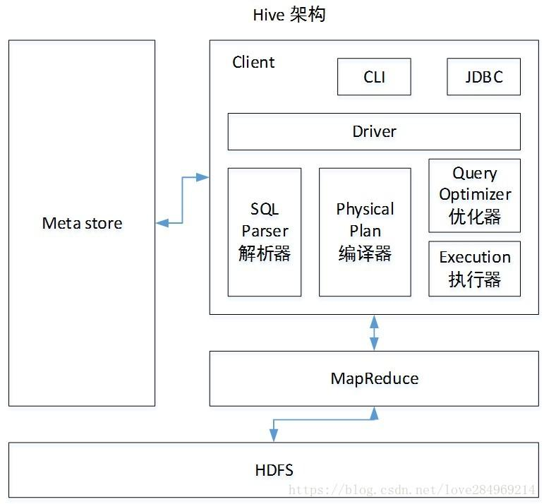


**SQL Parser 解析器**

将sql字符串转换成抽象语法树AST，这一步一般都用第三方工具库完成，比如antlr；对AST进行语法分析，比如表是否存在，字段是否存在，sql语义是否有误。

**Physical Plan 编译器**

将AST编译生成逻辑执行计划。

**Query Optimizer 优化器**

对逻辑执行计划进行优化

**Execution 执行器**

把逻辑执行计划转换成可以运行的物理执行计划。对于Hive来说，就是MR、Spark。


#### 7.1 HOL转换成MR任务流程说明

1. 进入程序，利用`Antlr`框架定义的HQL语法规则，对HQL完成`词法分析`、`语法分析`，将HQL转换成抽象语法树：`AST`
2. 遍历AST，抽象出查询的基本组成单元`QueryBlock(查询快)`，可以理解为最小的查询执行单元
3. 遍历`QueryBlock`,将其转换为`OperatorTree`（操作树，也就是逻辑执行计划），可以理解为不可拆分的一个逻辑执行单元
4. 利用逻辑优化器对`OperatorTree（操作树）`进行逻辑优化。例如合并不必要的`ReduceSinkOperator`，减少Shuffle数据量；
5. 遍历`OperatorTree`，转换成TaskTree。也就是翻译成MR任务的流程，将逻辑执行计划转换为物理执行计划。
6. 使用物理优化器对TaskTree进行物理优化；
7. 生成最终的执行计划，提交任务到Hadoop集群运行。


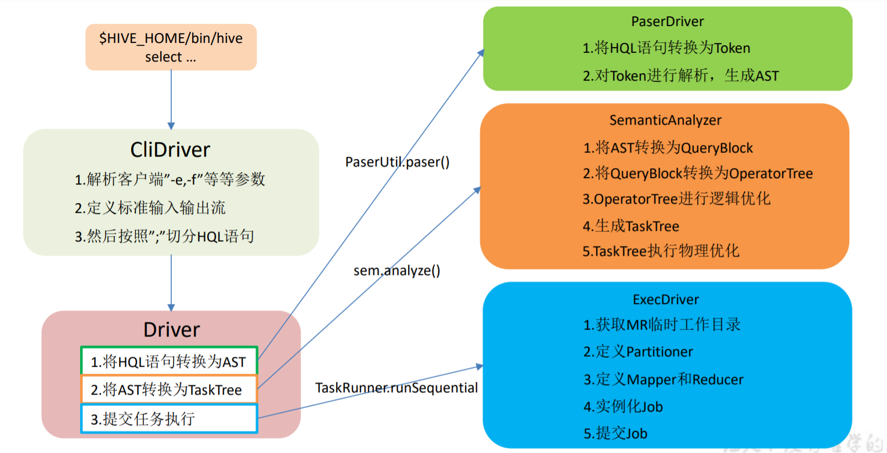


```java
private void runInternal(String command, boolean alreadyCompiled)
throws CommandProcessorResponse {
 errorMessage = null;
 SQLState = null;
 downstreamError = null;
 LockedDriverState.setLockedDriverState(lDrvState);
 lDrvState.stateLock.lock();

 ... ...
 PerfLogger perfLogger = null;
 if (!alreadyCompiled) {
 // compile internal will automatically reset the perf logger
 //1.编译 HQL 语句
 compileInternal(command, true);   // 这个方法里面会包含 解析器，编译器和优化器这个三个组件
 // then we continue to use this perf logger
 perfLogger = SessionState.getPerfLogger();
 }
 ... ...

 try {
 //2.执行
 execute();		// 这里会涉及到执行器
 } catch (CommandProcessorResponse cpr) {
 rollback(cpr);
 throw cpr;
 }
 isFinishedWithError = false;
 }
 }
```

```java
ASTNode tree = ParseUtils.parse(command, ctx); // 解析器解析HQL

// 在ParseUtils.parse() 方法中
/* 
1. 首先会对sql进行词法分析，得到词法单元token
2. 对token进行语法分析，最终将解析结果赋值给r
3. 通过r.getTree(); 方法获取最终的抽象语法树AST


*/

sem.analyze(tree,ctx); // 编译器与优化器
// Hive中的优化器（逻辑优化器）都好多好多种，其基本的抽象类为Transform类，其子类实现了各种的优化策略：例如（MapJoinProcessor策略，group Optimizer；分区过滤优化：PartitionConditionRemover；SimplePredicatePushDown）、
// 物理优化器提供的三种：Tez，MR，Spark 

```

<font color=red>小总结：</font>

1. **CliDriver处理传过来的SQL，按照`;`进行HQL语句的切分，每个HQL单独进行处理**
2. **将`HQL`传递给Hive的`Driver组件`**
3. **在Hive的`Driver`内部：**
   1. **解析器将`HQL`解析成抽象语法树`AST(具体使用的是`ParseUtils.parse()`方法)**
      - **先对HQL进行词法分析，生成<font color=green>词法单元:Token</font>**
      - **然后对词法单元Token进行语法分析，生成抽象语法树ASt**
      - **这个过程使用的是第三方框架`Antlr`**
   2. **编译器将AST进行编译，抽象出`QueryBlock`查询子块，进一步编译成`OperatorTree操作树`逻辑执行计划**
   3. **逻辑优化器对`OperatorTree`进行逻辑优化（具体的逻辑优化器抽象类为`Transform`类）,编译器将优化后的逻辑执行计划转换成`TaskTree物理执行计划`**
   4. **物理优化器将`TaskTree进行物理优化`（物理优化器共有三种 ：`TezOptimizer`,`MapReduceOptimizer`,`SparkOptimizer`）**
      - **其中MR的物理优化器在执行物理优化器方法之前就已经进行了相应的优化。**
   5. **`execut()方法`,将物理执行计划转化成MR任务，封装成`Job`,提交至集群运行任务。**


# Zookeeper复习

## 1. Zookeeper内部原理

### 1.1 选举机制

1. <font color=red>半数机制：集群中半数以上机器存活，集群可用。所以Zookeeper适合安装奇数台服务器。</font>
2. Zookeeper虽然在配置文件中并没有指定**Master**和**Slave**。但是，Zookeeper工作时，是有一个节点为Leader，其他则为Follower，Leader是通过内部的选举机制临时产生的。

**三个核心的选举原则**

1. Zookeeper集群中只有超过半数以上的服务器启动，集群才能正常工作；
2. 在集群正常工作之前，`myid`小的服务器给`myid`的的服务器投票，知道集群正常工作，选出`leader`；
3. 选出`Leader`之后，之前的服务器状态由`Looking`改变为`Following`，以后的服务器都是`Follower`。

以一个简单的例子来说明整个选举的过程：


假设有五台服务器组成的Zookeeper集群，他们的id从1~5，同时他们都是最新启动的，也就是没有历史数据，在存放数据量这一点上，都是一样的。假设这些服务器依序启动。

1. 服务器1启动，发起一次选举

   > 服务器1投自己一票，此时集群不够半数以上（3票），选举无法完成；
   >
   > 服务器1状态保持为`LOOKING`

2. 服务器2启动，再发起一次选举

   > 服务器2投自己一票，然后服务器1与服务器2交换投票信息，此时服务器1发现服务器2的id比自己的大，更改选票投给服务器2.
   >
   > 此时服务器1票数0票，服务器2票数2票，不够半数以上（3票），选举无法完成；（服务器1的票数在投票结束后，清零）
   >
   > 服务器1，2保持`LOOKING`

3. 服务器3启动，发起一次选举

   > 与上面过程一样，服务器1和服务器2先投自己一票，服务器3也投自己一票。
   >
   > 在交换投票信息的时候，发现此时还是LOOKING状态（还没有选取出leader），且服务器3的id最大，那么服务器3就会得到3票，此时服务器3的票数已经超过半数了（3票）
   >
   > 服务器1，2更新状态为FOLLOWING，服务器3更改状态为LEADING；

4. 服务器4启动，发起一次选举

   > 此时服务器1，2，3已经不是`LOOKING`状态，不会改变选票信息。交换选票信息结果：服务器3为3票，服务器4为1票。
   >
   > 此时服务器4服从多数，更改选票信息为服务器3；服务器3此时有4票
   >
   > 服务器4并更改状态为`FOLLOWING`;

5. 服务器5启动，同4一样投票给3，此时服务器3一共5票，服务器5为0票；

   > 服务器5更改状态为`FOLLOWING`

### 2. 节点类型

- 持久（Persistent）：客户端和服务器端断开连接后，创建的节点不删除
- 短暂（Ephemeral）：客户端与服务器端断开连接后，创建的节点自己会自动删除

说明：创建znode时，设置顺序标识，znode名称后会附加一个值，顺序号是一个单调递增的计数器，由父节点维护。

<font color=red>注意：分布式系统中，顺序号可以被用于为所有的事件进行全局排序，这样客户端可以通过顺序号推断事件的顺序。</font>

### 3. Stat结构体


### 4. 监听器原理


1. 首先要有一个main()线程
2. 在main线程中创建Zookeeper客户端，这时就会创建两个线程：一个负责网络连接通信（connect），一个负责监听（Listener）。
3. 通过connect线程，将注册的监听事件发送给Zookeeper。
4. 在Zookeeper的注册监听器列表中将注册的监听事件添加到列表中
5. Zookeeper监听到数据或路径变化，就会将这个消息发送给listener线程
6. listener线程内部调用了process()方法。

常见的监听：

1. 监听节点数据的变化

   `get path[watch]`

2. 监听子节点增减的变化

   `ls path[watch]`


### 5. Zookeeper写数据流程


1. client向zookeeper的Server1上写数据，发送一个写请求。
2. 如果server1不是leader，那么server1会把接收到的请求进一步转发给Leader，因为每个Zookeeper的Server里面有一个Leader。这个Leader会将写请求广播给各个Server，比如Server1，Server2，Server4，Server5；各个Server写成功后就会通知Leader。
3. 当Leader收到大多数Server数据写成功了，那么就说明数据写成功了。写成功之后，Leader会告诉Server1数据写成功了。
4. Server1会进一步通知Client数据写成功了，这时救人位整个操作成功了。

### 6. Zookeeper的常用命令

| 命令基本语法    | 功能描述                                                |
| --------------- | ------------------------------------------------------- |
| ls path[watch]  | 使用ls命令来查看当前znode中所包含的内容                 |
| ls2 path[watch] | 查看当前节点数据并能看到更新次数等数据                  |
| create          | 普通创建<br />-s含有序列<br />-e 临时（重启或超时消失） |
| get path[watch] | 获得节点的值                                            |
| set             | 设置节点的具体值                                        |
| stat            | 查看节点状态                                            |
| delete          | 删除节点                                                |
| rmr             | 递归删除节点                                            |


# Kafka复习

kafka是一个分布式的，基于消息订阅-发布模式的消息队列。Kafka对消息保存时根据Topic进行归类。每个消费者组可以订阅不同的Topic；且同一个消费者组的一个消费者只能消费一个分区中的数据。

无论是Kafka集群，还是consumer都依赖于**zookeeper**集群保存一些meta信息，来保证系统可用性。

**点对点模式（一对一，消费者主动拉取数据，消息收到后消息清除）**


消息生产者生产消息发送到Queue，然后消息消费者从Queue中取到并且消费消息。消息被消费后，queue中不再有存储，所以消息消费者不可能消费已经被消费的消息。Queue支持存在多个消费者，但是对一个消费者而言，只会有一个消费者可以消费。

**发布/订阅模式（一对多，消费者消费数据之后不会清除消息）**


消息生产者（发布）将消息发布到topic中，同时有多个消息消费者（订阅）消费该消息。和点对点方式不同，发布到topic的消息会被所有订阅者消费。

而发布/订阅模式的消息队列还可以分为两种：

1. 队列推送消息给消费者
2. 消费者主动拉取消息

如果采用第一种 队列推送消息给消费者，但是每个消费者的消费速度是不一定一致的，因此会发生消息的浪费情况。

在Kafka中则采用的第二种：消费者主动拉取消息。

## 1. 消息队列的作用（为什么使用消息队列？）

### 削峰

举个例子：双十一用户，假设在某一时间段内用户的下单请求峰值达到了一亿多，如果不使用消息队列，服务器端就要同时处理这一亿多的请求，如果服务器性能不够，就会崩掉！
如果使用了消息队列，就可以实现削峰的作用，限制同时访问服务器的请求数量，从而降低服务器端的负担。


### 解耦

通常生产者和消费者的业务逻辑是不同的，当消费者的消费业务逻辑发生变化时，如果不使用消息队列，就需要把整个生产-消费的逻辑改变。
如果使用了消息队列，生产者和消费者就实现了解耦，当需求发生变化时，只需要更改需要更改的一方，而不是修改整个 生产-消费的过程。


### 异步

很多时候，用户不想也不需要立即处理消息。消息队列提供了异步处理机制，允许用户
把一个消息放入队列，但并不立即处理它。想向队列中放入多少消息就放多少，然后在需要
的时候再去处理它们。


## 2. Kafka的特点

- 类似于消息队列和商业的消息系统，kafka提供对流式数据的发布和订阅
- kafka提供一种持久的容错的方式存储流式数据
- kafka拥有良好的性能，可以及时地处理流式数据


## 3. Kafka基础架构


1. **producer**：消息生产者，就是向Kafka broker发消息的客户端；

2. **consumer**：消息消费者，想kafka broker拉取消息的客户端；

3. **Topic**：可以理解为一个队列；

4. **consumer group（CG）**：这是Kafka用来实现一个topic消息的广播（发送给所有的Consumer）和单播（发给任意一个consumer）的手段

   一个topic可以有多个CG。topic的消息复制（不是真正的复制，是逻辑上的复制）到所有的CG，**但每个partition只会把消息发给CG中的一个consumer**

   如果需要实现广播，那么只需将每个consumer单独设置一个CG就可以了

   如果需要实现单播（一个消费者一个分区），只需将所有的consumer设置在同一个CG中即可。

   用CG还可以将consumer进行自由的分组而不需要多次发送消息到不同的topic中；

5. **Broker**：一台kafka服务器就是一个broker。一个集群由多个broker组成。一个broker可以容纳多个topic；

6. **partition**：为了实现扩展性，一个非常大的topic可以分布到多个broker（即服务器上）上。一个topic可以分为多个partition，每个partition是一个有序的队列。partition中的每条消息都会分配一个有序的id（offset）。kafka只保证按一个partition中的顺序将消息发给consumer，不保证一个topic的整体（多个partition间）的顺序。

7. **Offset**：kafka的存储文件都是按照offset.kafka来命名，用offset做名字的好处是方便查找。例如想找位于2049的位置，只要找到2048.kafka的文件即可。淡然the first offset就是`00000000000.kafka`。

8. **Replication**:副本，为了保证集群中的某个节点发生故障的时候，该节点上的partition数据不会丢失，且kafka仍然能够继续工作，kafka提供了副本机制，一个topic的每个分区都有若干个副本，一个`leader`和若干个`follower`

9. **leader**: 每个分区多个副本的“主”，生产者发送数据的对象，以及消费者消费数据的对象都是leader

10. **follower**：每个分区多个副本中的“从“，实时从leader中同步数据，保持和leader数据的同步。leader发生故障时，某个follower会成为新的leader。

## 4. Kafka部署注意事项

在配置Kafka上的server.properties时，要注意，每台broker的broker.id是需要设置不同的数字.<font  color=red>broker.id不能重复</font>

Kafka运行需要依赖于zookeeper，需要在配置文件中配置zookeeper集群的地址。

在启动kafka集群之前要确保zookeeper集群已经成功启动了。kafka集群停止的时候，要先停kafka，后停zookeeper，要不然kafka会关不掉的。

## 5. Kafka架构深入

### 5.1 Kafka工作流程以及文件存储机制

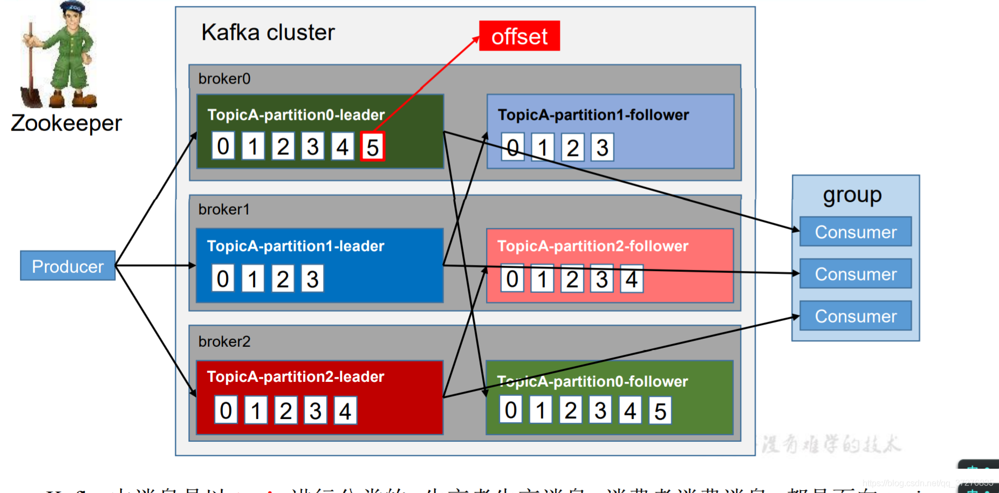


Kafka中消息是以topic进行分类的，生产者生产消息，消费者消费消息，都是面向topic的。
topic是逻辑上的概念，而partition是物理上的概念，每个partition对应一个log文件，该log文件中存储的就是producer生产的数据。Producer生产的数据会被不断追加到该log文件末端，且每条数据都有自己的offset。消费者组中的每个消费者，都会实时记录自己消费到了那个offset，以便出错恢复时，从上次的位置继续消费。

#### 文件存储机制

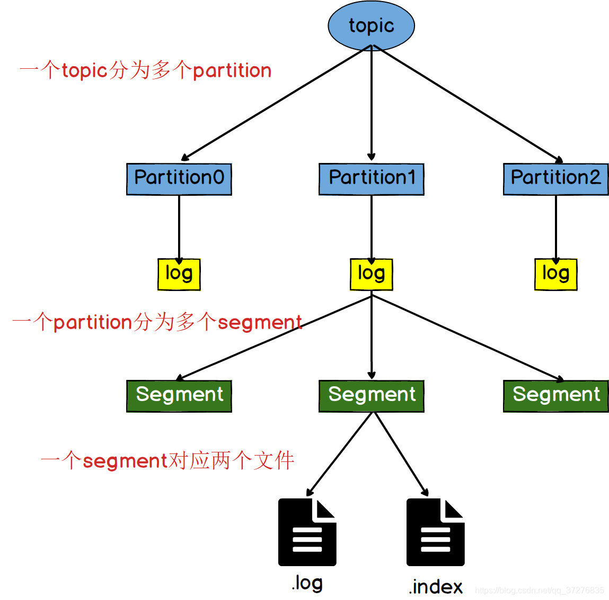

由于生产者生产的消息会不断追加到log文件末尾，为防止log文件过大导致数据定位效率低下，kafka采取了**切片**和**索引**机制，将每个partition分为多个segment。每个segment对应两个文件：`.index`和`.log`。这些文件位于一个文件夹下，该文件命名规则为：`topic名称+分区序号`。

例如，first 这个 topic 有三个分区，则其对应的文件夹为：first0,first-1,first-2。

```bash
00000000000000000000.index
00000000000000000000.log
00000000000000170410.index
00000000000000170410.log
00000000000000239430.index
00000000000000239430.log
```

index 和 log 文件以当前 segment 的第一条消息的 offset 命名。

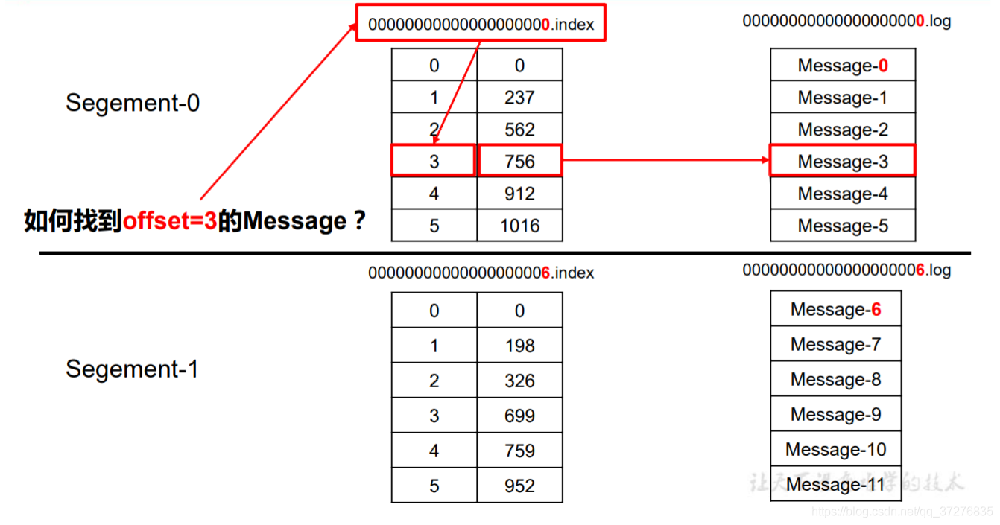

“index”文件存储着大量的索引信息，“log”文件存储大量的数据，索引文件中的元数据指向对应数据文件中message的物理偏移地址。

### 5.2 生产者

**分区的原因：**

1. 在集群中扩展，每个partition可以通过调整以适应它所在的机器，而一个topic又可以有多个patirion，因此整个集群就可以使用任意大小的数据了。
2. 可以提高并发，因为可以以partition为单位读写了。

**分区原则**

生产者producer发送数据的时候，需要将数据封装成一个`ProducerRecord`对象。生产者发送`ProducerRecord`对象的时候，可以指定分区号;

1. 指定partition的情况下，直接将指定的值作为partition值
2. 没有指定partition的值但是有key的情况下，将key的hash值与topic的partitions数进行取余得到partition值；
3. 既没有partition值又没有key值的情况下，第一次调用时随机生成一个证书（后面每次调用的时候，在这个整数上自增），将这个值与topic可用的partition总数取余得到partition值，这就是常说的`round-robin`轮询算法。


#### 数据可靠性

**为保证producer发送的数据，能可靠的发送到指定的topic，topic的每个partition收到producer发送的数据后，都需要向producer发送`ack`（acknowledge确认收到），如果producer收到ack，就会进行下一轮的发送，否则重新发送数据（一定时间内没有接收到ack的时候）。**

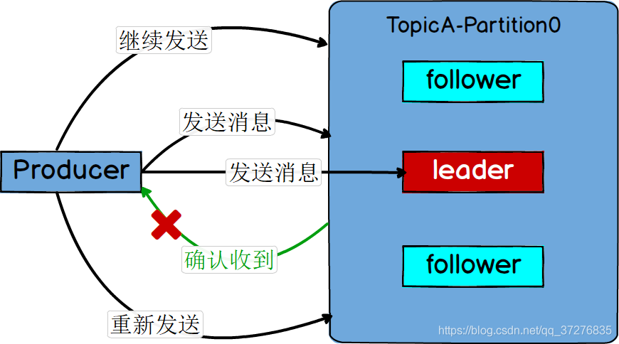


**何时发送ack？**

确保有follower与leader同步完成，leader再发送ack，这样才能保证leader挂掉之后，能在follower中选举出新的leader。

**多少个follower同步完成之后发送ack？**

现有方案：

- 半数以上的follower同步完成，即可发送ack
- 全部的follower同步完成，才可以发送ack

| 方案                        | 延迟   | 副本数量                                            |
| --------------------------- | ------ | --------------------------------------------------- |
| 半数以上完成同步，就发送ack | 低延迟 | 选举新的leader时，容忍n台节点的故障，需要2n+1个副本 |
| 全部完成同步，才发送ack     | 延迟高 | 选举新的leader时，容忍n台节点的故障，需要n+1个副本  |

Kafka选择了第二种方案，原因如下：

1. 同样为了容忍n台节点的故障，第一种方案需要2n+1个副本，而第二种方案只需要n+1个副本，而Kafka的每个分区都有大量的数据，第一种方案会造成大量数据的冗余。
2. 虽然第二种方案的网络延迟会比较高，但网络延迟对Kafka的影响较小。


##### ISR同步副本机制

采用第二种方案之后，设想以下场景：leader收到数据，所有的follower都开始同步数据，但有一个follower，因为某种故障，迟迟不能与leader进行同步，那么leader就要一直等下去，直到它完成同步，才能发送ack，这个问题怎么解决呢？

<font color=green>在kafka中，每个分区的Leader维护一个动态`in-sync-replica set`(ISR),意为和leader保持同步的follower的集合。当ISR中的follower完成数据的同步之后，leader就会给follower发送ack。如果follower长时间未向leader同步数据，则该follower将被踢出ISR，该时间阈值由`replica.lag.time.max.ms`参数设定。Leader发生故障之后，就会从ISR中选举新的Leader。</font>

##### ack应答机制

对于某些不太重要的数据，对数据的可靠性要求不是很高，能够容忍数据的少量丢失，所以没有必要等ISR中的follower全部接收成功。所以Kafka为用户提供了三种可靠性级别，用户根据可靠性和延迟的要求进行权衡，选择配置。

**ACK参数：**

> 0：producer不等待broker的ack，这一操作提供了一个最低的延迟，broker一接收到还没有写入磁盘就已经返回，当broker故障的时候有可能**丢数据**。
>
> 1：producer等待broker的ack，partition的leader落盘成功后返回ack，如果在follower同步成功之前leader故障，那么将会**丢数据**；
>
> -1（all）：producer等待broker的ack，partition的leader和follower全部落盘成功后才返回ack。但是如果在follower同步完成之后，broker发送ack之前，leader发生故障，那么会造成**数据重复**。

##### 故障处理细节


接下来介绍一下Kafka中一个topic的一个分区的broker挂掉之后，是如恢复的。

<font color=green>两个重要的核心概念：</font>

- LEO(Log End Offset)：日志末偏移量
  - 指的是每个副本最大的offset
- HW(Hign WaterMark)：高水位
  - 指的是消费者能够见到的最大的offset，ISR队列中最小的LEO（高水位）

###### 1. follower故障

follower发生故障之后，会被临时踢出ISR，待该follower恢复后，follower会读取本地磁盘记录的上次的HW，并将log文件高于HW的部分截取掉，从HW开始向leader进行同步。**等待follower的LEO大于等于此时的该分区Partition的HW**，即follower追上leader之后，就可以重新加入ISR了。

###### 2. leader故障

leader发生故障之后，会从ISR中选取一个新的Leader，之后，为了保证多个副本之间的数据一致性，其余的follower会先将各自的log文件中<font color=red>高于HW的部分截取掉</font>，然后从新的leader同步数据。（新官上任三把火，其他人都要按照我的规矩办事，废除上任的制度）

<font color=red>注意：这只能保证副本之间的数据一致性，并不能保证数据不丢失或者不重复。</font>


##### Exactly Once语义

将服务器的ack级别设置为-1，可以保证Producer到Server之间不会丢失数据，即 **At Least Once语义（至少一次）**。相对的，将服务器ack级别设置为0，可以保证生产者每条消息只会被发送一次，即**At Most Once语义（至多一次）。**

AtLeaseOnce可以保证数据不丢失，但是不能保证数据不重复；相对的，AtMostOnce可以保证数据不重复，但是不能保证数据不丢失。但是对于一些非常重要的信息，比如说交易数据，下游数据消费者要求数据即不能重复也不能丢失，即Exactly Once语义。在 0.11 版本以前的 Kafka，对此是无能为力的，只能保证数据不丢失，再在下游消费者对数据做全局去重。对于多个下游应用的情况，每个都需要单独做全局去重，这就对性能造成了很大影响。
0.11 版本的 Kafka，引入了一项重大特性：幂等性。所谓的幂等性就是指 Producer 不论向 Server 发送多少次重复数据，Server 端都只会持久化一条。幂等性结合 At Least Once 语义，就构成了 Kafka 的 Exactly Once 语义。即：
**AtLeaseOnce + *幂等性* = Exactly Once**

要启动幂等性，只需将Producer的参数中`enable.idompotence`设置为`true`即可。

### 5.3 分区分配策略

#### Range


Range策略针对的是主题。

由于消费者1，2同时订阅了主题1，而消费者1，2属于同一消费者组。

range策略：主题中的消息数/消费者组中的消费者数   ——  3/2 = 1.....1.那么化为范围的时候，就有一个消费者中要消费2条消息（因为没有整除）

#### RoundRobin


RoundRobin策略针对的是消费者组，组内不同消费者订阅的不同主题topic，消费者组内的所有消费者都可以消费这些主题中的消息，消费方式采用轮询。
**这里需要注意：**

> 如果采用了这种分区分配策略，就会导致没有订阅topic的消费者也消费到了消息，这样就有可能造成信息分配错了。所以默认是Range策略。同时在生产环境中，同一个消费者组内的消费者订阅的主题是要保持一致的。

### 5.4 kafka 消息发送流程


Kafka的Producer发送消息采用的是异步发送的方式。在消息发送的过程中，涉及到了两个线程：`main线程 和 Sender线程`，以及一个线程共享变量`RecordAccumulator`.

main线程将消息发送给RecordAccumulator，Sender线程不断从RecordAccumulator中拉取消息发送到kafka broker上。

### 5.5 Kafka中的选举机制

[参考文章](https://zhuanlan.zhihu.com/p/357042753)

[Kafka| 你一定不能错过的Kafka控制器](https://blog.csdn.net/sinat_27143551/article/details/103033641?utm_medium=distribute.pc_relevant_t0.none-task-blog-2%7Edefault%7EBlogCommendFromMachineLearnPai2%7Edefault-1.control&depth_1-utm_source=distribute.pc_relevant_t0.none-task-blog-2%7Edefault%7EBlogCommendFromMachineLearnPai2%7Edefault-1.control)

#### 1. Kafka的控制器Controller是如何被选举出来的？

每台Broker都能充当控制器，那么，当集群启动后，Kafka怎么确认控制器位于哪台Broker呢？

<font color=red>实际上，Broker在启动时，会尝试去Zookeeper中创建 `/controller节点`。Kafka当前选举控制器的规则是：第一个成功创建`/controller节点`的Broker会被指定为控制器。</font>

##### 控制器的作用

1. **主题管理（创建、删除、增加分区）**

   - 控制器帮助我们完成对Kafka主题的创建、删除、以及分区增加的操作。换句话说，当我们执行 ***\*kafka-topics\**** 脚本时，大部分的后台工作都是控制器来完成的。

2. **分区重分配**

   - 分区重分配主要是指：`kafka-reassign-partition脚本`，提供的对已有主题分区进行细粒度的分配功能。这部分功能也是控制器实现的。

3. **Preferred领导者选举**

4. **集群成员管理（新增Broker， Broker主动关闭、Broker宕机）**

   - 这是控制器提供的第 4 类功能，包括自动检测新增 Broker、Broker 主动关闭及被动宕机。这种自动检测是依赖于前面提到的 Watch 功能和 ZooKeeper 临时节点组合实现的。

     

     比如，控制器组件会利用 ***\*Watch 机制\****检查 ZooKeeper 的 /brokers/ids 节点下的子节点数量变更。目前，当有新 Broker 启动后，它会在 /brokers 下创建专属的 znode 节点。一旦创建完毕，ZooKeeper 会通过 Watch 机制将消息通知推送给控制器，这样，控制器就能自动地感知到这个变化，进而开启后续的新增 Broker 作业。

     

     侦测 Broker 存活性则是依赖于刚刚提到的另一个机制：***\*临时节点\****。每个 Broker 启动后，会在 /brokers/ids 下创建一个临时 znode。当 Broker 宕机或主动关闭后，该 Broker 与 ZooKeeper 的会话结束，这个 znode 会被自动删除。同理，ZooKeeper 的 Watch 机制将这一变更推送给控制器，这样控制器就能知道有 Broker 关闭或宕机了，从而进行“善后”。

5. **数据服务**

   - 控制器的最后一大类工作，就是向其他Broker提供数据服务。控制器上保存了最全的集群元数据信息，其他所有Broker会定期接收控制器发来的元数据更新请求，从而更新其内存中的缓存数据。


##### 控制器故障转移

在 Kafka 集群运行过程中，只能有一台 Broker 充当控制器的角色，那么这就存在***\*单点失效\****（Single Point of Failure）的风险，Kafka 是如何应对单点失效的呢？答案就是，为控制器提供故障转移功能，也就是说所谓的 Failover。


最开始时，Broker0是控制器，当Broker0宕机后，Zookeeper通过Watch机制感知到并删除了`/controller临时节点`。之后，所有存活的Broker开始竞选新的控制器身份。Broker3最后抢占成功，成功在Zookeeper上创建了`controller节点`。之后，Broker3会从Zookeeper中读取集群元数据信息，并初始化到自己的缓存中。

#### 分区Leader的选取

分区leader副本的选举由**控制器**负责具实施。当创建分区、分区上线这些时候，都需要执行leader的选举动作。

**基本策略**

按照**AR**（Kafka topic中一个分区的所有副本）集合中副本的顺序查找第一个存活的副本，并且这个副本在ISR集合中。一个分区的AR集合在分配的时候就被指定，并且只要不发生重分配的情况，集合内部副本的顺序是保持不变的，而分区的ISR集合中副本的顺序可能会改变。


## 常见面试题


1. Kafka中的ISR，OSR，AR分别代表什么？
   - ISR：与leader 保持同步的follower
   - OSR：与leader副本同步滞后过多的follower集合
   - AR：分区的所有副本
2. Kafka中的HW、LEO等分别代表什么？
   - LEO：是log文件末尾的偏移量
   - HW：一个分区中所有副本最小的offset
3. Kafka中是怎么体现消息顺序性的。
   - 生产消息时，每次生产的数据都会追加到log文件的末尾
   - 消费时，消费者会维护一个offset偏移量，根据偏移量就可以保证消息的顺序性
4. Kafka中的分区器、序列化器、拦截器是否了解？他们之间的处理顺序是什么？
   - **拦截器**
   - **序列化器**
   - **分区器**
5. Kafka生产者客户端的整体结构是什么样子的？使用了几个线程来处理？分别是什么？
   - 包括两个线程：main线程和sender线程
   - 组件包括：Procuder、拦截器。序列化器、分区器、共享变量RecordAccumulator和sender线程
   - 
6. Kafka哪些情形会造成重复消费？
   - 先消费信息，然后提交offset（如果当信息消费成功之后，offset提交之前，consumer宕机了）
   - 在consumer恢复的时候，还是会从之前的那个偏移量读取数据，这时就会造成重复消费。
7. kafka哪些情景会造成消息泄漏消费？
   - 先提交offset，后消费数据
   - 在offset提交offset完成后，消费数据前，consumer宕机了，就有可能造成消息漏消费

**待补充**


# Flink复习


# 数仓复习


# 网络复习

## 1. OSI的七层参考模型


| 应用层     | 访问网络服务的接口（DNS）                                    | 单位                     |
| ---------- | ------------------------------------------------------------ | ------------------------ |
| 表示层     | 提供数据格式转换服务                                         |                          |
| 会话层     | 建立端连接并提供访问验证和会话管理                           |                          |
| 传输层     | 提供应用进程之间的逻辑通信<br />常见：TCP、UDP、进程、端口（socket） | 数据段（segment）        |
| 网络层     | 为数据在节点之间传输创建逻辑链路，并分组转发数据<br />例如：对子网间的数据包进行路由选择<br />常见：路由器、多层交换机、防火墙 | 分组（数据包）（packet） |
| 数据链路层 | 在通信的实体间建立数据链路连接<br />例如：将数据分帧，并处理流控制、物理地址寻址、重发等<br />常见：网卡，网桥，二层交换机等。 | 帧（frame）              |
| 物理层     | 为数据端设备提供原始比特流（01）的传输大的通路<br />网络通信的传输介质，由电缆与设备共同构成<br />常见：中继器，集线器，网线等 | 比特（bit）              |

7层参考模型是一个标准，而非实现。

**五层参考模型**

物理层，数据链路层，网络层，传输层，应用层

## 2. 一次完整的Http请求过程

第一种回答：

1. 建立客户机与服务器连接
2. 建立连接后，客户机发送一个请求给服务器
3. 服务器收到请求给予相应信息
4. 客户端浏览器将返回的内容解析并呈现，断开连接。

第二种回答：

1. DNS域名解析
2. 发起TCP的3次握手
3. 建立TCP连接后发起http请求
4. 服务器响应http请求，浏览器得到html代码
5. 浏览器解析html代码，并请求html代码中的资源（如js、css、图片等）
6. 浏览器对页面进行渲染呈现给用户

## 3. DNS

DNS：域名系统，因特网上作为`域名`和`IP地址`相互映射的一个分布式数据库,能够使用户更方便的访问互联网，而不用去记住能够被机器直接读取的IP数串。

通过主机名，最终得到该主机名对应的ip地址的过程叫做域名解析（或主机名解析）

### 3.1 DNS的工作原理

将主机域名转换为ip地址，属于应用层协议，使用UDP传输。


域名到IP地址的解析过程的要点如下：

1. 当某一个应用需要把主机名解析为IP地址时，该应用进程就调用解析程序，并称为DNS的一个客户，把待解析的域名放在DNS请求报文中，以**UDP**用户数据报方式发给本地域名服务器。
2. 本地域名服务器在查找域名后，把对应的IP地址放在回答报文中返回。应用程序获得目的主机的IP地址后即可进行通信。
3. 若本地域名服务器不能回答该请求，则此域名服务器就暂时称为DNS的另一个客户，并向其他域名服务器发出查询请求。

[参考文献](https://blog.csdn.net/mocas_wang/article/details/109167660)


- 请求一旦发起，若是chrome浏览器，现在浏览器找之前看看有**没有缓存过的域名对应的ip地址**，有的话，直接跳过DNS解析，若是没有，就会找**硬盘的hosts文件**，有的话，直接找到hosts文件里面的ip
- 如果本地的hosts文件没有得到对应的ip地址，浏览器会发出一个`dns请求到本地DNS服务器,本地dns服务器一般都是你的网络接入服务器商提供`，比如中国移动、中国电信等。
- 查询你输入的网址的DNS请求到本地DNS服务器之后，**本地DNS服务器会首先查询它的缓存记录**，如果缓存中由此条记录，就可以直接返回结果，此过程是**递归的方式进行查询**。如果没有，**本地DNS服务器还要向DNS根服务器**进行查询。
- 本地DNS服务器继续向域服务器发出请求，在这个例子中，请求的对象是.com域服务器。.com域服务器收到请求之后，也不会直接返回域名和IP地址的对应关系，而是告诉本地DNS服务器，你的域名的解析服务器的地址。
- 最后，本地DNS服务器向**域名的解析服务器**发出请求，这时就能收到一个域名和IP地址对应关系，本地DNS服务器不仅要把IP地址返回给用户电脑，还要把这个对应关系保存在缓存中，以备下次别的用户查询时，可以直接返回结果，加快网络访问。


## 4. Http长连接与短连接

- 在HTTP/1.0中默认使用短连接。也就是说，客户端和服务器每进行一次HTTP操作（实际上就是TCP），就建立一次连接，任务结束就中断连接。当客户端浏览器访问的某个HTML或其他类型的Web页中包含有其他的Web资源（如JavaScript文件、图像文件、CSS文件等），每遇到这样一个Web资源，浏览器就会重新建立一个HTTP会话。
- 使用长连接的情况下，当一个网页打开完成后，客户端和服务器之间用于传输HTTP数据的TCP连接不会关闭，客户端再次访问这个服务器时，会继续使用这条已经建立的连接。`Keep-Alive`不会永久保持连接，它有一个保持时间，可以在不同的服务器软件中设置这个时间。实现长连接需要客户端和服务端都支持长连接。

HTTP协议的长连接和短连接，实质上是TCP协议的长连接和短连接。

## 5. HTTP请求方法

| 序 号 | 方法    | 描述                                                         |
| ----- | ------- | ------------------------------------------------------------ |
| 1     | GET     | 请求指定的页面信息，并返回实体主体。                         |
| 2     | HEAD    | 类似于 GET 请求，只不过返回的响应中没有具体的内容，用于获取报头 |
| 3     | POST    | 向指定资源提交数据进行处理请求（例如提交表单或者上传文件）。数据被包含在请求体中。POST 请求可能会导致新的资源的建立和/或已有资源的修改。 |
| 4     | PUT     | 从客户端向服务器传送的数据取代指定的文档的内容。             |
| 5     | DELETE  | 请求服务器删除指定的页面。                                   |
| 6     | CONNECT | HTTP/1.1 协议中预留给能够将连接改为管道方式的代理服务器。    |
| 7     | OPTIONS | 允许客户端查看服务器的性能。                                 |
| 8     | TRACE   | 回显服务器收到的请求，主要用于测试或诊断。                   |
| 9     | PATCH   | 是对 PUT 方法的补充，用来对已知资源进行局部更新 。           |

### GET 与 POST的区别？

1. get把请求的数据放在url上，参数之间以&相连，所以get不太安全；post把数据放在HTTP的包体内（request body）
2. get提交数据最大是2k（限制实际上取决于浏览器），post理论上没有限制。
3. GET请求会被浏览器主动缓存，而POST不会，除非手动设置。


## 6. HTTPS和HTTP的区别

1. HTTP协议传输的数据都是未加密的，也就是明文的，因此使用HTTP协议传输隐私信息非常不安全，HTTPS协议是由SSL+HTTP协议构建的可进行加密传输、身份认证的网络协议，要比http协议安全。
2. https协议需要到CA申请证书，一般免费证书较少，因而需要一定费用。
3. http和https使用的是完全不同的连接方式，用的端口也不一样，前者是80，后者是443


## 7. 什么是RARP？工作原理

概括：反向地址转换协议，网络层协议，`RARP`与`ARP`工作方式相反。RARP使只知道自己硬件地址的主机能够知道IP的地址。RARP发出要反向解释的物理地址并希望返回其IP地址，应答包括能够提供所需信息的RARP服务器发出的IP地址。

**原理**

1. 往上上的每台设备都会有一个独一无二的硬件地址，通常是由设备厂商分配的MAC地址。主机从网卡上读取MAC地址，然后在网络上发送一个`RARP`请求的广播数据包,请求RARP服务器回复该主机的IP地址
2. RARP服务器收到RARP请求数据包，为其分配IP地址，并将RARP回应发送给主机
3. PC1收到RARP回应后，就使用得到的IP地址进行通讯。


## 8. 什么是ARP？

`ARP`地址解析协议，其基本功能为透过目标设备的IP地址，查询目标设备的MAC地址，以保证通信的顺利进行。它是IPV4中网络层必不可少的协议，不过在IPV6中已不再适用，并被邻居发现协议（NDP）所替代。

**工作流程**


假设主机A和B在同一个网段，主机A要向主机B发送信息，具体的地址解析过程如下：
(1)  主机A首先查看自己的ARP表，确定其中是否包含有主机B对应的ARP表项。如果找到了对应的MAC地址，则主机A直接利用ARP表中的MAC地址，对IP数据包进行帧封装，并将数据包发送给主机B。

(2) 如果主机A在ARP表中找不到对应的MAC地址，则将缓存该数据报文，然后以广播方式发送一个ARP请求报文。ARP请求报文中的发送端IP地址和发送端MAC地址为主机A的IP地址和MAC地址，目标IP地址和目标MAC地址为主机B的IP地址和全0的MAC地址。由于ARP请求报文以广播方式发送，该网段上的所有主机都可以接收到该请求，但只有被请求的主机（即主机B）会对该请求进行处理。

(3) 主机B比较自己的IP地址和ARP请求报文中的目标IP地址，当两者相同时进行如下处理：将ARP请求报文中的发送端（即主机A）的IP地址和MAC地址存入自己的ARP表中。之后以单播方式发送ARP响应报文给主机A，其中包含了自己的MAC地址。

(4) 主机A收到ARP响应报文后，将主机B的MAC地址加入到自己的ARP表中以用于后续报文的转发，同时将IP数据包进行封装后发送出去。

## 9. TCP 头部信息


- **序号**（32bit）：传输方向上字节流的字节编号。初始时序号会被设置一个随机的初始值（ISN），之后每次发送数据时，`序号值=ISN+数据在整个字节流中的偏移`。

  假设A->B且ISN=1024，第一段数据512字节已经到B，则第二段数据发送时序号为1024+512.用于解决网络包乱序问题。

- **确认号**（32bit）：接收方对发送方TCP报文段的响应，其值是收到的序号值+1.（ack）

- **首部长**（4bit）：标识首部有多少个4字节*首部长，最大为15，即60字节。

- **标志位**（6bit）：

  - URG：标志紧急指针是否有效
  - **ACK**：标志确认号是否有效（确认报文段）。用于解决丢包问题。
  - PSH：提示接收端立即从缓冲读走数据。
  - RST：表示要求对方重新建立连接（复位报文段）。
  - **SYN**：表示请求建立一个连接（连接报文段）。
  - **FIN**：表示关闭连接（断开报文段）。

- **窗口**（16bit）：接收窗口。用于告知对方（发送方）本方的缓冲还能接收多少字节数据。用于解决流控。

- **检验和**（16bit）：接收端用CRC检验整个报文段有无损失。


**常见TCP的连接状态有哪些？**

- **CLOSED**：初始状态
- **LISTEN**：服务器处于监听状态。
- **SYN_SEND**：客户端socket执行connect连接，发送SYN包，进入此状态。
- **SYN_RECV**：服务端收到SYN包并发送服务端SYN包，进入此状态。
- **ESTABLISH**：表示连接建立。客户端发送了最后一个ACK包后进入此状态，服务端接收到ACK包后进入此状态。
- **FIN_WAIT_1**：终止连接的一方（通常是客户机），发送了FIN报文后进入此状态，等待对方FIN。
- **CLOSE_WAIT**：（假设服务器）接收到客户机FIN包之后等待关闭的阶段。在接收到对方的FIN包之后，自然是需要立即回复ACK包的，表示已经知道断开请求。但是本方是否立即断开连接（发送FIN包）取决于是否还有数据需要发送给客户端，若有，则在发送FIN包之前均为此状态。
- **FIN_WAIT_2**：此时是半连接状态，即有一方要求关闭连接，等待另一方关闭。客户端接收到服务器的ACK包，但并没有立即接收到服务端的FIN包，进入FIN_WAIT_2状态。
- **LAST_ACK**：服务端发动最后的FIN包，等待最后的客户端ACK响应，进入此状态。
- **TIME_WAIT**：客户端收到服务端的FIN包，并立即发出ACK包做最后的确认，在此之后的2MSL时间称为TIME_WAIT状态。

## 10. TCP 三次握手🤝与四次挥手👋🏻

**三次握手**


# 操作系统复习


# Redis复习

## 1.  常用数据类型

###  String

```shell
set key value
get key

setnx key  value  # 当key不存在的时候，才创建此key的数据
```

### List

```shell
lpush：相当于从左侧压栈，rpush相当于从右侧压栈
lrange：相当于从左侧开始读元素。没有rrange

lpop：从list左侧移除第一个元素；rpop从右侧移除第一个元素

lindex list 1：获取list从左侧开始的索引为1的值

llen list：获取list长度
lrem list count（1,2，3.） value：从list移除指定的值，如果有重复数据，可以指定移除的个数 。精确匹配
```


### set

```shell
sadd myset "hello"
smembers myset
sismember myset "hashdf"
srem myset "hello" # 移除集合中指定的元素

```

### Hash

```shell
hset myhash name ha # 创建hash myhash 并指定field： name    value：ha
hget myhash name
```

### Zset

有序集合

```shell
127.0.0.1:6379> zadd salary 2500 xiaohong 5000 zhangsan 500 xiaozhang # 有序集合添加元素，需要指定每个元素的权重
127.0.0.1:6379> ZRANGE salary 0 -1 withscores # 查看元素，可以指定查询结果是否带权重
```

### BitMap位图

```shell
# 使用bitmap来记录 周一至周日的打卡
# 周一：1 周二：0 周三：0 周四：1…………
127.0.0.1:6379> setbit sign 0 1
(integer) 0
127.0.0.1:6379> setbit sign 1 0
(integer) 0
127.0.0.1:6379> setbit sign 2 0
(integer) 0
127.0.0.1:6379> setbit sign 3 1
(integer) 0
127.0.0.1:6379> setbit sign 4 1
(integer) 0
127.0.0.1:6379> setbit sign 5 0
(integer) 0
127.0.0.1:6379> setbit sign 6 0
(integer) 0
====================
127.0.0.1:6379> getbit sign 3 # 查看周四是否打卡
(integer) 1

#####################
# 统计 打卡的天数
127.0.0.1:6379> bitcount sign 0 6 #统计周一至周日的打开天数
(integer) 3
```


## 2. Redis持久化

Redis是内存数据库，如果不将内存中的数据库状态保存到磁盘，那么一旦服务器进程退出，服务器中的数据库状态也会消失。所以Redis提供了持久化功能！

### RDB（Redis DataBase）

在指定的时间间隔内将内存中的数据集快照写入磁盘，也就是行话讲的Snapshot快照，它恢复时将快照文件直接读到内存里。

Redis会单独创建（`fork`）一个进程来进行持久化，会先将数据写入到一个临时文件中，待持久化过程都结束了，再用这个临时文件替换上次持久化好的文件。整个过程中，主进程是不进行任何IO操作的。这就确保了极高的性能。如果需要进行大规模的数据恢复，且对于数据恢复的完整性不是非常敏感，那RDB方式要比AOF方式更加高效。`RDB的缺点是最后一次持久化后的数据可能会丢失`。**RDB保存的文件是`dump.rdb`**

**优点：**

1. 适合大规模的数据恢复
2. 对数据的完整性和一致性要求不高

**缺点：**

1. 在一定时间间隔做一次备份，所以如果redis意外宕机的话，就会丢失最后一次快照的所有修改
2. fork的时候，内存中的数据被克隆了一份，大致2倍的内存膨胀。

**RDB持久化触发规则**

1. 一分钟内改了1万次
2. 5分钟内改了10次
3. 15分钟内改了1次

### AOF（Append Only File） 

AOF是以日志的形式来记录每个写操作，将redis执行过的所有写指令记录下来（读操作不记录），只许追加文件但不可以改写文件，redis启动之初会读取该文件重新构建数据，换言之，redis重启的话就根据日志文件的内容将写执行从前到后执行一遍，以完成数据的恢复工作。

AOF保存的是`appendonly.aof`

**注意：**

`appendonly.aof`与`dump.rdb`两者是可以共存的，但是，当redis启动的时候，会先加载aof文件恢复数据。

**Appendfsync：数据同步策略**

1. Always：同步持久化 每次发生数据变更会被立即记录到磁盘， 这种同步方式性能较差但数据完整性比较好
2. Everysec： 出厂默认推荐， 异步操作，每秒记录 如果一秒内宕机，有数据丢失
3. No：不进行数据同步

**AOF优势**

- 每修改同步：appendfsync always 同步持久化，每次发生数据变更会被立即记录到磁盘，性能较差但是数据完整性比较高
- 每秒同步： appendfsync everysec 异步操作，每秒记录 ，如果一秒内宕机，有数据丢失
- 不同步：appendfsync no 从不同步

**劣势**

- 对于相同数据集的数据而言，aof文件要远大于rdb文件，恢复速度慢于rdb
- AOF运行效率要慢于rdb，每秒同步策略效率较好，不同步效率和rdb相同


## 3. 哨兵Sentine模式（反客为主的自动版）

主从切换技术的方法是：当主服务器宕机后，需要手动把一台从服务器切换为主服务器，这就需要人工干预，费时费力，还会造成一段时间内服务不可用。Redis2.8开始正式提供了 **Sentinel**（哨兵）架构来解决这个问题

哨兵模式下，能后后台监视主机是否宕机故障，如果故障了根据投票数自动将从库切换成主库。

哨兵模式是一种特殊的模式，首先Redis提供了哨兵的命令，哨兵是一个独立的进程，作为进程，他会独立的运行。**其原理是：哨兵通过发送命令，等待Redis服务器响应，从而监控运行的多个Redis实例。**

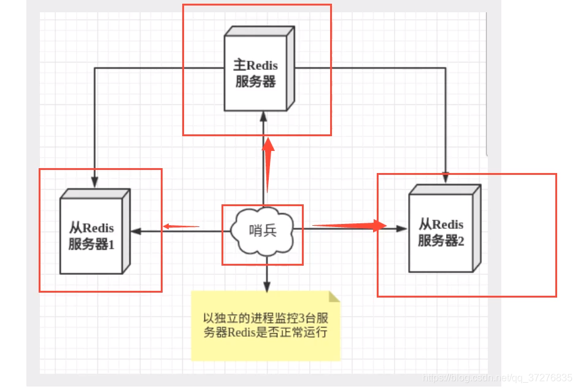

**哨兵的两个作用**

- 通过发送命令，让Redis服务器返回监控其运行状态，包括主服务器和从服务器
- 当哨兵检测到master宕机，会自动将slave切换到master，然后通过**发布订阅模式**通知其他的从服务器，修改配置文件，让他们切换主机

然而一个哨兵进程对Redis服务器进行监控，可能会出现问题，为此，我们可以使用多个哨兵进行监控。各个哨兵之间还会进行监控，这样就形成了多哨兵模式。

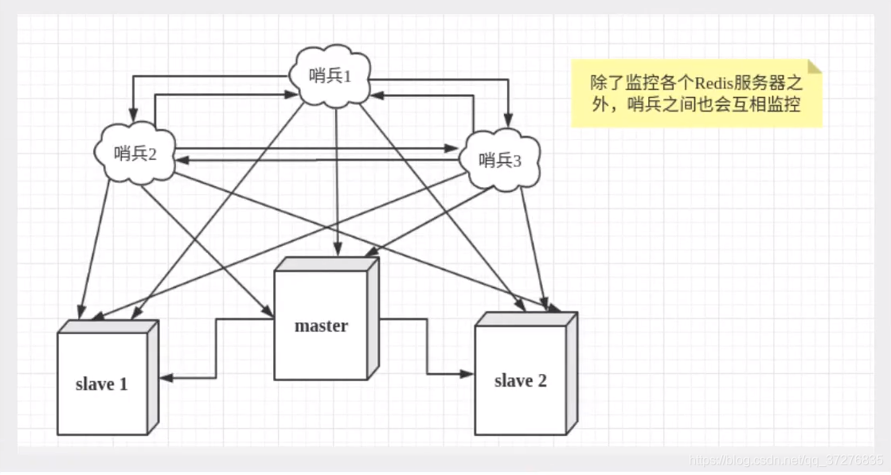


## 4. Redis 中 Key的过期淘汰机制

### 定期删除

Redis默认是每隔100ms就随机抽取一些设置了过期时间的key，检查其是否过期，如果过期就删除

为什么是随机而不是检查所有key？因为如果你设置的key成千上万，没100ms豆浆所有存在的key检查一遍，会给cpu带来较大的压力。

### 惰性删除

定期删除由于是随机抽取可能会导致很多过期key到了过期时间并没有被删除。

所以用户在从缓存获取数据的时候，redis会检查这个key是否过期了，如果过期就删除这个key，这时候就会将过期key从缓存中清除

## 5. 内存淘汰机制

如果仅仅使用**`定期删除+惰性删除`**机制还是会留下一个严重的隐患：如果定期删除保留下了很多已经过期的key，而且用户长时间都没有使用过这些过期key，就会导致过期的key无法被`惰性删除`，从而导致过期的key一直堆积在内存中，最终造成Redis内存块被消耗殆尽。

Redis的**内存淘汰机制**应运而生

### 8种内存淘汰机制

1. `noeviction`
   - 不驱逐任何key
2. `allkeys-lru`
   - 对所有key使用LRU算法进行删除（**默认**）
3. `volatile-lru`
   - 对所有设置了过期时间的key使用lru算法进行删除
4. `allkeys-random`
   - 对所有key随机删除
5. `volatile-random`
   - 对所有设置了过期时间的key随机删除
6. `volatile-ttl`
   - 删除马上要过期的key
7. `allkeys-lfu`、
   - 对所有key使用LFU算法进行删除
8. `volatile-lfu`
   - 对所有设置了过期时间的key使用LFU算法进行删除


# Git复习


### 


# Docker复习


# 经典算法复习


## 1. 经典排序及部分优化

### 1. Bubble Sort

```java
public static int[] bubbleSort(int[] array){
	if(array.length == 0){
		return array;
	}
	for(int i=0;i<array.length-1;i++){		//比较a.length-1轮即可，比较一轮找到一个
		for(int j=0;j<array.length-1-i;j++){		//无序区间[0,a.length-1-i)
			if(array[j+1]<array[j]){
				int temp = array[j+1];
				array[j+1] = array[j];
				array[j] = temp;
			}
		}
	}
	return array;
}
```

**优化**

```java
  /**
   * 冒泡排序
   *  优化点： 如果一趟排序中没有任何一对元素交换位置，那么整个序列已经是有序的，就不需要再进行排序了
   * @param array
   */
  public void sort(int[] array){
    if(array == null || array.length==0){
      return;
    }
    boolean flag;
    int changeIndex = 0;
    int lastChangeIndex = array.length;
    for (int i=0; i<array.length;i++){
      flag = true;
      for (int j=0;j<lastChangeIndex-1;j++){
        if(array[j]>array[j+1]){
          flag = false;  // 优化点：如果当前排序趟中并没有两个元素的交换，那么说明整个序列已经有序了，无需再进行比较了
          int temp = array[j+1];
          array[j+1] =  array[j];
          array[j] = temp;
          changeIndex = j; // 记录每次交换的位置
        }
      }
      lastChangeIndex = changeIndex; // 记录最后一次交换的位置
      if (flag){
        return;
//        break;
      }
    }
  }


```


### 2. Selection Sort

```java


```

**优化**

```java
// 同时确定 最大值和最小值这两个位置上的数


```


### 3. Insertion Sort

```java
/**
     * 基础版
     * @param nums
     */
public static void sort(int[] nums){
  int current;
  int preIndex;
  for(int i=0;i<nums.length-1;i++){
    current = nums[i+1];
    preIndex=i;
    while (preIndex>=0&&current<nums[preIndex]){
      //TODO 一次向前插入比较，如果当前元素小于前面的元素，那么就将前面的元素移动到后边
      nums[preIndex+1] = nums[preIndex];
      preIndex--;
    }
    // TODO 最后一次将当前插入元素赋值到最终的位置
    nums[preIndex+1]=current;
  }
}
```


**优化**

```java
/**
  * 优化版: 折半插入排序
  *  当代插入元素往前插入的时候，没有必要一个一个进行比较，可以通过折半查找（二分查找）的方式进行定位
  * @param nums
*/
public static void sort2(int[] nums){
  int current;
  for(int i=1;i<nums.length;i++){
    int low = 0;
    int high = i-1;
    current = nums[i];
    // TODO 折半查找寻找待插入的最终位置
    while(low<=high){
      int mid = low + (high-low)/2;
      if(nums[mid]>current){
        high = mid - 1;
      }
      else{
        low = mid + 1;
      }
    }
    // TODO 将hight前面的数据往后移动一位
    for(int j=i-1;j>high;j--){
      nums[j + 1] = nums[j];
    }
    nums[high+1] = current; //TODO 最终将待插入元素插入到指定位置
  }
```


### 4. Quick Sort

```java

public class QuickSort {
    static void sort(int[] nums) {
        int size = nums.length;
        sort(nums, 0, size - 1);
    }

    static void sort(int[] nums, int low, int high) {
        if (nums.length <= 0) return;
        if (low > high) return;
        int left = low;
        int right = high;
        int base = nums[left];
        while (left < right) {
            //TODO 先从后往前找比基准小的数
            while (left < right && nums[right] >= base) { // 等于的时候也需要考虑
                right--;
            }
            nums[left] = nums[right]; // 移动到前半部分
            //TODO 在从前往后找比基准大的数
            while (left < right && nums[left] <= base) { // 等于的时候也需要考虑
                left++;
            }
            nums[right] = nums[left]; // 移动到后半部分
        }
        if (left == right) {
            nums[left] = base; // 当 left==right 时，将基准填写到此处
            sort(nums, low, left - 1);    // 继续排序前半部分
            sort(nums, left + 1, high);   //  继续排序后半部分
        }

    }

    public static void main(String[] args) {
        int[] array = new int[]{6, 5, 7, 3, 6, 8, 1};
        sort(array);
        for (int i : array) {
            System.out.print(i + ",");
        }
    }
}
```

### 5. HeapSort

```java
// 大顶堆类
class Heap {
    int[] array;
    int size;

    public Heap(int[] arr) {
        array = arr;
        size = arr.length;
    }


    public void buildHeap() {
        int i = this.size / 2 - 1;  // 最后一个非叶子节点
        for (int index = i; index >= 0; index--) {
            adjHeap(index);
        }
    }


    public void adjHeap(int rootIndex) {
        int leftIndex = 2 * rootIndex + 1;
        int rightIndex = 2 * rootIndex + 2;
        int maxIndex = rootIndex;
        //TODO 找出 根元素，左子树元素， 右子树元素三者的最大的值的那个索引
        if (leftIndex < this.size && array[leftIndex] > array[maxIndex]) {
            maxIndex = leftIndex;
        }
        if (rightIndex < this.size && array[rightIndex] > array[maxIndex]) {
            maxIndex = rightIndex;
        }
        if (maxIndex != rootIndex) {
            //交换两个节点的值
            swap(maxIndex, rootIndex);
            //TODO 继续调整交换完数据的子树
            adjHeap(maxIndex);
        }

    }

    public void swap(int i, int j){
        int temp = array[i];
        array[i] = array[j];
        array[j] = temp;
    }

    public void sort(){
        for (int i=0;i<array.length;i++){
            // 先构建堆
            buildHeap();
            // 交换堆顶元素
            swap(0, size-1);
            size--;
        }
    }

}

public class HeapSort {

    static void sort(int[] nums) {
        if (nums.length <= 0) return;
        Heap heap = new Heap(nums);
        heap.sort();
    }


    public static void main(String[] args) {
        int[] array = {1, 2, 3, 4, 5, 6, 7, 8, 9, 10};
        for (int i : array) {
            System.out.println(i);
        }
    }
}
```


### 6. 归并排序

```java
public class MergeSort {
    static void sort(int[] nums) {
        int right = nums.length - 1;
        int[] temp = new int[right+1];
        sort(nums, 0, right, temp);
    }

    // TODO 分治
    static void sort(int[] nums, int left, int right, int[] temp) {
        if (left < right) {
            int mid = left + (right - left) / 2;
            sort(nums, left, mid, temp);
            sort(nums, mid + 1, right, temp);
            merge(nums, left, mid, right, temp);
        }
    }

    //TODO 二路归并
    static void merge(int[] nums, int left, int mid, int right, int[] temp) {
        int i = left;
        int j = mid + 1;
        int t = 0; // 临时数组的Index
        while (i <= mid && j <= right) {
            if (nums[i] < nums[j]) {
                temp[t++] = nums[i++];
            } else {
                temp[t++] = nums[j++];
            }
        }
        //TODO 处理左边剩余的元素
        while (i <= mid) {
            temp[t++] = nums[i++];
        }
        //TODO 处理右边剩余的元素
        while (j <= right) {
            temp[t++] = nums[j++];
        }
        // TODO 将临时数组中的元素覆盖到原数组中的元素
        t = 0;
        while (left <= right) {
            nums[left++] = temp[t++];
        }
    }

    // TODO 分治, 优化
    static void sort2(int[] nums, int left, int right, int[] temp) {
        if (left < right) {
            int mid = left + (right - left) / 2;
            sort(nums, left, mid, temp);
            sort(nums, mid + 1, right, temp);
            if(nums[mid]>nums[mid+1]){  //TODO 优化点： 当左右两段待归并的数据段已经有序了，就没有必要归并了
                merge(nums, left, mid, right, temp);
            }
        }
    }

    public static void main(String[] args) {
        int[] array = new int[]{2, 1, 6, 5, 9, 8, 7};
        sort(array);
        for (int i : array) {
            System.out.println(i);
        }
    }
}
```

### 7. ShellSort

```java
public class ShellSort {
    static void sort(int[] nums){
        int size = nums.length;
        //TODO gap 递减
        for(int gap=size/2;gap>0;gap /= 2){
            //TODO 根据gap确定每组中的后边的元素，然后根据此元素-gap，就可以得到前面的数
            //TODO i:代表即将插入的元素角标，作为每一组比较数据的最后一个元素角标
            //TODO j:代表与i同一组的数组元素角标
            for(int i=gap;i<size;i++){
                for(int j=i; j-gap>=0&&nums[j-gap]>nums[j]; j -= gap){
                    int temp = nums[j];
                    nums[j] = nums[j-gap];
                    nums[j-gap] = temp;
                }
            }
        }
    }

    public static void main(String[] args) {
        int[] nums = {5,2,1,6,4};
        sort(nums);
        for (int num : nums) {
            System.out.println(num);
        }
    }
}
```


## 2. 分布式算法


### 1. 分布式id生成算法（雪花算法）

#### **SnowFlake**

其核心思想就是：使用一个64bit的long型的数字作为全局唯一id。这个ID引入了时间戳，基本上保持自增的。

**64bit各段所代表的意义**

1. 第一部分： **1bit**
   - 高位第一位通常为符号位，而生成的ID一般都是正整数的，所以第一位保持为0
2. 第二部分：**41bit**
   - 41bit表示时间戳，单位是毫秒
   - 换算成年就是表示69年的时间
3. 第三部分：**10bit**
   - 5bit：表示机房id
   - 5bit：表示机器id
4. 第四部分：**12bit**
   - 12bit表示序号，也就是某个机房某台机器上在这一毫秒内同时生成的id序号，0000-0000-0000

```java
public class IdWorker {
 
	//因为二进制里第一个 bit 为如果是 1，那么都是负数，但是我们生成的 id 都是正数，所以第一个 bit 统一都是 0。
 
	//机器ID  2进制5位  32位减掉1位 31个
	private long workerId;
	//机房ID 2进制5位  32位减掉1位 31个
	private long datacenterId;
	//代表一毫秒内生成的多个id的最新序号  12位 4096 -1 = 4095 个
	private long sequence;
	//设置一个时间初始值    2^41 - 1   差不多可以用69年
	private long twepoch = 1585644268888L;
	//5位的机器id
	private long workerIdBits = 5L;
	//5位的机房id
	private long datacenterIdBits = 5L;
	//每毫秒内产生的id数 2 的 12次方
	private long sequenceBits = 12L;
	// 这个是二进制运算，就是5 bit最多只能有31个数字，也就是说机器id最多只能是32以内
	private long maxWorkerId = -1L ^ (-1L << workerIdBits);
	// 这个是一个意思，就是5 bit最多只能有31个数字，机房id最多只能是32以内
	private long maxDatacenterId = -1L ^ (-1L << datacenterIdBits);
 
	private long workerIdShift = sequenceBits; //12
	private long datacenterIdShift = sequenceBits + workerIdBits; // 12+5=17
	private long timestampLeftShift = sequenceBits + workerIdBits + datacenterIdBits; // 12 + 5 + 5 = 22
	private long sequenceMask = -1L ^ (-1L << sequenceBits);
	//记录产生时间毫秒数，判断是否是同1毫秒
	private long lastTimestamp = -1L;
	public long getWorkerId(){
		return workerId;
	}
	public long getDatacenterId() {
		return datacenterId;
	}
	public long getTimestamp() {
		return System.currentTimeMillis();
	}


	/**
	 *
	 * @param workerId	机器id
	 * @param datacenterId	数据中心id（机房id）
	 * @param sequence		序列号
	 */
	public IdWorker(long workerId, long datacenterId, long sequence) {
 
		// 检查机房id和机器id是否超过31 不能小于0
		if (workerId > maxWorkerId || workerId < 0) {
			throw new IllegalArgumentException(
					String.format("worker Id can't be greater than %d or less than 0",maxWorkerId));
		}
 
		if (datacenterId > maxDatacenterId || datacenterId < 0) {
 
			throw new IllegalArgumentException(
					String.format("datacenter Id can't be greater than %d or less than 0",maxDatacenterId));
		}
		this.workerId = workerId;
		this.datacenterId = datacenterId;
		this.sequence = sequence;
	}
 
	//TODO 这个是核心方法，通过调用nextId()方法，让当前这台机器上的snowflake算法程序生成一个全局唯一的id
	public synchronized long nextId() {
		// 这儿就是获取当前时间戳，单位是毫秒
		long timestamp = timeGen();
		if (timestamp < lastTimestamp) {
 
			System.err.printf(
					"clock is moving backwards. Rejecting requests until %d.", lastTimestamp);
			throw new RuntimeException(
					String.format("Clock moved backwards. Refusing to generate id for %d milliseconds",
							lastTimestamp - timestamp));
		}
 
		// 下面是说假设在同一个毫秒内，又发送了一个请求生成一个id
		// 这个时候就得把seqence序号给递增1，最多就是4096
		if (lastTimestamp == timestamp) {
 
			// 这个意思是说一个毫秒内最多只能有4096个数字，无论你传递多少进来，
			//这个位运算保证始终就是在4096这个范围内，避免你自己传递个sequence超过了4096这个范围
			sequence = (sequence + 1) & sequenceMask;
			//当某一毫秒的时间，产生的id数 超过4095，系统会进入等待，直到下一毫秒，系统继续产生ID
			if (sequence == 0) {
				timestamp = tilNextMillis(lastTimestamp);
			}
 
		} else {
			// 每个时间戳内，序列号都从0开始
			sequence = 0;
		}
		// 这儿记录一下最近一次生成id的时间戳，单位是毫秒
		lastTimestamp = timestamp;
		// 这儿就是最核心的二进制位运算操作，生成一个64bit的id
		// 先将当前时间戳左移，放到41 bit那儿；将机房id左移放到5 bit那儿；将机器id左移放到5 bit那儿；将序号放最后12 bit
		// 最后拼接起来成一个64 bit的二进制数字，转换成10进制就是个long型
		return ((timestamp - twepoch) << timestampLeftShift) |
				(datacenterId << datacenterIdShift) |
				(workerId << workerIdShift) | sequence;
	}
 
	/**
	 * 当某一毫秒的时间，产生的id数 超过4095，系统会进入等待，直到下一毫秒，系统继续产生ID
	 * @param lastTimestamp
	 * @return
	 */
	private long tilNextMillis(long lastTimestamp) {
 
		long timestamp = timeGen();
 		//TODO 知道当前时间戳大于上一次时间戳的时候，退出循环
		while (timestamp <= lastTimestamp) {
			timestamp = timeGen();
		}
		return timestamp;
	}
	//获取当前时间戳
	private long timeGen(){
		return System.currentTimeMillis();
	}
 
	/**
	 *  main 测试类
	 * @param args
	 */
	public static void main(String[] args) {
		System.out.println(1&4596);
		System.out.println(2&4596);
		System.out.println(6&4596);
		System.out.println(6&4596);
		System.out.println(6&4596);
		System.out.println(6&4596);
//		IdWorker worker = new IdWorker(1,1,1);
//		for (int i = 0; i < 22; i++) {
//			System.out.println(worker.nextId());
//		}
	}
}
```


### 2. Flink中的检查点一致性算法

**关键：**检查点`barrier`对齐，上游所有分区的`barrier`都被处理完之后，才做`checkpoint`，保证barrier之前的数据都处理完。

其中有的分区的数据处理的快，barrier处理完成后，还会继续处理接收到数据，这些数据可以被`缓存`起来，等待所有的barrier对齐之后，把当前的状态保存到`状态后端`,然后继续下下游传递。


### 3. 分布式一致性算法

#### CAP理论的定义

CAP指的是：**Consistency一致性；Availability可用性；Partition tolerance分区容错性**（分区容错性要保证）

CAP理论中，CP与AP二选一

强调的客户端发出请求之后，服务端先去保证一致性还是先返回

Redis是AP架构：客户端发出请求之后，服务端不侧重一致性，而是先返回相应信息

Zookeeper是CP架构：即客户端发出请求之后，服务端需要先保证一致性，（其他节点需要同步，保持一致）才响应客户端；（内部使用的paxos算法，多数派只要同步了，就返回响应）

**分布式环境一定要保证一致性**

分布式一致性问题解决的一般方案：<font color=red>state machine replication（状态机复制）</font>

通俗的说，每个操作都是一条日志其他节点同步到这些日志执行来实现集群一致性的。


**弱一致性模型**（其他节点不立即同步后才响应，但是最终会保证一致性的）

	- **DNS**
	- GOSSIP

**强一致性模型**（先保证其他节点同步）

- **Paxos**（多数派）
- **Raft（multi paxos）**
- **ZAB（multi paxos）**
- 同步（只要有一个节点没有同步成功，整个集群就会不可用）


#### 决策模型


**Client**：系统外部角色，请求发起者。像民众。

**Proposer**：提议一个值，用于投票表决。向议员，替民众提出议案

**Acceptor(Voter)**：对每个提议的值进行投票，并存储接收的值

**Learner：**被告知投票的结果，接收达成共识的值，存储保存，不参与投票的过程。像记录员。（做备份）


#### Paxos

##### Basic Paxos基本流程


**tips：**

1. 每个提案都会有一个**唯一的id**，而且是**全局自增**的。
   - 全局自增的目的是保证日志数据的有序性
   - 例如：当前提案id为5，如果来了一个4号的提案，就会认为这个提案是过时的，不会再处理
2. 二阶段提交


**角色介绍**

一阶段：

1. <font color=red>Phase 1a：Prepare</font>
   - proposer提出一个提案，编号为N，此N大于这个proposer之前提出的提案编号。请求Accpetor的quorum（最大的允许数量）接受。
2. <font color=red>Phase 1b：Promise</font>
   - 如果N大于此acceptor之前接收的任何提案编号则接收，否则拒绝

二阶段：

3. <font color=red>Phase 2a：Accept</font>
   - 如果达到了多数派（多数派都接收到了这个大于之前提案的请求，响应给proposer）,proposer会发出accept请求，此请求包含提案编号**N**，以及**提案内容**。
4. <font color=red>Phase 2b：Accepted</font>
   - 如果此acceptor在此期间没有收到任何编号大于N的提案，则接收此提案的内容，否则忽略。


**Basic Paxos部分节点失败，但达到quoroms**


只要promise过半即可


**Basic Paxos Proposer失败**


Proposer故障，Proposer可以配置HA，然后客户端需要提出一个新的提案，然后内容是上一次提案的内容，但是提案的ID需要自增。


**Basic Paxos<font color=red>活锁问题</font>**


1号提案提出后，很短的时间内，2号提案又提出，这样会导致先发出的1号的提案不会被Promise

然后1号提案不甘心，有重新提交了一次，此次提案id为3，但是2号提案的id只小于3，2号提案就会被拒绝。


解决活锁的方式：随机增加超时时间，就是一次提案失败之后，可以稍稍等待一段时候之后再去提交。


**Basic Paxos模型其他问题**：一次提案，多次RPC请求。


##### Multi Paxos

`Multi Paxos`是在多个`Accpetor`中选举出来一个`主节点`，然后所有的提案都会先经过这个`主 Accpetor`进行处理后，同步给提他`Accpetor`。


##### 强一致性算法--Raft

**三个子问题**

1. **Leader Election**（领导者选举）
2. **Log replication**（日志复制）
3. **Safety**（安全、恢复）


**重新定义角色（状态）**

1. **Leader**（领导者）

2. **Follower**（跟随者）

3. **Candidate**（参选者）

   

**Raft算法流程动画演示：**https://raft.github.io/

http://thesecretlivesofdata.com/raft/

流程说明前提：每个节点都会有一个<font color=green>election timeout</font>,如果时间倒计时达到了这个时间，该节点就会变为Condidate。处于`Condidate`状态（角色）的节点会给自己投一票，然后给其他节点发送消息，询问是否投自己一票；

如果其他节点收到上述消息，那么<font color=green>election timeout</font>倒计时就会重置，然后会应答给`Candidate`节点，当`Candidate`节点收到半数以上的应答就会转换为`Leader`状态，并向其它节点发送`心跳信息`，其他节点也要返回应答信息，其他节点只要收到信息就会重置<font color=green>election timeout</font>倒计时。

如果有Leader挂了，那么就重新进行选举。


具体步骤入校

1. 刚开始的时候，所有节点均处于`Follower`状态。每个节点都会有一个`timeout`超时时间，处于`Follower`状态的节点一旦节点倒计时超过timeout的时候，就会变为Condidate状态，然后向其他节点发送信息，竞选`Leader`，只要收到过半的应答信息，此节点就会晋胜为`Leader`。随后`Leader`节点会不断的向集群中的其他`Follower`节点发送心跳信息。集群中的每个节点只要收到消息，其本身的超时倒计时都会重置。

2. 当集群中的节点`Leader`宕机（挂了），那么其他`Follower`就收不到心跳信息了，所以会重新选取Leader，过程跟第一步是一样的。

   - 如果原始`Leader`恢复之后，就会变成`Follower`，然后与此时的Follower同步数据，（历史数据也会同步过来）。

3. 集群中的请求都是通过`Leader`来进行处理的。

   - 比如客户端想`Leader`发送一的请求，请求写一条数据，然后`Leader`会便随着心跳信息转发这个写请求到集群中的其他节点，此时`Leader`的数据还没有写入到log中，等待集群中其他节点的回应。如果回应数达到了**半数以上**，那么此时`Leader`才会commit，真正的将数据写入到log中。此时其他的节点还没有同步到Log中。
   - 伴随着下一次的心跳信息的接收，其他节点才会同步数据到log上。

4. Raft会出现脑裂问题：

   - 当此时的`Leader`以大部分节点之间的通信被阻断后，其它大部分节点接收不到了`Leader`的心跳信息，他们之间就会重新进行`Leader`的竞选，竞选成功后就会出现`两个Leader`的情况（脑裂问题）

   - **脑裂的解决方案**

     - <font color=red>引入一个新的概念：region leader。region leader是一个逻辑上的概念，任意时刻对于某一个region来说，一定只拥有一个region leader，每个region leader在任期期间之内尝试每隔t时间间隔，在raft group内部更新一下region leader的lease。所有的读写请求都必须通过region leader完成</font>

     - 但是指的注意的是，region leader和raft leader可能不是一个节点，当region leader和raft leader不重合的时候，region leader会将请求转发给当前的raft leader，当网络出现分区时，会出现以下情况：

       1. **region leader落在多数派，老raft leader在多数派这边**
          - 对于第一种情况，`region leader`的lease不会过期，因为`region leader`的心跳仍然能更新到多数派的节点上，老的`raft leader`任然能同步到大多数节点上，少数派这边也不会选举出新的`Leader`，这种情况下不会出现stale read
       2. **region leader落在多数派，老raft leader在少数派这边**
          - 第二种情况，他的`raft leader`被分到了少数派，多数派这边选举出新的`raft leader`，如果此时的`region leader`在多数派。
       3. **region leader落在少数派，老raft leader在多数派这边**
          - 第三种情况，`region leader`落在了少数派这边，老`raft leader`在多数派这边，这种情况下客户端请求到`region leader`，它发现无法联系到`leader`，（因为在少数派这边没有办法选举出新的leader），请求会失败，直到本次`region leader`的lease过期，同时新的`region leader`会在多数派那边产生（因为新的region leader 需要尝试走一遍raft流程）。因为老的`region leader`没办法写入成功，所以也不会出现stale read。但是付出的代价是在`region leader lease`期间的系统可用性
       4. **region leader落在多数派，老raft leader在少数派这边**
          - 第四种情况与第三种情况类似，多数派那边会产生一个新的`raft leader`和`region leader`

       总体来说，这种方法牺牲了一定的可用性（在脑裂时部分客户端的可用性）换取了一致性的保证。


##### 强一致性算法-ZAB

原理与Raft基本上相同。

在一些名词叫法上有些区别：如ZAB将某个leader的周期称为`epoch`，而raft则称之为`term`。

实现上也有些许不同：如raft的心跳方向是有leader值follower。而ZAB则是相反的。


状态机复制的共识算法


