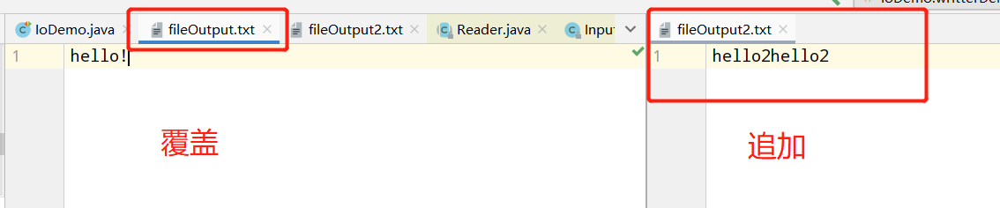
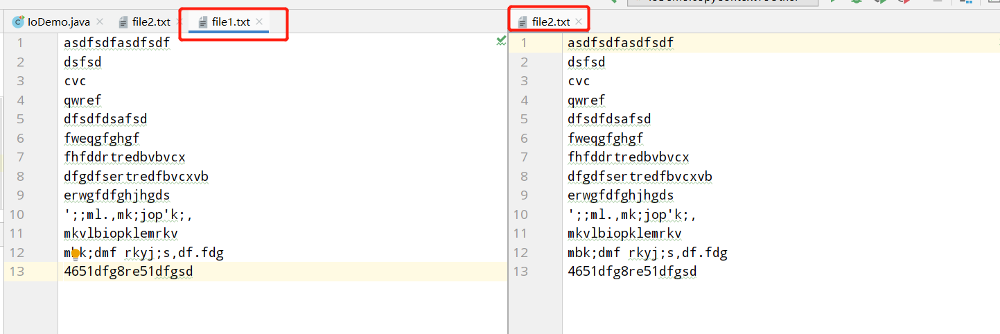
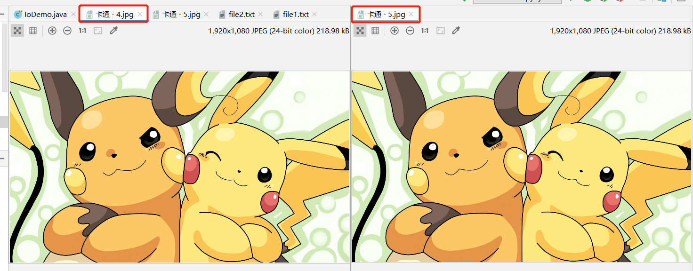
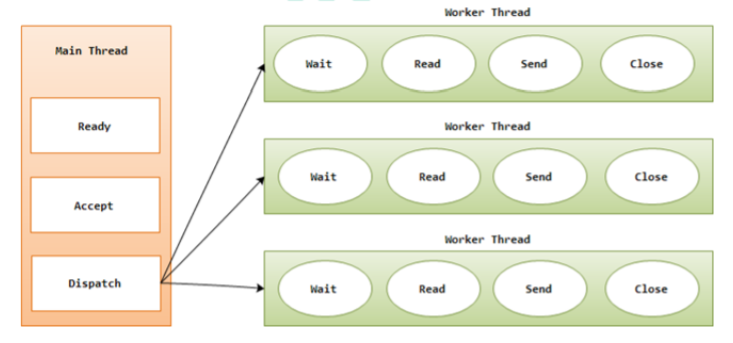
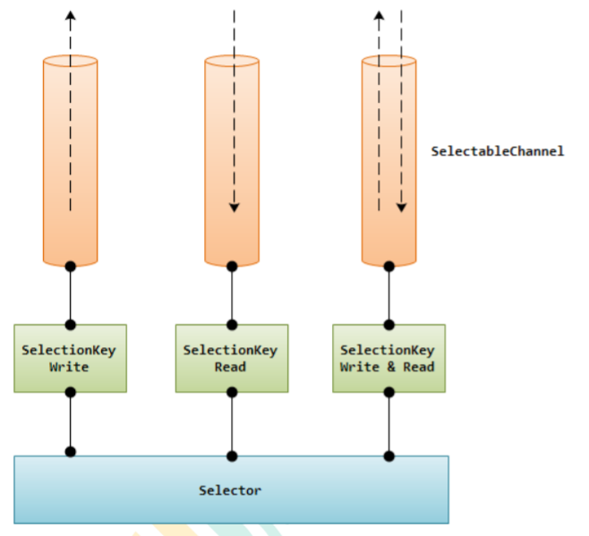
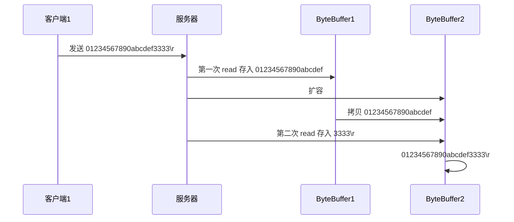

# 1. IO流

## 1.1 File类的使用

### File类的理解

1. File类的一个对象，代表一个文件或一个目录（俗称：文件夹）

2. File类声明在`java.io`包下

3. File类中涉及到关于文件或文件目录的创建，删除、重命名、修改时间、文件大小等方法

   并未涉及到写入或读取文件内容的操作。如果需要读取或写入文件内容，必须使用IO流来完成

4. 后续File类的对象常会作为参数传递到流的构造器中，指明读取或写入的“终点”。

### File的实例化

#### 构造器


```java
File file = new File(String filePath);
File file = new File(String parentPath, String childPath);
File file = new File(File parentFile, String childPath);
```


#### 常用方法

```java
public boolean isDirectory()：判断是否是文件目录
public boolean isFile() ：判断是否是文件
public boolean exists() ：判断是否存在
public boolean canRead() ：判断是否可读
public boolean canWrite() ：判断是否可写
public boolean isHidden() ：判断是否隐藏
public boolean createNewFile() ：创建文件。若文件存在，则不创建，返回false
public boolean mkdirs() ：创建文件目录。如果此文件目录存在，就不创建了。如果词文件目录的上层目录不存在， 也不创建。
public boolean mkdir() ：创建文件目录，如果上层文件目录不存在，一并创建
public boolean delete() ：删除文件或者文件夹（直接删除，不走回收站）
//  分隔符常量
File.separator  用于路径的分隔符  /* unix：/   windows： \\ */
```


## 1.2 IO流概述

- I/O是Input/Output的缩写，I/O技术是非常实用的技术，用于处理设备之间的数据传输。如读/写文件、网络通讯等。

- Java程序中，对于数据的输入/输出操作以“流Stream”的方式进行。
- java.io包下提供了各种“流”类和接口，用以获取不同种类的数据，并通过标准的方法输入或输出数据。
- 输入Input：读取外部数据（磁盘，光盘等存储设备的数据）到程序（内存）中
- 输出output：将程序（内存）数据输出到磁盘、光盘等存储设备中


**流的分类**

- 按操作数据单位不同分为：**字节流（8bit）**、**字符流（16bit）**
- 按数据流的流向不同分为：输入流、输出流
- 按数据流的角色不同分为：节点流、处理流

| 抽象基类 | 字节流       | 字符流                     |
| -------- | ------------ | -------------------------- |
| 输入流   | InputStream  | Reader（往内存中读取数据） |
| 输出流   | OutputStream | Writer（将内存中数据写出） |

Java的IO流涉及40多个类，实际上非常规则，都是从上述4个抽象基类派生的；由这四个类派生出来的子类名称都是其父类名作为子类名后缀。


**IO流的体系**

| 分类                 | 字节输入流           | 字节输出流            | 字符输入流        | 字符输出流         |
| -------------------- | -------------------- | --------------------- | ----------------- | ------------------ |
| 抽象基类             | InputStream          | OutputStream          | Reader            | Writer             |
| 访问文件（节点流）   | FileInputStream      | FileOutputStream      | FileReader        | FileWriter         |
| 访问数组             | ByteArrayInputStream | ByteArrayOutputStream | CharArrayReader   | CharArrayWriter    |
| 访问管道             | PipedInputStream     | PipedOutputStream     | PipedReader       | PipedWriter        |
| 访问字符串           |                      |                       | StringReader      | StringWriter       |
| 缓冲流(处理流的一种) | BufferedInputStream  | BufferedOutputStream  | BufferedReader    | BufferedWriter     |
| 转换流               |                      |                       | InputStreamReader | OutputStreamWriter |
| 对象流               | ObjectInputStream    | ObjectOutputStream    |                   |                    |
|                      | FilterInputStream    | FilterOutputStream    | FilterReader      | FilterWriter       |
| 打印流               |                      | PrintStream           |                   | PrintWriter        |
| 推回输入流           | PushbackinputStream  |                       | PushbackReader    |                    |
| 特殊流               | DataInputStream      | DataOutputStream      |                   |                    |


## 1.3 文件流

### 1.3.1 FileReader读入数据的基本操作

**四步骤：**

1. 建立一个流对象，将已存在的一个文件加载进流

   - ```java
     FileReader fr = new FileReader(new File("Test.txt"));
     ```

2. 创建一个临时存放数据的数组

   - ```java
     char[] ch = new char[1024];
     ```

3. 调用流对象对象的读取方法将流中的数据读入到数组中

   - ```java
     fr.read(ch);
     ```

4. 关闭资源

   - ```java
     fr.close();
     ```


**使用read()方法一个字符一个字符的读取**

```java
import org.junit.Test;

import java.io.File;
import java.io.FileReader;
import java.io.IOException;

public class IoDemo {

    @Test
    public void test1() throws IOException {
        File file = new File("Files\\file1.txt");
        FileReader fileReader = null;
        char[] chars = new char[1024];
        try{
            fileReader = new FileReader(file);
            int read = fileReader.read();
            while (read!=-1){
                System.out.print((char)read);
                read = fileReader.read();
            }
        }catch (IOException e){
            e.printStackTrace();
        }finally {
            fileReader.close();
        }

    }
}
// 输出结果 
asdfsdfasdfsdf
dsfsd
cvc
qwref
```

**使用read(char[] chars) 方法读入数据**

```java
@Test
public void readDemo2() throws IOException {
    File file = new File("Files\\file1.txt");
    FileReader fr = null;
    char[] chars = new char[20];
    try {
        fr = new FileReader(file);
        int len=0;
        while((len=fr.read(chars))!=-1){

            System.out.println(len);
            System.out.println(new String(chars,0,len));
        }
    }catch (Exception e)
    {
        e.printStackTrace();
    }finally {
        fr.close();
    }
}
```

### 1.3.2 FileWriter写出数据的操作

```java
@Test
public void writterDemo() throws IOException {
    File file = new File("Files\\fileOutput.txt");
    File file2 = new File("Files\\fileOutput2.txt");
    // 默认 每次 write 覆盖原有文件中的内容
    FileWriter fw = new FileWriter(file,false);
    // 指定为true时， 每次write 表示追加内容到文件中
    FileWriter fw2 = new FileWriter(file2,true);
    fw.write("hello!");
    fw2.write("hello2");
    fw.close();
    fw2.close();

    // 默认 每次 write 覆盖原有文件中的内容
    fw = new FileWriter(file,false);
    // 指定为true时， 每次write 表示追加内容到文件中
    fw2 = new FileWriter(file2,true);
    fw.write("hello!");
    fw2.write("hello2");
    fw.close();
    fw2.close();
}
```




### 1.3.3 FileReader 和 FileWriter实现文本复制

小需求：要求将文件`file1.txt`中的内容复制到另一个文件`file2.txt`中

```java
@Test
public void copyContextToOther() throws IOException{
    String filePath1 = "Files\\file1.txt";
    String filePath2 = "Files\\file2.txt";
    File src = new File(filePath1);
    File target = new File(filePath2);
    // 将 file1.txt 中的内容读到内存中
    FileReader fr = new FileReader(src);
    // 将读取的数据临时存放到buffer中
    char[] buffer = new char[5];
    // 将file1.txt 中的内容写到file2.txt中
    FileWriter fw = new FileWriter(target);
    int len = 0;
    while((len = fr.read(buffer))!=-1){
        fw.write(buffer,0,len);
    }
    fw.close();
    fr.close();
}
```



### 1.3.4 FileInputStream和FileOutputStream不能读取文本文件

**tip:**

**FileInputStream**和**FileOutputStream**不能操作像`.java`,`.cpp`,`.txt`,`.c`等文本文件，操作文本文件使用**FileReader**和**FileWriter**字符流；

如果是`.jpg`,`.mp4`,`.mp3`等文件使用**FileInputStream**和**FileOutputStream**字节流操作

<font color=green>使用字节流**FileInputStream**和**FileOutputStream**操作文本文件，有可能出现乱码的问题</font>

```java
// 使用字节流操作文本文件
    //使用字节流FileInputStream处理文本文件，可能出现乱码。
    @Test
    public void testFileInputStream(){
        FileInputStream fis = null;
        try {
            //1.造文件
            File file = new File("Files\\file1.txt");

            //2.造流
            fis = new FileInputStream(file);

            //3.读数据
            byte[] buffer = new byte[5];
            int len;//记录每次读取的字节的个数
            while((len = fis.read(buffer)) != -1){
                String str = new String(buffer,0,len);
                System.out.print(str);
            }
        } catch (IOException e) {
            e.printStackTrace();
        }finally {
            if(fis != null) {
                //4.关闭资源
                try {
                    fis.close();
                } catch (IOException e) {
                    e.printStackTrace();
                }
            }
        }
    }
```

使用**FileInputStream**和**FileOutputStream**实现文件的复制

```java
@Test
public void copyByte() throws IOException{
    File file1 = new File("Files\\卡通 - 4.jpg");
    File file2 = new File("Files\\卡通 - 5.jpg");
    FileInputStream fis = new FileInputStream(file1);
    byte[] buffer = new byte[5];
    FileOutputStream fos = new FileOutputStream(file2);
    int len=0;
    while ((len=fis.read(buffer))!=-1){
        fos.write(buffer,0,len);
    }
    fos.close();
    fis.close();
}
```




## 1.4 缓冲流的使用


- 缓冲流要`套接`在相应的节点流之上，根据数据操作单位可以把缓冲流分为：
  - **BufferedInputStream**和**BufferedOutputStream**
  - **BufferedReader**和**BufferedWriter**
- 当读取数据时，数据按块读入缓冲区，其后的读操作则直接访问缓冲区
- 当使用BufferedInputStream读取字节文件时，BufferedInputStream会一次性从文件中读取8192（8kb）,存在缓冲区中，直到缓冲区装满了，才重新从文件中读取下一个8kb的字节数组。
- 向流中写入字节时，不会直接写到文件，先写到缓冲区中直到缓冲区写满，BufferedOutputStream才会把缓冲区中的数据一次性写到文件中。使用`flush()`可以强制将缓冲区的内容全部写入到输出流中。
- 关闭流的顺序和打开流的顺序相反。只要关闭最外层流即可，关闭最外层流也会相应关闭内层节点流
- flush()方法的使用：手动将buffer中内容写入到文件
- 如果是带缓冲区的流对象的close()方法，不但会关闭流，还会在关闭流之间刷线缓冲区，关闭后不能再写出。


## 1.5 转换流的使用

### 1.5.1 转换流概述与InputStreamReader的使用

- 转换流提供了在字节流和字符流之间的转换
- Java API提供了两个转换流：
  - `InputStreamReader`：将InputStream转换成Reader
    - 实现将字节的输入流按指定字符集转换成字符的输入流
    - 需要和`InputStream`套接
    - 构造器
      - `public InputStreamReader(InpurStream in)`
      - `public InputStreamReader(InpurStream in, String charsetName)`
      - 例如：`Reader isr=new InpurStreamReader(System.in, "gbk")`
  - `OutputStreamWriter`：将Writer转换为OutputStream
    - 实现将字符的输出流按指定字符集转换为字节的输出流
    - 需要和`OutputStream`套接
    - 构造器
      - `public OutputStreamWriter(OutputStream out)`
      - `public OutputStreamWriter(OutputStream out, String charsetName)`
  - 字节流中的数据都是字符时，转换成字符流操作更高效
  - 很多时候我们使用转换流来处理文本乱码问题。实现编码和解码的功能。


### 1.5.2 转换流实现文件的读入和写出

**InputStreamReader**：将一个字节的输入流转换为字符的输入流

**OutputStreamWriter**：将一个字符的输出流转换为字节的输出流

```java
@Test
public void transformation() throws IOException {
    FileInputStream inputStream = new FileInputStream(new File("Files\\file1.txt"));
    FileOutputStream outputStream = new FileOutputStream(new File("Files\\file3.txt"));
    // 将字节流转换成字符流
    InputStreamReader isr = new InputStreamReader(inputStream);
    // 将字符流转换成字节输出流
    OutputStreamWriter osw = new OutputStreamWriter(outputStream);
    // 用字符数组承接字节流转换成字符流的数据
    char[] chars = new char[5];
    int len = 0;
    while ((len=isr.read(chars))!=-1){
        // 将字符流通过转换流写出到字节流FileOutputStream中
        osw.write(chars,0,len);
    }
    osw.close();
    isr.close();
}
```


## 1.6 其他的流的使用

### 1.6.1 标准输入、输出流

- System.in 和 System.out 分别代表了系统标准的输入和输出设备
- 默认输入设备是键盘；输出设备是：显示器
- System.in 的类型方式InputStream
- System.out的类型是PrintStream，其是OutputStream的子类FilterOutputStream的子类
- 重定向：通过System类的setln，setOut方法对默认设备进行改变。
  - `public static void setln(InputStream in)`
  - `public static void setOut(PrintStream out)`

### 1.6.2 打印流

- 实现将基本数据类型的数据格式转化为字符串输出
- 打印流：PrintStream和PrintWriter
  - 提供了一系列重载的print()和println()方法，用于多种数据类型的输出
  - PrintStream和PrintWriter的输出不会抛出IOException异常
  - PrintStream和PrintWriter有自动flush功能
  - PrintStream打印的所有字符都使用平台的默认字符编码转换为字节。在需要写入字符而不是写入字节的情况下，应该使用PrintWriter类。
  - System.out返回的是PrintStream的实例


### 1.6.3 数据流

- 为了方便地操作Java语言的基本数据类型和String的string数据，可以使用数据流
- 数据流有两个类：（用于读取和写出基本数据类型、String类的数据）
  - DataInputStream和DataOutputStream
  - 分别“套接”在InputStream和OutputStream

**数据流**：

- DataInputStream：数据输入流
- DataOutputStream：数据输出流

```java
@Test
public void dataStreamDemoWrite() throws IOException{
    // 数据流 可以读取特定类型的数据，可以写特定的数据类型的数据

    // 输出
    DataOutputStream dos = new DataOutputStream(new FileOutputStream(new File("Files\\data.txt")));
    dos.writeChar('c');
    dos.writeBoolean(true);
    dos.writeDouble(2.0798654);
    dos.writeLong(123456789L);
    dos.flush();
}
@Test
public void dataStreamDemoReade() throws IOException{
    DataInputStream dis = new DataInputStream(new FileInputStream(new File("Files\\data.txt")));
    char c = dis.readChar();
    boolean b = dis.readBoolean();
    double v = dis.readDouble();
    long l = dis.readLong();
    System.out.println(c+"\t"+b+"\t"+v+"\t"+l+"\t");
}
```


## 1.7 对象流

### 1.7.1 对象序列化机制的理解

- `ObjectInputStream`和`ObjectOutputStream`
- 用于存储和读取基本数据类型数据或对象的处理流。它的强大之处就是把Java中的对象写入到数据源中，也能把对象从数据源中还原回来。
- 序列化：用`ObjectInputStream`类读取基本类型数据或对象的机制
- 反序列化：用`ObjectInputStream`类读取基本类型数据或对象的机制
- `ObjectOutputStream`和`ObjectInputStream`不能序列化`static`和`transient`修饰的成员变量
- 对象序列化机制允许把内存中的Java对象转换成平台无关的二进制流，从而允许把这种二进制流持久地保存在磁盘上，或通过网络将这种二进制流传输到另一个网络节点。当其他程序获取这种二进制流，就可以恢复原来的Java对象。
- 序列化的好处在于可将任何实现了`Serializable`接口的对象转化为字节数据，使其在保存和传输时刻被还原
- 序列化是RMI（Remote Method Invoke-远程方法调用）过程的参数和返回值都必须实现的机制，而RMI是JavaEE的基础。因此序列化机制是JavaEE平台的基础
- 如果需要让某个对象支持序列化机制，则必须让对象所属的类及其属性是可序列化的，为了让某个类是可序列化的，该类必须实现如下两个接口之一。否则，会抛出`NotSerializableException`异常
  - `Serializable`
  - `Externalizable`


### 1.7.2 对象流序列化与反序列化字符串操作

定义一个Person类，并实现`Serializable`接口，实现系列化功能，

通过`ObjectOutputStream`将Person对象写入到`person.dat`文件中，然后通过`ObjectInputStream`将person读回内存。

```java
class Person implements Serializable{
    private String name;
    private int age;
    public Person(String name, int age){
        this.name=name;
        this.age=age;
    }

    public String getName() {
        return name;
    }

    public void setName(String name) {
        this.name = name;
    }

    public int getAge() {
        return age;
    }

    public void setAge(int age) {
        this.age = age;
    }

    @Override
    public String toString() {
        return "Person{" +
                "name='" + name + '\'' +
                ", age=" + age +
                '}';
    }
}

/**
     * 序列化与反序列化
     *  实现Serializable接口，即可将对象通过ObjectOutputStream存储到磁盘中
     *                              通过ObjectInputStream读取到内存中
     */
@Test
public void serializableDemo() throws IOException, ClassNotFoundException {
    ObjectOutputStream oos = new ObjectOutputStream(new FileOutputStream(new File("Files\\person.dat")));
    Person person = new Person("yu", 25);
    oos.writeObject(person);

    ObjectInputStream ois = new ObjectInputStream(new FileInputStream(new File("Files\\person.data")));
    Person person1 = (Person)ois.readObject();
    System.out.println(person1);

}
```

### 1.7.3 serialVersionUID的理解

- 凡是实现`Serializable`接口的类都有一个表示序列化版本标识符的静态变量
  - `private static final long serialVersionUID`
  - `serialVersionUID`用来表明类的不同版本间的兼容性。简言之，其目的是以序列化对象进行版本控制，有关各版本反序列化时是否兼容
  - 如果类没有显示定义这个静态常量，它的值是Java运行时环境根据类的内部细节自动生成的。若类的实力变量做了修改，`serialVersionUID`可能发生变化，故建议显示声明
- 简单来说，Java的序列化机制是通过在运行时判断类的`serialVersionUID`来验证版本一致的。在进行反序列化时，JVM会把传来的字节流中的`serialVersionUID`与本地相应实体类的`serialVersionUID`进行比较，如果相同就认为是一致的，可以进行反序列化，否则就会出现序列化版本不一致的异常（InvalidCastException）


如果想要一个类的对象可序列化，除了实现`Serializable`接口之外，还必须保证其内部所有的属性也必须是可序列化的。（默认情况下，基本数据类型都可序列化）

一般情况下需要自定义`serialVersionUID`


> **序列化机制**
>
> 对象序列化机制允许把内存中的Java对象转换成平台无关的二进制流，从而允许把这种二进制流持久地保存在磁盘上，或通过网络将这种二进制流传输到另一个网络节点。当其他程序获取了这种二进制流，就可以恢复成原来的Java对象。


## 1.8 RandomAccessFile(随机存取文件流)的使用

- `RandomAccessFile`声明在`java.io`包下，但直接继承于`java.lang.Object`类。并且它实现了`DataInput、DataOutput`这两个接口，也就意味着这个类**既可以读也可以写**
- `RandomAccessFile`类支持“随机访问”的方式，程序可以直接跳到文件的任意地方来读、写文件
  - 支持只访问文件的部分内容
  - 可以向已存在的文件后追加内容
- `RandomAccessFile`对象包含一个记录指针，用以表示单签读写处的位置。`RandomAccessFile`类对象可以自己移动记录指针：
  - `long getFilePointer()`
  - `void seek(long pos)`
- 构造器
  - `public RandomAccessFile(File file, String mode)`
  - `public RandomAccessFile(String name, String mode)`
- 创建RandomAccessFile类实例需要指定一个mode参数，该参数指定RandomAccessFile的访问模式：
  - `r`：以只读方式打开
  - `rw`：打开以便读取和写入
  - `rwd`：打开以便读取和写入；同步文件内容的更新
  - `rws`：打开以便读取和写入；同步文件内容和元数据的更新
- 如果模式为只读`r`，则不会创建文件，而是会去读取一个已经存在的文件，如果读取的文件不存在则会出现异常。如果模式为`rw`读写，如果文件不存在则去创建文件，如果存在则不会创建。

```java
import org.junit.Test;

import java.io.File;
import java.io.IOException;
import java.io.RandomAccessFile;

/**
 * RandomAccessFile的使用
 * 1.RandomAccessFile直接继承于java.lang.Object类，实现了DataInput和DataOutput接口
 * 2.RandomAccessFile既可以作为一个输入流，又可以作为一个输出流
 * 3.如果RandomAccessFile作为输出流时，写出到的文件如果不存在，则在执行过程中自动创建。
 *   如果写出到的文件存在，则会对原有文件内容进行覆盖。（默认情况下，从头覆盖）
 */
public class RandomAccessFileTest {

    @Test
    public void test(){

        RandomAccessFile raf1 = null;
        RandomAccessFile raf2 = null;
        try {
            raf1 = new RandomAccessFile(new File("爱情与友情.jpg"),"r");
            raf2 = new RandomAccessFile(new File("爱情与友情1.jpg"),"rw");

            byte[] buffer = new byte[1024];
            int len;
            while((len = raf1.read(buffer)) != -1){
                raf2.write(buffer,0,len);
            }
        } catch (IOException e) {
            e.printStackTrace();
        } finally {
            if(raf1 != null){
                try {
                    raf1.close();
                } catch (IOException e) {
                    e.printStackTrace();
                }

            }
            if(raf2 != null){
                try {
                    raf2.close();
                } catch (IOException e) {
                    e.printStackTrace();
                }
            }
        }

    }

    @Test
    public void test2() throws IOException {

        RandomAccessFile raf1 = new RandomAccessFile("hello.txt","rw");

        raf1.write("xyz".getBytes());

        raf1.close();

    }

}
```

RandomAccessFile实现数据的插入（seek()方法会重置偏移量）

```java
// 
import org.junit.Test;

import java.io.File;
import java.io.IOException;
import java.io.RandomAccessFile;

/**
 * RandomAccessFile的使用
 * 1.RandomAccessFile直接继承于java.lang.Object类，实现了DataInput和DataOutput接口
 * 2.RandomAccessFile既可以作为一个输入流，又可以作为一个输出流
 * 3.如果RandomAccessFile作为输出流时，写出到的文件如果不存在，则在执行过程中自动创建。
 *   如果写出到的文件存在，则会对原有文件内容进行覆盖。（默认情况下，从头覆盖）
 *
 * 4.可以通过相关的操作，实现RandomAccessFile“插入”数据的效果
 */
public class RandomAccessFileTest {

    /**
     * 使用RandomAccessFile实现数据的插入效果
     */
    @Test
    public void test3() throws IOException {
        RandomAccessFile raf1 = new RandomAccessFile("hello.txt","rw");

        raf1.seek(3);//将指针调到角标为3的位置
        //保存指针3后面的所有数据到StringBuilder中
        StringBuilder builder = new StringBuilder((int) new File("hello.txt").length());
        byte[] buffer = new byte[20];
        int len;
        while((len = raf1.read(buffer)) != -1){
            builder.append(new String(buffer,0,len)) ;
        }
        //调回指针，写入“xyz”
        raf1.seek(3);
        raf1.write("xyz".getBytes());

        //将StringBuilder中的数据写入到文件中
        raf1.write(builder.toString().getBytes());

        raf1.close();

        //思考：将StringBuilder替换为ByteArrayOutputStream
    }

}
```


## 1.9 Path、Paths、Files的使用


# 2. 网络编程

### 2.1 网络编程概述

- Java是Internet上的语言，它从语言级上提供了对网络应用程序的支持，程序员能够很容易开发常见的网络应用程序。
- Java提供的网络类库，可以实现无痛的网络连接，联网的底层细节被隐藏在Java的本机安装系统中，有JVM进行控制。并且Java实现了一个跨平台的网络库，**程序面对的是一个统一的网络编程环境**。
- 网络编程的目的：直接或间接地通过网络协议与其它计算机实现数据交换，进行通讯
- 网络编程中有两个主要的问题：
  - 如果准确地定位网络上一台或多台主机；定位主机上的特定的应用
  - 找到主机后如何可靠高效地进行数据传输

### 2.2 网络通信要素概述

- 通信双方地址
  - IP
  - 端口号
- 一定的规则（即：网络通信协议。有两套参考模型）
  - OSI参考模型：模型过于理想化，未能在因特网上进行广泛推广
  - TCP/IP参考模型（或TCP/IP协议）：实事上的国际标准
- 网络通信协议


> 网络编程中有两个主要的问题：
>
> 1. 如何准确地定位网络上一台或多台主机；定位主机上的特定的应用
> 2. 找到主机后如何可靠高效地进行数据传输
>
> 网络编程中的两个要素：
>
> 1. 对应问题1：IP和端口号
> 2. 对应问题2：提供网络通信协议：TCP/IP参考模型（应用层、传输层、网络层、物理+数据链路层）

### 2.3 通信要素1：IP和端口号

#### 2.3.1 IP的理解与InetAddress类的实例化

- IP地址：`InetAddress`
  - 唯一的表示Internet上的计算机（通信实体）
  - 本地回环地址（hostAddress）：127.0.01 主机名（hostName）：localhost
  - IP地址分类方式1：IPV4和IPV6
    - IPV4：由4个字节组成
    - IPV6：由16个字节组成
  - IP地址分类方式2：公网地址（万维网使用）和私有地址（局域网使用）。`192.168. . `开头的就是私有地址，范围即为`192.168.0.0 ~ 192.168.255.255`，专门为组织内部使用。
- Internet上的主机有两种方式表示：
  - 域名（hostName）：www.baidu.com
  - IP地址（hostAddress）：220.181.38.149

```java
@Test
public void test1() throws UnknownHostException {
    InetAddress inetAddress = InetAddress.getByName("www.baidu.com");
    System.out.println(inetAddress);
    // 获取本地ip
    System.out.println(InetAddress.getLocalHost());
    // 获取主机名
    System.out.println(inetAddress.getHostName());
}

//输出
www.baidu.com/220.181.38.149
DESKTOP-AQE9VH2/192.168.70.1
www.baidu.com
```

#### 2.3.2 端口号的理解

- 端口号表示正在计算机上运行的进程（程序）
  - 不同的进程有不同的端口号
  - 被规定为一个16位的整数`0~65535`
  - 端口分类：
    - 公认端口：`0~1023`.被预先定义的服务通信占用（如：HTTP占用端口80，FTP占用端口21，Telnet占用端口23）
    - 注册端口：`1024~49151`.分配给用户进程或应用程序。（如：Tomcat占用端口8080，MySQL占用端口3306，Oracle占用端口1521等）。
    - 动态/私有端口：49152~65535.
- 端口号与IP地址的组合得出一个网络套接字：`Socket`


### 2.4 通信要素2：网络协议

- **网络通信协议**

  计算机网络中实现通信必须有一些约定，即通信协议，对速率，传输代码，代码结构，传输控制步骤，出错控制等制定标准。

- **问题：网络协议太复杂**

  计算机网络通信设计内容很多，比如指定源地址和目标地址，加密解密，压缩解压缩，差错控制，流量控制，路由控制等

- **通信协议分层的思想**

  在制定协议时，把复杂问题分解成一些简单的成分，再将他们复合起来。最常用的复合方式使层次方式，即同层间可以通信，上一层可以调用下一层，而与再下一层不发生关系。各层互不影响，利于系统的开发和扩展。


#### 2.4.1 TCP和UDP网络通信协议的对比

- 传输层协议中有两个非常重要的协议：
  - 传输控制协议TCP
  - 用户数据报协议UDP
- TCP/IP以其两个主要协议：传输控制协议（TCP）和网络互联协议（IP）而得名，实际上是一组协议，包括多个具有不同功能互为关联的协议。
- IP协议是网络层的主要协议，支持网络间互连的数据通信
- TCP/IP协议模型从更实用的角度出发，形成了高效的四层体系结构，即物理层、数据链路层、IP层、传输层T、应用层。
- TCP协议：
  - 使用TCP协议前，需先建立TCP连接，形传输数据通道
  - 传输前，采用“三次握手”方式，点对点通信，是可靠的
  - TCP协议进行通信的两个应用进程：客户端、服务端
  - 在连接中进行大数据量的传输，传输完毕，需释放已建立的连接，效率低
- UDP协议：
  - 将数据、源、目的封装成数据包，不需要建立连接
  - 每个数据报的大小限制在64K内
  - 发送不管对方是否准备好，接收方收到也不确认，故是不可靠的
  - 可以广播发送
  - 发送数据结束时无需释放资源，开销小，速度快。


### 2.5 TCP网络编程

```java
// Client端 向 服务器端 发送数据
@Test
public void client() throws IOException {
    // client 端 发送消息
    Socket socket = null;
    OutputStream os = null;
    try{
        // 1. 创建Socket对象，指明服务器端的ip和端口
        InetAddress inet = InetAddress.getByName("192.168.137.237");
        socket = new Socket(inet, 8899);
        // 2. 获取一个输出流，用于输出数据
        os = socket.getOutputStream();
        // 3. 写出数据
        os.write("hello world !".getBytes());
    }catch(IOException e){
        e.printStackTrace();
    }finally {
        if(os!=null){
            os.close();
        }
        if(socket!=null){
            socket.close();
        }
    }
}

// Server端接收Client端发送来的数据
@Test
public void server() throws IOException {
    // server 端 接收消息
    ServerSocket ss = null;
    Socket socket = null;
    InputStream is = null;
    ByteArrayOutputStream baos = null;
    // 1. 创建服务器端的ServerSocket，指明自己的端口号
    ss = new ServerSocket(8899);
    //2. 调用accept()表示接收来自客户端的socket
    socket = ss.accept();
    // 3. 获取输入流    获取输出流的时候，会阻塞，等待Client端 给服务器端发送数据
    is = socket.getInputStream();
    // 4. 读取输入流中的数据
    baos = new ByteArrayOutputStream();
    byte[] buffer = new byte[5];
    int len=0;
    while((len=is.read(buffer))!=-1){
        baos.write(buffer,0,len);
    }
    System.out.println("收到来自："+socket.getInetAddress().getHostAddress()+"的数据");
    System.out.println(baos.toString());
}
```


TCP网络编程：从客户端发送文件给服务端，服务端保存到本地，并返回“发送成功”给客户端。并关闭相应的连接。

```java
@Test
public void client2() throws IOException {
    // 1. 客户端向服务端发送一张图片， 等待服务端接收完毕后返回 接收成功！ 信息
    Socket socket = new Socket("127.0.0.1", 9090);
    OutputStream os = socket.getOutputStream();
    FileInputStream fis = new FileInputStream(new File("Files\\卡通 - 4.jpg"));
    byte[] buffer = new byte[5];
    int len = 0;
    while ((len=fis.read(buffer))!=-1){
        // 从文件中读取的数据写入到到socket输出流中
        os.write(buffer,0,len);
    }
    // 关闭socket数据的输出
    socket.shutdownOutput();
    // 接收服务器端的数据，并显示到控制台上
    InputStream is = socket.getInputStream();
    ByteArrayOutputStream baos = new ByteArrayOutputStream();
    buffer = new byte[5];
    len = 0;
    while ((len=is.read(buffer))!=-1){
        baos.write(buffer,0,len);
    }
    System.out.println(baos.toString());
    fis.close();
    os.close();
    socket.close();
}

@Test
public void server2() throws IOException{
    ServerSocket ss = new ServerSocket(9090);
    Socket socket = ss.accept();
    InputStream is = socket.getInputStream();
    FileOutputStream fos = new FileOutputStream(new File("Files\\图片1.jpg"));
    byte[] buffer = new byte[1024];
    int len=0;
    while((len=is.read(buffer))!=-1){
        fos.write(buffer,0,len);
    }
    System.out.println("服务器端接收数据完毕");

    // 给客户端进行反馈
    OutputStream os = socket.getOutputStream();
    os.write("照片服务器端已经接收完毕".getBytes());
    os.close();
    fos.close();
    is.close();
    socket.close();
    ss.close();
}
```


### 2.6 UDP网络编程

- 类**DatagramSocket**和**DatagramPacket**实现了基于UDP协议网络程序。
- UDP数据报通过数据报套接字DatagramSocket发送和接收，系统不保证UDP数据包一定能够安全送到目的地，也不能确定什么时候可以抵达
- DatagramPacket对象封装了UDP数据报，在数据报中包含了发送端的IP地址和端口号以及接收端的IP地址和端口号。
- UDP协议中每个数据报都给出了完整的地址信息，因此无需建立发送方和接收方的连接。如同发快递包裹一样。
- 流程
  1. DatagramSocket与DatagramPacket
  2. 建立发送端，接收端
  3. 建立数据包
  4. 调用Socket的发送、接收方法
  5. 关闭Socket

> 发送端与接收端是两个独立的运行程序

```java
@Test
public void udpSend() throws IOException{
    DatagramSocket socket = new DatagramSocket();
    String str = "我是UDP发送端";
    byte[] data = str.getBytes();
    InetAddress inetAddress = InetAddress.getLocalHost();
    DatagramPacket packet = new DatagramPacket(data,0,data.length,inetAddress,9090);
    socket.send(packet);
    socket.close();
}
@Test
public void udpReceive() throws IOException{
    DatagramSocket socket = new DatagramSocket(9090);
    byte[] buffer = new byte[1024];
    DatagramPacket packet = new DatagramPacket(buffer,0,buffer.length);
    socket.receive(packet);
    System.out.println(new String(packet.getData(),0,packet.getLength()));
    socket.close();
}
```

### 2.7 URL编程

URL网络编程实现数据下载

```java
@Test
public void urlDemo() throws IOException {
    HttpURLConnection urlConnection = null;
    InputStream is = null;
    FileOutputStream fos = null;
    URL url = new URL("https://pic2.zhimg.com/80/v2-576df7c2088825cc388a4a8f74f8b2ed_720w.jpg");
    urlConnection = (HttpURLConnection) url.openConnection();
    urlConnection.connect();
    is = urlConnection.getInputStream(); // 得到输入流
    fos = new FileOutputStream(new File("Files\\spark.jpg"));
    byte[] buffer = new byte[5];
    int len = 0;
    while ((len = is.read(buffer)) != -1) {
        fos.write(buffer, 0, len);
    }
    System.out.println("图片下载完成");
    fos.close();
    is.close();
    urlConnection.disconnect();
}
```


# 3. NIO

## 3.1 Java NIO 概述

### 阻塞IO

通常在进行同步I/O操作时，如果读取数据，代码会阻塞直至有可提供读取的数据。同样，写入调用将会阻塞直至数据能够写入。传统的Server/Client模式会基于（TPR：Thread per Request），服务器会为每个客户端请求建立一个线程，由该线程单独负责处理一个客户请求。这种模式带来的一个问题就是线程数量的剧增，大量的线程会增大服务器的开销。大多数的实现为了避免这个问题，都采用了线程池模型，并设置线程池线程的最大数量，这又带来了新的问题，如果线程池中有100个线程，而有100个用户都在进行大文件下载，会导致第101个用户的请求无法及时处理，即便第101个用户只想请求一个几kb大小的页面。传统的Server/Client模式如图所示：




### 非阻塞IO（NIO）

NIO中非阻塞I/O采用了基于Reactor模式的工作方式，I/O调用不会被阻塞，相反是注册感兴趣的特定I/O事件，如可读数据到达，新的套接字连接等等，在发生特定事件时，系统再通知我们。NIO中实现非阻塞I/O的核心对象就是Selector，Selector就是注册各种I/O事件地方，而且当我们感兴趣的事件发生时，就是这个对象告诉我们所发生的时间。



当有读或写等任何注册的时间发生时，可以从Selector中获得相应的SelectionKey，同时SelectionKey中可以找到发生的事件和该事件所发生的具体的SelectableChannel，以获得客户端发送过来的数据。

非阻塞指的是IO时间本身不阻塞，但是获取IO事件的select()方法是需要阻塞等待的。区别是阻塞的IO会阻塞IO操作上，NIO阻塞在事件获取上，没有事件就没有IO，从高层次看IO就不阻塞了。也就是说只有IO已经发生那么我们才评估IO是否阻塞，但是select()阻塞的时候IO还没有发生，何谈IO的阻塞呢？NIO的本质是延迟IO操作到真正发生IO的时候，而不是以前的只要IO流打开了就一直等到IO操作。

| IO                      | NIO                           |
| ----------------------- | ----------------------------- |
| 面向流(Stream Oriented) | 面向缓冲区（Buffer Oriented） |
| 阻塞IO（Blocking IO）   | 非阻塞IO（Non Blocking IO）   |
| 无                      | 选择器（Selectors）           |

Java的NIO由以下几个核心部分组成：

- Channels

  - > NIO中的Channel和 IO中的Stream(流)是差不多一个等级的。只不过Stream是单向的，譬如：**InputStream**，**OutputStream**。而**Channel**是双向的，**即可以用来进行读操作，又可以用来进行写操作**。
    >
    > NIO中的Channel的主要实现有：FileChannel，DatagramChannel，SocketChannel和ServerSocketChannel，分别对应文件IO，UDP和TCP（Server和Client）

- Buffers

  - > NIO中的关键实现有：ByteBuffer，CharBuffer，DoubleBuffer，FloatBuffer，IntBuffer，LongBuffer，ShortBuffer，分别对应基本数据类型：byte，char，double，float，int，long，short。

- Selectors

  - > Selector运行单线程处理多个Channel，如果你的应用打开了多个通道，但每个连接的流量都很低，使用Selector就会很方便。例如在一个聊天服务器中。要使用Selector，得向Selector注册Channel，然后调用它的select()方法。这个方法就会一直阻塞到某个注册的通道有事件就绪。一旦这个方法返回，线程就可以处理这些事件，事件的例子就如新的连接进行，数据接收等。

虽然Java NIO中除此之外还有很多类和组件，但Channel，Buffer和Selector构成了核心的API。其他组件，如Pipe和FileLock，只不过是与三个核心组件共同使用的工具类。

## 3.2 Channel

Channel是一个通道，可以通过它读取和写入数据，它就像水管一样，网络数据通过Channel读取和写入。通道与流的不同之处在于通道是双向的，流只是在一个方向移动（一个流必须是InputStream或者OutputStream的子类），而且通道可以用于读，写或者同时用于读写。因为Channel是全双工的，所以它可以比流更好地映射底层操作系统的API。

NIO中通过Channel封装了数据源的操作，通过channel我们可以操作数据源，但又不必关系数据源的具体物理结构。这个数据源可能是多种的。比如：可以是文件，也可以是socket。在大多数应用中，Channel与文件描述或者socket是一一对应的。**Channel用于在字节缓冲区和位于通道另一侧的实体**（通常是一个文件或套接字）之间有效地传输数据。


与缓冲区不同，通道API主要由接口指定。不同的操作系统上通道实现（Channel Implementation）会有根本性的差异，所以通道API仅仅描述了可以做什么。因此很自然地，通道实现经常使用操作系统的本地代码。通道接口允许您以一种受控且可移植的方式来访问底层的I/O服务。

Channel是一个对象，可以通过它读取和写入数据。拿NIO与原来的I/O做个比对，通道就像是流。所有数据都通过**Buffer**对象来处理。您永远不会将字节直接写入同道中人，相反，您是将数据写入包含一个或者多个字节的缓冲区。同样，您不会直接从通道中读取字节，而是将数据从通道读入缓冲区，再从缓冲区获取这个字节。

**Java NIO的通道类似流，但又有些不同：**

- 既可以从通道中读取数据，又可以写数据到通道。但流的读写通常是单向的。
- 通道可以异步地读写
- 通道中的数据总是要先读到一个**Buffer**，或者总是要从一个**Buffer**中写入。

如图所示：从通道读数据到缓冲区；从缓冲区写入数据到通道


### Channel 的实现

下面是Java IO 中最重要的Channel的实现：

- **FileChannel**
  - FileChannel从文件中读写数据
- **DatagramChannel**
  - DatagramChannel能通过UDP读写网络中的数据
- **SocketChannel**
  - SocketChannel能通过TCP读写网络中的数据
- **ServerSocketChannel**
  - ServerSocketChannel可以监听新进来的TCP连接，像Web服务器那样，对每一个新进来的连接都会创建一个SocketChannel。


#### FileChannel 操作详解


##### FileChannel介绍和示例

FileChannel类可以实现常用的read，write以及scatter/gather操作，同时它也提供了很多专用于文件的新方法。这些方法中的许多都是我们所熟悉的文件操作。

| 方法                              | 描述                                         |
| --------------------------------- | -------------------------------------------- |
| **int read(ByteBuffer dst)**      | **从Channel中读取数据到ByteBuffer**          |
| **long read(ByteBuffer[] dsts)**  | **将Channel中的数据“分散”到ByteBuffer[]**    |
| **int write(ByteBuffer src)**     | **将ByteBuffer中的数据写入到Channel**        |
| **long write(ByteBuffer[] srcs)** | **将ByteBuffer[]中的数据“聚集”到Channel**    |
| long position()                   | 返回此通道的文件位置                         |
| FileChannel position(long p)      | 设置此通道的文件位置                         |
| long size()                       | 返回此通道的文件的当前大小                   |
| FileChannel truncate(long s)      | 将此通道的文件截取为给定大小                 |
| void force(boolean metaData)      | 强制将所有对此通道的文件更新写入到存储设备中 |

**FileChannel Demo**

```java
import java.io.IOException;
import java.io.RandomAccessFile;
import java.nio.ByteBuffer;
import java.nio.channels.FileChannel;

public class FileChannelDemo1 {
    // FileChannel 读取数据到buffer中
    public static void main(String[] args) throws IOException {
        // 1. 创建FileChannel
        RandomAccessFile aFile = new RandomAccessFile("Files\\data.txt","rw");
        FileChannel fileChannel = aFile.getChannel();
        // 2. 创建Buffer
        ByteBuffer buffer = ByteBuffer.allocate(8);

        // 3. 读取数据到buffer中
        int byteReads = 0;
        while((byteReads=fileChannel.read(buffer))!=-1){
            System.out.println("读取了："+byteReads);
            // 读写反转，重置缓冲区的position
            buffer.flip();
            while (buffer.hasRemaining()){
                System.out.print((char)buffer.get());
            }
            // buffer 中的数据读取完成后 清空
            System.out.println();
            buffer.clear();
        }
        // 关闭channel
        aFile.close();
        System.out.println("结束了！");
    }
}
```


**Buffer通常的操作**

- 将数据写入缓冲区
- 调用`buffer.flip()`反转读写模式
- 从缓冲区读取数据
- 调用`buffer.clear()`或`buffer.compact()`清除缓冲区内容


##### 1.  打开FileChannel

在使用**FileChannel**之前，必须先打开它。但是，无法直接打开一个FileChannel，需要通过使用一个InputStream、OutputStream或RandomAccessFile来获取一个FileChannel实例。

```java
RandomAccessFile aFile = new RandomAccessFile("Files\\data.txt");
FileChannle fileChannel = aFile.getChannel();
```

##### 2. 从FileChannel读取数据

使用FileChannel.read()方法从FileChannel中读取数据。

```java
ByteBuffer buffer = ByteBuffer.allocate(8);
int byteRead = fileChannel.read(buffer);
```

首先分配一个Buffer。从FileChannel中读取的数据将被读取到Buffer中。然后，调用FileChannel.read()方法。该方法将数据从FileChannel读取到Buffer中。read()方法返回的int值表示有多少字节被读取到了Buffer中。如果返回-1，表示到了文件末尾。

##### 3. 向FileChannel写数据

使用FileChannel.write()方法向FileChannel中写数据，该方法的参数是一个Buffer

```java
    @Test
    public void writeDemo() throws IOException {
        RandomAccessFile aFile = new RandomAccessFile(new File("Files\\data2.txt"),"rw");
        FileChannel fileChannel = aFile.getChannel();
        ByteBuffer byteBuffer = ByteBuffer.allocate(1024);
        String data = "new String to write file ........ !"+System.currentTimeMillis();
        byteBuffer.clear();
        byteBuffer.put(data.getBytes());
        // 将Buffer中的数据写入到Channel中，需要从buffer中读取数据，put的时候，buffer为写的模式，需要反转buffer的读写模式
        // todo 换言之，读 或者 写 之后的 写 或者 读 操作之前需要转换一下 buffer 的读写模式
        byteBuffer.flip();
        while(byteBuffer.hasRemaining()){
            System.out.println("写入中。。。");
            fileChannel.write(byteBuffer);
        }
        // 关闭通道
        fileChannel.close();
        aFile.close();
    }
```

注意：FileChannel.write()是在while循环中调用的。因为无法保证write()方法一次能向FileChannel写入多少字节，因此需要重复调用write()方法，直到Buffer中已经没有尚未写入通道的字节。

##### 4. 关闭FileChannel

用完FileChannel后必须将其关闭

```java
fileChannel.close();
```

##### 5. FileChannel的position方法

有时可能需要在**FileChannel**的某个特定位置进行数据的读/写操作。可以通过调用**position()**方法获取**FileChannel**的当前位置。也可以通过调用**position(long pos)** 方法设置**FileChannel**的当前位置。

例子：

- `long pos = channel.position();`
- `channel.position(pos+123);`

如果将位置设置在文件结束符之后，然后试图从文件通道中读取数据，读方法将返回`-1`（文件结束标志）。

如果将位置设置在文件结束符之后，然后向通道中写数据，文件将撑大到当前位置并写入数据。这可能导致“<font color=red>文件空洞</font>”，磁盘上物理文件中写入的数据间有空隙。

##### 6. FileChannel的size方法

FileChannel实例的size()方法将返回该示例所关联文件的大小。如：

`long fileSize = channel.size();`

##### 7. FileChannel 的 truncate方法

可以使用`FileChannel.truncate()`方法截取一个文件。截取文件时，文件将指定长度后面的部分将被删除。如：

`channel.truncate(1024);`

这个例子截取文件的前`1024`个字节。


##### 8. FileChannel的force方法

FileChannel.force()方法将通道里面尚未写入磁盘的数据强制写到磁盘上 。处于性能方面的考虑，操作系统会将数据缓存在内存中，所以无法保证写入到FileChannel里面的数据一定会及时写到磁盘上。要保证这一点，需要调用`force()`方法。

`force()`方法有一个`boolean`类型的参数，指明是否同时将文件元数据（权限信息等）写入到磁盘上。

##### 9. FileChannel的transferTo和transferFrom方法

**通道之间的数据传输**

如果两个通道中有一个是FileChannel，那么可以直接将数据从一个C hannel传输到另外一个Channel。

1. **transferFrom()**

   - FileChannel的transferFrom()方法可以将数据从源通道传输到FileChannel中

     - ```java
       @Test
       public void transferFromDemo() throws IOException {
           // 定义 源 Channel
           RandomAccessFile file = new RandomAccessFile("Files\\data.txt", "rw");
           FileChannel fromChannel = file.getChannel();
           // 定义 目标 Channel
           RandomAccessFile file1 = new RandomAccessFile("Files\\dataTo.txt", "rw");
           FileChannel toChannel = file1.getChannel();
           long position = 0;
           long count = fromChannel.size();
           // transferFrom 从一个通道中复制数据到另一个通道中
           toChannel.transferFrom(fromChannel,0,count);
       
           toChannel.close();
           fromChannel.close();
           file1.close();
           file.close();
           System.out.println("over!");
       }
       ```

2. **transferTo**

   - transferTo()方法将数据从FileChannel传输到其他的channel中。

     - ```java
       @Test
       public void transferToDemo() throws IOException{
           // 定义 源 Channel
           RandomAccessFile file = new RandomAccessFile("Files\\data.txt", "rw");
           FileChannel fromChannel = file.getChannel();
           // 定义 目标 Channel
           RandomAccessFile file1 = new RandomAccessFile("Files\\dataTo2.txt", "rw");
           FileChannel toChannel = file1.getChannel();
           long size = fromChannel.size();
           int position = 0;
       
           fromChannel.transferTo(position, size, toChannel);
       
           fromChannel.close();
           toChannel.close();
           file.close();
           file1.close();
       }
       ```


<font color=red>注意</font>

通道之间的传输方法每次最多只能传输`2GB`的数据，如果超过了`2GB`，就需要额外的处理：

```java
import java.io.*;
import java.nio.channels.FileChannel;

public class TransferToDemo {
    public static void main(String[] args) {
        try(
                FileChannel fromChannel = new FileInputStream(new File("src\\Files\\data.txt")).getChannel();
                final FileChannel targetChannel = new FileOutputStream(new File("src\\Files\\data2.txt")).getChannel()
        ) {
            /*核心代码*/
            long size = fromChannel.size();
            for(long remain = size; remain>0;){
                remain -= fromChannel.transferTo(remain - size, size, targetChannel);
            }
        } catch (IOException e) {
            e.printStackTrace();
        }
    }
}
```


### SocketChannel通道


1. > <font size=4px color=green>新的 socket 通道类可以运行非阻塞模式并且是可选择的，可以激活大程序（如网络服务器和中间件组件）巨大的可伸缩性和灵活性。再也不需要为每个 socket 连接使用一个线程的必要了，也避免了管理大量线程所需的上下文交换开销。借助新的 NIO 类，一个或几个线程就可以管理成百上千的活动 socket 连接了并且只有很少甚至可能没有性能损失。所有的 socket 通道类(DatagramChannel、SocketChannel 和 ServerSocketChannel)都继承了位于 java.nio.channels.spi 包中的 AbstractSelectableChannel。这意味着我们可以用一个 Selector 对象来执行socket 通道的就绪选择（readiness selection）。</font>

2. ><font size=4px color=green>请注意 DatagramChannel 和 SocketChannel 实现定义读和写的功能，而接口
   >ServerSocketChannel 没有实现。ServerSocketChannel 负责监听传入的连接和创建新
   >的 SocketChannel 对象，它本身从不传输数据。</font>

3. > **socket 和 socket 通道之间 的关系**。通道是一个连接 I/O 服务导管并提供与该服务交互的方法。就某个 socket 而 言，它不会再次实现与之对应的 socket 通道类中的 socket 协议 API，而 java.net 中 已经存在的 socket 通道都可以被大多数协议操作重复使用。
   >
   > <font size=4px color=green>全部 socket 通道类（DatagramChannel、SocketChannel 和
   > ServerSocketChannel）在被实例化时都会创建一个对等 socket 对象。这些是我们所
   > 熟悉的来自 java.net 的类（Socket、ServerSocket 和 DatagramSocket），它们已
   > 经被更新以识别通道。对等 socket 可以通过调用 socket( )方法从一个通道上获取。
   > 此外，这三个 java.net 类现在都有 getChannel( )方法。</font>

4. > <font size=4px color=green>要把一个 socket 通道置于非阻塞模式，我们要依靠所有 socket 通道类的公有 超级类：SelectableChannel。就绪选择（readiness selection）是一种可以用来查 询通道的机制，该查询可以判断通道是否准备好执行一个目标操作，如读或写。非阻 塞 I/O 和可选择性是紧密相连的，那也正是管理阻塞模式的 API 代码要在 SelectableChannel 超级类中定义的原因。设置或重新设置一个通道的阻塞模式是很简单的，**只要调用 configureBlocking( )方 法即可**，传递参数值为 true 则设为阻塞模式，参数值为 false 值设为非阻塞模式。可 以通过调用 isBlocking( )方法来判断某个 socket 通道当前处于哪种模式。</font>

非阻塞 socket 通常被认为是服务端使用的，因为它们使同时管理很多 socket 通道变 得更容易。但是，在客户端使用一个或几个非阻塞模式的 socket 通道也是有益处的， 例如，借助非阻塞 socket 通道，GUI 程序可以专注于用户请求并且同时维护与一个或 多个服务器的会话。在很多程序上，非阻塞模式都是有用的。 偶尔地，我们也会需要防止 socket 通道的阻塞模式被更改。API 中有一个 blockingLock( )方法，该方法会返回一个非透明的对象引用。返回的对象是通道实现 修改阻塞模式时内部使用的。只有拥有此对象的锁的线程才能更改通道的阻塞模式。

#### 1. ServerSocketChannel

`ServerSocketChannel`是一个基于通道的socket监听器。它同我们所熟悉的`java.net.ServerSocket`执行相同的任务，不过它增加了通道语义，因此能够在非阻塞模式下运行。

由于`ServerSocketChannel`没有`bind()`方法，因此有必要取出对等的socket并使用它来绑定一个端口以开始监听连接。我们也是使用对等`ServerSocket`的API来根据需要设置其他的socket选项。

同`java.net.ServerSocket`一样，`ServerSocketChannel`也有`accept()`方法。一旦创建了一个`ServerSocketChannel`并用对等socket绑定了，然后就可以在其中一个上调用`accpet()`。如果您选择在`ServerSocket`上调用`accept()`方法，那么他会同任何其他的`ServerSocket`表现一样的行为：总是阻塞并返回一个`java.net.Socket`对象；如果您选择在`ServerSocketChannel`上调用`accept()`方法则会返回`SocketChannel`类型的对象，返回的对象能够在非阻塞模式下运行。

>换句话说：
>
>ServerSocketChannel的accept()方法会返回ServerChannel类型对象，SocketChannel可以在非阻塞模式下运行。
>
>其他Socket的accept()方法会阻塞返回一个Socket对象。如果ServerSocketChannel以非阻塞模式被调用，当没有传入在等待时，ServerSocketChannel.accept()会立即返回null。正是这种检查连接而不阻塞的能力实现了可伸缩性并降低了复杂性。可选择性也因此得到实现。我们可以使用一个选择器实例来注册`ServerSocketChannel`对象以实现新连接到达时自动通知的功能。


**Server端**

```java
@Test
public void serverSocketChannelTest() throws IOException, InterruptedException {
    // 定义一个端口号 8888
    int port = 8888;

    // 打开一个SocketServerChannel
    ServerSocketChannel ssc = ServerSocketChannel.open();
    // 定义一个缓冲区
    ByteBuffer buffer = ByteBuffer.wrap("Hello java.nio".getBytes());  // 直接将一个字节数组包装成一个ByteBuffer
    ByteBuffer accept_buffer = ByteBuffer.allocate(8);  // 申请一个8字节的字节缓冲区
    // 绑定端口号  用于接收数据
    ssc.socket().bind(new InetSocketAddress("localhost",port));
    // 设置非阻塞模式
    ssc.configureBlocking(false);
    //循环监听
    while (true) {
        System.out.println("Waiting for connections");
        // 此处得到的是一个非阻塞式的socketChannel
        SocketChannel sc = ssc.accept();
        //TODO 如果是阻塞式的socket，那么接下来的代码会被一直阻塞着，一直等到socket收到请求为止
        if(sc==null){
            System.out.println("connection is null");
            Thread.sleep(2000L);
        }else{
            System.out.println("Incoming connection from"+sc.socket().getRemoteSocketAddress());
            System.out.println();
            // 重置缓冲区位置
            buffer.rewind();
            sc.write(buffer);  // 将buffer中的数据写入接收到的socket中
        }
    }
}
```

**Client端**

```java
@Test
public void socketClientDemo() throws IOException {
    Socket socket = new Socket("localhost",8888);
    OutputStream os = socket.getOutputStream();
    os.write("客户端发送消息！".getBytes());


    InputStream is = socket.getInputStream();
    byte[] buffer = new byte[8];
    int len=0;
    while((len=is.read(buffer))!=-1){
        for(int i=0;i<len;i++){
            System.out.print((char)buffer[i]);
        }
    }
    os.close();
    is.close();
}
```


##### 打开ServerSocketChannel

通过调用ServerSocketChannel.open()方法来打开ServerSocketChannel。

`ServerSocketChannel serverSocketChannel = ServerSocketChannel.open();`


##### 关闭ServerSocketChannel

通过调用ServerSocketChannel.close()方法来关闭ServerSocketChannel。

`serverSocketChannel.close();`

##### 监听新的连接

通过`ServerSocketChannel.accept()`方法监听新进的连接。当`accept()`方法返回的时候，它会返回一个包含新进来的`SocketChannel`。因此，`accept()`方法会一直阻塞到有新连接到达。

通常不会仅仅只监听一个连接，在while循环中调用`accept()`方法。如下：

```java
while(true){
    System.out.println("Waiting for connections");
    SocketChannel sc = scc.accept();
}
```

##### 阻塞模式

如果是阻塞模式下，那么调用`accept()`方法后，会被阻塞，知道有新的连接进来才会继续执行接下来的代码。

##### 非阻塞模式

`ServerSocketChannel`可以设置成非阻塞模式。在非阻塞模式下，`accept()`方法会立即返回，如果还没有进来的连接，返回的就是null。因此，需要检查返回的`SocketChannel`是否是null。如：

```java
ServerSocketChannel ssc = ServerSocketChannel.open();
ssc.socket().bind(new InetSocketAddress(port));
ssc.configureBlocking(false);
while(ture){
    System.out.println("Waiting for connections");
    SocketChannel sc = ssc.accept();
    if(sc==null){
        ...
    }else{
        ...
    }
}
```

#### 2.  SocketChannel

##### SocketChannel介绍

JAVA NIO 中的SocketChannel是一个连接到TCP网络套接字的通道。它是一种面向流连接sockets套接字的可选择通道

- SocketChannel是用来连接Socket套接字
- SocketChannel主要用途用来处理网络IO的通道
- SocketChannel是基于TCP连接传输
- SocketChannel实现了可选择通道，可以被多路复用的


##### SocketChannel特征

1. 对于已经存在的socket不能创建SocketChannel

2. SocketChannel中提供的open接口创建的Channel并没有进行网络级联，需要使用connect接口连接到指定地址

3. 未进行连接的SocketChannel执行IO操作时，会抛出`NotYetConnectedException`

4. SocketChannel支持两种IO模式：阻塞式和非阻塞式

5. SocketChannel支持异步关闭。如果SocketChannel在一个线程上read阻塞，另一个线程对该SocketChannel调用`shutdowninput`，则读阻塞的线程将返回-1表示没有读取任何数据；如果SocketChannel在一个线程上write，另一个线程对该SocketChannel调用`shutdownWrite`，则写阻塞的线程将抛出`AsynchronousCloseException`

6. SocketChannel支持设定参数

   | 参数名           | 说明                                                  |
   | ---------------- | ----------------------------------------------------- |
   | **SO_SNDBUF**    | 套接字发送缓冲区大小                                  |
   | **SO_RCVBUF**    | 套接字接收缓冲区大小                                  |
   | **SO_KEEPALIVE** | 保活连接                                              |
   | **O_REUSEADDR**  | 复用地址                                              |
   | **SO_LINGER**    | 有数据传输时延缓关闭Channel（只有在非阻塞模式下有用） |
   | **TCP_NODELAY**  | 禁用Nagle                                             |

   

##### SocketChannel使用

```java
@Test
public void socketChannelTest() throws IOException {
    /* TODO 创建SocketChannel   */
    // 方式一
    SocketChannel socketChannel = SocketChannel.open(new InetSocketAddress("www.baidu.com", 80));

    // 方式二
    SocketChannel socketChannel1 = SocketChannel.open();
    socketChannel1.connect(new InetSocketAddress("www.baidu.com", 80));

    /* TODO 连接校验 */
    System.out.println(socketChannel.isOpen());                 // 测试SocketChannel是否为open状态
    System.out.println(socketChannel.isConnected());            // 测试SocketChannel是否已经被连接
    System.out.println(socketChannel.isConnectionPending());    // 测试SocketChannel是否正在进行连接
    System.out.println(socketChannel.finishConnect());          // 校验正在进行套接字连接的SocketChannel是否已经完成连接

    /* TODO 读写模式 */
    socketChannel.configureBlocking(false);                     // 非阻塞式模式
    socketChannel1.configureBlocking(true);                     // 阻塞式模式


    ByteBuffer buffer1 = ByteBuffer.allocate(16);
    // TODO 非阻塞式模式下，会打印出 socketChannel read over !
    socketChannel.read(buffer1);
    socketChannel.close();
    System.out.println(" socketChannel read over ! ");


    ByteBuffer buffer2 = ByteBuffer.allocate(16);
    // TODO 阻塞模式下，read方法会阻塞，控制台无法打印出 socketChannel1 read over !
    socketChannel1.read(buffer2);
    socketChannel1.close();
    System.out.println(" socketChannel1 read over !");

    /* TODO 设置和获取参数 */
    socketChannel.setOption(StandardSocketOptions.SO_KEEPALIVE, Boolean.TRUE)
        .setOption(StandardSocketOptions.TCP_NODELAY, Boolean.TRUE);                    // 通过setOptions方法可以设置socket套接字的相关参数
    // 获取相关参数的值
    System.out.println(socketChannel.getOption(StandardSocketOptions.SO_KEEPALIVE));
    System.out.println(socketChannel.getOption(StandardSocketOptions.SO_RCVBUF));           // 通过getOption获取相关参数的值。如默认的接收缓冲区大小是8192byte
}
```


#### 3. DatagramChannel

正如 SocketChannel 对应 Socket，ServerSocketChannel 对应 ServerSocket，每 一个DatagramChannel 对象也有一个关联的 DatagramSocket 对象。正如 SocketChannel 模拟连接导向的流协议（如TCP/IP），DatagramChannel 则模拟包 导向的无连接协议（如 UDP/IP）。DatagramChannel 是无连接的，每个数据报 （datagram）都是一个自包含的实体，拥有它自己的目的地址及不依赖其他数据报的 数据负载。与面向流的的 socket 不同，DatagramChannel 可以发送单独的数据报给不同的目的地址。同样，DatagramChannel对象也可以接收来自任意地址的数据包。每个到达的数据报都含有关于它来自何处的信息（源地址）

##### 打开DatagramChannel

```java
DatagramChannel server = DatagramChannel.open();
server.socket().bind(new InetSocketAddress(10010));
```

此例子是打开10010端口接收UDP数据包

##### 接收数据

通过`receive()`接收UDP包

```java
ByteBuffer receiveBuffer=ByteBuffer.allocate(64);
receiveBuffer.clear();
SocketAddress receiveAddr = server.receive(receiveBuffer);
```

SocketAddress可以获得发包的IP，端口等信息，用toString查看，格式如下：

> /127.0.0.1:57126

##### 发送数据

通过`send()`发送UDP包

```java
DatagramChannel server = DatagramChannel.open();
ByteBuffer sendBuffer = ByteBuffer.wrap("client send".getBytes());
server.send(sendBuffer, new InetSocketAddress("127.0.0.1", 10010))
```


##### 连接

UDP不存在真正意义上的连接，这里的连接是向特定服务地址用`read`和`write`接收发送数据包。

```java
client.connect(new InetSocketAddress("127.0.0.1", 10010));
int readSize = client.read(sendBuffer);
server.write(sendBuffer);
```

`read()`和`write()`只有在`connect()`后才能使用，不然会抛出`NotYetConnectedException`异常。用`read()`接收时，如果没有接收到包，会抛出`PortUnreachableException`异常。


##### DatagramChannel示例

模拟 客户端发送，服务端接收的例子

```java
import org.junit.Test;

import java.io.IOException;
import java.net.InetSocketAddress;
import java.net.SocketAddress;
import java.nio.ByteBuffer;
import java.nio.channels.DatagramChannel;
import java.nio.charset.Charset;
import java.util.Random;

public class DatagramChannelDemo {

    @Test
    public void sendDatagram() throws IOException, InterruptedException {
        DatagramChannel sendChannel = DatagramChannel.open();
        InetSocketAddress inetSocketAddress = new InetSocketAddress("127.0.0.1", 9999);
        Random random = new Random();
        while (true){
            ByteBuffer buffer = ByteBuffer.wrap("发送 UDP包".getBytes("UTF-8"));
            sendChannel.send(buffer,inetSocketAddress);
            System.out.println("已经完成了发送！！！"+random.nextInt(1000));
            Thread.sleep(3000L);
        }
    }

    @Test
    public void receiveDatagram() throws IOException {
        DatagramChannel receiveChannel = DatagramChannel.open();
        receiveChannel.socket().bind(new InetSocketAddress(9999));

        // 接收
        ByteBuffer receiveBuffer = ByteBuffer.allocate(1024);
        while (true){
            receiveBuffer.clear();
            SocketAddress socketAddress = receiveChannel.receive(receiveBuffer);
            if(socketAddress==null){
                System.out.println("null");
                continue;
            }
            receiveBuffer.flip();
            System.out.println(socketAddress.toString());
            System.out.println(Charset.forName("UTF-8").decode(receiveBuffer));
        }
    }
}
```


**connect测试**

```java
/**
     * 连接 read 和 write
     */
@Test
public void connectDemo() throws IOException {
    DatagramChannel client = DatagramChannel.open();
    client.bind(new InetSocketAddress(9999));  // 绑定 用于 接收

    //连接
    client.connect(new InetSocketAddress("127.0.0.1",9999));  // 连接 用于 发送
    client.write(ByteBuffer.wrap("发送 UDP包".getBytes("UTF-8")));

    // read
    ByteBuffer readBuffer = ByteBuffer.allocate(1024);
    while (true){
        readBuffer.clear();
        client.read(readBuffer);
        readBuffer.flip();
        System.out.println(Charset.forName("UTF-8").decode(readBuffer));
    }
}
```


### Scatter/Gather

Java NIO开始支持scatter/gather，scatter/gather用于描述从Channel中读取或者写入到Channel的操作。

- **分散（Scatter）读**

  - > <font color=green size=4px>分散（Scatter）从Channel中读取  是指在读操作时将读取的数据写入多个buffer中，因此，Channel将从Channel中读取的数据  分散Scatter 到多个Buffer中。</font>

  - 

  - **分散读（Scatter Reads）** 是指数据从一个Channel读取到多个buffer中。

- **聚集（Gather）写**

  - > <font color=green size=4px>聚集（Gather）写入Channel是指在写操作时将多个buffer的数据写入同一个Channel，因此，Channel将多个Buffer中的数据聚集（Gather）后发送到Channel。</font>

  - 

  - **聚集写（Gathering Writes）**是指数据从多个buffer写入到同一个channel。


scatter/gather经常用于需要将传输的数据分开处理的场合，例如传输一个由消息头和消息体组成的消息，你可能会将消息体和消息头分散到不同的buffer中，这样你可以方便的处理消息头和消息体。

#### 1. Scattering Reads

```java
ByteBuffer header = ByteBuffer.allocate(1024);
ByteBuffer body = ByteBuffer.allocate(1024);
ByteBuffer[] bufferArray = {header, body};
channel.read(bufferArray);
```

<font color=red>注意</font>

buffer首先被插入到数组，然后再将数组作为`channel.read()`的输入参数。`read()`方法按照buffer在数组中的顺序将从channel中读取的数据写入到buffer，当一个buffer被写满后，channel紧接着向另一个buffer中写。

Scattering Reads在移动下一个buffer前，必须填满当前的buffer，这也意味着它不适用动态消息（消息大小不固定）。换句话说，如果存在消息头和消息体，消息头必须完成填充（例如 128byte），Scattering Reads 才能正常工作。


#### 2. Gathering Writes

```java
ByteBuffer header = ByteBuffer.allocate(128);
ByteBuffer body = ByteBuffer.allocate(1024);
ByteBuffer[] bufferArray = {header, body};

channel.write(bufferArray);
```

buffers数组是`write()`方法的入参，`write()`方法会按照buffer在数组中的顺序，将数据写入到channel，注意只有position和limit之间的数据才会被写入。因此，如果一个buffer的容量为128byte，但是仅仅包含58byte的数据，那么这58byte的数据将被写入到channel中。<font color=blue>因此与Scattering Reads相反, Gathering Writes能较好的处理动态消息。</font>


## 3.3  Buffer

### 补充

#### ByteBuffer 结构

ByteBuffer 有以下重要属性

* capacity
* position
* limit

一开始


写模式下，position 是写入位置，limit 等于容量，下图表示写入了 4 个字节后的状态


flip 动作发生后，position 切换为读取位置，limit 切换为读取限制


读取 4 个字节后，状态


clear 动作发生后，状态


compact 方法，是把未读完的部分向前压缩，然后切换至写模式


#### 💡 调试工具类

需要引入netty依赖

```xml
<dependency>
	<groupId>io-netty</groupId>
    <artifactId>netty-all</artifactId>
    <version>4.1.51.Final</version>
</dependency>
```


```java
public class ByteBufferUtil {
    private static final char[] BYTE2CHAR = new char[256];
    private static final char[] HEXDUMP_TABLE = new char[256 * 4];
    private static final String[] HEXPADDING = new String[16];
    private static final String[] HEXDUMP_ROWPREFIXES = new String[65536 >>> 4];
    private static final String[] BYTE2HEX = new String[256];
    private static final String[] BYTEPADDING = new String[16];

    static {
        final char[] DIGITS = "0123456789abcdef".toCharArray();
        for (int i = 0; i < 256; i++) {
            HEXDUMP_TABLE[i << 1] = DIGITS[i >>> 4 & 0x0F];
            HEXDUMP_TABLE[(i << 1) + 1] = DIGITS[i & 0x0F];
        }

        int i;

        // Generate the lookup table for hex dump paddings
        for (i = 0; i < HEXPADDING.length; i++) {
            int padding = HEXPADDING.length - i;
            StringBuilder buf = new StringBuilder(padding * 3);
            for (int j = 0; j < padding; j++) {
                buf.append("   ");
            }
            HEXPADDING[i] = buf.toString();
        }

        // Generate the lookup table for the start-offset header in each row (up to 64KiB).
        for (i = 0; i < HEXDUMP_ROWPREFIXES.length; i++) {
            StringBuilder buf = new StringBuilder(12);
            buf.append(NEWLINE);
            buf.append(Long.toHexString(i << 4 & 0xFFFFFFFFL | 0x100000000L));
            buf.setCharAt(buf.length() - 9, '|');
            buf.append('|');
            HEXDUMP_ROWPREFIXES[i] = buf.toString();
        }

        // Generate the lookup table for byte-to-hex-dump conversion
        for (i = 0; i < BYTE2HEX.length; i++) {
            BYTE2HEX[i] = ' ' + StringUtil.byteToHexStringPadded(i);
        }

        // Generate the lookup table for byte dump paddings
        for (i = 0; i < BYTEPADDING.length; i++) {
            int padding = BYTEPADDING.length - i;
            StringBuilder buf = new StringBuilder(padding);
            for (int j = 0; j < padding; j++) {
                buf.append(' ');
            }
            BYTEPADDING[i] = buf.toString();
        }

        // Generate the lookup table for byte-to-char conversion
        for (i = 0; i < BYTE2CHAR.length; i++) {
            if (i <= 0x1f || i >= 0x7f) {
                BYTE2CHAR[i] = '.';
            } else {
                BYTE2CHAR[i] = (char) i;
            }
        }
    }

    /**
     * 打印所有内容
     * @param buffer
     */
    public static void debugAll(ByteBuffer buffer) {
        int oldlimit = buffer.limit();
        buffer.limit(buffer.capacity());
        StringBuilder origin = new StringBuilder(256);
        appendPrettyHexDump(origin, buffer, 0, buffer.capacity());
        System.out.println("+--------+-------------------- all ------------------------+----------------+");
        System.out.printf("position: [%d], limit: [%d]\n", buffer.position(), oldlimit);
        System.out.println(origin);
        buffer.limit(oldlimit);
    }

    /**
     * 打印可读取内容
     * @param buffer
     */
    public static void debugRead(ByteBuffer buffer) {
        StringBuilder builder = new StringBuilder(256);
        appendPrettyHexDump(builder, buffer, buffer.position(), buffer.limit() - buffer.position());
        System.out.println("+--------+-------------------- read -----------------------+----------------+");
        System.out.printf("position: [%d], limit: [%d]\n", buffer.position(), buffer.limit());
        System.out.println(builder);
    }

    private static void appendPrettyHexDump(StringBuilder dump, ByteBuffer buf, int offset, int length) {
        if (isOutOfBounds(offset, length, buf.capacity())) {
            throw new IndexOutOfBoundsException(
                    "expected: " + "0 <= offset(" + offset + ") <= offset + length(" + length
                            + ") <= " + "buf.capacity(" + buf.capacity() + ')');
        }
        if (length == 0) {
            return;
        }
        dump.append(
                "         +-------------------------------------------------+" +
                        NEWLINE + "         |  0  1  2  3  4  5  6  7  8  9  a  b  c  d  e  f |" +
                        NEWLINE + "+--------+-------------------------------------------------+----------------+");

        final int startIndex = offset;
        final int fullRows = length >>> 4;
        final int remainder = length & 0xF;

        // Dump the rows which have 16 bytes.
        for (int row = 0; row < fullRows; row++) {
            int rowStartIndex = (row << 4) + startIndex;

            // Per-row prefix.
            appendHexDumpRowPrefix(dump, row, rowStartIndex);

            // Hex dump
            int rowEndIndex = rowStartIndex + 16;
            for (int j = rowStartIndex; j < rowEndIndex; j++) {
                dump.append(BYTE2HEX[getUnsignedByte(buf, j)]);
            }
            dump.append(" |");

            // ASCII dump
            for (int j = rowStartIndex; j < rowEndIndex; j++) {
                dump.append(BYTE2CHAR[getUnsignedByte(buf, j)]);
            }
            dump.append('|');
        }

        // Dump the last row which has less than 16 bytes.
        if (remainder != 0) {
            int rowStartIndex = (fullRows << 4) + startIndex;
            appendHexDumpRowPrefix(dump, fullRows, rowStartIndex);

            // Hex dump
            int rowEndIndex = rowStartIndex + remainder;
            for (int j = rowStartIndex; j < rowEndIndex; j++) {
                dump.append(BYTE2HEX[getUnsignedByte(buf, j)]);
            }
            dump.append(HEXPADDING[remainder]);
            dump.append(" |");

            // Ascii dump
            for (int j = rowStartIndex; j < rowEndIndex; j++) {
                dump.append(BYTE2CHAR[getUnsignedByte(buf, j)]);
            }
            dump.append(BYTEPADDING[remainder]);
            dump.append('|');
        }

        dump.append(NEWLINE +
                "+--------+-------------------------------------------------+----------------+");
    }

    private static void appendHexDumpRowPrefix(StringBuilder dump, int row, int rowStartIndex) {
        if (row < HEXDUMP_ROWPREFIXES.length) {
            dump.append(HEXDUMP_ROWPREFIXES[row]);
        } else {
            dump.append(NEWLINE);
            dump.append(Long.toHexString(rowStartIndex & 0xFFFFFFFFL | 0x100000000L));
            dump.setCharAt(dump.length() - 9, '|');
            dump.append('|');
        }
    }

    public static short getUnsignedByte(ByteBuffer buffer, int index) {
        return (short) (buffer.get(index) & 0xFF);
    }
}
```


Java NIO中的Buffer用于和NIO通道Channel进行交互。数据是从通道读入缓冲区，从缓冲区写入通道中的。


缓冲区<font color=red>本质上是一块可以写入数据，然后可以从中读取数据的内存</font>.这块内存被包装成NIO Buffer对象，并提供了一组方法，用来方便访问该块内存。缓冲区实际上是一个容器对象，更直接的说，其实就是一个**数组**，<font color=red>在NIO库中，所有数据都是缓冲区处理的。</font>在读取数据时，它是直接读到缓冲区中的；在写入数据时，它也是写入到缓冲区中的；任何时候访问NIO中的数据，都是将它放到缓冲区中。而在面向流IO系统中，所有数据都是直接写入或者直接将数据读取到Stream对象中。

在NIO中，所有的缓冲区类型都继承于抽象类`Buffer`，最常用的就是`ByteBuffer`，对于Java中的基本类型，基本都有一个具体Buffer类型与之相对应，他们之间的继承关系如下图所示：


###  1. Buffer 的基本用法

**使用Buffer读写数据，一般遵循以下四个步骤：**

1. 写入数据到Buffer
2. 调用`flip()`方法
3. 从Buffer中读取数据
4. 调用`clear()`方法或者`compact()`方法

> 当向buffer写入数据是，buffer会记录下写了多少数据。一旦要读取数据，需要通过`flip()`方法将Buffer从写模式切换到读模式。在读模式下，可以读取之前写入到Buffer的所有数据。一旦读完了所有的数据，就需要清空缓冲区，让它可以再次被写入。有两种方式能清空缓冲区：调用`clear()`或`compact()`方法。`clear()`方法会清空整个缓冲区。`compact()`方法只会清除已经读过的数据。任何未读的数据都
> 被移到缓冲区的起始处，新写入的数据将放到缓冲区未读数据的后面。

ByteBuffer Demo

```java
@Test
public void bufferTest1() throws IOException {
    RandomAccessFile raf = new RandomAccessFile("Files\\data.txt","rw");
    FileChannel fileChannel = raf.getChannel();
    // 创建Buffer
    ByteBuffer buffer = ByteBuffer.allocate(8);
    // 承接读取的字节数
    int readBytes = 0;
    while ((readBytes=fileChannel.read(buffer))!=-1){
        // 写读转换
        buffer.flip();
        while (buffer.hasRemaining()){
            System.out.print((char)buffer.get());
        }
        buffer.compact();
    }
    raf.close();
}
```


IntBuffer Demo

```java
@Test
public void intBuferTest(){
    // 分配新的int缓冲区，参数为缓冲区容量
    // 新缓冲区的当前位置为零， 其界限（限制位置）将为其容量
    // 它将具有一个底层实现数组，其数组偏移量将为零
    IntBuffer buffer = IntBuffer.allocate(8);

    for(int i=0;i<buffer.capacity();++i){
        int j=2*(i+1);
        buffer.put(j);
    }

    // 重置缓冲区，将限制设置为当前位置，然后将当前位置设置为0
    buffer.flip();

    while (buffer.hasRemaining()){
        int j = buffer.get();
        System.out.print(j+" ");
    }
}
```


**Buffer的capacity、position和limit**

为了理解Buffer的工作原理，需要熟悉它的三个属性：

- Capacity
- Position
- limit

position和limit的含义取决于Buffer处于**读模式**还是**写模式**。不管Buffer处在什么模式，capacity的含义总是一样的。


1. **capacity**
   - 作为一个内存块，Buffer有一个固定的大小值，也叫“capacity”。你只能往里面写capacity个byte、long、char等类型。一旦buffer满了，需要将其清空（通过读数据或者清除数据）才能继续往里写数据。
2. **position**
   - **写数据到Buffer中时**，position表示写入数据的当前位置，position的初始值为0,。当一个byte、long等数据写到buffer后，position会向下移动到下一个可插入数据的buffer单元。position最大可为capacity-1（因为position的初始值为0）
   - **读数据到Buffer中时**，position表示读入数据的当前位置，如position=2时表示已开始读入了3个byte，或从第3个byte开始读取。通过`ByteBuffer.flip()`切换到读模式时，position会被重置为0，当Buffer从position读入数据后，position会下移到下一个可读入的数据Buffer单元。
3. **limit**
   - 写数据时，limit表示可对Buffer最多写入多少个数据。写模式下，limit等于Buffer的capacity
   - 读数据时，limit表示Buffer里有多少可读数据（not null 的数据），因此能读到之前写入的所有数据（limit被设置成已写数据的数量，这个值在写模式下就是position）

### 2. Buffer的类型

JAVA NIO 有一下Buffer类型

- ByteBuffer
- MappedByteBuffer
- CharBuffer
- DoubleBuffer
- FloatBuffer
- IntBuffer
- LongBuffer
- ShortBuffer

这些Buffer类型代表了不同的数据类型。换句话说，就是可以通过char，short，int，long，float或double类型来操作缓冲区中的字节。


### 3. Buffer分配和写数据

#### Buffer的分配

想要获得一个Buffer对象首先要进行过分配。每一个Buffer类都有一个allocate方法。比如分配一个48字节capacity的ByteBuffer：

`ByteBuffer buffer = ByteBuffer.allocate(48);`

分配一个可存储1024个字符的CharBuffer：

`CharBuffer buffer = CharBuffer.allocate(1024);`


#### 向Buffer中写数据

写数据到Buffer中有两种方式：

1. 从Channel写到Buffer
   - `int bytesRead = inChannel.read(buffer)`
2. 通过Buffer的`put()`方法写到Buffer中
   - `buffer.put(127);`
   - put方法有很多版本，允许以不同的方式把数据写入到Buffer中。例如，写到一个指定的位置，或者把一个字节数组写入到Buffer中。


### 4. flip() 方法

`flip()`方法将Buffer从写模式切换到读模式。调用`flip()`方法会将position设置为0，并将limit设置成之前position的值。换句话说，position现在用于标记读的位置，limit表示之前写进了多少个byte，char等（现在能读取多少个byte，char等）。


### 5. 从Buffer中读取数据

**从Buffer中读取数据有两种方式：**

1. 从Buffer读取数据到Channel
   - `int byteWrites = inchannel.write(buffer)`
   - 读取buffer中的数据，写入到channel中
2. 使用`get()`方法从Buffer中读取数据
   - `byte aByte = buffer.get();`
   - get方法有很多版本，允许你以不同的方式从Buffer中读取数据。例如，从指定position读取，或者从Buffer中读取数据到字节数组。


### 6. Buffer的几个方法

#### rewind()方法

`Buffer.rewind()`将position设回0，所以可以重读Buffer中的所有数据。limit保持不变，任然表示能从Buffer中读取多少个元素（byte，char等）。


#### clear() 与 compact()方法

一旦读完Buffer中的数据，需要让Buffer准备好再次被写入。可以通过`clear()`或者`compact()`方法来完成。

如果调用的是`clear()`方法，position将被设置回0，limit被设置为capacity的值。换句话说，Buffer被清空了。Buffer中的数据并未清除，只是这些标记告诉我们可以从哪里开始往Buffer里写数据。

如果Buffer中有一些未读的数据，调用`clear()`方法，数据将被“**遗忘**”，意味着不再有任何标记会告诉你哪些数据呗读过，哪些还没有。

如果Buffer中仍有未读的数据，且后续还需要这些数据，但是此时想要先写些数据，那么使用`compact()`方法。

`compact()`方法将所有未读的数据拷贝到Buffer起始处。然后将position设到最后一个维度元素正后面。limit属性依然像`clear()`方法一样，设置成capacity。现在Buffer准备好写数据了，但是不会覆盖未读的数据。


#### mark()与reset()方法

通过调用`Buffer.mark()`方法，可以标记Buffer中的一个特定的position。之后可以通过调用`Buffer.reset()`方法恢复到这个position。

```java
buffer.mark();
// set position back to mark
buffer.reset();
```


### 7. Buffer 操作


#### 1. Buffer分片

在NIO中，除了可以分配或者包装一个缓冲区对象外，还可以根据现有的缓冲区对象来创建一个子缓冲区，即在现有缓冲区上切出一片来作为一个新的缓冲区，但现有的缓冲区与创建的子缓冲区在底层数组层面上是**数据共享**的，也就是说，子缓冲区相当于是现有缓冲区的一个视图窗口。调用`slice()`方法可以创建一个子缓冲区。

```java
@Test
public void sliceTest(){
    ByteBuffer buffer = ByteBuffer.allocate(10);
    for (int i = 0; i < buffer.capacity(); i++) {
        buffer.put((byte)i);
    }

    buffer.position(3);
    buffer.limit(7);
    ByteBuffer slice = buffer.slice();

    // 改变子缓冲区的内容
    for (int i = 0; i < slice.capacity(); i++) {
        byte b = slice.get(i);
        b*=10;
        slice.put(i,b);
    }
    buffer.position(0);
    buffer.limit(buffer.capacity());
    while (buffer.hasRemaining()){
        System.out.print(buffer.get()+" ");
    }
}
```


#### 2. 只读缓冲区

只读缓冲区非常简单，可以读取他们，但是不能写入数据。可以通过调用缓冲区的`asReadOnlyBuffer()`方法，将任何常规缓冲区转换为只读缓冲区，这个方法返回一个与原缓冲区完全相同的缓冲区，并与原缓冲区共享数据，只不过它是只读的。如果原缓冲区的内容发生了变化，只读缓冲区的内容也随之发生变化：

```java
@Test
public void readOnlyBufferTest(){
    ByteBuffer buffer = ByteBuffer.allocate(10);

    for (int i = 0; i < buffer.capacity(); i++) {
        buffer.put((byte)i);
    }

    // 创建只读缓冲区
    ByteBuffer readOnlyBuffer = buffer.asReadOnlyBuffer();

    // 改变原缓冲区的内容
    for (int i = 0; i < buffer.capacity(); i++) {
        byte b = buffer.get();
        b*=10;
        buffer.put(i, b);
    }
    readOnlyBuffer.position(0);
    readOnlyBuffer.limit(buffer.capacity());
    //只读缓冲区的内容也随之改变
    while(readOnlyBuffer.remaining()>0){
        System.out.println(readOnlyBuffer.get());
    }
}
```

如果尝试修改只读缓冲区的内容，则会报`ReadOnlyBufferException`异常。只读缓冲区对于保护数据很有用，在将缓冲区传递给某个对象的时候，无法知道这个方法是否会修改缓冲区中的数据。创建一个只读的缓冲区可以保证该缓冲区不会被修改。只可以把常规缓冲区转换为只读缓冲区，而不能将只读缓冲区转换成可写的缓冲区。


#### 3. 直接缓冲区

直接缓冲区是为了加快`I/O`速度，使用一种特殊方式为其分配内存的缓冲区，JDK文档中的描述为：<font color=blue>给定一个直接缓冲区，Java虚拟机将尽最大努力直接对它执行本机I/O操作。</font>

也就是说，它会在每次调用底层操作系统的本机I/O操作之前（或之后），尝试避免将缓冲区的内容拷贝到另一个中间缓冲区中，或者从一个中间缓冲区拷贝数据。要分配直接缓冲区，需要调用`allocateDirect()`方法，而不是`allocate()`方法，是用方式与普通缓冲区并无区别。

```java
@Test
public void directBufferTest() throws IOException{
    FileInputStream fileInputStream = new FileInputStream("Files\\data.txt");
    FileOutputStream fileOutputStream = new FileOutputStream("Files\\data4.txt");
    FileChannel inChannel = fileInputStream.getChannel();
    FileChannel oChannel = fileOutputStream.getChannel();
    // 创建直接缓冲区
    ByteBuffer buffer = ByteBuffer.allocateDirect(1024);
    // 复制文件内容
    while (true){
        buffer.clear();
        int r = inChannel.read(buffer);
        if (r==-1){
            break;
        }
        buffer.flip();
        oChannel.write(buffer);
    }
    inChannel.close();
    oChannel.close();
    fileInputStream.close();
    fileOutputStream.close();
}
```

##### 直接缓冲区与非直接缓冲区的区别


在非直接缓冲区中读或者写数据都要在`操作系统`和`JVM`直接进行`copy`，所以它的效率不高


直接缓冲区建立在操作系统的物理内存中。应用程序直接面对的是物理内存。所里效率比较高，但是在应用程序中开辟一个直接缓冲区是比较耗费资源的。还有一点：应用程序将文件写入直接缓冲区后，这个文件的数据就不归应用程序所管了。至于直接缓冲区中的数据在何时写入到磁盘中，那就由操作系统决定了。在销毁的时候 需要断开应用程序和 物理内存之间的引用，然后让垃圾回收机制进行回收，这个也是比较耗资源的。


#### 4. 内存映射文件I/O

内存映射文件I/O是一种读取和写文件数据的方法，它可以比常规的基于流或者基于通道的I/O快的多。一般来说，只有文件中实际读取或者写入的部分才会映射到内存中。

```java
@Test
public void mappedByteBufferTest() throws IOException{
    RandomAccessFile raf = new RandomAccessFile("Files\\data.txt","rw");
    FileChannel fc = raf.getChannel();
    MappedByteBuffer mbb = fc.map(FileChannel.MapMode.READ_WRITE, start, size);
    // 在指定索引处put元素
    mbb.put(0,(byte)97);
    mbb.put(1023,(byte)122);
    raf.close();
}
```


### 8. 黏包  与  半包

通常在网络传输中，可能会出现一个长文本会被拆分成多次进行发送，

```java
import org.junit.Test;

import java.nio.ByteBuffer;

public class Main {


    public static void main(String[] args) {
        String input1 = "Hello,World.\nI'm zhangsan\nHo";
        String input2 = "w are you?\n";
        ByteBuffer byteBuffer = ByteBuffer.allocate(1024);
        byteBuffer.put(input1.getBytes());
        split(byteBuffer);
        byteBuffer.put(input2.getBytes());
        split(byteBuffer);
    }

    @Test
    public static void split(ByteBuffer source){
        source.flip();
        for (int i = 0; i < source.limit(); i++) {
            if (source.get(i)=='\n'){
                int length = i+1-source.position();
                ByteBuffer target = ByteBuffer.allocate(length);
                for (int j = 0; j < length; j++) {
                    target.put(source.get());
                }
                print(target);
            }
        }
        // 当buffer中的还有元素没有读取完成的时候，采用整理的方式，保留剩余元素，清除读取过的元素
        // 这里没有读到\n 这个buffer就会有剩余元素
        source.compact();
    }

    private static void print(ByteBuffer target) {
        for (int i = 0; i < target.limit(); i++) {
            System.out.print((char)target.get(i));
        }
    }
}
```

但是上述`split`方法存在一个跟大的漏洞，当客户端传递过来的消息长度超过了buffer的容量就会和预期不一致。

解决办法详见 **消息边界一节**


## 3.4 Selector

### 1. Selector简介

#### Selector和Channel的关系

Selector一般称为选择器，也可以翻译为 多路复用器。它是Java NIO核心组件中的一个，用于检查一个或多个NIO Channel（通道）的状态是否处于可读、可写。如此可以实现单线程管理多个channels，也就是可以管理多个网络连接。


使用Selector的好处在于：使用更少的线程就可以来处理通道了，相比使用多个线程，避免了线程上下文切换所带来的开销。

#### 2. 可选择通道（SelectableChannel）

1. 不是所有的 Channel 都可以被 Selector 复用的。比方说，FileChannel 就不能 被选择器复用。判断一个 Channel 能被 Selector 复用，有一个前提：判断他是否继 承了一个抽象类 `SelectableChannel`。如果继承了 `SelectableChannel`，则可以被复用，否则不能。 
2. `SelectableChannel` 类提供了实现通道的可选择性所需要的公共方法。它是所有支持就绪检查的通道类的父类。所有 socket 通道，都继承了 `SelectableChannel` 类 都是可选择的，包括从管道(Pipe)对象的中获得的通道。而 FileChannel 类，没有继 承 `SelectableChannel`，因此是不是可选通道。 
3. 一个通道可以被注册到多个选择器上，但对每个选择器而言只能被注册一次。通道和选择器之间的关系，使用注册的方式完成。``SelectableChannel` 可以被注册到 `Selector` 对象上，在注册的时候，需要指定通道的哪些操作，是 Selector 感兴趣的。


#### 3. Channel注册到Selector

1. 使用`Channel.register(Selector sel, int ops)`方法，将一个通道注册到一个选择器时。第一个参数，指定通道要注册的选择器。第二个参数指定选择器需要查询的通道操作。

2. 可以供选择器查询的通道操作，从类型来分，包括以下四种：

   1. 可读`SelectorKey.OP_READ`
   2. 可写`SelectorKey.OP_WRITE`
   3. 连接`SelectorKey.OP_CONNECT`
   4. 接收`SelectorKey.OP_ACCEPT`

   如果Selector对通道的多操作类型感兴趣，可以使用`位或`操作符来实现。比如：`int key = SelectorKey.OP_READ | SelectorKey.OP_WRITE`;、

3. 选择器查询的不是通道的操作，而是通道的某个操作的一种就绪状态。什么是操作的就绪状态？

   > 一旦通道具备完成某个操作的条件，表示该通道的某个操作已经就绪，就可以被Selector查询到，程序可以对通道进行对应的操作。
   >
   > 比方说，某个SocketChannel通道可以连接到一个服务器，则处于“连接就绪”（OP_CONNECT）。
   >
   > 再比方说，一个ServerSocketChannel服务器通道准备好接收进入的连接，则处于“接收就绪”（OP_ACCEPT）状态，
   >
   > 还不妨说，一个有数据可读的通道，可以说是“读就绪”（OP_READ）。
   >
   > 一个等待写数据的通道可以说是“写就绪”（OP_WRITE）。

#### 4. 选择键（SelectionKey）

1. Channel注册后，并且一旦通道处于某种就绪的状态，就可以被选择器查询到。这个工作，使用选择器Selector的`select()`方法完成。`select()`方法的作用，对感兴趣的通道操作，进行就绪状态的查询。
2. Selector可以不断的查询Channel中发生的操作的就绪状态。并且挑选感兴趣的操作就绪状态。一旦通道有操作的就绪状态达成，并且是Selector感兴趣的操作，就会被Selector选中，放入选择键集合中。
3. 一个选择键，首先是包含了注册在Selector的通道操作类型，比方说`SelectorKey.OP_READ`。也包含了特定的通道与特定的选择器之间的注册关系。

​		开发应用程序时，选择键是编程的关键。NIO的编程，就是根据对应的选择键，进行不同的业务逻辑处理。

4. 选择键的概念，和事件的概念比较相似，一个选择键类似监听器模式里边的一个事件。由于Selector不是事件触发的模式，而是主动去查询的模式，所以不叫事件Event，而是叫SelectorKey选择键。


### 2. Selector的使用方法

#### 1. Selector的创建

通过调用Selector.open()方法创建一个Selector对象，如下：

```java
// 1. 获取Selector选择器
Selector selector = Selector.open();
```

#### 2. 注册Channel到Selector

要实现Selector管理Channel，需要将Channel注册到相应的Selector上。

```java
// 1. 获取Selector选择器
Selector selector = Selector.open();

// 2. 获取通道
ServerSocketChannel serverSocketChannel = ServerSocketChannel.open();

// 3. 设置为非阻塞
serverSocketChannel.configureBlocking(false);

// 4. 绑定连接
serverSocketChannel.bind(new InetSocketAddress(9999));

// 5. 将通道注册到选择器上，并制定监听事件为：“接收”事件
serverSocketChannel.register(selector, SelectionKey.OP_ACCEPT);
```

上面通过调用通道的`register()`方法会将它注册到一个选择器上。

<font color=red>首先需要注意的是：</font>

1. 与Selector一起使用时，Channel必须处于**非阻塞模式下**，否则将抛出异常`IllegalBlockingModeException`。这意味着，FileChannel不能与Selector一起使用，因为FileChannel不能切换到非阻塞模式，而套接字相关的所有的通道都可以。
2. 一个通道，并没有一定要支持所有的四种操作。比如服务器通道`ServerSocketChannel`支持`accept()`接收操作，而`SocketChannel`客户端通道则不支持。可以通过通道的`validOps()`方法，来获取特定通道下所有支持的操作集合。


#### 3. 轮询查询就绪操作

1. 通过Selector的select()方法，可以查询出已经就绪的通道操作，这些就绪的状态集合，存到一个SelectionKey对象的Set集合中。

2. 下面是Selector几个重载的查询select()方法：
   - `select()`：阻塞到至少有一个通道在你注册的事件上就绪了。
   
     - > 这就表明，Selector不会空转cpu，没有key发生时，是会阻塞的，不会一直占用cpu
   
       > 如果select在事件未处理时，它不会阻塞，会一直重复进行未出的那一个key**直至处理为止** 或 **取消**。
   
   - `select(long timeout)`：和`select()`一样，但最长阻塞事件时间为timeout毫秒
   - `selectNow()`：非阻塞，只要有通道就绪就立刻返回

`select()`方法返回的int值，表示有多少通道已经就绪，更准确的说，是之前一次select方法以来到这一次select方法之间的时间段上，有多少通道变成就绪状态。

例如：首次调用`select()`方法，如果有一个通道变成就绪状态，返回了1，若再次调用`select()`方法，如果另一个通道就绪了，它会再次返回1.如果对第一个就绪的Channel没有任何操作，现在就有两个就绪的通道，但是每次`select()`方法调用之间，只有一个通道就绪了。

一旦调用select()方法，并且返回值不为0时，在Selector中有一个`selectedKeys()`方法，用来访问已选择键集合，迭代集合的每一个选择键元素，根据就绪操作的类型，完成对应的操作。

```java
Set selectedKey = selector.selectedKeys();
Iterator keyIterator = selectedKeys.iterator();
while(keyIterator.hasNext()){
    SelectionKey key = keyIterator.next();
    if(key.isAcceptable()){
        // a connection was accepted by a ServerSocketChannel
    }else if(key.isConnectable()){
        // a connection was eatablished with a remote server
    }else if(key.isReadable()){
        // a channel is ready for reading
    }else if(key.isWritable()){
        // a channel is ready for writing
    }
    keyIterator.remove();
}
```


#### 4.  停止选择的方法

选择器执行选择的过程，系统底层会依次询问每个通道是否已经就绪，这个过程可能会造成调用线程进行阻塞状态，那么我们有以下三种方式可以唤醒在select()方法中阻塞的线程。

`wakeup()`方法：通过调用Selector对象的`wakeup()`方法让处于阻塞状态的`select()`方法立刻返回；该方法使得选择器上的第一个还没有返回的选择操作立即返回。如果当前没有进行中的选择操作，那么下一次对`select()`方法的一次调用将立即返回。

`close()`方法：通过close()方法关闭Selector，该方法使得任何一个在选择操作中阻塞的线程都被唤醒（类似`wakeup()`），同时使得注册到该Selector的所有Channel被注销，所有的键将被取消，但是Channel本身并不会关闭。


#### 使用示例


服务端（接收 客户端的消息，返回消息给客户端）

```java
import org.junit.Test;

import java.io.IOException;
import java.net.InetSocketAddress;
import java.nio.ByteBuffer;
import java.nio.channels.SelectionKey;
import java.nio.channels.Selector;
import java.nio.channels.ServerSocketChannel;
import java.nio.channels.SocketChannel;
import java.util.Iterator;
import java.util.Set;

public class SelectorDemo {
    @Test
    public void serverSelectorTest() throws IOException {
        ServerSocketChannel ssc = ServerSocketChannel.open();
        ssc.socket().bind(new InetSocketAddress("172.16.75.240",8000));
        ssc.configureBlocking(false);

        Selector selector = Selector.open();
        // 注册Channel，并且指定感兴趣的事件是Accept
        ssc.register(selector, SelectionKey.OP_ACCEPT);

        ByteBuffer readBuffer = ByteBuffer.allocate(1024);
        ByteBuffer writeBuffer = ByteBuffer.allocate(1024);
        writeBuffer.put("received".getBytes());
        writeBuffer.flip();
        while(true){
            int nReady = selector.select();
            Set<SelectionKey> keys = selector.selectedKeys();
            Iterator<SelectionKey> it = keys.iterator();
            while (it.hasNext()){
                SelectionKey key = it.next();
                it.remove();
                // 接收状态就绪
                if(key.isAcceptable()){
                    // 创建新的连接，并且把连接注册到selector上，而且，声明这个channel只对读操作感兴趣。
                    SocketChannel socketChannel = ssc.accept();
                    socketChannel.configureBlocking(false);
                    socketChannel.register(selector,SelectionKey.OP_READ);
                }else if(key.isReadable()){
                    // 如果读状态就绪
                    // 获取读状态key下的channel
                    SocketChannel socketChannel = (SocketChannel)key.channel();
                    readBuffer.clear();
                    socketChannel.read(readBuffer);
                    readBuffer.flip();
                    System.out.println("received:"+new String(readBuffer.array()));
                    // 设置key的感兴趣的状态为写
                    key.interestOps(SelectionKey.OP_WRITE);
                }else if(key.isWritable()){
                    writeBuffer.rewind();  // 重置 writeBuffer的position
                    SocketChannel socketChannel = (SocketChannel) key.channel();
                    socketChannel.write(writeBuffer);
                    key.interestOps(SelectionKey.OP_READ);
                }
            }
        }
    }
}
```


客户端向服务端发送消息，并接收服务端返回的消息

```java
@Test
public void clientSelector() throws IOException,InterruptedException{
    SocketChannel socketChannel = SocketChannel.open();
    socketChannel.connect(new InetAddress("172.16.75.240",8000));
    socketChannel.configureBlocking(false);
    ByteBuffer readBuffer = ByteBuffer.allocate(32);
    ByteBuffer writeBuffer = ByteBuffer.allocate(32);
    writeBuffer.put("hello".getBytes());
    writeBuffer.flip();
    while(true){
        writeBuffer.rewind();
        socketChannel.write(writeBuffer);
        readBuffer.clear();
        socketChannel.read(readBuffer);
        System.out.println("server:"+new String(readBuffer.array()));
        Thread.sleep(3000);
    }
}
```


#### NIO编程步骤总结

1. 创建Selector选择器
2. 创建ServerSocketChannel通道，并绑定监听端口
3. 设置Channel通道是非阻塞模式
4. 把Channel注册到Selector选择器上，监听连接事件
5. 调用Selector的select方法（循环调用），监听通道的就绪状态
6. 调用selectKeys方法获取就绪channel集合
7. 遍历就绪channel集合，判断就绪事件类型，实现具体的业务操作
8. 根据业务，决定是否需要再次注册监听事件，重复执行第三步操作


#### 为什么每次处理完一个key后，需要将这个key进行移除remove？

selector内部其实会涉及到两个重要的集合`SelectionKey[] ks =  new SelectionKey[n];` 和 `protected Set<SelectionKey> selectedKeys = new HashSet();`

在通道Channel往Selector上进行注册时，会对应创建一个`SelectionKey`, 这个`SelectionKey`是一个抽象类，附带了所注册的`Channel`的信息。

当又对应的`key`就绪时，会往`SelectedKeys`集合中添加上述注册时创建好的`SelectionKey`。<font color=red>此处需要注意的是，只要有key的状态变为就绪状态，就会被添加到SelectedKeys中，而且这个过程是单向的，即只往集合中添加相应的key，再相应的key被处理完成之后，这个key的状态会发生改变，但是并没有从集合中移除相应key的操作</font>。因此，在处理完一个就绪的key时，我们就需要及时的进行移除`remove`操作，避免重复执行。

> 如果集合中的key处理完没有及时的移除掉，这就会导致这个key会再次被处理，而在处理这个key 的过程中（假设key所对应的Channel是非阻塞模式的），由于非阻塞模式没有事件发生时，就会返回null，这时就会发生空指针异常。

使用迭代器的`remove()`方法就可以将当前的元素从集合中移除。<font color=green>这也是为什么要使用迭代器来进行key的遍历，而不是直接遍历这个集合.</font>


### 💡 select 何时不阻塞

- 事件发生时
  - 客户端发起连接请求，会触发accept事件
  - 客户端发送数据过来，客户端正常、异常关闭时，都会触发read事件，另外如果发送的数据大于buffer缓冲区，会触发多次读取事件
  - channel可写，会触发write时间
  - 在linux下nio bug发生时
- 调用`selector.wakeup()`
- 调用`selector.close()`
- `selector`所在线程`interrupt`


## 3.5 Pipe和FileLock

### 1. Pipe

Java NIO管道是两个线程之间的单向数据连接。Pipe有一个source通道和一个sink通道。数据会被写入sink通道，从source通道读取。


#### 创建管道

`Pipe pipe = Pipe.open();`

#### 向管道写入管道

要向管道写数据，需要访问sink通道。

`Pipe.SinkChannel sinkChannel = pipe.sink();`

通过调用SinkChannel的`write()`方法，将数据写入SinkChannel；

```java
String newData = "New String to write to file"+System.currentTimeMillis();
ByteBuffer buffer = ByteBuffer.allocate(48);
buffer.clear();
buffer.put(newData.getBytes());
buffer.flip();
while(buffer.hasRemaining()){
    sinkChannel.write(buffer);
}
```

#### 从管道读取数据

从管道中读取数据，需要访问source通道。

`Pipe.SourceChannel sourceChannel = pipe.source();`

调用source通道的`read()`方法来读取数据：

```java
ByteBuffer buf = ByteBuffer.allocate(48);
int byteRead = sourceChannel.read(buf);
```

`read()`方法返回的int值会告诉我们多少字节被读进了缓冲区。

#### 示例

```java
import org.junit.Test;

import java.io.IOException;
import java.nio.ByteBuffer;
import java.nio.channels.Pipe;

public class PipeDemo {
    @Test
    public void pipeDemo() throws IOException {
        Pipe pipe = Pipe.open();
        // 向通道中写入数据
        ByteBuffer buffer = ByteBuffer.allocate(48);
        buffer.put("new String Data".getBytes());
        // 转换读写模式
        buffer.flip();

        Pipe.SinkChannel sinkChannel = pipe.sink();
        sinkChannel.write(buffer);
        // 从通道中读取数据

        ByteBuffer readBuffer = ByteBuffer.allocate(48);
        Pipe.SourceChannel sourceChannel = pipe.source();
        int len = sourceChannel.read(readBuffer);
        System.out.println(new String(readBuffer.array(),0,len));
    }
}
```


### 2. FileLock

#### FileLock简介

文件锁在OS中很常见，如果多个程序同时访问，修改同一个文件，很容易因为文件数据不同步而出现问题。给文件加一个锁，同一时间，只能有一个程序修改此文件，或者程序都只能读此文件，这就解决了同步问题。


文件锁是进程级别的，不是线程级别的。文件锁可以解决多个**进程**并发访问、修改同一个文件的问题，但不能解决多**线程**并发访问、修改同一文件的问题。使用文件锁时，同一进程内的多个线程，可以同时访问、修改此文件。


文件锁时当前程序所属的JVM实例持有的，一旦获取到文件锁（对文件加锁），需要调用`release()`，或者关闭对应的`FileChannel`对象，或者当前JVM退出，才会释放这个锁。


一旦某个进程（比如说JVM实例）对某个文件加锁，则在释放这个锁之前，此进程不能再对此文件加锁，就是说JVM实例在同一个文件上的文件锁是不重叠的（进程级别不能重复在同一文件上获取锁）。

#### 文件锁分类：

**排它锁**：又叫**独占锁**。对文件加排它锁后，该进程可以对此文件进行读写，该进程独占此文件，其他进程不能读写此文件，直到该进程释放文件锁。


**共享锁**：某个进程对文件加共享锁，其他进程也可以访问此文件，但这些进程都只能读此文件，不能写。线程是安全的。只要还有一个进程持有共享锁，词文件就只能读，不能写。


#### 使用示例

```java
// 创建FileChannel对象，文件锁只能通过FileChannel对象来使用
FileChannel fileChannle = new FileOutputStream("./1.txt").getChannel();

// 对文件加锁
FileLock lock = fileChannel.lock();

// 对此文件进行一些读写操作
// ......

// 释放锁
lock.release();
```

文件锁要通过`FileChannel`对象使用


#### 获取文件锁方法


**有3中获取文件锁的方法：**

1. `lock()` 对整个文件加锁，默认为排它锁
2. `lock(long position, long size, boolean shared)` 自定义加锁方式。前两个参数指定要加锁的部分（可以只对此文件的部分内容加锁），第三个参数指定是否是共享锁。
3. `tryLock()` 对整个文件加锁，默认为排他锁
4. `tryLock(long position, long size, boolean shared)` 自定义加锁方式。

如果指定为共享锁，则其他进程可读此文件，所有进程均不能写此文件，如果某进程试图对此文件进行写操作，会抛出异常。


#### lock和tryLock的区别

lock是阻塞式的，如果为获取到文件锁，会一直阻塞当前线程，直到获取文件锁。


tryLock和lock的作用相同，只不过tryLock是非阻塞式的，tryLock是尝试获取文件锁，获取成功就返回锁对象，否则返回null，不会阻塞当前线程。


#### FileLock两个方法

`boolean isShared()` 此文件锁是否是共享锁

`boolean isValid()` 此文件锁是否还有效

在某些OS上，对某个文件加锁后，不能对此文件使用通道映射。


#### 使用示例

```java
import java.io.BufferedReader;
import java.io.FileReader;
import java.io.IOException;
import java.nio.ByteBuffer;
import java.nio.channels.FileChannel;
import java.nio.channels.FileLock;
import java.nio.file.Path;
import java.nio.file.Paths;
import java.nio.file.StandardOpenOption;

public class FileLockDemo {
    public static void main(String[] args) throws IOException {
        String input = "hello world";
        System.out.println("input:"+input);
        ByteBuffer buffer = ByteBuffer.wrap(input.getBytes());
        String fp = "Files\\data.txt";
        Path path = Paths.get(fp);
        FileChannel channel = FileChannel.open(path, StandardOpenOption.WRITE, StandardOpenOption.APPEND);
        channel.position(channel.size()-1);

        FileLock lock = channel.tryLock(0,Long.MAX_VALUE, false);
        System.out.println("共享锁 shared："+lock.isShared());

        channel.write(buffer);
        channel.close();
        System.out.println("写操作完成");
        // 读数据
        readPrint(fp);
    }

    private static void readPrint(String path) throws IOException {
        FileReader fileReader = new FileReader(path);
        BufferedReader bufferedReader = new BufferedReader(fileReader);
        String tr = bufferedReader.readLine();
        System.out.println("读取内容：");
        while (tr!=null){
            System.out.println("      "+tr);
            tr = bufferedReader.readLine();
        }
        fileReader.close();
        bufferedReader.close();
    }
}
```


## 3.6 其他

### 1. Path

#### Path 简介

Java Path 接口是 Java NIO 更新的一部分，同 Java NIO 一起已经包括在Java6 和 Java7 中。Java Path 接口是在 Java7 中添加到 Java NIO 的。Path 接口位于 java.nio.file 包中，所以 Path 接口的完全限定名称为`java.nio.file.Path`。

Java Path示例表示文件系统中的路径。一个路径可以指向一个文件或一个目录。路径可以是绝对路径，也可以是相对路径。绝对路径包含从文件系统的根目录到它指向文件或目录的完整路径。相对路径包含相对于其他路径的文件或目录的路径。

在许多方面，`java.nio.file.Path`接口类似于`java.io.File`类，但是有一些差别。不过，在许多情况下，可以使用Path接口来替换File类的使用。


#### 创建Path示例

使用`java.nio.file.Path`示例必须创建一个Path示例。可以使用Paths类（`java.nio.file.Pahts`）中的静态方法`Paths.get()`来创建路径示例。

```java
import java.nio.file.Path;
import java.nio.file.Paths;

public class PathDemo{
    public static void main(String[] args){
        Path path = Paths.get("D:\\Files\\data.txt");
    }
}
```

上述代码，可以理解为，`Paths.get()`方法是Path示例的工厂方法。


#### 创建绝对路径

```java
Path path = Paths.get("D:\\Files\\data.txt");
```

在Linux，MacOs机器上：

```java
Path path = Paths.get("/home/Files/data.txt");
```

如果在Windows机器上使用了从`/`开始的路径，那么路径将被解释为相对于当前驱动器。


#### 创建相对路径

Java NIO Path类也可以用于处理相对路径。您可以使用`Paths.get(basePaht, relativePath)`方法创建一个相对路径。


```java
Path projects = Paths.get("D:\\Files", "projects");

Path file = Paths.get("D:\\Files", "projects\\002.txt");
```


#### Path.normalize()

Path接口的`normalize()`方法可以是路径标准化。标准化意味着它将移除所有在路径字符串的中间的.和..代码，并解析路径字符串所引用的路径。

```java
String originalPath = "d:\\a\\b\\..\\demo.txt";
Path path1 = Paths.get(originalPath);
System.out.println("path1:"path1);
Path path2 = path1.normalize();
System.out.println("path2:"+path2);
```

上述代码会输出：

> path1:d:\\a\\b\\..\\demo.txt
>
> path2:d:\\a\\demo.txt


### 2. File


#### Files.createDirectory()


#### Files.copy()


#### Files.move()


#### Files.delete()


#### Files.walkFileTree()


### 3. AsynchronousFileChannel


#### 创建AsynchronousFileChannel


#### 通过Future读取数据


#### 通过CompletionHandler读取数据


#### 通过Future写数据


#### 通过CompletionHandler写数据


### 4. 字符集

**Charset 常用的静态方法**

```java
// 通过编码类型获得Charset对象
public static Charset forName(String charsetName);
// 获得系统支持的所有编码方式
public static SortedMap<String, Charset> availableCharsets();
// 获得虚拟机默认的编码方式
public static Charset defaultCharset();
// 判断是否支持该编码类型
public static boolean isSupported(String charsetName);
```

**Charset 常用普通方法**

```java
public final String name() // 获得Charset对象的编码类型String 
public abstract CharsetEncoder newEncoder()  // 获得编码器对象
public abstract CharsetDecoder newDecoder()  // 获得编码器对象
```

## 3.7 Java NIO 综合案例

使用Java NIO 完成一个多人聊天室功能


### 1. 服务端

code大致思路

1. 创建Selector选择器

2. 创建ServerSocketChannel通道

3. 为channel通道绑定监听端口

4. 循环，等待有新连接接入

5. 根据就绪状态，调用对应方法实现具体业务操作

   1. 如果是`accept`状态

      .....

   2. 如果是可读状态

      ......

```java
import java.io.IOException;
import java.net.InetSocketAddress;
import java.nio.ByteBuffer;
import java.nio.channels.*;
import java.nio.charset.Charset;
import java.util.Iterator;
import java.util.Set;

public class ChatServer {

    public void startServer() throws IOException {
        // 1. 创建一个选择器
        Selector selector = Selector.open();
        // 2. 创建一个ServerSocketChannel
        ServerSocketChannel serverSocketChannel = ServerSocketChannel.open();
        // 3. 绑定端口号
        serverSocketChannel.bind(new InetSocketAddress(9999));
        // 4. 设置通道模式为非阻塞式模式
        serverSocketChannel.configureBlocking(false);
        // 5. 将serverSocketChannel注册到Selector上,设置监听key为 accept
        serverSocketChannel.register(selector, SelectionKey.OP_ACCEPT);
        System.out.println("服务器已经成功启动！");
        // 循环等待有新连接接入
        for (; ; ) {
            // 获取channel的数量
            int readChannels = selector.select();
            if (readChannels == 0) {
                continue;
            }
            // 获取可用的channel
            Set<SelectionKey> selectionKeys = selector.selectedKeys();
            // 遍历集合
            Iterator<SelectionKey> iterator = selectionKeys.iterator();
            while (iterator.hasNext()){

                SelectionKey selectionKey = iterator.next();
                // 移除set集合当前selectionKey
                iterator.remove();

                // 6. 根据就绪状态，调用对应方法实现具体业务操作
                //   6.1 如果监听到的key的状态是accept
                if(selectionKey.isAcceptable()){
                    // do something for accept
                    acceptOperator(serverSocketChannel, selector);
                }
                //   6.2 如果监听到的状态是可读状态
                if(selectionKey.isReadable()){
                    // do something for read
                    readOperator(selector,selectionKey);
                }
            }
        }
    }

    // 处理接入状态操作
    private void acceptOperator(ServerSocketChannel serverSocketChannel, Selector selector) throws IOException {
        //1. 接入状态，创建socketChannel
        SocketChannel socketChannel = serverSocketChannel.accept();

        // 2. 将socketChannel 设置非阻塞模式
        socketChannel.configureBlocking(false);

        // 3. 把channel注册到selector选择器上，监听可读状态
        socketChannel.register(selector, SelectionKey.OP_READ);

        // 4. 客户端回复消息
        socketChannel.write(Charset.forName("UTF-8").encode("欢迎进入聊天室，请注意隐私安全"));
    }

    // 处理可读状态
    private void readOperator(Selector selector, SelectionKey selectionKey) throws IOException{
        // 1. 从SelectionKey获取已经就绪的通道
        SocketChannel socketChannel = (SocketChannel) selectionKey.channel();
        // 2. 创建buffer
        ByteBuffer byteBuffer = ByteBuffer.allocate(1024);
        // 3. 循环读取客户端消息
        int readLength = socketChannel.read(byteBuffer);
        String message = "";
        if (readLength > 0) {
            // 切换缓冲区的读写模式
            byteBuffer.flip();
            // 读取内容
            message += Charset.forName("UTF-8").decode(byteBuffer);
        }
        // 4. 将channel再次注册到选择器上，监听可读状态
        socketChannel.register(selector, SelectionKey.OP_READ);

        // 5. 把客户端发送的消息，广播到其他客户端
        if (message.length() > 0) {
            // 广播给其他客户端
            System.out.println(message);
            castOtherClient(message, selector, socketChannel);
        }
    }

    private void castOtherClient(String message, Selector selector, SocketChannel socketChannel) throws IOException {
        // 1. 获取所有已经连入的channel
        Set<SelectionKey> selectionKeySet = selector.keys();
        // 2. 循环向所有channel广播消息
        for (SelectionKey selectionKey : selectionKeySet) {
            // 获取每个channel
            SelectableChannel tarChannel = selectionKey.channel();
            // 不给自己发
            if (tarChannel instanceof SocketChannel && tarChannel != socketChannel) {
                ((SocketChannel)tarChannel).write(Charset.forName("UTF-8").encode(message));
            }
        }
    }


    public static void main(String[] args) {
        try{
            new ChatServer().startServer();
        }catch(IOException e){
            e.printStackTrace();
        }
    }
}

```


### 2. 客户端

```java
import java.io.IOException;
import java.net.InetSocketAddress;
import java.nio.channels.SelectionKey;
import java.nio.channels.Selector;
import java.nio.channels.SocketChannel;
import java.nio.charset.Charset;
import java.util.Scanner;

public class ChatClient {
    // 启动客户端方法
    public void startClient(String name) throws IOException{
        // 连接服务器, open方法里面直接传入服务端的ip地址和端口号
        SocketChannel socketChannel = SocketChannel.open(new InetSocketAddress("127.0.01", 9999));
        // 接收服务端响应数据
        Selector selector = Selector.open();
        socketChannel.configureBlocking(false);
        socketChannel.register(selector, SelectionKey.OP_READ);

        // 创建线程, 用于接收服务端传来的消息
        new Thread(new ClientThread(selector)).start();

        // 向服务器端发送消息
        Scanner scanner = new Scanner(System.in);
        while (scanner.hasNextLine()) {
            String msg = scanner.nextLine();
            if(msg.length()>0){
                socketChannel.write(Charset.forName("UTF-8").encode(name+": "+msg));
            }
        }
    }
}
```


### 3. 客户端接收服务端线程

```java
import java.io.IOException;
import java.nio.ByteBuffer;
import java.nio.channels.SelectionKey;
import java.nio.channels.Selector;
import java.nio.channels.SocketChannel;
import java.nio.charset.Charset;
import java.util.Iterator;
import java.util.Set;

public class ClientThread implements Runnable {
    private Selector selector;

    public ClientThread(Selector selector) {
        this.selector = selector;
    }

    @Override
    public void run() {
        try{
            for (;;){
                // 获取channel数量
                int readChannels = selector.select();
                if(readChannels==0){
                    continue;
                }
                //获取可用的channel
                Set<SelectionKey> selectionKeys = selector.selectedKeys();
                Iterator<SelectionKey> iterator = selectionKeys.iterator();
                while (iterator.hasNext()) {
                    SelectionKey selectionKey = iterator.next();
                    // 移除set集合当前selectionKey
                    iterator.remove();
                    // 如果状态为可读状态
                    if (selectionKey.isReadable()) {
                        readOperator(selector,selectionKey);
                    }
                }
            }
        } catch(IOException e){
            e.printStackTrace();
        }
    }

    private void readOperator(Selector selector, SelectionKey selectionKey) throws IOException{
        // 1. 从Selectionkey获取到已经就绪的通道
        SocketChannel socketChannel = (SocketChannel) selectionKey.channel();
        // 2. 创建buffer
        ByteBuffer byteBuffer = ByteBuffer.allocate(1024);
        // 3. 循环读取客户端消息
        int readLength = socketChannel.read(byteBuffer);
        String message = "";
        if(readLength>0){
            byteBuffer.flip();
            message += Charset.forName("UTF-8").decode(byteBuffer);
        }
        // 4. 将channel再次注册到选择器上，监听可读状态
        socketChannel.register(selector, SelectionKey.OP_READ);
        if (message.length()>0){
            // 广播给其他客户端
            System.out.println(message);
        }
    }
}
```


### 模拟三个客户端A、B、C三个可客户端在聊天室进行聊天

```java
import java.io.IOException;

public class AClient {
    public static void main(String[] args) {
        try {
            new ChatClient().startClient("A Client");
        } catch (IOException e) {
            e.printStackTrace();
        }
    }
}

import java.io.IOException;

public class BClient {
    public static void main(String[] args) {
        try {
            new ChatClient().startClient("B Client");
        } catch (IOException e) {
            e.printStackTrace();
        }
    }
}

import java.io.IOException;

public class CClient {
    public static void main(String[] args) {
        try {
            new ChatClient().startClient("C Client");
        } catch (IOException e) {
            e.printStackTrace();
        }
    }
}
```


## 3.8 补充


### 处理accept事件

客户端

```java
public class Client{
    public static void main(String[] args){
        try(Socket socket = new Socket("localhost",9090)){
            System.out.println(socket);
            socket.getOutputStream().write("world".getBytes());
            System.in.read();
        }catch(IOException e){
            e.printStackTrace();
        }
    }
}
```


服务端代码

```java
@Slf4j
public class ChannelDemo6 {
    public static void main(String[] args) {
        try (ServerSocketChannel channel = ServerSocketChannel.open()) {
            channel.bind(new InetSocketAddress(8080));
            System.out.println(channel);
            Selector selector = Selector.open();
            channel.configureBlocking(false);
            channel.register(selector, SelectionKey.OP_ACCEPT);

            while (true) {
                int count = selector.select();
//                int count = selector.selectNow();
                log.debug("select count: {}", count);
//                if(count <= 0) {
//                    continue;
//                }

                // 获取所有事件
                Set<SelectionKey> keys = selector.selectedKeys();

                // 遍历所有事件，逐一处理
                Iterator<SelectionKey> iter = keys.iterator();
                while (iter.hasNext()) {
                    SelectionKey key = iter.next();
                    // 判断事件类型
                    if (key.isAcceptable()) {
                        ServerSocketChannel c = (ServerSocketChannel) key.channel();
                        // 必须处理
                        SocketChannel sc = c.accept();
                        log.debug("{}", sc);
                    }
                    // 处理完毕，必须将事件移除
                    iter.remove();
                }
            }
        } catch (IOException e) {
            e.printStackTrace();
        }
    }
}
```

#### 💡 事件发生后能否不处理

事件发生后，要么处理，要么取消（cancel），不能什么都不做，否则下次该时间仍会触发，这是因为nio底层使用的水平触发。


### 处理read事件

#### 消息边界问题  与 channel附件attachment


- 一种思路是固定消息长度，数据包大小一样，服务器按预定长度读取，缺点是浪费贷款
- 另一种思路是按分隔符拆分，缺点是效率低
- TLV格式，即Type类型、Length长度、Value数据，类型和长度已知的情况下，就可以方便获取消息大小，分配合适的buffer，缺点是buffer需要提前分配，如果内容过大，则会影响server的吞吐量
  - Http1.1 是TLV格式
  - Http2.0 是LTV格式




Server端

```java
import org.junit.Test;

import java.io.IOException;
import java.net.InetSocketAddress;
import java.nio.ByteBuffer;
import java.nio.channels.SelectionKey;
import java.nio.channels.Selector;
import java.nio.channels.ServerSocketChannel;
import java.nio.channels.SocketChannel;
import java.util.Iterator;
import java.util.Set;

public class Server {

    @Test
    public static void split(ByteBuffer source) {
        source.flip();
        // 如果没有读到分隔符，source就不会进行get操作，
        for (int i = 0; i < source.limit(); i++) {
            if (source.get(i) == '\n') {
                int length = i + 1 - source.position();
                ByteBuffer target = ByteBuffer.allocate(length);
                for (int j = 0; j < length; j++) {
                    target.put(source.get());
                }
                print(target);
            }
        }
        // 当buffer中的还有元素没有读取完成的时候，采用整理的方式，保留剩余元素，清除读取过的元素
        // 这里没有读到\n 这个buffer就会有剩余元素
        source.compact();
    }

    private static void print(ByteBuffer target) {
        for (int i = 0; i < target.limit(); i++) {
            System.out.print((char) target.get(i));
        }
    }

    public void startServer() throws IOException {
        Selector selector = Selector.open();
        ServerSocketChannel serverSocketChannel = ServerSocketChannel.open();
        serverSocketChannel.configureBlocking(false);
        serverSocketChannel.bind(new InetSocketAddress("localhost", 9999));
        SelectionKey selectionKey = serverSocketChannel.register(selector, 0, null);
        selectionKey.interestOps(SelectionKey.OP_ACCEPT);
        // 循环监听
        while (true) {
            selector.select();  // 选择阻塞
            // 获取就绪key的集合
            Set<SelectionKey> selectionKeys = selector.selectedKeys();
            Iterator<SelectionKey> iterator = selectionKeys.iterator();
            while (iterator.hasNext()) {
                SelectionKey key = iterator.next();
                // key取出来之后及时的从集合中移除
                iterator.remove();
                // 根据key的类型，处理不同的业务场景
                if (key.isAcceptable()) {
                    ServerSocketChannel ssc = (ServerSocketChannel) key.channel();
                    SocketChannel socketChannel = ssc.accept();
                    ByteBuffer buffer = ByteBuffer.allocate(16);
                    // TODO 每accept一次，就绑定socketChannel到selector上，并将buffer作为附件一并注册到selector
                    // TODO 这样每个channel就会对应一个buffer对象的附件attchment
                    socketChannel.configureBlocking(false);
                    socketChannel.register(selector, SelectionKey.OP_READ, buffer);

                } else if (key.isReadable()) {
                    SocketChannel socketChannel = (SocketChannel) key.channel();
                    ByteBuffer buffer = (ByteBuffer) key.attachment();
                    int read = socketChannel.read(buffer);
                    if (read == -1) {  // 如果read的值为-1，意味正常断开，
                        key.cancel();
                    } else {
                        split(buffer);
                        //TODO 当buffer满了，无法再添加数据的时候，需要扩容
                        if(buffer.position()==buffer.limit()) {
                            // 扩容 
                            ByteBuffer newBuffer = ByteBuffer.allocate(buffer.capacity() << 1);
                            // 重置buffer的position，进行从头读取
                            buffer.flip();
                            newBuffer.put(buffer);
                            key.attach(newBuffer);
                        }
                    }
                }
            }
        }
    }

    public static void main(String[] args) {
        try {
            new Server().startServer();
        } catch (IOException e) {
            e.printStackTrace();
        }
    }
}
```

Client端

```java
import java.io.IOException;
import java.net.InetSocketAddress;
import java.net.SocketAddress;
import java.nio.channels.SocketChannel;
import java.nio.charset.Charset;

public class Client {
    public static void main(String[] args) throws IOException {
        SocketChannel sc = SocketChannel.open();
        sc.connect(new InetSocketAddress("localhost", 9999));
        SocketAddress address = sc.getLocalAddress();
// sc.write(Charset.defaultCharset().encode("hello\nworld\n"));
        sc.write(Charset.defaultCharset().encode("0123\n456789abcdef"));
        sc.write(Charset.defaultCharset().encode("0123456789abcdef3333\n"));
        System.in.read();
    }
}
```

#### ByteBuffer 大小分配

- > 每个channel都需要记录可能被切分的消息，因为ByteBuffer不能被多个channel共同使用，因此需要为每个channel维护一个独立的ByteBuffer

- > ByteBuffer不能太大，比如一个ByteBuffer 1Mb的话，要支持百万连接就需要1Tb内存，因此需要设计大小可变的ByteBuffer

  - 一种思路是首先分配一个较小的buffer，例如4k，如果发现数据不够，再分配8k的buffer，将4kbuffer内容拷贝到8k buffer，优点是消息连续容易处理，缺点是数据拷贝耗费性能。参考实现[http://tutorials.jenkov.com/java-performance/resizable-array.html](http://tutorials.jenkov.com/java-performance/resizable-array.html)
  - 另一种思路是用多个数组组成buffer，一个数组不够，把多出来的内容写入新的数组，与前面的区别是消息存储不连续，解析复杂，优点是避免了拷贝引起的性能损耗。


#### 💡 为何要 iter.remove()

> 因为 select 在事件发生后，就会将相关的 key 放入 selectedKeys 集合，但不会在处理完后从 selectedKeys 集合中移除，需要我们自己编码删除。例如
>
> * 第一次触发了 ssckey 上的 accept 事件，没有移除 ssckey 
> * 第二次触发了 sckey 上的 read 事件，但这时 selectedKeys 中还有上次的 ssckey ，在处理时因为没有真正的 serverSocket 连上了，就会导致空指针异常


#### 💡 cancel 的作用

> cancel 会取消注册在 selector 上的 channel，并从 keys 集合中删除 key 后续不会再监听事件


### 处理write事件

#### 一次无法写完例子

- 非阻塞模式下，无法保证把buffer中所有数据都写入channel，因此需要追踪write方法的返回值（代表实际写入字节数）
- 用selector监听所有channel的可写事件，每个channel都需要一个key来跟踪buffer，但这样又会导致占用内存过多，就有两阶段策略
  - 当消息处理器第一次写入消息时，才将channel注册到selector上
  - selector检查channel上的可写事件，如果所有的数据写完了，就取消channel的注册
    - 如果不取消，会每次可写均会触发write事件


服务端

```java
import org.junit.Test;

import java.io.IOException;
import java.net.InetSocketAddress;
import java.nio.ByteBuffer;
import java.nio.channels.SelectionKey;
import java.nio.channels.Selector;
import java.nio.channels.ServerSocketChannel;
import java.nio.channels.SocketChannel;
import java.nio.charset.Charset;
import java.util.Iterator;

public class WriteServer {
    @Test
    public void startServer() throws IOException {
        Selector selector = Selector.open();
        ServerSocketChannel ssc = ServerSocketChannel.open();
        ssc.configureBlocking(false);
        ssc.bind(new InetSocketAddress("localhost", 8888));
        ssc.register(selector, SelectionKey.OP_ACCEPT);
        // 循环监听
        while (true) {
            selector.select();
            Iterator<SelectionKey> iterator = selector.selectedKeys().iterator();
            while (iterator.hasNext()){
                SelectionKey key = iterator.next();
                // 取出key，并及时移除key
                iterator.remove();
                if (key.isAcceptable()) {
                    ServerSocketChannel serverSocketChannel = (ServerSocketChannel) key.channel();
                    SocketChannel socketChannel = serverSocketChannel.accept();
                    socketChannel.configureBlocking(false);
                    SelectionKey scKey = socketChannel.register(selector, SelectionKey.OP_READ);
                    // todo 服务端向客户端发送数据
                    StringBuilder sb = new StringBuilder();
                    for (int i = 0; i < 90000000; i++) {
                        sb.append("a");
                    }
                    ByteBuffer byteBuffer = Charset.forName("UTF-8").encode(sb.toString());
                    int write = socketChannel.write(byteBuffer);
                    // write 代表实际写入了多少字节
                    System.out.println("实际写入字节数："+ write);
                    if (byteBuffer.hasRemaining()){
                        // 如果buffer position 到 limit 还有数据, 这种情况就是一次性没有写完数据
                        // todo 在原有的事件上，增加 可写write 事件
                        scKey.interestOps(scKey.interestOps() + SelectionKey.OP_WRITE);
                        // 由于buffer中的数据还没有全部被写入完，需要将buffer作为附件，传递给scKey
                        scKey.attach(byteBuffer);
                    }
                } else if (key.isReadable()) {
//                    System.out.println("Selector 监控到可读状态");
                } else if (key.isWritable()) {
                    ByteBuffer byteBuffer = (ByteBuffer) key.attachment();
                    SocketChannel socketChannel = (SocketChannel) key.channel();
                    int write = socketChannel.write(byteBuffer);
                    System.out.println("实际写入字节数："+ write);
                    if(!byteBuffer.hasRemaining()){
                        // 如果buffer中的数据全部写入完成之后，就需要及时的移除 可写状态的监控杆
                        key.interestOps(key.interestOps() - SelectionKey.OP_WRITE);
                        // 清除附件 buffer
                        key.attach(null);
                    }
                }
            }
        }
    }
}

```


客户端

```java
import org.junit.Test;

import java.io.IOException;
import java.net.InetSocketAddress;
import java.nio.ByteBuffer;
import java.nio.channels.SelectionKey;
import java.nio.channels.Selector;
import java.nio.channels.SocketChannel;
import java.util.Iterator;

public class WriteClient {
    @Test
    public void startClient() throws IOException {
        Selector selector = Selector.open();
        SocketChannel socketChannel = SocketChannel.open();
        socketChannel.configureBlocking(false);
        socketChannel.connect(new InetSocketAddress("localhost", 8888));
        socketChannel.register(selector, SelectionKey.OP_CONNECT | SelectionKey.OP_READ);
        int count = 0;
        while (true) {
            selector.select();
            Iterator<SelectionKey> iterator = selector.selectedKeys().iterator();
            while (iterator.hasNext()) {
                SelectionKey key = iterator.next();
                if (key.isConnectable()) {
                    System.out.println(socketChannel.finishConnect());
                } else if (key.isReadable()) {
                    SocketChannel sc = (SocketChannel) key.channel();
                    ByteBuffer buffer = ByteBuffer.allocate(1024 * 1024);
                    count += sc.read(buffer);
                    System.out.println(count);
                    buffer.clear();
                }
            }
        }
    }
}

```

### 非阻塞 VS 阻塞

#### 阻塞

- 阻塞模式下，相关方法都会导致线程暂停
  - `ServerSocketChannel.accept()`会在没有连接建立时让线程暂停
  - `SocketChannel.read()`会在没有数据可读时让线程阻塞
  - 阻塞的表现其实就是线程暂停了，暂停期间不会占用CPU，但是线程相当于闲置
- 单线程下，阻塞方法之间相互影响，几乎不能正常工作，需要多线程支持
- 但在多线程下，有新的问题，体现在以下几个方面
  - 32位JVM一个线程占320K，64位JVM一个线程占1024K，如果连接数过多，必然导致OOM，并且线程太多，反而会因为频繁上下文切换导致性能降低
  - 可以采用线程池技术来减少线程数和线程上下文切换，但治标不治本，如果有很多连接建立，但长时间inactive，会阻塞线程池中所有线程，因此不适合长连接，只适合短连接。

服务端

```java
// 使用nio来理解阻塞模式，单线程
ByteBuffer buffer = ByteBuffer.allocate(16);
ServerSocketChannel ssc = ServerSocketChannel.open();
ssc.bind(new InetSocketAddress(8080));
// 连接集合
List<SocketChannel> channels = new ArrayList<>();
while(true){
    SocketChannel sc = ssc.accept(); // 阻塞方法，线程停止运行
    channels.add(sc);
    for(SocketChannel channel : channels){
        // 接收数据
        channel.read(buffer); // 阻塞方法，线程停止运行
        buffer.flip();  // 重置position和limit
        debugRead(buffer);
        buffer.clear();
    }
}
```

客户端

```java
SocketChannel sc = SocketChannel.open();
sc.connect(new InetSocketAddress("localhost",8080));
System.out.println("wainting ...");
```

#### 非阻塞

- 非阻塞模式下， 相关方法都不会让线程暂停
  - `ServerSocketChannel.accept()`没有连接建立时，会返回null，继续运行
  - `SocketChannel.read()`在没有数据可读时，会返回0，但线程不必阻塞，可以去执行其他`SocketChannel`的`read`或是去执行`ServerSocketChannel.accept`
  - 写数据时，线程只是等待数据写入Channel即可，无需等`Channel`通过网络把数据发送出去
- 但非阻塞模式下，即使没有连接建立，和可读数据，线程仍然在不断运行，白白浪费了cpu
- 数据复制过程中，线程实际还是阻塞的(AIO改进的地方)


服务器端，客户端代码不变

```java
//使用nio来理解非阻塞模式，单线程
// 0. ByteBuffer
ByteBuffer buffer = ByteBuffer.allocate(16);
// 1. 创建了服务器
ServerSocketChannel ssc = ServerSocketChannel.open();
ssc.configureBlocking(false); // 非阻塞模式
// 2. 绑定监听端口
ssc.bind(new InetSocketAddress(8080));
// 3. 连接集合
List<SocketChannel> channels = new ArrayList<>();
while (true) {
    // 4. accept 建立与客户端连接， SocketChannel 用来与客户端之间通信
    SocketChannel sc = ssc.accept(); // 非阻塞，线程还会继续运行，如果没有连接建立，但sc是null
    if (sc != null) {
        log.debug("connected... {}", sc);
        sc.configureBlocking(false); // 非阻塞模式
        channels.add(sc);
    }
    for (SocketChannel channel : channels) {
        // 5. 接收客户端发送的数据
        int read = channel.read(buffer);// 非阻塞，线程仍然会继续运行，如果没有读到数据，read 返回 0
        if (read > 0) {
            buffer.flip();
            debugRead(buffer);
            buffer.clear();
            log.debug("after read...{}", channel);
        }
    }
}
```

### 多路复用

单线程可以配合Selector完成对多个Channel可读写事件的监控，这称之为多路复用

- 多路复用仅针对网络IO，普通文件IO没法利用多路复用
- 如果不用Selector的非阻塞模式，线程大部分时间都在做无用功，而Selector能够保证
  - 有可连接事件时才去连接
  - 有可读事件才去读取
  - 有可写事件才去写入
    - 限于网络传输能力，Channel未必时时可写，一旦Channel可写，会触发Selector的可写事件。


## 3.9 多线程版的NIO优化

> 现在都是多核cpu，设计时要充分考虑别让cpu的力量被白白浪费

前面的代码只有一个选择器，没有充分利用多核cpu，如何改进呢？

分两组选择器

- 单线程配一个选择器，专门处理`accept`事件——Boss
- 创建cpu核心数的线程，每个线程配一个选择器，轮流处理**read**事件——Workers


假设共有四个socket客户端`1,2,3,4`，通过Boss的单线程中的Selector连监听socket的`accept`事件，然后将相应的socket注册到具体的worker上进行具体的`read`和`write`事件的处理。


**基础版Server**

```java
import org.junit.Test;
import utils.ByteBufferUtil;

import java.io.IOException;
import java.net.InetSocketAddress;
import java.nio.ByteBuffer;
import java.nio.channels.SelectionKey;
import java.nio.channels.Selector;
import java.nio.channels.ServerSocketChannel;
import java.nio.channels.SocketChannel;
import java.util.Iterator;


public class MultiThreadServer {


    @Test
    public void startServer() throws IOException {
        Thread.currentThread().setName("boss");
        ServerSocketChannel ssc = ServerSocketChannel.open();
        ssc.configureBlocking(false);
        ssc.bind(new InetSocketAddress(9999));
        Selector boss = Selector.open();
        SelectionKey bossSelectionKey = ssc.register(boss, 0, null);
        // boss线程中的selector专门负责监听accept事件
        bossSelectionKey.interestOps(SelectionKey.OP_ACCEPT);
        Worker worker = new Worker("workder-0");
        worker.register();
        while (true) {
            boss.select();
            Iterator<SelectionKey> iterator = boss.selectedKeys().iterator();
            while (iterator.hasNext()) {
                SelectionKey key = iterator.next();
                iterator.remove();
                // 监听到accept事件，进行处理
                if (key.isAcceptable()) {
                    ServerSocketChannel serverSocketChannel = (ServerSocketChannel) key.channel();
                    SocketChannel socketChannel = serverSocketChannel.accept();
                    socketChannel.configureBlocking(false);
                    System.out.println(String.format("connected...{}"+ socketChannel.getRemoteAddress()));
                    // TODO 将 boss 通过监听accept所得到的socketChannel注册到 worker的selector上
                    System.out.println(String.format("before register...{}"+socketChannel.getRemoteAddress()));
                    socketChannel.register(worker.selector, SelectionKey.OP_READ, null);
                    System.out.println(String.format("after register...{}"+socketChannel.getRemoteAddress()));
                }
            }
        }
    }

    class Worker implements Runnable {
        private Thread thread;
        private Selector selector;
        private String name;
        private volatile boolean start = false; // 用于标识 Selector和Thread是否初始化，保证初始化一次

        public Worker(String name) {
            this.name = name;
        }

        /**
         * 初始化线程，和selector
         */
        public void register() throws IOException {
            // 保证 在 即使调用 多次register方法，worker和thread只被初始化一次
            if (!start) {
                selector = Selector.open();
                thread = new Thread(this, name);
                thread.start();
                start = true;
            }
        }

        @Override
        public void run() {
            while (true) {
                try {
                    selector.select();
                    Iterator<SelectionKey> iterator = selector.selectedKeys().iterator();
                    while (iterator.hasNext()) {
                        SelectionKey key = iterator.next();
                        iterator.remove();
                        if (key.isReadable()) {
                            SocketChannel socketChannel = (SocketChannel) key.channel();
                            ByteBuffer buffer = ByteBuffer.allocate(16);
                            int read = socketChannel.read(buffer);
                            buffer.flip();
                            ByteBufferUtil.debugAll(buffer);
                            System.out.println(String.format("read register...{}"+socketChannel.getRemoteAddress()));
                        } else if (key.isWritable()) {

                        }
                    }
                } catch (IOException e) {
                    e.printStackTrace();
                }
            }
        }
    }
}
```

这种情况下，worker线程中进行监控，boss线程中进行注册。但是由于worker线程先执行，导致`selector.select();`一直阻塞着，后期boss向worker的selector上注册新的事件时，该线程一直在阻塞着，无法继续执行。


**改进1Server**

```java
import org.junit.Test;
import utils.ByteBufferUtil;

import java.io.IOException;
import java.net.InetSocketAddress;
import java.nio.ByteBuffer;
import java.nio.channels.*;
import java.util.Iterator;
import java.util.concurrent.ConcurrentLinkedQueue;


public class MultiThreadServer {


    @Test
    public void startServer() throws IOException {
        Thread.currentThread().setName("boss");
        ServerSocketChannel ssc = ServerSocketChannel.open();
        ssc.configureBlocking(false);
        ssc.bind(new InetSocketAddress(9999));
        Selector boss = Selector.open();
        SelectionKey bossSelectionKey = ssc.register(boss, 0, null);
        // boss线程中的selector专门负责监听accept事件
        bossSelectionKey.interestOps(SelectionKey.OP_ACCEPT);
        Worker worker = new Worker("workder-0");
        while (true) {
            boss.select();
            Iterator<SelectionKey> iterator = boss.selectedKeys().iterator();
            while (iterator.hasNext()) {
                SelectionKey key = iterator.next();
                iterator.remove();
                // 监听到accept事件，进行处理
                if (key.isAcceptable()) {
                    ServerSocketChannel serverSocketChannel = (ServerSocketChannel) key.channel();
                    SocketChannel socketChannel = serverSocketChannel.accept();
                    socketChannel.configureBlocking(false);
                    System.out.println(String.format("connected...{}"+ socketChannel.getRemoteAddress()));
                    // TODO 将 boss 通过监听accept所得到的socketChannel注册到 worker的selector上
                    System.out.println(String.format("before register...{}"+socketChannel.getRemoteAddress()));
                    worker.register(socketChannel);
                    System.out.println(String.format("after register...{}"+socketChannel.getRemoteAddress()));
                }
            }
        }
    }

    class Worker implements Runnable {
        private Thread thread;
        private Selector selector;
        private String name;
        private volatile boolean start = false; // 用于标识 Selector和Thread是否初始化，保证初始化一次
        // 两个不同的线程传递执行代码，可以通过队列的方式进行传递
        private ConcurrentLinkedQueue<Runnable> queue = new ConcurrentLinkedQueue<>();
        public Worker(String name) {
            this.name = name;
        }

        /**
         * 初始化线程，和selector
         */
        public void register(SocketChannel socketChannel) throws IOException {
            // 保证 在 即使调用 多次register方法，worker和thread只被初始化一次
            if (!start) {
                selector = Selector.open();
                thread = new Thread(this, name);
                thread.start();
                start = true;
            }
            queue.add(()->{
                try {
                    socketChannel.register(selector, SelectionKey.OP_READ, null);
                } catch (ClosedChannelException e) {
                    e.printStackTrace();
                }
            });
            selector.wakeup(); // 唤醒selector的阻塞等待
        }

        @Override
        public void run() {
            // run方法是在新的线程中进行运行的
            while (true) {
                try {
                    selector.select();
                    // 获取boss线程中的任务
                    Runnable task = queue.poll();
                    if(task!=null){
                        task.run();
                    }
                    Iterator<SelectionKey> iterator = selector.selectedKeys().iterator();
                    while (iterator.hasNext()) {
                        SelectionKey key = iterator.next();
                        iterator.remove();
                        if (key.isReadable()) {
                            SocketChannel socketChannel = (SocketChannel) key.channel();
                            ByteBuffer buffer = ByteBuffer.allocate(16);
                            int read = socketChannel.read(buffer);
                            buffer.flip();
                            ByteBufferUtil.debugAll(buffer);
                            System.out.println(String.format("read register...{}"+socketChannel.getRemoteAddress()));
                        } else if (key.isWritable()) {

                        }
                    }
                } catch (IOException e) {
                    e.printStackTrace();
                }
            }
        }
    }
}
```

**多worker版本的Server**

```java
import org.junit.Test;
import utils.ByteBufferUtil;

import java.io.IOException;
import java.net.InetSocketAddress;
import java.nio.ByteBuffer;
import java.nio.channels.*;
import java.util.Iterator;
import java.util.concurrent.ConcurrentLinkedQueue;
import java.util.concurrent.atomic.AtomicInteger;


public class MultiThreadServer {


    @Test
    public void startServer() throws IOException {
        Thread.currentThread().setName("boss");
        ServerSocketChannel ssc = ServerSocketChannel.open();
        ssc.configureBlocking(false);
        ssc.bind(new InetSocketAddress(9999));
        Selector boss = Selector.open();
        SelectionKey bossSelectionKey = ssc.register(boss, 0, null);
        // boss线程中的selector专门负责监听accept事件
        bossSelectionKey.interestOps(SelectionKey.OP_ACCEPT);
//        Worker[] workers = new Worker[Runtime.getRuntime().availableProcessors()];
        Worker[] workers = new Worker[2];
        for (int i = 0; i < workers.length; i++) {
            workers[i] = new Worker("worker-"+i);
        }
        AtomicInteger index = new AtomicInteger();
        while (true) {
            boss.select();
            Iterator<SelectionKey> iterator = boss.selectedKeys().iterator();
            while (iterator.hasNext()) {
                SelectionKey key = iterator.next();
                iterator.remove();
                // 监听到accept事件，进行处理
                if (key.isAcceptable()) {
                    ServerSocketChannel serverSocketChannel = (ServerSocketChannel) key.channel();
                    SocketChannel socketChannel = serverSocketChannel.accept();
                    socketChannel.configureBlocking(false);
                    System.out.println(String.format(Thread.currentThread().getName()+"connected...{}"+ socketChannel.getRemoteAddress()));
                    // TODO 将 boss 通过监听accept所得到的socketChannel注册到 worker的selector上
                    System.out.println(String.format(Thread.currentThread().getName()+"before register...{}"+socketChannel.getRemoteAddress()));
                    // round robin 轮询
                    workers[index.getAndIncrement() % workers.length].register(socketChannel);
                    System.out.println(String.format(Thread.currentThread().getName()+"after register...{}"+socketChannel.getRemoteAddress()));
                }
            }
        }
    }

    class Worker implements Runnable {
        private Thread thread;
        private Selector selector;
        private String name;
        private volatile boolean start = false; // 用于标识 Selector和Thread是否初始化，保证初始化一次
        // 两个不同的线程传递执行代码，可以通过队列的方式进行传递
        private ConcurrentLinkedQueue<Runnable> tasks = new ConcurrentLinkedQueue<>();
        public Worker(String name) {
            this.name = name;
        }

        /**
         * 初始化线程，和selector
         */
        public void register(SocketChannel socketChannel) throws IOException {
            // 保证 在 即使调用 多次register方法，worker和thread只被初始化一次
            if (!start) {
                selector = Selector.open();
                thread = new Thread(this, name);
                thread.start();
                start = true;
            }
            tasks.add(()->{
                try {
                    socketChannel.register(selector, SelectionKey.OP_READ, null);
                } catch (ClosedChannelException e) {
                    e.printStackTrace();
                }
            });
            selector.wakeup(); // 唤醒selector的阻塞等待
        }

        @Override
        public void run() {
            // run方法是在新的线程中进行运行的
            while (true) {
                try {
                    selector.select();
                    // 获取boss线程中的任务
                    Runnable task = tasks.poll();
                    if(task!=null){
                        task.run();
                    }
                    Iterator<SelectionKey> iterator = selector.selectedKeys().iterator();
                    while (iterator.hasNext()) {
                        SelectionKey key = iterator.next();
                        iterator.remove();
                        if (key.isReadable()) {
                            SocketChannel socketChannel = (SocketChannel) key.channel();
                            ByteBuffer buffer = ByteBuffer.allocate(16);
                            int read = socketChannel.read(buffer);
                            buffer.flip();
                            ByteBufferUtil.debugAll(buffer);
                            System.out.println(String.format(Thread.currentThread().getName()+"read register...{}"+socketChannel.getRemoteAddress()));
                        } else if (key.isWritable()) {

                        }
                    }
                } catch (IOException e) {
                    e.printStackTrace();
                }
            }
        }
    }
}
```

## 4.0 NIO vs BIO

### 1. stream vs channel

- stream不会自动缓冲数据，channel会利用系统提供的发送缓冲区、接收缓冲区（更为底层）
- stream仅支持阻塞api，channel同时支持阻塞、非阻塞api、网络channel可配合selector实现多路复用。
- 二者均为全双工，即读写可以同时进行


### 2. IO 模型

同步阻塞、同步非阻塞、同步多路复用、异步阻塞（没有此情况）、异步非阻塞

* 同步：线程自己去获取结果（一个线程）
* 异步：线程自己不去获取结果，而是由其它线程送结果（至少两个线程）


当调用一次 channel.read 或 stream.read 后，会切换至操作系统内核态来完成真正数据读取，而读取又分为两个阶段，分别为：

* 等待数据阶段
* 复制数据阶段


* 阻塞 IO

  

* 非阻塞  IO

  

* 多路复用

  

* 信号驱动

* 异步 IO

  

* 阻塞 IO vs 多路复用

  

  

#### 🔖 参考

UNIX 网络编程 - 卷 I


### 3. 零拷贝

#### 3.1 传统 IO 问题

传统的 IO 将一个文件通过 socket 写出

```java
File f = new File("helloword/data.txt");
RandomAccessFile file = new RandomAccessFile(file, "r");

byte[] buf = new byte[(int)f.length()];
file.read(buf);

Socket socket = ...;
socket.getOutputStream().write(buf);
```

内部工作流程是这样的：


1. java 本身并不具备 IO 读写能力，因此 read 方法调用后，要从 java 程序的**用户态**切换至**内核态**，去调用操作系统（Kernel）的读能力，将数据读入**内核缓冲区**。这期间用户线程阻塞，操作系统使用 DMA（Direct Memory Access）来实现文件读，其间也不会使用 cpu

   > DMA 也可以理解为硬件单元，用来解放 cpu 完成文件 IO

2. 从**内核态**切换回**用户态**，将数据从**内核缓冲区**读入**用户缓冲区**（即 byte[] buf），这期间 cpu 会参与拷贝，无法利用 DMA

3. 调用 write 方法，这时将数据从**用户缓冲区**（byte[] buf）写入 **socket 缓冲区**，cpu 会参与拷贝

4. 接下来要向网卡写数据，这项能力 java 又不具备，因此又得从**用户态**切换至**内核态**，调用操作系统的写能力，使用 DMA 将 **socket 缓冲区**的数据写入网卡，不会使用 cpu

可以看到中间环节较多，java 的 IO 实际不是物理设备级别的读写，而是缓存的复制，底层的真正读写是操作系统来完成的

* 用户态与内核态的切换发生了 3 次，这个操作比较重量级
* 数据拷贝了共 4 次

#### 3.2 NIO优化

通过 DirectByteBuf 

* ByteBuffer.allocate(10)  HeapByteBuffer 使用的还是 java 内存
* ByteBuffer.allocateDirect(10)  DirectByteBuffer 使用的是操作系统内存


大部分步骤与优化前相同，不再赘述。唯有一点：java 可以使用 DirectByteBuf 将堆外内存映射到 jvm 内存中来直接访问使用

* 这块内存不受 jvm 垃圾回收的影响，因此内存地址固定，有助于 IO 读写
* java 中的 DirectByteBuf 对象仅维护了此内存的虚引用，内存回收分成两步
  * DirectByteBuf 对象被垃圾回收，将虚引用加入引用队列
  * 通过专门线程访问引用队列，根据虚引用释放堆外内存
* 减少了一次数据拷贝，用户态与内核态的切换次数没有减少


进一步优化（底层采用了 linux 2.1 后提供的 sendFile 方法），java 中对应着两个 channel 调用 transferTo/transferFrom 方法拷贝数据


1. java 调用 transferTo 方法后，要从 java 程序的**用户态**切换至**内核态**，使用 DMA将数据读入**内核缓冲区**，不会使用 cpu
2. 数据从**内核缓冲区**传输到 **socket 缓冲区**，cpu 会参与拷贝
3. 最后使用 DMA 将 **socket 缓冲区**的数据写入网卡，不会使用 cpu

可以看到

* 只发生了一次用户态与内核态的切换
* 数据拷贝了 3 次


进一步优化（linux 2.4）


1. java 调用 transferTo 方法后，要从 java 程序的**用户态**切换至**内核态**，使用 DMA将数据读入**内核缓冲区**，不会使用 cpu
2. 只会将一些 offset 和 length 信息拷入 **socket 缓冲区**，几乎无消耗
3. 使用 DMA 将 **内核缓冲区**的数据写入网卡，不会使用 cpu

整个过程仅只发生了一次用户态与内核态的切换，数据拷贝了 2 次。所谓的【零拷贝】，并不是真正无拷贝，而是在不会拷贝重复数据到 jvm 内存中，零拷贝的优点有

* 更少的用户态与内核态的切换
* 不利用 cpu 计算，减少 cpu 缓存伪共享
* 零拷贝适合小文件传输

### 4. 文件AIO

先来看看 AsynchronousFileChannel

```java
@Slf4j
public class AioDemo1 {
    public static void main(String[] args) throws IOException {
        try{
            AsynchronousFileChannel s = 
                AsynchronousFileChannel.open(
                	Paths.get("1.txt"), StandardOpenOption.READ);
            ByteBuffer buffer = ByteBuffer.allocate(2);
            log.debug("begin...");
            s.read(buffer, 0, null, new CompletionHandler<Integer, ByteBuffer>() {
                @Override
                public void completed(Integer result, ByteBuffer attachment) {
                    log.debug("read completed...{}", result);
                    buffer.flip();
                    debug(buffer);
                }

                @Override
                public void failed(Throwable exc, ByteBuffer attachment) {
                    log.debug("read failed...");
                }
            });

        } catch (IOException e) {
            e.printStackTrace();
        }
        log.debug("do other things...");
        System.in.read();
    }
}
```

输出

```
13:44:56 [DEBUG] [main] c.i.aio.AioDemo1 - begin...
13:44:56 [DEBUG] [main] c.i.aio.AioDemo1 - do other things...
13:44:56 [DEBUG] [Thread-5] c.i.aio.AioDemo1 - read completed...2
         +-------------------------------------------------+
         |  0  1  2  3  4  5  6  7  8  9  a  b  c  d  e  f |
+--------+-------------------------------------------------+----------------+
|00000000| 61 0d                                           |a.              |
+--------+-------------------------------------------------+----------------+
```

可以看到

* 响应文件读取成功的是另一个线程 Thread-5
* 主线程并没有 IO 操作阻塞


#### 💡 守护线程

默认文件 AIO 使用的线程都是守护线程，所以最后要执行 `System.in.read()` 以避免守护线程意外结束


#### 网络 AIO

```java
public class AioServer {
    public static void main(String[] args) throws IOException {
        AsynchronousServerSocketChannel ssc = AsynchronousServerSocketChannel.open();
        ssc.bind(new InetSocketAddress(8080));
        ssc.accept(null, new AcceptHandler(ssc));
        System.in.read();
    }

    private static void closeChannel(AsynchronousSocketChannel sc) {
        try {
            System.out.printf("[%s] %s close\n", Thread.currentThread().getName(), sc.getRemoteAddress());
            sc.close();
        } catch (IOException e) {
            e.printStackTrace();
        }
    }

    private static class ReadHandler implements CompletionHandler<Integer, ByteBuffer> {
        private final AsynchronousSocketChannel sc;

        public ReadHandler(AsynchronousSocketChannel sc) {
            this.sc = sc;
        }

        @Override
        public void completed(Integer result, ByteBuffer attachment) {
            try {
                if (result == -1) {
                    closeChannel(sc);
                    return;
                }
                System.out.printf("[%s] %s read\n", Thread.currentThread().getName(), sc.getRemoteAddress());
                attachment.flip();
                System.out.println(Charset.defaultCharset().decode(attachment));
                attachment.clear();
                // 处理完第一个 read 时，需要再次调用 read 方法来处理下一个 read 事件
                sc.read(attachment, attachment, this);
            } catch (IOException e) {
                e.printStackTrace();
            }
        }

        @Override
        public void failed(Throwable exc, ByteBuffer attachment) {
            closeChannel(sc);
            exc.printStackTrace();
        }
    }

    private static class WriteHandler implements CompletionHandler<Integer, ByteBuffer> {
        private final AsynchronousSocketChannel sc;

        private WriteHandler(AsynchronousSocketChannel sc) {
            this.sc = sc;
        }

        @Override
        public void completed(Integer result, ByteBuffer attachment) {
            // 如果作为附件的 buffer 还有内容，需要再次 write 写出剩余内容
            if (attachment.hasRemaining()) {
                sc.write(attachment);
            }
        }

        @Override
        public void failed(Throwable exc, ByteBuffer attachment) {
            exc.printStackTrace();
            closeChannel(sc);
        }
    }

    private static class AcceptHandler implements CompletionHandler<AsynchronousSocketChannel, Object> {
        private final AsynchronousServerSocketChannel ssc;

        public AcceptHandler(AsynchronousServerSocketChannel ssc) {
            this.ssc = ssc;
        }

        @Override
        public void completed(AsynchronousSocketChannel sc, Object attachment) {
            try {
                System.out.printf("[%s] %s connected\n", Thread.currentThread().getName(), sc.getRemoteAddress());
            } catch (IOException e) {
                e.printStackTrace();
            }
            ByteBuffer buffer = ByteBuffer.allocate(16);
            // 读事件由 ReadHandler 处理
            sc.read(buffer, buffer, new ReadHandler(sc));
            // 写事件由 WriteHandler 处理
            sc.write(Charset.defaultCharset().encode("server hello!"), ByteBuffer.allocate(16), new WriteHandler(sc));
            // 处理完第一个 accpet 时，需要再次调用 accept 方法来处理下一个 accept 事件
            ssc.accept(null, this);
        }

        @Override
        public void failed(Throwable exc, Object attachment) {
            exc.printStackTrace();
        }
    }
}
```
