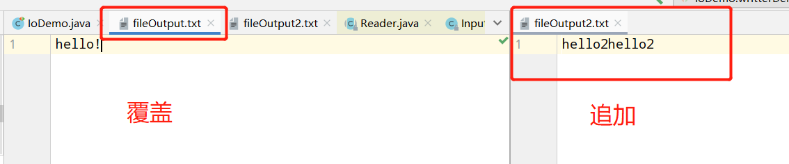
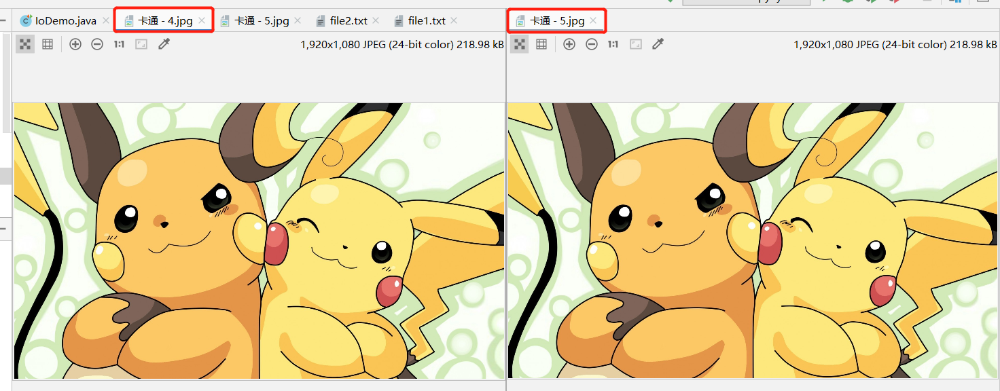
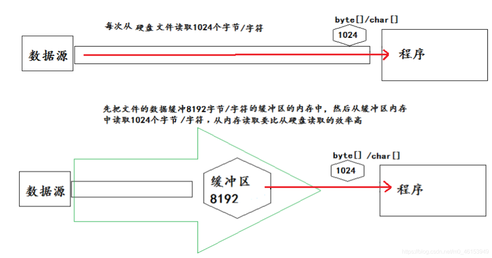
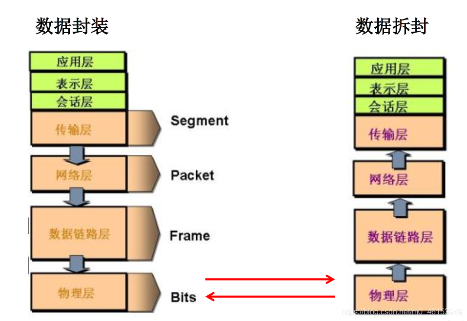
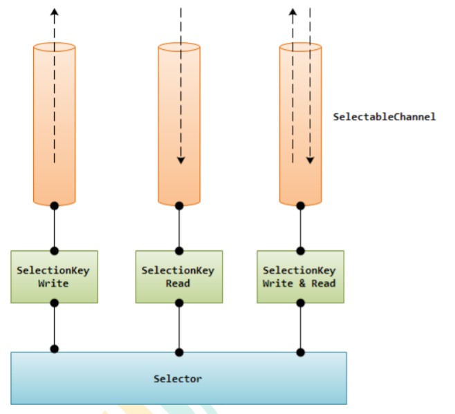

# 1. IO流

## 1.1 File类的使用

### File类的理解

1. File类的一个对象，代表一个文件或一个目录（俗称：文件夹）

2. File类声明在`java.io`包下

3. File类中涉及到关于文件或文件目录的创建，删除、重命名、修改时间、文件大小等方法

   并未涉及到写入或读取文件内容的操作。如果需要读取或写入文件内容，必须使用IO流来完成

4. 后续File类的对象常会作为参数传递到流的构造器中，指明读取或写入的“终点”。

### File的实例化

#### 构造器


```java
File file = new File(String filePath);
File file = new File(String parentPath, String childPath);
File file = new File(File parentFile, String childPath);
```


#### 常用方法

```java
public boolean isDirectory()：判断是否是文件目录
public boolean isFile() ：判断是否是文件
public boolean exists() ：判断是否存在
public boolean canRead() ：判断是否可读
public boolean canWrite() ：判断是否可写
public boolean isHidden() ：判断是否隐藏
public boolean createNewFile() ：创建文件。若文件存在，则不创建，返回false
public boolean mkdirs() ：创建文件目录。如果此文件目录存在，就不创建了。如果词文件目录的上层目录不存在， 也不创建。
public boolean mkdir() ：创建文件目录，如果上层文件目录不存在，一并创建
public boolean delete() ：删除文件或者文件夹（直接删除，不走回收站）
//  分隔符常量
File.separator  用于路径的分隔符  /* unix：/   windows： \\ */
```


## 1.2 IO流概述

- I/O是Input/Output的缩写，I/O技术是非常实用的技术，用于处理设备之间的数据传输。如读/写文件、网络通讯等。

- Java程序中，对于数据的输入/输出操作以“流Stream”的方式进行。
- java.io包下提供了各种“流”类和接口，用以获取不同种类的数据，并通过标准的方法输入或输出数据。
- 输入Input：读取外部数据（磁盘，光盘等存储设备的数据）到程序（内存）中
- 输出output：将程序（内存）数据输出到磁盘、光盘等存储设备中


**流的分类**

- 按操作数据单位不同分为：**字节流（8bit）**、**字符流（16bit）**
- 按数据流的流向不同分为：输入流、输出流
- 按数据流的角色不同分为：节点流、处理流

| 抽象基类 | 字节流       | 字符流                     |
| -------- | ------------ | -------------------------- |
| 输入流   | InputStream  | Reader（往内存中读取数据） |
| 输出流   | OutputStream | Writer（将内存中数据写出） |

Java的IO流涉及40多个类，实际上非常规则，都是从上述4个抽象基类派生的；由这四个类派生出来的子类名称都是其父类名作为子类名后缀。


**IO流的体系**

| 分类                 | 字节输入流           | 字节输出流            | 字符输入流        | 字符输出流         |
| -------------------- | -------------------- | --------------------- | ----------------- | ------------------ |
| 抽象基类             | InputStream          | OutputStream          | Reader            | Writer             |
| 访问文件（节点流）   | FileInputStream      | FileOutputStream      | FileReader        | FileWriter         |
| 访问数组             | ByteArrayInputStream | ByteArrayOutputStream | CharArrayReader   | CharArrayWriter    |
| 访问管道             | PipedInputStream     | PipedOutputStream     | PipedReader       | PipedWriter        |
| 访问字符串           |                      |                       | StringReader      | StringWriter       |
| 缓冲流(处理流的一种) | BufferedInputStream  | BufferedOutputStream  | BufferedReader    | BufferedWriter     |
| 转换流               |                      |                       | InputStreamReader | OutputStreamWriter |
| 对象流               | ObjectInputStream    | ObjectOutputStream    |                   |                    |
|                      | FilterInputStream    | FilterOutputStream    | FilterReader      | FilterWriter       |
| 打印流               |                      | PrintStream           |                   | PrintWriter        |
| 推回输入流           | PushbackinputStream  |                       | PushbackReader    |                    |
| 特殊流               | DataInputStream      | DataOutputStream      |                   |                    |


## 1.3 文件流

### 1.3.1 FileReader读入数据的基本操作

**四步骤：**

1. 建立一个流对象，将已存在的一个文件加载进流

   - ```java
     FileReader fr = new FileReader(new File("Test.txt"));
     ```

2. 创建一个临时存放数据的数组

   - ```java
     char[] ch = new char[1024];
     ```

3. 调用流对象对象的读取方法将流中的数据读入到数组中

   - ```java
     fr.read(ch);
     ```

4. 关闭资源

   - ```java
     fr.close();
     ```


**使用read()方法一个字符一个字符的读取**

```java
import org.junit.Test;

import java.io.File;
import java.io.FileReader;
import java.io.IOException;

public class IoDemo {

    @Test
    public void test1() throws IOException {
        File file = new File("Files\\file1.txt");
        FileReader fileReader = null;
        char[] chars = new char[1024];
        try{
            fileReader = new FileReader(file);
            int read = fileReader.read();
            while (read!=-1){
                System.out.print((char)read);
                read = fileReader.read();
            }
        }catch (IOException e){
            e.printStackTrace();
        }finally {
            fileReader.close();
        }

    }
}
// 输出结果 
asdfsdfasdfsdf
dsfsd
cvc
qwref
```

**使用read(char[] chars) 方法读入数据**

```java
@Test
public void readDemo2() throws IOException {
    File file = new File("Files\\file1.txt");
    FileReader fr = null;
    char[] chars = new char[20];
    try {
        fr = new FileReader(file);
        int len=0;
        while((len=fr.read(chars))!=-1){

            System.out.println(len);
            System.out.println(new String(chars,0,len));
        }
    }catch (Exception e)
    {
        e.printStackTrace();
    }finally {
        fr.close();
    }
}
```

### 1.3.2 FileWriter写出数据的操作

```java
@Test
public void writterDemo() throws IOException {
    File file = new File("Files\\fileOutput.txt");
    File file2 = new File("Files\\fileOutput2.txt");
    // 默认 每次 write 覆盖原有文件中的内容
    FileWriter fw = new FileWriter(file,false);
    // 指定为true时， 每次write 表示追加内容到文件中
    FileWriter fw2 = new FileWriter(file2,true);
    fw.write("hello!");
    fw2.write("hello2");
    fw.close();
    fw2.close();

    // 默认 每次 write 覆盖原有文件中的内容
    fw = new FileWriter(file,false);
    // 指定为true时， 每次write 表示追加内容到文件中
    fw2 = new FileWriter(file2,true);
    fw.write("hello!");
    fw2.write("hello2");
    fw.close();
    fw2.close();
}
```




### 1.3.3 FileReader 和 FileWriter实现文本复制

小需求：要求将文件`file1.txt`中的内容复制到另一个文件`file2.txt`中

```java
@Test
public void copyContextToOther() throws IOException{
    String filePath1 = "Files\\file1.txt";
    String filePath2 = "Files\\file2.txt";
    File src = new File(filePath1);
    File target = new File(filePath2);
    // 将 file1.txt 中的内容读到内存中
    FileReader fr = new FileReader(src);
    // 将读取的数据临时存放到buffer中
    char[] buffer = new char[5];
    // 将file1.txt 中的内容写到file2.txt中
    FileWriter fw = new FileWriter(target);
    int len = 0;
    while((len = fr.read(buffer))!=-1){
        fw.write(buffer,0,len);
    }
    fw.close();
    fr.close();
}
```


### 1.3.4 FileInputStream和FileOutputStream不能读取文本文件

**tip:**

**FileInputStream**和**FileOutputStream**不能操作像`.java`,`.cpp`,`.txt`,`.c`等文本文件，操作文本文件使用**FileReader**和**FileWriter**字符流；

如果是`.jpg`,`.mp4`,`.mp3`等文件使用**FileInputStream**和**FileOutputStream**字节流操作

<font color=green>使用字节流**FileInputStream**和**FileOutputStream**操作文本文件，有可能出现乱码的问题</font>

```java
// 使用字节流操作文本文件
    //使用字节流FileInputStream处理文本文件，可能出现乱码。
    @Test
    public void testFileInputStream(){
        FileInputStream fis = null;
        try {
            //1.造文件
            File file = new File("Files\\file1.txt");

            //2.造流
            fis = new FileInputStream(file);

            //3.读数据
            byte[] buffer = new byte[5];
            int len;//记录每次读取的字节的个数
            while((len = fis.read(buffer)) != -1){
                String str = new String(buffer,0,len);
                System.out.print(str);
            }
        } catch (IOException e) {
            e.printStackTrace();
        }finally {
            if(fis != null) {
                //4.关闭资源
                try {
                    fis.close();
                } catch (IOException e) {
                    e.printStackTrace();
                }
            }
        }
    }
```

使用**FileInputStream**和**FileOutputStream**实现文件的复制

```java
@Test
public void copyByte() throws IOException{
    File file1 = new File("Files\\卡通 - 4.jpg");
    File file2 = new File("Files\\卡通 - 5.jpg");
    FileInputStream fis = new FileInputStream(file1);
    byte[] buffer = new byte[5];
    FileOutputStream fos = new FileOutputStream(file2);
    int len=0;
    while ((len=fis.read(buffer))!=-1){
        fos.write(buffer,0,len);
    }
    fos.close();
    fis.close();
}
```




## 1.4 缓冲流的使用




- 缓冲流要`套接`在相应的节点流之上，根据数据操作单位可以把缓冲流分为：
  - **BufferedInputStream**和**BufferedOutputStream**
  - **BufferedReader**和**BufferedWriter**
- 当读取数据时，数据按块读入缓冲区，其后的读操作则直接访问缓冲区
- 当使用BufferedInputStream读取字节文件时，BufferedInputStream会一次性从文件中读取8192（8kb）,存在缓冲区中，直到缓冲区装满了，才重新从文件中读取下一个8kb的字节数组。
- 向流中写入字节时，不会直接写到文件，先写到缓冲区中直到缓冲区写满，BufferedOutputStream才会把缓冲区中的数据一次性写到文件中。使用`flush()`可以强制将缓冲区的内容全部写入到输出流中。
- 关闭流的顺序和打开流的顺序相反。只要关闭最外层流即可，关闭最外层流也会相应关闭内层节点流
- flush()方法的使用：手动将buffer中内容写入到文件
- 如果是带缓冲区的流对象的close()方法，不但会关闭流，还会在关闭流之间刷线缓冲区，关闭后不能再写出。


## 1.5 转换流的使用

### 1.5.1 转换流概述与InputStreamReader的使用

- 转换流提供了在字节流和字符流之间的转换
- Java API提供了两个转换流：
  - `InputStreamReader`：将InputStream转换成Reader
    - 实现将字节的输入流按指定字符集转换成字符的输入流
    - 需要和`InputStream`套接
    - 构造器
      - `public InputStreamReader(InpurStream in)`
      - `public InputStreamReader(InpurStream in, String charsetName)`
      - 例如：`Reader isr=new InpurStreamReader(System.in, "gbk")`
  - `OutputStreamWriter`：将Writer转换为OutputStream
    - 实现将字符的输出流按指定字符集转换为字节的输出流
    - 需要和`OutputStream`套接
    - 构造器
      - `public OutputStreamWriter(OutputStream out)`
      - `public OutputStreamWriter(OutputStream out, String charsetName)`
  - 字节流中的数据都是字符时，转换成字符流操作更高效
  - 很多时候我们使用转换流来处理文本乱码问题。实现编码和解码的功能。


### 1.5.2 转换流实现文件的读入和写出

**InputStreamReader**：将一个字节的输入流转换为字符的输入流

**OutputStreamWriter**：将一个字符的输出流转换为字节的输出流

```java
@Test
public void transformation() throws IOException {
    FileInputStream inputStream = new FileInputStream(new File("Files\\file1.txt"));
    FileOutputStream outputStream = new FileOutputStream(new File("Files\\file3.txt"));
    // 将字节流转换成字符流
    InputStreamReader isr = new InputStreamReader(inputStream);
    // 将字符流转换成字节输出流
    OutputStreamWriter osw = new OutputStreamWriter(outputStream);
    // 用字符数组承接字节流转换成字符流的数据
    char[] chars = new char[5];
    int len = 0;
    while ((len=isr.read(chars))!=-1){
        // 将字符流通过转换流写出到字节流FileOutputStream中
        osw.write(chars,0,len);
    }
    osw.close();
    isr.close();
}
```


## 1.6 其他的流的使用

### 1.6.1 标准输入、输出流

- System.in 和 System.out 分别代表了系统标准的输入和输出设备
- 默认输入设备是键盘；输出设备是：显示器
- System.in 的类型方式InputStream
- System.out的类型是PrintStream，其是OutputStream的子类FilterOutputStream的子类
- 重定向：通过System类的setln，setOut方法对默认设备进行改变。
  - `public static void setln(InputStream in)`
  - `public static void setOut(PrintStream out)`

### 1.6.2 打印流

- 实现将基本数据类型的数据格式转化为字符串输出
- 打印流：PrintStream和PrintWriter
  - 提供了一系列重载的print()和println()方法，用于多种数据类型的输出
  - PrintStream和PrintWriter的输出不会抛出IOException异常
  - PrintStream和PrintWriter有自动flush功能
  - PrintStream打印的所有字符都使用平台的默认字符编码转换为字节。在需要写入字符而不是写入字节的情况下，应该使用PrintWriter类。
  - System.out返回的是PrintStream的实例


### 1.6.3 数据流

- 为了方便地操作Java语言的基本数据类型和String的string数据，可以使用数据流
- 数据流有两个类：（用于读取和写出基本数据类型、String类的数据）
  - DataInputStream和DataOutputStream
  - 分别“套接”在InputStream和OutputStream

**数据流**：

- DataInputStream：数据输入流
- DataOutputStream：数据输出流

```java
@Test
public void dataStreamDemoWrite() throws IOException{
    // 数据流 可以读取特定类型的数据，可以写特定的数据类型的数据

    // 输出
    DataOutputStream dos = new DataOutputStream(new FileOutputStream(new File("Files\\data.txt")));
    dos.writeChar('c');
    dos.writeBoolean(true);
    dos.writeDouble(2.0798654);
    dos.writeLong(123456789L);
    dos.flush();
}
@Test
public void dataStreamDemoReade() throws IOException{
    DataInputStream dis = new DataInputStream(new FileInputStream(new File("Files\\data.txt")));
    char c = dis.readChar();
    boolean b = dis.readBoolean();
    double v = dis.readDouble();
    long l = dis.readLong();
    System.out.println(c+"\t"+b+"\t"+v+"\t"+l+"\t");
}
```


## 1.7 对象流

### 1.7.1 对象序列化机制的理解

- `ObjectInputStream`和`ObjectOutputStream`
- 用于存储和读取基本数据类型数据或对象的处理流。它的强大之处就是把Java中的对象写入到数据源中，也能把对象从数据源中还原回来。
- 序列化：用`ObjectInputStream`类读取基本类型数据或对象的机制
- 反序列化：用`ObjectInputStream`类读取基本类型数据或对象的机制
- `ObjectOutputStream`和`ObjectInputStream`不能序列化`static`和`transient`修饰的成员变量
- 对象序列化机制允许把内存中的Java对象转换成平台无关的二进制流，从而允许把这种二进制流持久地保存在磁盘上，或通过网络将这种二进制流传输到另一个网络节点。当其他程序获取这种二进制流，就可以恢复原来的Java对象。
- 序列化的好处在于可将任何实现了`Serializable`接口的对象转化为字节数据，使其在保存和传输时刻被还原
- 序列化是RMI（Remote Method Invoke-远程方法调用）过程的参数和返回值都必须实现的机制，而RMI是JavaEE的基础。因此序列化机制是JavaEE平台的基础
- 如果需要让某个对象支持序列化机制，则必须让对象所属的类及其属性是可序列化的，为了让某个类是可序列化的，该类必须实现如下两个接口之一。否则，会抛出`NotSerializableException`异常
  - `Serializable`
  - `Externalizable`


### 1.7.2 对象流序列化与反序列化字符串操作

定义一个Person类，并实现`Serializable`接口，实现系列化功能，

通过`ObjectOutputStream`将Person对象写入到`person.dat`文件中，然后通过`ObjectInputStream`将person读回内存。

```java
class Person implements Serializable{
    private String name;
    private int age;
    public Person(String name, int age){
        this.name=name;
        this.age=age;
    }

    public String getName() {
        return name;
    }

    public void setName(String name) {
        this.name = name;
    }

    public int getAge() {
        return age;
    }

    public void setAge(int age) {
        this.age = age;
    }

    @Override
    public String toString() {
        return "Person{" +
                "name='" + name + '\'' +
                ", age=" + age +
                '}';
    }
}

/**
     * 序列化与反序列化
     *  实现Serializable接口，即可将对象通过ObjectOutputStream存储到磁盘中
     *                              通过ObjectInputStream读取到内存中
     */
@Test
public void serializableDemo() throws IOException, ClassNotFoundException {
    ObjectOutputStream oos = new ObjectOutputStream(new FileOutputStream(new File("Files\\person.dat")));
    Person person = new Person("yu", 25);
    oos.writeObject(person);

    ObjectInputStream ois = new ObjectInputStream(new FileInputStream(new File("Files\\person.data")));
    Person person1 = (Person)ois.readObject();
    System.out.println(person1);

}
```

### 1.7.3 serialVersionUID的理解

- 凡是实现`Serializable`接口的类都有一个表示序列化版本标识符的静态变量
  - `private static final long serialVersionUID`
  - `serialVersionUID`用来表明类的不同版本间的兼容性。简言之，其目的是以序列化对象进行版本控制，有关各版本反序列化时是否兼容
  - 如果类没有显示定义这个静态常量，它的值是Java运行时环境根据类的内部细节自动生成的。若类的实力变量做了修改，`serialVersionUID`可能发生变化，故建议显示声明
- 简单来说，Java的序列化机制是通过在运行时判断类的`serialVersionUID`来验证版本一致的。在进行反序列化时，JVM会把传来的字节流中的`serialVersionUID`与本地相应实体类的`serialVersionUID`进行比较，如果相同就认为是一致的，可以进行反序列化，否则就会出现序列化版本不一致的异常（InvalidCastException）


如果想要一个类的对象可序列化，除了实现`Serializable`接口之外，还必须保证其内部所有的属性也必须是可序列化的。（默认情况下，基本数据类型都可序列化）

一般情况下需要自定义`serialVersionUID`


> **序列化机制**
>
> 对象序列化机制允许把内存中的Java对象转换成平台无关的二进制流，从而允许把这种二进制流持久地保存在磁盘上，或通过网络将这种二进制流传输到另一个网络节点。当其他程序获取了这种二进制流，就可以恢复成原来的Java对象。


## 1.8 RandomAccessFile(随机存取文件流)的使用

- `RandomAccessFile`声明在`java.io`包下，但直接继承于`java.lang.Object`类。并且它实现了`DataInput、DataOutput`这两个接口，也就意味着这个类**既可以读也可以写**
- `RandomAccessFile`类支持“随机访问”的方式，程序可以直接跳到文件的任意地方来读、写文件
  - 支持只访问文件的部分内容
  - 可以向已存在的文件后追加内容
- `RandomAccessFile`对象包含一个记录指针，用以表示单签读写处的位置。`RandomAccessFile`类对象可以自己移动记录指针：
  - `long getFilePointer()`
  - `void seek(long pos)`
- 构造器
  - `public RandomAccessFile(File file, String mode)`
  - `public RandomAccessFile(String name, String mode)`
- 创建RandomAccessFile类实例需要指定一个mode参数，该参数指定RandomAccessFile的访问模式：
  - `r`：以只读方式打开
  - `rw`：打开以便读取和写入
  - `rwd`：打开以便读取和写入；同步文件内容的更新
  - `rws`：打开以便读取和写入；同步文件内容和元数据的更新
- 如果模式为只读`r`，则不会创建文件，而是会去读取一个已经存在的文件，如果读取的文件不存在则会出现异常。如果模式为`rw`读写，如果文件不存在则去创建文件，如果存在则不会创建。

```java
import org.junit.Test;

import java.io.File;
import java.io.IOException;
import java.io.RandomAccessFile;

/**
 * RandomAccessFile的使用
 * 1.RandomAccessFile直接继承于java.lang.Object类，实现了DataInput和DataOutput接口
 * 2.RandomAccessFile既可以作为一个输入流，又可以作为一个输出流
 * 3.如果RandomAccessFile作为输出流时，写出到的文件如果不存在，则在执行过程中自动创建。
 *   如果写出到的文件存在，则会对原有文件内容进行覆盖。（默认情况下，从头覆盖）
 */
public class RandomAccessFileTest {

    @Test
    public void test(){

        RandomAccessFile raf1 = null;
        RandomAccessFile raf2 = null;
        try {
            raf1 = new RandomAccessFile(new File("爱情与友情.jpg"),"r");
            raf2 = new RandomAccessFile(new File("爱情与友情1.jpg"),"rw");

            byte[] buffer = new byte[1024];
            int len;
            while((len = raf1.read(buffer)) != -1){
                raf2.write(buffer,0,len);
            }
        } catch (IOException e) {
            e.printStackTrace();
        } finally {
            if(raf1 != null){
                try {
                    raf1.close();
                } catch (IOException e) {
                    e.printStackTrace();
                }

            }
            if(raf2 != null){
                try {
                    raf2.close();
                } catch (IOException e) {
                    e.printStackTrace();
                }
            }
        }

    }

    @Test
    public void test2() throws IOException {

        RandomAccessFile raf1 = new RandomAccessFile("hello.txt","rw");

        raf1.write("xyz".getBytes());

        raf1.close();

    }

}
```

RandomAccessFile实现数据的插入（seek()方法会重置偏移量）

```java
// 
import org.junit.Test;

import java.io.File;
import java.io.IOException;
import java.io.RandomAccessFile;

/**
 * RandomAccessFile的使用
 * 1.RandomAccessFile直接继承于java.lang.Object类，实现了DataInput和DataOutput接口
 * 2.RandomAccessFile既可以作为一个输入流，又可以作为一个输出流
 * 3.如果RandomAccessFile作为输出流时，写出到的文件如果不存在，则在执行过程中自动创建。
 *   如果写出到的文件存在，则会对原有文件内容进行覆盖。（默认情况下，从头覆盖）
 *
 * 4.可以通过相关的操作，实现RandomAccessFile“插入”数据的效果
 */
public class RandomAccessFileTest {

    /**
     * 使用RandomAccessFile实现数据的插入效果
     */
    @Test
    public void test3() throws IOException {
        RandomAccessFile raf1 = new RandomAccessFile("hello.txt","rw");

        raf1.seek(3);//将指针调到角标为3的位置
        //保存指针3后面的所有数据到StringBuilder中
        StringBuilder builder = new StringBuilder((int) new File("hello.txt").length());
        byte[] buffer = new byte[20];
        int len;
        while((len = raf1.read(buffer)) != -1){
            builder.append(new String(buffer,0,len)) ;
        }
        //调回指针，写入“xyz”
        raf1.seek(3);
        raf1.write("xyz".getBytes());

        //将StringBuilder中的数据写入到文件中
        raf1.write(builder.toString().getBytes());

        raf1.close();

        //思考：将StringBuilder替换为ByteArrayOutputStream
    }

}
```


## 1.9 Path、Paths、Files的使用


# 2. 网络编程

### 2.1 网络编程概述

- Java是Internet上的语言，它从语言级上提供了对网络应用程序的支持，程序员能够很容易开发常见的网络应用程序。
- Java提供的网络类库，可以实现无痛的网络连接，联网的底层细节被隐藏在Java的本机安装系统中，有JVM进行控制。并且Java实现了一个跨平台的网络库，**程序面对的是一个统一的网络编程环境**。
- 网络编程的目的：直接或间接地通过网络协议与其它计算机实现数据交换，进行通讯
- 网络编程中有两个主要的问题：
  - 如果准确地定位网络上一台或多台主机；定位主机上的特定的应用
  - 找到主机后如何可靠高效地进行数据传输

### 2.2 网络通信要素概述

- 通信双方地址
  - IP
  - 端口号
- 一定的规则（即：网络通信协议。有两套参考模型）
  - OSI参考模型：模型过于理想化，未能在因特网上进行广泛推广
  - TCP/IP参考模型（或TCP/IP协议）：实事上的国际标准
- 网络通信协议




> 网络编程中有两个主要的问题：
>
> 1. 如何准确地定位网络上一台或多台主机；定位主机上的特定的应用
> 2. 找到主机后如何可靠高效地进行数据传输
>
> 网络编程中的两个要素：
>
> 1. 对应问题1：IP和端口号
> 2. 对应问题2：提供网络通信协议：TCP/IP参考模型（应用层、传输层、网络层、物理+数据链路层）

### 2.3 通信要素1：IP和端口号

#### 2.3.1 IP的理解与InetAddress类的实例化

- IP地址：`InetAddress`
  - 唯一的表示Internet上的计算机（通信实体）
  - 本地回环地址（hostAddress）：127.0.01 主机名（hostName）：localhost
  - IP地址分类方式1：IPV4和IPV6
    - IPV4：由4个字节组成
    - IPV6：由16个字节组成
  - IP地址分类方式2：公网地址（万维网使用）和私有地址（局域网使用）。`192.168. . `开头的就是私有地址，范围即为`192.168.0.0 ~ 192.168.255.255`，专门为组织内部使用。
- Internet上的主机有两种方式表示：
  - 域名（hostName）：www.baidu.com
  - IP地址（hostAddress）：220.181.38.149

```java
@Test
public void test1() throws UnknownHostException {
    InetAddress inetAddress = InetAddress.getByName("www.baidu.com");
    System.out.println(inetAddress);
    // 获取本地ip
    System.out.println(InetAddress.getLocalHost());
    // 获取主机名
    System.out.println(inetAddress.getHostName());
}

//输出
www.baidu.com/220.181.38.149
DESKTOP-AQE9VH2/192.168.70.1
www.baidu.com
```

#### 2.3.2 端口号的理解

- 端口号表示正在计算机上运行的进程（程序）
  - 不同的进程有不同的端口号
  - 被规定为一个16位的整数`0~65535`
  - 端口分类：
    - 公认端口：`0~1023`.被预先定义的服务通信占用（如：HTTP占用端口80，FTP占用端口21，Telnet占用端口23）
    - 注册端口：`1024~49151`.分配给用户进程或应用程序。（如：Tomcat占用端口8080，MySQL占用端口3306，Oracle占用端口1521等）。
    - 动态/私有端口：49152~65535.
- 端口号与IP地址的组合得出一个网络套接字：`Socket`


### 2.4 通信要素2：网络协议

- **网络通信协议**

  计算机网络中实现通信必须有一些约定，即通信协议，对速率，传输代码，代码结构，传输控制步骤，出错控制等制定标准。

- **问题：网络协议太复杂**

  计算机网络通信设计内容很多，比如指定源地址和目标地址，加密解密，压缩解压缩，差错控制，流量控制，路由控制等

- **通信协议分层的思想**

  在制定协议时，把复杂问题分解成一些简单的成分，再将他们复合起来。最常用的复合方式使层次方式，即同层间可以通信，上一层可以调用下一层，而与再下一层不发生关系。各层互不影响，利于系统的开发和扩展。


#### 2.4.1 TCP和UDP网络通信协议的对比

- 传输层协议中有两个非常重要的协议：
  - 传输控制协议TCP
  - 用户数据报协议UDP
- TCP/IP以其两个主要协议：传输控制协议（TCP）和网络互联协议（IP）而得名，实际上是一组协议，包括多个具有不同功能互为关联的协议。
- IP协议是网络层的主要协议，支持网络间互连的数据通信
- TCP/IP协议模型从更实用的角度出发，形成了高效的四层体系结构，即物理层、数据链路层、IP层、传输层T、应用层。
- TCP协议：
  - 使用TCP协议前，需先建立TCP连接，形传输数据通道
  - 传输前，采用“三次握手”方式，点对点通信，是可靠的
  - TCP协议进行通信的两个应用进程：客户端、服务端
  - 在连接中进行大数据量的传输，传输完毕，需释放已建立的连接，效率低
- UDP协议：
  - 将数据、源、目的封装成数据包，不需要建立连接
  - 每个数据报的大小限制在64K内
  - 发送不管对方是否准备好，接收方收到也不确认，故是不可靠的
  - 可以广播发送
  - 发送数据结束时无需释放资源，开销小，速度快。


### 2.5 TCP网络编程

```java
// Client端 向 服务器端 发送数据
@Test
public void client() throws IOException {
    // client 端 发送消息
    Socket socket = null;
    OutputStream os = null;
    try{
        // 1. 创建Socket对象，指明服务器端的ip和端口
        InetAddress inet = InetAddress.getByName("192.168.137.237");
        socket = new Socket(inet, 8899);
        // 2. 获取一个输出流，用于输出数据
        os = socket.getOutputStream();
        // 3. 写出数据
        os.write("hello world !".getBytes());
    }catch(IOException e){
        e.printStackTrace();
    }finally {
        if(os!=null){
            os.close();
        }
        if(socket!=null){
            socket.close();
        }
    }
}

// Server端接收Client端发送来的数据
@Test
public void server() throws IOException {
    // server 端 接收消息
    ServerSocket ss = null;
    Socket socket = null;
    InputStream is = null;
    ByteArrayOutputStream baos = null;
    // 1. 创建服务器端的ServerSocket，指明自己的端口号
    ss = new ServerSocket(8899);
    //2. 调用accept()表示接收来自客户端的socket
    socket = ss.accept();
    // 3. 获取输入流    获取输出流的时候，会阻塞，等待Client端 给服务器端发送数据
    is = socket.getInputStream();
    // 4. 读取输入流中的数据
    baos = new ByteArrayOutputStream();
    byte[] buffer = new byte[5];
    int len=0;
    while((len=is.read(buffer))!=-1){
        baos.write(buffer,0,len);
    }
    System.out.println("收到来自："+socket.getInetAddress().getHostAddress()+"的数据");
    System.out.println(baos.toString());
}
```


TCP网络编程：从客户端发送文件给服务端，服务端保存到本地，并返回“发送成功”给客户端。并关闭相应的连接。

```java
@Test
public void client2() throws IOException {
    // 1. 客户端向服务端发送一张图片， 等待服务端接收完毕后返回 接收成功！ 信息
    Socket socket = new Socket("127.0.0.1", 9090);
    OutputStream os = socket.getOutputStream();
    FileInputStream fis = new FileInputStream(new File("Files\\卡通 - 4.jpg"));
    byte[] buffer = new byte[5];
    int len = 0;
    while ((len=fis.read(buffer))!=-1){
        // 从文件中读取的数据写入到到socket输出流中
        os.write(buffer,0,len);
    }
    // 关闭socket数据的输出
    socket.shutdownOutput();
    // 接收服务器端的数据，并显示到控制台上
    InputStream is = socket.getInputStream();
    ByteArrayOutputStream baos = new ByteArrayOutputStream();
    buffer = new byte[5];
    len = 0;
    while ((len=is.read(buffer))!=-1){
        baos.write(buffer,0,len);
    }
    System.out.println(baos.toString());
    fis.close();
    os.close();
    socket.close();
}

@Test
public void server2() throws IOException{
    ServerSocket ss = new ServerSocket(9090);
    Socket socket = ss.accept();
    InputStream is = socket.getInputStream();
    FileOutputStream fos = new FileOutputStream(new File("Files\\图片1.jpg"));
    byte[] buffer = new byte[1024];
    int len=0;
    while((len=is.read(buffer))!=-1){
        fos.write(buffer,0,len);
    }
    System.out.println("服务器端接收数据完毕");

    // 给客户端进行反馈
    OutputStream os = socket.getOutputStream();
    os.write("照片服务器端已经接收完毕".getBytes());
    os.close();
    fos.close();
    is.close();
    socket.close();
    ss.close();
}
```


### 2.6 UDP网络编程

- 类**DatagramSocket**和**DatagramPacket**实现了基于UDP协议网络程序。
- UDP数据报通过数据报套接字DatagramSocket发送和接收，系统不保证UDP数据包一定能够安全送到目的地，也不能确定什么时候可以抵达
- DatagramPacket对象封装了UDP数据报，在数据报中包含了发送端的IP地址和端口号以及接收端的IP地址和端口号。
- UDP协议中每个数据报都给出了完整的地址信息，因此无需建立发送方和接收方的连接。如同发快递包裹一样。
- 流程
  1. DatagramSocket与DatagramPacket
  2. 建立发送端，接收端
  3. 建立数据包
  4. 调用Socket的发送、接收方法
  5. 关闭Socket

> 发送端与接收端是两个独立的运行程序

```java
@Test
public void udpSend() throws IOException{
    DatagramSocket socket = new DatagramSocket();
    String str = "我是UDP发送端";
    byte[] data = str.getBytes();
    InetAddress inetAddress = InetAddress.getLocalHost();
    DatagramPacket packet = new DatagramPacket(data,0,data.length,inetAddress,9090);
    socket.send(packet);
    socket.close();
}
@Test
public void udpReceive() throws IOException{
    DatagramSocket socket = new DatagramSocket(9090);
    byte[] buffer = new byte[1024];
    DatagramPacket packet = new DatagramPacket(buffer,0,buffer.length);
    socket.receive(packet);
    System.out.println(new String(packet.getData(),0,packet.getLength()));
    socket.close();
}
```

### 2.7 URL编程

URL网络编程实现数据下载

```java
@Test
public void urlDemo() throws IOException {
    HttpURLConnection urlConnection = null;
    InputStream is = null;
    FileOutputStream fos = null;
    URL url = new URL("https://pic2.zhimg.com/80/v2-576df7c2088825cc388a4a8f74f8b2ed_720w.jpg");
    urlConnection = (HttpURLConnection) url.openConnection();
    urlConnection.connect();
    is = urlConnection.getInputStream(); // 得到输入流
    fos = new FileOutputStream(new File("Files\\spark.jpg"));
    byte[] buffer = new byte[5];
    int len = 0;
    while ((len = is.read(buffer)) != -1) {
        fos.write(buffer, 0, len);
    }
    System.out.println("图片下载完成");
    fos.close();
    is.close();
    urlConnection.disconnect();
}
```


# 3. NIO

## 3.1 Java NIO 概述

### 阻塞IO

通常在进行同步I/O操作时，如果读取数据，代码会阻塞直至有可提供读取的数据。同样，写入调用将会阻塞直至数据能够写入。传统的Server/Client模式会基于（TPR：Thread per Request），服务器会为每个客户端请求建立一个线程，由该线程单独负责处理一个客户请求。这种模式带来的一个问题就是线程数量的剧增，大量的线程会增大服务器的开销。大多数的实现为了避免这个问题，都采用了线程池模型，并设置线程池线程的最大数量，这又带来了新的问题，如果线程池中有100个线程，而有100个用户都在进行大文件下载，会导致第101个用户的请求无法及时处理，即便第101个用户只想请求一个几kb大小的页面。传统的Server/Client模式如图所示：


### 非阻塞IO（NIO）

NIO中非阻塞I/O采用了基于Reactor模式的工作方式，I/O调用不会被阻塞，相反是注册感兴趣的特定I/O事件，如可读数据到达，新的套接字连接等等，在发生特定事件时，系统再通知我们。NIO中实现非阻塞I/O的核心对象就是Selector，Selector就是注册各种I/O事件地方，而且当我们感兴趣的事件发生时，就是这个对象告诉我们所发生的时间。



当有读或写等任何注册的时间发生时，可以从Selector中获得相应的SelectionKey，同时SelectionKey中可以找到发生的事件和该事件所发生的具体的SelectableChannel，以获得客户端发送过来的数据。

非阻塞指的是IO时间本身不阻塞，但是获取IO事件的select()方法是需要阻塞等待的。区别是阻塞的IO会阻塞IO操作上，NIO阻塞在事件获取上，没有事件就没有IO，从高层次看IO就不阻塞了。也就是说只有IO已经发生那么我们才评估IO是否阻塞，但是select()阻塞的时候IO还没有发生，何谈IO的阻塞呢？NIO的本质是延迟IO操作到真正发生IO的时候，而不是以前的只要IO流打开了就一直等到IO操作。

| IO                      | NIO                           |
| ----------------------- | ----------------------------- |
| 面向流(Stream Oriented) | 面向缓冲区（Buffer Oriented） |
| 阻塞IO（Blocking IO）   | 非阻塞IO（Non Blocking IO）   |
| 无                      | 选择器（Selectors）           |

Java的NIO由以下几个核心部分组成：

- Channels

  - > NIO中的Channel和 IO中的Stream(流)是差不多一个等级的。只不过Stream是单向的，譬如：**InputStream**，**OutputStream**。而**Channel**是双向的，**即可以用来进行读操作，又可以用来进行写操作**。
    >
    > NIO中的Channel的主要实现有：FileChannel，DatagramChannel，SocketChannel和ServerSocketChannel，分别对应文件IO，UDP和TCP（Server和Client）

- Buffers

  - > NIO中的关键实现有：ByteBuffer，CharBuffer，DoubleBuffer，FloatBuffer，IntBuffer，LongBuffer，ShortBuffer，分别对应基本数据类型：byte，char，double，float，int，long，short。

- Selectors

  - > Selector运行单线程处理多个Channel，如果你的应用打开了多个通道，但每个连接的流量都很低，使用Selector就会很方便。例如在一个聊天服务器中。要使用Selector，得向Selector注册Channel，然后调用它的select()方法。这个方法就会一直阻塞到某个注册的通道有事件就绪。一旦这个方法返回，线程就可以处理这些事件，事件的例子就如新的连接进行，数据接收等。

虽然Java NIO中除此之外还有很多类和组件，但Channel，Buffer和Selector构成了核心的API。其他组件，如Pipe和FileLock，只不过是与三个核心组件共同使用的工具类。

## 3.2 Channel

Channel是一个通道，可以通过它读取和写入数据，它就像水管一样，网络数据通过Channel读取和写入。通道与流的不同之处在于通道是双向的，流只是在一个方向移动（一个流必须是InputStream或者OutputStream的子类），而且通道可以用于读，写或者同时用于读写。因为Channel是全双工的，所以它可以比流更好地映射底层操作系统的API。

NIO中通过Channel封装了数据源的操作，通过channel我们可以操作数据源，但又不必关系数据源的具体物理结构。这个数据源可能是多种的。比如：可以是文件，也可以是socket。在大多数应用中，Channel与文件描述或者socket是一一对应的。**Channel用于在字节缓冲区和位于通道另一侧的实体**（通常是一个文件或套接字）之间有效地传输数据。


与缓冲区不同，通道API主要由接口指定。不同的操作系统上通道实现（Channel Implementation）会有根本性的差异，所以通道API仅仅描述了可以做什么。因此很自然地，通道实现经常使用操作系统的本地代码。通道接口允许您以一种受控且可移植的方式来访问底层的I/O服务。

Channel是一个对象，可以通过它读取和写入数据。拿NIO与原来的I/O做个比对，通道就像是流。所有数据都通过**Buffer**对象来处理。您永远不会将字节直接写入同道中人，相反，您是将数据写入包含一个或者多个字节的缓冲区。同样，您不会直接从通道中读取字节，而是将数据从通道读入缓冲区，再从缓冲区获取这个字节。

**Java NIO的通道类似流，但又有些不同：**

- 既可以从通道中读取数据，又可以写数据到通道。但流的读写通常是单向的。
- 通道可以异步地读写
- 通道中的数据总是要先读到一个**Buffer**，或者总是要从一个**Buffer**中写入。

如图所示：从通道读数据到缓冲区；从缓冲区写入数据到通道


### Channel 的实现

下面是Java IO 中最重要的Channel的实现：

- **FileChannel**
  - FileChannel从文件中读写数据
- **DatagramChannel**
  - DatagramChannel能通过UDP读写网络中的数据
- **SocketChannel**
  - SocketChannel能通过TCP读写网络中的数据
- **ServerSocketChannel**
  - ServerSocketChannel可以监听新进来的TCP连接，像Web服务器那样，对每一个新进来的连接都会创建一个SocketChannel。


#### FileChannel 操作详解


##### FileChannel介绍和示例

FileChannel类可以实现常用的read，write以及scatter/gather操作，同时它也提供了很多专用于文件的新方法。这些方法中的许多都是我们所熟悉的文件操作。

| 方法                              | 描述                                         |
| --------------------------------- | -------------------------------------------- |
| **int read(ByteBuffer dst)**      | **从Channel中读取数据到ByteBuffer**          |
| **long read(ByteBuffer[] dsts)**  | **将Channel中的数据“分散”到ByteBuffer[]**    |
| **int write(ByteBuffer src)**     | **将ByteBuffer中的数据写入到Channel**        |
| **long write(ByteBuffer[] srcs)** | **将ByteBuffer[]中的数据“聚集”到Channel**    |
| long position()                   | 返回此通道的文件位置                         |
| FileChannel position(long p)      | 设置此通道的文件位置                         |
| long size()                       | 返回此通道的文件的当前大小                   |
| FileChannel truncate(long s)      | 将此通道的文件截取为给定大小                 |
| void force(boolean metaData)      | 强制将所有对此通道的文件更新写入到存储设备中 |

**FileChannel Demo**

```java
import java.io.IOException;
import java.io.RandomAccessFile;
import java.nio.ByteBuffer;
import java.nio.channels.FileChannel;

public class FileChannelDemo1 {
    // FileChannel 读取数据到buffer中
    public static void main(String[] args) throws IOException {
        // 1. 创建FileChannel
        RandomAccessFile aFile = new RandomAccessFile("Files\\data.txt","rw");
        FileChannel fileChannel = aFile.getChannel();
        // 2. 创建Buffer
        ByteBuffer buffer = ByteBuffer.allocate(8);

        // 3. 读取数据到buffer中
        int byteReads = 0;
        while((byteReads=fileChannel.read(buffer))!=-1){
            System.out.println("读取了："+byteReads);
            // 读写反转，重置缓冲区的position
            buffer.flip();
            while (buffer.hasRemaining()){
                System.out.print((char)buffer.get());
            }
            // buffer 中的数据读取完成后 清空
            System.out.println();
            buffer.clear();
        }
        // 关闭channel
        aFile.close();
        System.out.println("结束了！");
    }
}
```


**Buffer通常的操作**

- 将数据写入缓冲区
- 调用`buffer.flip()`反转读写模式
- 从缓冲区读取数据
- 调用`buffer.clear()`或`buffer.compact()`清除缓冲区内容


##### 1.  打开FileChannel

在使用**FileChannel**之前，必须先打开它。但是，无法直接打开一个FileChannel，需要通过使用一个InputStream、OutputStream或RandomAccessFile来获取一个FileChannel实例。

```java
RandomAccessFile aFile = new RandomAccessFile("Files\\data.txt");
FileChannle fileChannel = aFile.getChannel();
```

##### 2. 从FileChannel读取数据

使用FileChannel.read()方法从FileChannel中读取数据。

```java
ByteBuffer buffer = ByteBuffer.allocate(8);
int byteRead = fileChannel.read(buffer);
```

首先分配一个Buffer。从FileChannel中读取的数据将被读取到Buffer中。然后，调用FileChannel.read()方法。该方法将数据从FileChannel读取到Buffer中。read()方法返回的int值表示有多少字节被读取到了Buffer中。如果返回-1，表示到了文件末尾。

##### 3. 向FileChannel写数据

使用FileChannel.write()方法向FileChannel中写数据，该方法的参数是一个Buffer

```java
    @Test
    public void writeDemo() throws IOException {
        RandomAccessFile aFile = new RandomAccessFile(new File("Files\\data2.txt"),"rw");
        FileChannel fileChannel = aFile.getChannel();
        ByteBuffer byteBuffer = ByteBuffer.allocate(1024);
        String data = "new String to write file ........ !"+System.currentTimeMillis();
        byteBuffer.clear();
        byteBuffer.put(data.getBytes());
        // 将Buffer中的数据写入到Channel中，需要从buffer中读取数据，put的时候，buffer为写的模式，需要反转buffer的读写模式
        // todo 换言之，读 或者 写 之后的 写 或者 读 操作之前需要转换一下 buffer 的读写模式
        byteBuffer.flip();
        while(byteBuffer.hasRemaining()){
            System.out.println("写入中。。。");
            fileChannel.write(byteBuffer);
        }
        // 关闭通道
        fileChannel.close();
        aFile.close();
    }
```

注意：FileChannel.write()是在while循环中调用的。因为无法保证write()方法一次能向FileChannel写入多少字节，因此需要重复调用write()方法，直到Buffer中已经没有尚未写入通道的字节。

##### 4. 关闭FileChannel

用完FileChannel后必须将其关闭

```java
fileChannel.close();
```

##### 5. FileChannel的position方法

有时可能需要在**FileChannel**的某个特定位置进行数据的读/写操作。可以通过调用**position()**方法获取**FileChannel**的当前位置。也可以通过调用**position(long pos)** 方法设置**FileChannel**的当前位置。

例子：

- `long pos = channel.position();`
- `channel.position(pos+123);`

如果将位置设置在文件结束符之后，然后试图从文件通道中读取数据，读方法将返回`-1`（文件结束标志）。

如果将位置设置在文件结束符之后，然后向通道中写数据，文件将撑大到当前位置并写入数据。这可能导致“<font color=red>文件空洞</font>”，磁盘上物理文件中写入的数据间有空隙。

##### 6. FileChannel的size方法

FileChannel实例的size()方法将返回该示例所关联文件的大小。如：

`long fileSize = channel.size();`

##### 7. FileChannel 的 truncate方法

可以使用`FileChannel.truncate()`方法截取一个文件。截取文件时，文件将指定长度后面的部分将被删除。如：

`channel.truncate(1024);`

这个例子截取文件的前`1024`个字节。


##### 8. FileChannel的force方法

FileChannel.force()方法将通道里面尚未写入磁盘的数据强制写到磁盘上 。处于性能方面的考虑，操作系统会将数据缓存在内存中，所以无法保证写入到FileChannel里面的数据一定会及时写到磁盘上。要保证这一点，需要调用`force()`方法。

`force()`方法有一个`boolean`类型的参数，指明是否同时将文件元数据（权限信息等）写入到磁盘上。

##### 9. FileChannel的transferTo和transferFrom方法

**通道之间的数据传输**

如果两个通道中有一个是FileChannel，那么可以直接将数据从一个C hannel传输到另外一个Channel。

1. **transferFrom()**

   - FileChannel的transferFrom()方法可以将数据从源通道传输到FileChannel中

     - ```java
       @Test
       public void transferFromDemo() throws IOException {
           // 定义 源 Channel
           RandomAccessFile file = new RandomAccessFile("Files\\data.txt", "rw");
           FileChannel fromChannel = file.getChannel();
           // 定义 目标 Channel
           RandomAccessFile file1 = new RandomAccessFile("Files\\dataTo.txt", "rw");
           FileChannel toChannel = file1.getChannel();
           long position = 0;
           long count = fromChannel.size();
           // transferFrom 从一个通道中复制数据到另一个通道中
           toChannel.transferFrom(fromChannel,0,count);
       
           toChannel.close();
           fromChannel.close();
           file1.close();
           file.close();
           System.out.println("over!");
       }
       ```

2. **transferTo**

   - transferTo()方法将数据从FileChannel传输到其他的channel中。

     - ```java
       @Test
       public void transferToDemo() throws IOException{
           // 定义 源 Channel
           RandomAccessFile file = new RandomAccessFile("Files\\data.txt", "rw");
           FileChannel fromChannel = file.getChannel();
           // 定义 目标 Channel
           RandomAccessFile file1 = new RandomAccessFile("Files\\dataTo2.txt", "rw");
           FileChannel toChannel = file1.getChannel();
           long size = fromChannel.size();
           int position = 0;
       
           fromChannel.transferTo(position, size, toChannel);
       
           fromChannel.close();
           toChannel.close();
           file.close();
           file1.close();
       }
       ```


### SocketChannel通道


1. > <font size=4px color=green>新的 socket 通道类可以运行非阻塞模式并且是可选择的，可以激活大程序（如网络服务器和中间件组件）巨大的可伸缩性和灵活性。再也不需要为每个 socket 连接使用一个线程的必要了，也避免了管理大量线程所需的上下文交换开销。借助新的 NIO 类，一个或几个线程就可以管理成百上千的活动 socket 连接了并且只有很少甚至可能没有性能损失。所有的 socket 通道类(DatagramChannel、SocketChannel 和 ServerSocketChannel)都继承了位于 java.nio.channels.spi 包中的 AbstractSelectableChannel。这意味着我们可以用一个 Selector 对象来执行socket 通道的就绪选择（readiness selection）。</font>

2. ><font size=4px color=green>请注意 DatagramChannel 和 SocketChannel 实现定义读和写的功能，而接口
   >ServerSocketChannel 没有实现。ServerSocketChannel 负责监听传入的连接和创建新
   >的 SocketChannel 对象，它本身从不传输数据。</font>

3. > **socket 和 socket 通道之间 的关系**。通道是一个连接 I/O 服务导管并提供与该服务交互的方法。就某个 socket 而 言，它不会再次实现与之对应的 socket 通道类中的 socket 协议 API，而 java.net 中 已经存在的 socket 通道都可以被大多数协议操作重复使用。
   >
   > <font size=4px color=green>全部 socket 通道类（DatagramChannel、SocketChannel 和
   > ServerSocketChannel）在被实例化时都会创建一个对等 socket 对象。这些是我们所
   > 熟悉的来自 java.net 的类（Socket、ServerSocket 和 DatagramSocket），它们已
   > 经被更新以识别通道。对等 socket 可以通过调用 socket( )方法从一个通道上获取。
   > 此外，这三个 java.net 类现在都有 getChannel( )方法。</font>

4. > <font size=4px color=green>要把一个 socket 通道置于非阻塞模式，我们要依靠所有 socket 通道类的公有 超级类：SelectableChannel。就绪选择（readiness selection）是一种可以用来查 询通道的机制，该查询可以判断通道是否准备好执行一个目标操作，如读或写。非阻 塞 I/O 和可选择性是紧密相连的，那也正是管理阻塞模式的 API 代码要在 SelectableChannel 超级类中定义的原因。设置或重新设置一个通道的阻塞模式是很简单的，**只要调用 configureBlocking( )方 法即可**，传递参数值为 true 则设为阻塞模式，参数值为 false 值设为非阻塞模式。可 以通过调用 isBlocking( )方法来判断某个 socket 通道当前处于哪种模式。</font>

非阻塞 socket 通常被认为是服务端使用的，因为它们使同时管理很多 socket 通道变 得更容易。但是，在客户端使用一个或几个非阻塞模式的 socket 通道也是有益处的， 例如，借助非阻塞 socket 通道，GUI 程序可以专注于用户请求并且同时维护与一个或 多个服务器的会话。在很多程序上，非阻塞模式都是有用的。 偶尔地，我们也会需要防止 socket 通道的阻塞模式被更改。API 中有一个 blockingLock( )方法，该方法会返回一个非透明的对象引用。返回的对象是通道实现 修改阻塞模式时内部使用的。只有拥有此对象的锁的线程才能更改通道的阻塞模式。

#### 1. ServerSocketChannel

`ServerSocketChannel`是一个基于通道的socket监听器。它同我们所熟悉的`java.net.ServerSocket`执行相同的任务，不过它增加了通道语义，因此能够在非阻塞模式下运行。

由于`ServerSocketChannel`没有`bind()`方法，因此有必要取出对等的socket并使用它来绑定一个端口以开始监听连接。我们也是使用对等`ServerSocket`的API来根据需要设置其他的socket选项。

同`java.net.ServerSocket`一样，`ServerSocketChannel`也有`accept()`方法。一旦创建了一个`ServerSocketChannel`并用对等socket绑定了，然后就可以在其中一个上调用`accpet()`。如果您选择在`ServerSocket`上调用`accept()`方法，那么他会同任何其他的`ServerSocket`表现一样的行为：总是阻塞并返回一个`java.net.Socket`对象；如果您选择在`ServerSocketChannel`上调用`accept()`方法则会返回`SocketChannel`类型的对象，返回的对象能够在非阻塞模式下运行。

>换句话说：
>
>ServerSocketChannel的accept()方法会返回ServerChannel类型对象，SocketChannel可以在非阻塞模式下运行。
>
>其他Socket的accept()方法会阻塞返回一个Socket对象。如果ServerSocketChannel以非阻塞模式被调用，当没有传入在等待时，ServerSocketChannel.accept()会立即返回null。正是这种检查连接而不阻塞的能力实现了可伸缩性并降低了复杂性。可选择性也因此得到实现。我们可以使用一个选择器实例来注册`ServerSocketChannel`对象以实现新连接到达时自动通知的功能。


**Server端**

```java
@Test
public void serverSocketChannelTest() throws IOException, InterruptedException {
    // 定义一个端口号 8888
    int port = 8888;

    // 打开一个SocketServerChannel
    ServerSocketChannel ssc = ServerSocketChannel.open();
    // 定义一个缓冲区
    ByteBuffer buffer = ByteBuffer.wrap("Hello java.nio".getBytes());  // 直接将一个字节数组包装成一个ByteBuffer
    ByteBuffer accept_buffer = ByteBuffer.allocate(8);  // 申请一个8字节的字节缓冲区
    // 绑定端口号
    ssc.socket().bind(new InetSocketAddress("localhost",port));
    // 设置非阻塞模式
    ssc.configureBlocking(false);
    //循环监听
    while (true) {
        System.out.println("Waiting for connections");
        // 此处得到的是一个非阻塞式的socketChannel
        SocketChannel sc = ssc.accept();
        //TODO 如果是阻塞式的socket，那么接下来的代码会被一直阻塞着，一直等到socket收到请求为止
        if(sc==null){
            System.out.println("connection is null");
            Thread.sleep(2000L);
        }else{
            System.out.println("Incoming connection from"+sc.socket().getRemoteSocketAddress());
            System.out.println();
            // 重置缓冲区位置
            buffer.rewind();
            sc.write(buffer);  // 将buffer中的数据写入接收到的socket中
        }
    }
}
```

**Client端**

```java
@Test
public void socketClientDemo() throws IOException {
    Socket socket = new Socket("localhost",8888);
    OutputStream os = socket.getOutputStream();
    os.write("客户端发送消息！".getBytes());


    InputStream is = socket.getInputStream();
    byte[] buffer = new byte[8];
    int len=0;
    while((len=is.read(buffer))!=-1){
        for(int i=0;i<len;i++){
            System.out.print((char)buffer[i]);
        }
    }
    os.close();
    is.close();
}
```


##### 打开ServerSocketChannel

通过调用ServerSocketChannel.open()方法来打开ServerSocketChannel。

`ServerSocketChannel serverSocketChannel = ServerSocketChannel.open();`


##### 关闭ServerSocketChannel

通过调用ServerSocketChannel.close()方法来关闭ServerSocketChannel。

`serverSocketChannel.close();`

##### 监听新的连接

通过`ServerSocketChannel.accept()`方法监听新进的连接。当`accept()`方法返回的时候，它会返回一个包含新进来的`SocketChannel`。因此，`accept()`方法会一直阻塞到有新连接到达。

通常不会仅仅只监听一个连接，在while循环中调用`accept()`方法。如下：

```java
while(true){
    System.out.println("Waiting for connections");
    SocketChannel sc = scc.accept();
}
```

##### 阻塞模式

如果是阻塞模式下，那么调用`accept()`方法后，会被阻塞，知道有新的连接进来才会继续执行接下来的代码。

##### 非阻塞模式

`ServerSocketChannel`可以设置成非阻塞模式。在非阻塞模式下，`accept()`方法会立即返回，如果还没有进来的连接，返回的就是null。因此，需要检查返回的`SocketChannel`是否是null。如：

```java
ServerSocketChannel ssc = ServerSocketChannel.open();
ssc.socket().bind(new InetSocketAddress(port));
ssc.configureBlocking(false);
while(ture){
    System.out.println("Waiting for connections");
    SocketChannel sc = ssc.accept();
    if(sc==null){
        ...
    }else{
        ...
    }
}
```

#### 2.  SocketChannel

##### SocketChannel介绍

JAVA NIO 中的SocketChannel是一个连接到TCP网络套接字的通道。它是一种面向流连接sockets套接字的可选择通道

- SocketChannel是用来连接Socket套接字
- SocketChannel主要用途用来处理网络IO的通道
- SocketChannel是基于TCP连接传输
- SocketChannel实现了可选择通道，可以被多路复用的


##### SocketChannel特征

1. 对于已经存在的socket不能创建SocketChannel

2. SocketChannel中提供的open接口创建的Channel并没有进行网络级联，需要使用connect接口连接到指定地址

3. 未进行连接的SocketChannel执行IO操作时，会抛出`NotYetConnectedException`

4. SocketChannel支持两种IO模式：阻塞式和非阻塞式

5. SocketChannel支持异步关闭。如果SocketChannel在一个线程上read阻塞，另一个线程对该SocketChannel调用`shutdowninput`，则读阻塞的线程将返回-1表示没有读取任何数据；如果SocketChannel在一个线程上write，另一个线程对该SocketChannel调用`shutdownWrite`，则写阻塞的线程将抛出`AsynchronousCloseException`

6. SocketChannel支持设定参数

   | 参数名           | 说明                                                  |
   | ---------------- | ----------------------------------------------------- |
   | **SO_SNDBUF**    | 套接字发送缓冲区大小                                  |
   | **SO_RCVBUF**    | 套接字接收缓冲区大小                                  |
   | **SO_KEEPALIVE** | 保活连接                                              |
   | **O_REUSEADDR**  | 复用地址                                              |
   | **SO_LINGER**    | 有数据传输时延缓关闭Channel（只有在非阻塞模式下有用） |
   | **TCP_NODELAY**  | 禁用Nagle                                             |

   

##### SocketChannel使用

```java
@Test
public void socketChannelTest() throws IOException {
    /* TODO 创建SocketChannel   */
    // 方式一
    SocketChannel socketChannel = SocketChannel.open(new InetSocketAddress("www.baidu.com", 80));

    // 方式二
    SocketChannel socketChannel1 = SocketChannel.open();
    socketChannel1.connect(new InetSocketAddress("www.baidu.com", 80));

    /* TODO 连接校验 */
    System.out.println(socketChannel.isOpen());                 // 测试SocketChannel是否为open状态
    System.out.println(socketChannel.isConnected());            // 测试SocketChannel是否已经被连接
    System.out.println(socketChannel.isConnectionPending());    // 测试SocketChannel是否正在进行连接
    System.out.println(socketChannel.finishConnect());          // 校验正在进行套接字连接的SocketChannel是否已经完成连接

    /* TODO 读写模式 */
    socketChannel.configureBlocking(false);                     // 非阻塞式模式
    socketChannel1.configureBlocking(true);                     // 阻塞式模式


    ByteBuffer buffer1 = ByteBuffer.allocate(16);
    // TODO 非阻塞式模式下，会打印出 socketChannel read over !
    socketChannel.read(buffer1);
    socketChannel.close();
    System.out.println(" socketChannel read over ! ");


    ByteBuffer buffer2 = ByteBuffer.allocate(16);
    // TODO 阻塞模式下，read方法会阻塞，控制台无法打印出 socketChannel1 read over !
    socketChannel1.read(buffer2);
    socketChannel1.close();
    System.out.println(" socketChannel1 read over !");

    /* TODO 设置和获取参数 */
    socketChannel.setOption(StandardSocketOptions.SO_KEEPALIVE, Boolean.TRUE)
        .setOption(StandardSocketOptions.TCP_NODELAY, Boolean.TRUE);                    // 通过setOptions方法可以设置socket套接字的相关参数
    // 获取相关参数的值
    System.out.println(socketChannel.getOption(StandardSocketOptions.SO_KEEPALIVE));
    System.out.println(socketChannel.getOption(StandardSocketOptions.SO_RCVBUF));           // 通过getOption获取相关参数的值。如默认的接收缓冲区大小是8192byte
}
```


#### 3. DatagramChannel

正如 SocketChannel 对应 Socket，ServerSocketChannel 对应 ServerSocket，每 一个DatagramChannel 对象也有一个关联的 DatagramSocket 对象。正如 SocketChannel 模拟连接导向的流协议（如TCP/IP），DatagramChannel 则模拟包 导向的无连接协议（如 UDP/IP）。DatagramChannel 是无连接的，每个数据报 （datagram）都是一个自包含的实体，拥有它自己的目的地址及不依赖其他数据报的 数据负载。与面向流的的 socket 不同，DatagramChannel 可以发送单独的数据报给不同的目的地址。同样，DatagramChannel对象也可以接收来自任意地址的数据包。每个到达的数据报都含有关于它来自何处的信息（源地址）

##### 打开DatagramChannel

```java
DatagramChannel server = DatagramChannel.open();
server.socket().bind(new InetSocketAddress(10010));
```

此例子是打开10010端口接收UDP数据包

##### 接收数据

通过`receive()`接收UDP包

```java
ByteBuffer receiveBuffer=ByteBuffer.allocate(64);
receiveBuffer.clear();
SocketAddress receiveAddr = server.receive(receiveBuffer);
```

SocketAddress可以获得发包的IP，端口等信息，用toString查看，格式如下：

> /127.0.0.1:57126

##### 发送数据

通过`send()`发送UDP包

```java
DatagramChannel server = DatagramChannel.open();
ByteBuffer sendBuffer = ByteBuffer.wrap("client send".getBytes());
server.send(sendBuffer, new InetSocketAddress("127.0.0.1", 10010))
```


##### 连接

UDP不存在真正意义上的连接，这里的连接是向特定服务地址用`read`和`write`接收发送数据包。

```java
client.connect(new InetSocketAddress("127.0.0.1", 10010));
int readSize = client.read(sendBuffer);
server.write(sendBuffer);
```

`read()`和`write()`只有在`connect()`后才能使用，不然会抛出`NotYetConnectedException`异常。用`read()`接收时，如果没有接收到包，会抛出`PortUnreachableException`异常。


##### DatagramChannel示例

模拟 客户端发送，服务端接收的例子

```java
import org.junit.Test;

import java.io.IOException;
import java.net.InetSocketAddress;
import java.net.SocketAddress;
import java.nio.ByteBuffer;
import java.nio.channels.DatagramChannel;
import java.nio.charset.Charset;
import java.util.Random;

public class DatagramChannelDemo {

    @Test
    public void sendDatagram() throws IOException, InterruptedException {
        DatagramChannel sendChannel = DatagramChannel.open();
        InetSocketAddress inetSocketAddress = new InetSocketAddress("127.0.0.1", 9999);
        Random random = new Random();
        while (true){
            ByteBuffer buffer = ByteBuffer.wrap("发送 UDP包".getBytes("UTF-8"));
            sendChannel.send(buffer,inetSocketAddress);
            System.out.println("已经完成了发送！！！"+random.nextInt(1000));
            Thread.sleep(3000L);
        }
    }

    @Test
    public void receiveDatagram() throws IOException {
        DatagramChannel receiveChannel = DatagramChannel.open();
        receiveChannel.socket().bind(new InetSocketAddress(9999));

        // 接收
        ByteBuffer receiveBuffer = ByteBuffer.allocate(1024);
        while (true){
            receiveBuffer.clear();
            SocketAddress socketAddress = receiveChannel.receive(receiveBuffer);
            if(socketAddress==null){
                System.out.println("null");
                continue;
            }
            receiveBuffer.flip();
            System.out.println(socketAddress.toString());
            System.out.println(Charset.forName("UTF-8").decode(receiveBuffer));
        }
    }
}
```


**connect测试**

```java
/**
     * 连接 read 和 write
     */
@Test
public void connectDemo() throws IOException {
    DatagramChannel client = DatagramChannel.open();
    client.bind(new InetSocketAddress(9999));  // 绑定 用于 接收

    //连接
    client.connect(new InetSocketAddress("127.0.0.1",9999));  // 连接 用于 发送
    client.write(ByteBuffer.wrap("发送 UDP包".getBytes("UTF-8")));

    // read
    ByteBuffer readBuffer = ByteBuffer.allocate(1024);
    while (true){
        readBuffer.clear();
        client.read(readBuffer);
        readBuffer.flip();
        System.out.println(Charset.forName("UTF-8").decode(readBuffer));
    }
}
```


### Scatter/Gather

Java NIO开始支持scatter/gather，scatter/gather用于描述从Channel中读取或者写入到Channel的操作。

- **分散（Scatter）读**

  - > <font color=green size=4px>分散（Scatter）从Channel中读取  是指在读操作时将读取的数据写入多个buffer中，因此，Channel将从Channel中读取的数据  分散Scatter 到多个Buffer中。</font>

  - 

  - **分散读（Scatter Reads）** 是指数据从一个Channel读取到多个buffer中。

- **聚集（Gather）写**

  - > <font color=green size=4px>聚集（Gather）写入Channel是指在写操作时将多个buffer的数据写入同一个Channel，因此，Channel将多个Buffer中的数据聚集（Gather）后发送到Channel。</font>

  - 

  - **聚集写（Gathering Writes）**是指数据从多个buffer写入到同一个channel。


scatter/gather经常用于需要将传输的数据分开处理的场合，例如传输一个由消息头和消息体组成的消息，你可能会将消息体和消息头分散到不同的buffer中，这样你可以方便的处理消息头和消息体。

#### 1. Scattering Reads

```java
ByteBuffer header = ByteBuffer.allocate(1024);
ByteBuffer body = ByteBuffer.allocate(1024);
ByteBuffer[] bufferArray = {header, body};
channel.read(bufferArray);
```

<font color=red>注意</font>

buffer首先被插入到数组，然后再将数组作为`channel.read()`的输入参数。`read()`方法按照buffer在数组中的顺序将从channel中读取的数据写入到buffer，当一个buffer被写满后，channel紧接着向另一个buffer中写。

Scattering Reads在移动下一个buffer前，必须填满当前的buffer，这也意味着它不适用动态消息（消息大小不固定）。换句话说，如果存在消息头和消息体，消息头必须完成填充（例如 128byte），Scattering Reads 才能正常工作。


#### 2. Gathering Writes

```java
ByteBuffer header = ByteBuffer.allocate(128);
ByteBuffer body = ByteBuffer.allocate(1024);
ByteBuffer[] bufferArray = {header, body};

channel.write(bufferArray);
```

buffers数组是`write()`方法的入参，`write()`方法会按照buffer在数组中的顺序，将数据写入到channel，注意只有position和limit之间的数据才会被写入。因此，如果一个buffer的容量为128byte，但是仅仅包含58byte的数据，那么这58byte的数据将被写入到channel中。<font color=blue>因此与Scattering Reads相反, Gathering Writes能较好的处理动态消息。</font>


## 3.3  Buffer


## 3.4 Selector


## 3.5 Pipe和FileLock


## 3.6 其他
