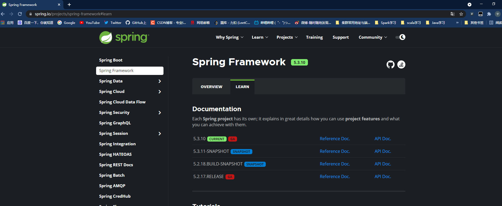
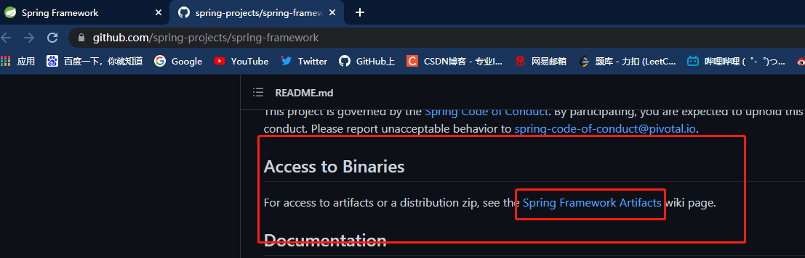
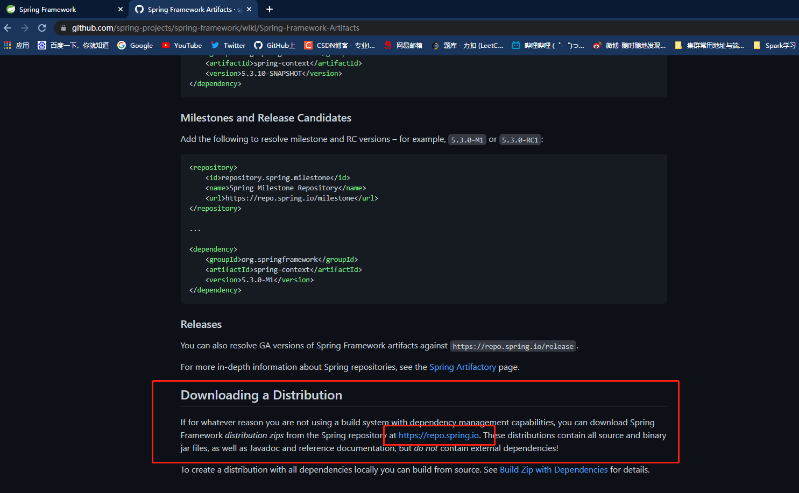
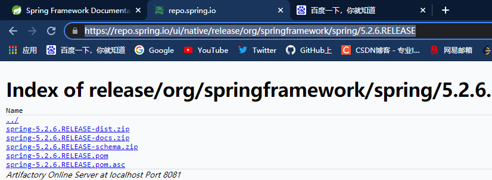
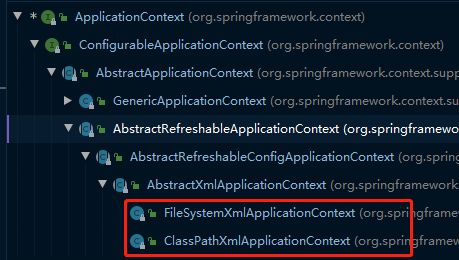
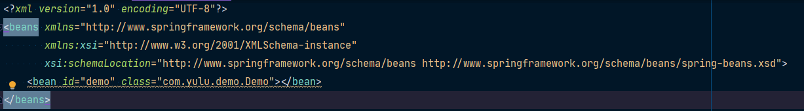

---
title: Spring
---


[TOC]


# Spring概述

Spring是轻量级的开源的J2EE应用程序框架。Spring可以解决企业应用开发的复杂性。

Spring有两个核心部分：IOC和AOP


**IOC**：控制反转，把创建对象过程交给Spring进行管理

**AOP**：面向切面，不修改原代码进行功能的增强

## 特点

1. 方便解耦，简化开发
2. AOP编程的支持
3. 方便程序的测试
4. 方便集成各种优秀框架
5. 降低Java EE API的使用难度
6. Java源码经典学习范例
7. 方便事务的操作


## 下载








https://repo.spring.io/ui/native/release

[最终的下载地址：https://repo.spring.io/ui/native/release/org/springframework/spring/5.2.6.RELEASE](https://repo.spring.io/ui/native/release/org/springframework/spring/5.2.6.RELEASE)




# IOC容器

## IOC底层原理

### 1. 什么是IOC

IOC：控制反转，是面向对象中的一种设计原则，可以用来降低计算机代码之间的耦合度。其中最常见的方式叫做**依赖注入（DI）**，还有一种方式叫“依赖查找”。通过控制反转，对象在被创建的时候，有一个调控系统内所有对象的外界实体将其所依赖的对象的引用传递给它。也可以说，依赖注入到对象中。


通俗一点：**把对象创建和对象之间的调用过程，交给Spring进行管理**


**使用IOC目的**：为了耦合度降低


### 2.IOC底层原理

1. XML解析
2. 工厂模式
3. 反射创建对象


### 3. IOC接口

1. <font color=red>IOC思想基于IOC容器完成，IOC容器底层就是对象工厂</font>

2. <font color=red>Spring提供IOC容器实现两种方式：（两个接口）</font>

   - **BeanFactory**

     - IOC容器基本实现，是Spring内部的使用接口，一般不提供开发人员使用

     - > 加载配置文件时，不会创建配置文件里面指定的对象；在获取对象（或使用对象）时才创建对象。

   - **ApplicationContext**

     - 是**BeanFactory**接口的子接口，提供更多更强大的功能，一般有开发人员进行使用

     - > 在加载配置文件时候就会把在配置文件中的对象进行创建。

### 4. ApplicationContext接口实现类



- **FileSystemXmlApplicationContext**
  - Xml文件实际所在的绝对路径
- **ClassPathXmlApplicationContext**
  - Xml文件所在的相对路径位置（相对于scr路径）


## IOC的Bean管理

### 1.什么是Bean管理？

Bean管理指的是两个操作：`Spring创建对象`；`Spring注入属性`

- Spring创建对象

- Spring注入属性

### 2.Bean管理操作的两种方式


#### IOC操作Bean管理（基于XML）

##### 1. 基于Xml方式创建对象



通过Xml文件中的`<bean></bean>`标签配置类，就可以实现对象的创建

>  bean标签中的常用属性：
>
> 1. id属性：唯一标识
> 2. class属性：类全路径（报名+类）

创建对象时，默认也是执行无参数构造方法完成对象的创建


##### 2. 基于Xml方式注入属性

1. **DI**：依赖注入，就是注入属性

   > 属性的注入有两种方式：
   >
   > 1. 使用set方法进行注入
   >
   >    ```xml
   >    <?xml version="1.0" encoding="UTF-8"?>
   >    <beans xmlns="http://www.springframework.org/schema/beans"
   >           xmlns:xsi="http://www.w3.org/2001/XMLSchema-instance"
   >           xsi:schemaLocation="http://www.springframework.org/schema/beans http://www.springframework.org/schema/beans/spring-beans.xsd">
   >        <bean id="demo" class="com.yulu.demo.Demo"/>
   >        <bean id="book" class="com.yulu.demo.Beans.Book">
   >            <property name="bname" value="易筋经"/>
   >            <property name="bauthor" value="达摩老祖"/>
   >        </bean>
   >    </beans>
   >    ```
   >
   >    
   >
   >    ```java
   >    package com.yulu.demo.Beans;
   >    
   >    public class Book {
   >        private String bname;
   >        private String bauthor;
   >    
   >        public Book() {
   >        }
   >    
   >        public void setBname(String bname) {
   >            this.bname = bname;
   >        }
   >    
   >        public void setBauthor(String bauthor) {
   >            this.bauthor = bauthor;
   >        }
   >    
   >        public void printInfo(){
   >            System.out.println("bname::"+bname+"\t bauthor::"+bauthor);
   >        }
   >    }
   >    ```
   >
   >    ```java
   >        @Test
   >        public void testBook(){
   >            // 加载spring配置文件
   >            ApplicationContext context = new ClassPathXmlApplicationContext("spring-config.xml");
   >            // 得到spring配置文件配置的bean对象
   >            Book book = context.getBean("book", Book.class);
   >            System.out.println(book);
   >            book.printInfo();
   >        }
   >    
   >    com.yulu.demo.Beans.Book@43738a82
   >    bname::易筋经	 bauthor::达摩老祖
   >    ```
   >
   >    
   >
   > 2. 使用有参数构造进行注入
   >
   >    ```xml
   >             
   >        <bean id="order" class="com.yulu.demo.Beans.Order">
   >            <constructor-arg name="orderId" value="order::1"></constructor-arg>
   >            <constructor-arg name="orderUser" value="yulu"></constructor-arg>
   >        </bean>
   >             
   >    ```
   >
   >    ```java
   >    package com.yulu.demo.Beans;
   >             
   >    public class Order {
   >        private String orderId;
   >        private String orderUser;
   >             
   >        public Order(String orderId, String orderUser) {
   >            this.orderId = orderId;
   >            this.orderUser = orderUser;
   >        }
   >             
   >        public void printInfo(){
   >            System.out.println("orderId::"+orderId+"\t orderUser::"+orderUser);
   >        }
   >    }
   >    ```
   >
   >    ```java
   >        @Test
   >        public void testOrder(){
   >            ApplicationContext context = new ClassPathXmlApplicationContext("spring-config.xml");
   >            Order order = context.getBean("order", Order.class);
   >            System.out.println(order);
   >            order.printInfo();
   >        }
   >    com.yulu.demo.Beans.Order@545997b1
   >    orderId::order::1	 orderUser::yulu
   >    ```
   >
   >    


#### IOC操作Bean管理（基于注解）


# AOP


# JDBCTemplate


# 事务管理


# Spring5新特性