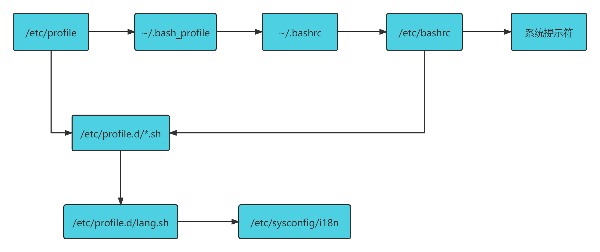

# Shell学习笔记


## 输入输出重定向

### 1. 标准输入输出

| 设备   | 设备文件名    | 文件描述符 | 类型         |
| ------ | ------------- | ---------- | ------------ |
| 键盘   | `/dev/stdin`  | 0          | 标准输入     |
| 显示器 | `/dev/sdtout` | 1          | 标准输出     |
| 显示器 | `/dev/sdterr` | 2          | 标准错误输出 |

### 2. 输出重定向

| 类型                                              | 符号                    | 作用                                                       |
| ------------------------------------------------- | ----------------------- | ---------------------------------------------------------- |
| 标准输出重定向                                    | 命令 > 文件             | 以覆盖的方式，把命令的正确输出输出到指定的文件或设备当中   |
|                                                   | 命令 >> 文件            | 以追加的方式，把命令的正确输出输出到指定的文件或设备当中   |
| 标准错误输出重定向                                | 错误命令 2> 文件        | 以覆盖的方式，把命令的错误输出输出到指定的文件或设备当中。 |
|                                                   | 错误命令 2>> 文件       | 以追加的方式，把命令的错误输出输出到指定的文件中。         |
| <font color=red>正确输出和错误输出同时保存</font> | 命令 > 文件 2>&1        | 以覆盖的方式，把正确输出和错误输出都保存到同一个文件当中   |
|                                                   | 命令 >> 文件 2>&1       | 以追加的方式，把正确输出和错误输出都保存到同一个文件当中   |
|                                                   | 命令 &> 文件            | 以覆盖的方式，把正确输出和错误输出都保存到同一个文件当中   |
|                                                   | 命令 &>> 文件           | 以追加的方式，把正确输出和错误输出都保存到同一个文件中     |
|                                                   | 命令 >> 文件1 2>> 文件2 | 把正确的输出追加到文件1中，把错误的输出追加到文件2中       |

有一种常用的方式

```shell
ls &>> /dev/null  #  将命令的正确输出和错误输出都输出到黑洞中
```


### 3. 输入重定向

`命令 < 文件` 把文件作为命令的输入

例子： wc统计文件中的 行、词、字节

```java
public class Demo2 {
    public static void main(String[] args) throws InterruptedException {
        while (true) {
            System.out.println("hello");
            Thread.sleep(1000);
        }
    }
}
```

```shell
[hadoop@kube-master1 Files]$ wc < Demo2.java 
  8  20 216
```


## 多命令顺序执行与管道符

### 命令顺序执行，逻辑与执行，逻辑或执行

| 多命令执行 | 格式             | 作用                                                         |
| ---------- | ---------------- | ------------------------------------------------------------ |
| `;`        | `命令1 ; 命令2`  | 多个命令顺序执行，命令之间没有任何逻辑联系                   |
| `&&`       | `命令1 && 命令2` | 逻辑与<br />当命令1正确执行，则命令2才会执行<br />当命令1执行不正确，则命令2不会执行 |
| `||`       | `命令1 || 命令2` | 逻辑或<br />当命令1执行不正确，则命令2才会执行<br />当命令1正确执行，则命令2不会执行 |

举例：

1. 统计磁盘复制时间

```shell
# dd 命令 复制磁盘
dd if=输入文件 of=输出文件 bs=字节数 count=个数
选项：
	if=输入文件		指定源文件或源设备
	of=输出文件		执行目标文件或目标设备
	bs=字节数		 指定一次输入/输出多少字节，即把这些字节看做一个数据块
	count=个数	  指定输入/输出多少个数据块
root@localhost~]# date; dd if=/dev/zero of=/root/testfile bs=1k count=100000; date
# 上述命令可以查看复制磁盘数据所花费的时间

```

2. 编译软件(`configure`完成后才可以`make`完成后才可以执行`make install` )

```shell
./configure && make && make install
```

例子2：

```shell
[root@localhost ~]# 命令 && echo yes || echo no
# 如果 命令执行成功 则输出 yes ，如果命令执行失败，则输出 no
```


### 管道符

```shell
[root@loaclhost ~]# 命令1 | 命令2
# 命令1的正确输出作为命令2的操作对象
```


`grep`命令

```shell
grep [选项] "搜索内容" 文件
选项：
	-i		忽略大小写
	-n		输出行号
	-v		反向查找（查找处理需要查找关键内容 之外 的 内容）
	--color=auto	搜索出的关键字用颜色显示

例如：
grep -v "abc" text.java  # 查找除了包含abc之外的内容
```


## 通配符和其他特殊符号

| 通配符 | 作用                                                         |
| ------ | ------------------------------------------------------------ |
| ?      | 匹配一个任意字符                                             |
| *      | 匹配0个或任意多个任意字符，也就是可以匹配任何内容；例如删除一个文件夹中的所有文件：`rm -rf /home/files/*` |
| []     | 匹配中括号中的任意一个字符，例如：`[abc]`代表一定匹配一个字符，要么是`a`，要么是`b`，要么是`c`。 |
| [-]    | 匹配中括号中任意一个字符，`-`代表一个范围，例如`[a-z]`代表匹配一个a到z的小写字母 |
| [^]    | 逻辑非，表示匹配不是中括号内的一个字符                       |

举几个例子：

```shell
rm -rf *		# 删除所在目录下的所有文件
ls ?abc			# 列出以abc结尾的，名字为4位的所有文件
ls *abc			# 列出以abc结尾的所有文件
ls [0-9]*		# 列出以数字开头的所有文件
ls [^0-9]		# 列出不以数字开头的所有文件
```

| 特殊符号 | 作用                                                         |
| -------- | ------------------------------------------------------------ |
| `''`     | 单引号。在单引号中所有的特殊符号，如`$`和``` `（反引号）都没有特殊含义 |
| `""`     | 双引号。在双引号中特殊符号都没有特殊含义，但是`$`、``` `和`\`是例外，拥有**调用变量的值**、**引用命令**、**转义符**的特殊含义 |
| ``` `    | 反引号。反引号括起来的内容是系统命令，在Bash中会先执行它。和`$()`作用一样，不过推荐使用`$()`，因为反引号非常容易看错 |
| `$()`    | 和反引号作用一样，用来引用系统命令                           |
| `#`      | 在Shell脚本中，#开头的行代表注释                             |
| `$`      | 用于调用变量的值，如需要调用变量name的值时，需要用`$name`的方式得到变量的值 |
| `\`      | 转义符，跟在`\`之后的特殊符号将失去特殊含义，变为普通字符<br />如`\$`将输出$符号，而不当做是变量引用。 |


## Bash变量

- 在Bash中，变量的**默认**类型都是**字符串**类型，如果要进行数值运算，则必须指定变量类型为**数值型**
- 变量用`=`连接，等号左右两侧不能有空格
- 变量的值如果有空格，需要使用单引号` `` `或者`""`包括（因为空格在shell中，默认为分割符）
- 在变量的值中，可以使用`\`转义符
- 如果需要增加变量的值，那么可以进行变量值的累加。不过变量需要用`""`包含
  - `"$变量名"`
  - `${变量名}`
- 如果把命令的结果作为变量值赋予变量，则需要使用反引号或者`$()`包含命令
- 环境变量名建议大写，便于区分

**变量的分类**

> - 用户自定义变量
> - 环境变量：这种变量中主要保存的是和系统操作环境相关的数据
> - 位置参数变量：这种变量主要是用来向脚本当中传递参数或数据的，变量名不能自定义，变量作用是固定的。
> - 预定义变量：是Bash中已经定义好的变量，变量名不能自定义，变量作用也是固定的。

### 用户自定义变量（本地变量）

用户自定义变量只存在于当前shell中，父Shell和子Shell都访问不到

```shell
name=$(date)
name2=${name}abc  # 变量叠加
name3="$name"abc  # 变量叠加
echo $name2
# set命令可以查看所有变量
set
# 删除变量
unset 变量名
```


### 环境变量

用户自定义变量只在当前的Shell中生效，而环境变量会在当前Shell和这个Shell的所有子Shell中生效。如果把环境变量写入相应的配置文件，那么这个环境变量就会在所有的Shell中生效。

- 设置环境变量 `export 环境变量名=环境变量值`
- 查询环境变量 `env`
- 删除环境变量 `unset`

:bulb:**补充命令**

> `pstree`：查看进程树

#### 系统常见的环境变量

- PATH：系统查找命令的路径

  - PATH用`:`进行分隔

    - > ```shell
      > yu@PC:~$ echo $PATH 
      > /home/yu/bin:/usr/local/sbin:/usr/local/bin:/usr/sbin:/usr/bin:/sbin:/bin:/usr/games:/usr/local/games:/snap/bin
      > ```

  - PATH变量叠加

    - > ```shell
      > PATH="$PATH":/root/sh
      > 
      > PATH=${PATH}:/root/sh
      > ```

- PS1：定义系统提示符的变量

  - | 符号 | 说明                                                         |
    | ---- | ------------------------------------------------------------ |
    | `\d` | 显示日期，格式为：“星期  月  日”                             |
    | `\h` | 显示简写主机名。如默认的主机名“localhost”                    |
    | `\t` | 显示24小时制时间，格式为“HH:MM:SS”                           |
    | `\T` | 显示12小时制时间，格式为“HH:MM:SS”                           |
    | `\A` | 显示24小时制时间，格式为“HH:MM”                              |
    | `\u` | 显示当前用户名                                               |
    | `\w` | 显示当前所在目录的完整名称                                   |
    | `\W` | 显示当前所在目录的最后一个目录                               |
    | `\#` | 执行的第几个命令                                             |
    | `\$` | 提示符。如果是root用户会显示提示为"#"，如果是普通用户，会显示提示符为“$” |

  - > ```shell
    > yu@PC:~$ echo $PS1
    > \[\e]0;\u@\h: \w\a\]${debian_chroot:+($debian_chroot)}\u@\h:\w\$
    > 
    > # 重新设置PS1变量
    > yu@PC:~$ PS1='[\u@\h \t \w]:\#\$'
    > [yu@PC 15:53:58 ~]:9$
    > # [用户名@主机名 时间 完整目录]:执行的第几个命令 提示符
    > ```


### 位置参数变量

| 位置参数变量 | 作用                                                         |
| ------------ | ------------------------------------------------------------ |
| `$n`         | n为数字，`$0`代表命令本身（执行的是什么命令，`$0`就是什么），`$1`~`$9`代表第1到第9个参数，十以上的参数需要用大括号包含，如`${10}` |
| `$*`         | 这个变量代表命令行中所有的参数，`$*`把所有的参数看成一个整体· |
| `$@`         | 这个变量也代表命令行中所有的参数，不过`$@`把每个参数区分对待 |
| `$#`         | 这个变量代表命令行中所有参数的个数                           |

**求两个数的和**

```shell
#!/bin/bash

num1=$1
num2=$2

sum=$(($num1+$num2))
echo -e "\e[1;32m $sum \e[0m"
```


```shell
yu@PC:~/bin$ cat ./test1.sh 
#!/bin/bash

echo "A total of $# parameters"

echo "The parameters are : $*"

echo "The parameters are : $@"
yu@PC:~/bin$ test1.sh 1 2 3 4 5 6
A total of 6 parameters
The parameters are : 1 2 3 4 5 6
The parameters are : 1 2 3 4 5 6

```

`$* 与 $@`的区别

```shell
for i in "$*"
	do
		echo "The parameter is: $i"
	done
x=1
for y in "$@"
	do
		echo "The parameter$x is : $y"
		x=$(($x + 1))
	done

```


### 预定义变量


| 预定义变量 | 作用                                                         |
| ---------- | ------------------------------------------------------------ |
| `$?`       | 最后一次执行的命令的返回状态。如果这个变量的值为0，证明上一个命令正确执行；如果这个变量的值非0（具体是哪个数，由命令自己来决定），则证明上一个命令执行不正确了<br />举个具体的例子：<br />`命令1&&命令2`或者`命令1||命令2`怎么判断前一条命令是否正确执行呢？通过`$?`即可判断 |
| `$$`       | 当前进程的进程号（PID）                                      |
| `$!`       | 后台运行的最后一个进程的PID                                  |


### 接收键盘输入

```shell
yu@PC:~$ read [选项] [变量名]
选项：
	-p "提示信息"		在等待read输入时，输出提示信息
	-t 秒数			 read命令会一直等待用户输入，使用此选项可以指定等待时间
	-n 字符数			read命令只要接受指定的字符数，就会执行（不用等待回车）
	-s				  隐藏输入的数据，适用于机密信息的输入
```


```shell
yu@PC:~/bin$ cat ./readDemo.sh 
#!/bin/bash
# 提示“请输入姓名”并等待30s，把用户的输入保存在变量name中
read -t 30 -p "Please input your name: " name
echo "Name is $name"

# 年龄是隐私，所以我们使用 -s 选项来隐藏输入
read -s -t 30 -p "Please enter your age" age
echo -e "\n"
echo "Age is $age"

# 使用“-n 1”选项只接收输入字符就会执行，（都不用输入回车）
read -n 1 -t 30 -p "Please select your gender[M/F]:" gender
echo -e "\n"
echo "Sex is $gender"

yu@PC:~/bin$ vim readDemo.sh
yu@PC:~/bin$ chmod 755 ./readDemo.sh 
yu@PC:~/bin$ readDemo.sh 
Please input your name: luyu
Name is luyu
Please enter your age

Age is 12
Please select your gender[M/F]:M

Sex is M
```


## 数值运算与运算符

```shell
aa=11
bb=22
cc=$aa+$22
echo $cc

输出： 11+22
原因： shell变量的默认类型全部为 字符串 类型
```

### 数值运算

#### declare 声明变量类型

```shell
declare [+/-][选项] 变量名
选项：
	-			给变量设定类型属性
	+			取消变量的类型属性
	-i			将变量声明为正数型（integer）
	-x			将变量声明为环境变量
	-p			显示执行变量的被声明的类型
```

#### 方法1：declare声明类型

```shell
aa=11
bb=22
declare -i cc=$aa+$bb
```

#### 方法2：expr或let数值运算工具

```shell
aa=11
bb=22
dd=$(expr $aa + $bb)  # 注意，这里面加号左右必须有空格
echo $dd
33
```

#### 方法3：$((运算式)) 或 $[运算式]   (推荐)

```shell
aa=11
bb=22
ff=$(($aa+$bb))
gg=$[$aa+$bb]
```


### 运算符

| 优先级 | 运算符                                       | 说明                               |
| ------ | -------------------------------------------- | ---------------------------------- |
| 13     | `-, +`                                       | 单目负， 单目正                    |
| 12     | `!, ~`                                       | 逻辑非，按位取反或补码             |
| 11     | `*, /, %`                                    | 乘、除、取模                       |
| 10     | `+, -`                                       | 加、减                             |
| 9      | `<< , >>`                                    | 按位左移、按位右移                 |
| 8      | `<=, >= < >`                                 | 小于或等于，大于或等于，小于，大于 |
| 7      | `==, !=`                                     | 等于，不等于                       |
| 6      | `&`                                          | 按位与                             |
| 5      | `^`                                          | 按位异或                           |
| 4      | `|`                                          | 按位或                             |
| 3      | `&&`                                         | 逻辑与                             |
| 2      | `||`                                         | 逻辑或                             |
| 1      | `=, +=, -=, *=, /=,%=, &=, ^=, |=, <<=, >>=` | 赋值，运算且赋值                   |


### 变量测试 与 内容替换

| 变量置换方式 | 变量y没有设置                  | 变量y为空值                 | 变量y设置值 |
| ------------ | ------------------------------ | --------------------------- | ----------- |
| x=${y-新值}  | x= 新值                        | x 为空（`x="" # ""为空值`） | x=$y        |
| x=${y:-新值} | x= 新值                        | x= 新值                     | x=$y        |
| x=${y+新值}  | x 为空                         | x= 新值                     | x=新值      |
| x=${y:+新值} | x 为空                         | x 为空                      | x=新值      |
| x=${y=新值}  | x= 新值                        | x 为空                      | x=$y        |
| y= 新值      | y 值不变                       | y值不变                     |             |
| x=${y:=新值} | x= 新值                        | X= 新值                     | x=$y        |
| y= 新值      | y= 新值                        | y值不变                     |             |
| x=${y?新值}  | 新值输出到标准错误输出（屏幕） | x 为空                      | x=$y        |
| x=${y:?新值} | 新值输出到标准错误输出         | 新值输出到标准错误输出      | x=$y        |

## 环境变量配置文件

### :bulb:source 命令

` source 配置文件`

`. 配置文件` 和`source 配置文件`作用一致。

### 环境变量配置文件简介

> 环境变量配置文件中主要是定义对系统的操作环境生效的系统默认环境变量，比如：`PATH`,`HISTSIZE`,`PS1`,`HOSTNAME`等默认环境变量

- `/etc/profile`
- `/etc/profile.d/*.sh`
- `/etc/bashrc`

<font color=green>上述三个`etc`目录下的三个配置文件对所有登录linux系统的用户全都生效</font>

- `~/.bash_profile`
- `~/.bashrc`

上述两个文件，只对当前登录用户生效

**配置文件的调用顺序**




### 环境变量配置文件作用

#### :butterfly:`/etc/profile`的作用

- USER变量
- LOGNAME变量
- MAIL变量
- PATH变量
- HOSTNAME变量
- HISTSIZE变量
- umask：系统默认权限
- 调用`/etc/profile.d/*.sh`


### 其他配置文件和登录信息

#### 注销时生效的配置文件

`~/.bash_logout`

#### 历史命令保存文件

`~/.bash_history`


#### Shell 登录信息

**本地终端欢迎信息：`/etc/issue`**

| 转义符 | 作用                             |
| ------ | -------------------------------- |
| `\d`   | 显示当前系统日期                 |
| `\s`   | 显示操作系统名称                 |
| `\l`   | 显示登录的终端号，这个比较常用   |
| `\m`   | 显示硬件体系结构，如i386，i686等 |
| `\n`   | 显示主机名                       |
| `\o`   | 显示域名                         |
| `\r`   | 显示内核版本                     |
| `\t`   | 显示当前系统时间                 |
| `\u`   | 显示当前登录用户的序列号         |

**远程终端欢迎信息： `/etc/issue.net`**

- 转义符在`/etc/issue.net`文件中不能使用
- 是否显示此欢迎信息，有ssh的配置文件`/etc/ssh/sshd_config`决定，加入`Banner /etc/issue.net`行才能显示（记得重启SSH服务）

**登录后 欢迎 信息： `/etc/motd`**

不管是本地登录，还是远程登录，都可以显示此欢迎信息


## 正则表达式

- 正则表达式用来在文件中匹配符合条件的字符串，正则是<font color=blue>包含匹配</font>。`grep, awk, sed`等命令可以支持正则表达式。
- 通配符用来匹配符合条件的文件名，通配符是<font color=blue>完全匹配</font>。`ls, find, cp`这些命令不支持正则表达式，所以只能使用Shell自己的通配符来进行匹配了。

|     字符      | 描述                                                         |
| :-----------: | ------------------------------------------------------------ |
|      `\`      | 转义符，将特殊字符无效，仅当成普通的字符来使用               |
|      `^`      | 匹配输入字符串的开始位置。如果设置了RegExp对象的Multiline属性，^也匹配“\n”或“\r”之后的位置。 |
|      `$`      | 匹配输入字符串的结束位置。如果设置了RegExp对象的Multiline属性，$也匹配“\n”或“\r”之前的位置。 |
|      `*`      | 匹配前面的子表达式零次或多次。例如，zo*能匹配“z”以及“zoo”。*等价于{0,}。 |
|      `+`      | 匹配前面的子表达式一次或多次。例如，“zo+”能匹配“zo”以及“zoo”，但不能匹配“z”。+等价于{1,}。 |
|      `?`      | 匹配前面的子表达式零次或一次。例如，“do(es)?”可以匹配“do”或“does”中的“do”。?等价于{0,1}。 |
|     `{n}`     | *n* 是一个非负整数。匹配确定的*n* 次。例如，“o{2}”不能匹配“Bob”中的“o”，但是能匹配“food”中的两个o。 |
|    `{n,}`     | *n* 是一个非负整数。至少匹配*n* 次。例如，“o{2,}”不能匹配“Bob”中的“o”，但能匹配“foooood”中的所有o。“o{1,}”等价于“o+”。“o{0,}”则等价于“o*”。 |
|    `{n,m}`    | *m* 和*n* 均为非负整数，其中*n* <=*m* 。最少匹配*n* 次且最多匹配*m* 次。例如，“o{1,3}”将匹配“fooooood”中的前三个o。“o{0,1}”等价于“o?”。请注意在逗号和两个数之间不能有空格。 |
|      `?`      | 当该字符紧跟在任何一个其他限制符(*,+,?,{*n* },{*n* ,},{*n* ,*m* })后面时，匹配模式是非贪婪的。非贪婪模式尽可能少的匹配所搜索的字符串，而默认的贪婪模式则尽可能多的匹配所搜索的字符串。例如，对于字符串“oooo”，“o+?”将匹配单个“o”，而“o+”将匹配所有“o”。 |
|      `.`      | 匹配除“\*n* ”之外的任何单个字符。要匹配包括“\*n* ”在内的任何字符，请使用像“[.\*n* ]”的模式。 |
|  `(pattern)`  | 匹配pattern并获取这一匹配。所获取的匹配可以从产生的Matches集合得到，在VBScript中使用SubMatches集合，在JScript中则使用$0…$9属性。要匹配圆括号字符，请使用“\(”或“\)”。 |
| `(?:pattern)` | 匹配pattern但不获取匹配结果，也就是说这是一个非获取匹配，不进行存储供以后使用。这在使用“或”字符(\|)来组合一个模式的各个部分是很有用。例如，“industr(?:y\|ies)就是一个比”industry\|industries'更简略的表达式。 |
| `(?=pattern)` | 正向预查，在任何匹配pattern的字符串开始处匹配查找字符串。这是一个非获取匹配，也就是说，该匹配不需要获取供以后使用。例如，“Windows(?=95\|98\|NT\|2000)”能匹配“Windows2000”中的“Windows”，但不能匹配 “Windows3.1”中的“Windows”。预查不消耗字符，也就是说，在一个匹配发生后，在最后一次匹配之后立即开始下一次匹配的搜索，而不是从包含预查的字符之后开始。 |
| `(?!pattern)` | 负向预查，在任何不匹配pattern的字符串开始处匹配查找字符串。这是一个非获取匹配，也就是说，该匹配不需要获取供以后使用。例如 “Windows(?!95\|98\|NT\|2000)”能匹配“Windows3.1”中的“Windows”，但不能匹配“Windows2000”中的“Windows”。预查不消耗字符，也就是说，在一个匹配发生后，在最后一次匹配之后立即开始下一次匹配的搜索，而不是从包含预查的字符之后开始 |
|     `x|y`     | 匹配x或y。例如，“z\|food”能匹配“z”或“food”。“(z\|f)ood”则匹配“zood”或“food”。 |
|    `[xyz]`    | 字符集合。匹配所包含的任意一个字符。例如，“[abc]”可以匹配“plain”中的“a”。 |
|   `[^xyz]`    | 负值字符集合。匹配未包含的任意字符。例如，“[^abc]”可以匹配“plain”中的“p”。 |
|    `[a-z]`    | 字符范围。匹配指定范围内的任意字符。例如，“[a-z]”可以匹配“a”到“z”范围内的任意小写字母字符。 |
|   `[^a-z]`    | 负值字符范围。匹配任何不在指定范围内的任意字符。例如，“[^a-z]”可以匹配任何不在“a”到“z”范围内的任意字符。 |
|     `\b`      | 匹配一个单词边界，也就是指单词和空格间的位置。例如，“er\b”可以匹配“never”中的“er”，但不能匹配“verb”中的“er”。 |
|     `\B`      | 匹配非单词边界。“er\B”能匹配“verb”中的“er”，但不能匹配“never”中的“er”。 |
|     `\cx`     | 匹配由x指明的控制字符。例如，\cM匹配一个Control-M或回车符。x的值必须为A-Z或a-z之一。否则，将c视为一个原义的“c”字符。 |
|     `\d`      | 匹配一个数字字符。等价于[0-9]。                              |
|     `\D`      | 匹配一个非数字字符。等价于[^0-9]。                           |
|     `\f`      | 匹配一个换页符。等价于\x0c和\cL。                            |
|     `\n`      | 匹配一个换行符。等价于\x0a和\cJ。                            |
|     `\r`      | 匹配一个回车符。等价于\x0d和\cM。                            |
|     `\s`      | 匹配任何空白字符，包括空格、制表符、换页符等等。等价于[\f\n\r\t\v]。 |
|     `\S`      | 匹配任何非空白字符。等价于[^\f\n\r\t\v]。                    |
|     `\t`      | 匹配一个制表符。等价于\x09和\cI。                            |
|     `\v`      | 匹配一个垂直制表符。等价于\x0b和\cK。                        |
|     `\w`      | 匹配包括下划线的任何单词字符。等价于“[A-Za-z0-9_]”。         |
|     `\W`      | 匹配任何非单词字符。等价于“[^A-Za-z0-9_]”。                  |
|     `\xn`     | 匹配*n* ，其中*n* 为十六进制转义值。十六进制转义值必须为确定的两个数字长。例如，“\x41”匹配“A”。“\x041”则等价于“\x04”&“1”。正则表达式中可以使用ASCII编码。. |
|    `\num`     | 匹配*num* ，其中*num* 是一个正整数。对所获取的匹配的引用。例如，“(.)\1”匹配两个连续的相同字符。 |
|      `n`      | 标识一个八进制转义值或一个向后引用。如果\*n* 之前至少*n* 个获取的子表达式，则*n* 为向后引用。否则，如果*n* 为八进制数字(0-7)，则*n* 为一个八进制转义值。 |
|     `\nm`     | 标识一个八进制转义值或一个向后引用。如果\*nm* 之前至少有*nm* 个获得子表达式，则*nm* 为向后引用。如果\*nm* 之前至少有*n* 个获取，则*n* 为一个后跟文字*m* 的向后引用。如果前面的条件都不满足，若*n* 和*m* 均为八进制数字(0-7)，则\*nm* 将匹配八进制转义值*nm* 。 |
|    `\nml`     | 如果*n* 为八进制数字(0-3)，且*m和l* 均为八进制数字(0-7)，则匹配八进制转义值*nm* l。 |
|     `\un`     | 匹配*n* ，其中*n* 是一个用四个十六进制数字表示的Unicode字符。例如，\u00A9匹配版权符号（©）。 |

```shell
grep "a*" file		# 没有任何意义，匹配所有内容，包括空白行
grep "aa*" file		# 匹配至少包含一个a的行
grep "aaa*" file	# 匹配最少包含两个连续a的字符串

grep "s..d" test.txt			# 匹配在s和d这两个字母之间一定有两个字符的单词
grep "s.*d" test.txt			# 匹配在s和d之间有任意字符
grep ".*"	text.txt			# 匹配所有内容

grep "^M" text.txt				# 匹配以大写M开头的行
grep "n$" text.txt				# 匹配以小写n结尾的行
grep -n "^$" text.txt			# 会匹配空白行  (-n选项是为了输出具体的行号)

grep "s[ao]id" text.txt			# 匹配s和i字母中，要么是a，要么是o
grep "[0-9]" text.txt			# 匹配任意一个数字
grep "^[a-z]" text.txt			# 匹配用小写字母开头的行

grep "\.$" text.txt				# 匹配以. 结尾的行

grep "a\{3\}" text.txt			# 匹配a字母连续出现三次的字符串
grep "[0-9]\{3\}" text.txt		# 匹配包含连续的三个数字的字符串
```


## 字符截取命令

grep是提取文本中的行，而cut和awk是提取文本中的列。

### :black_heart:`cut` 字段提取命令

```shell
cut [选项] 文件名
选项：
	-f	列号:			提取第几列
	-d  分隔符：	   按照指定分隔符分割列
yu@PC:~/Files$ cat student.txt 
ID Name gender Mark
1 Liming M 86
2 Sc M 90
3 Gao F 83
yu@PC:~/Files$ cut -d' ' -f 2 student.txt 
Name
Liming
Sc
Gao
yu@PC:~/Files$ 
yu@PC:~/Files$ cut -d' ' -f 0 student.txt 
cut: fields are numbered from 1
# 上述命令说明，cut截取的列号 起始是从1开始的
yu@PC:~/Files$ cut -d' ' -f 2,3 student.txt  # 列号可以指定多列
Name gender
Liming M
Sc M
Gao F
yu@PC:~/Files$ cut -d' ' -f 2-4 student.txt # 列号可以指定连续的列
Name gender Mark
Liming M 86
Sc M 90
Gao F 83
yu@PC:~/Files$ 
```

实际的例子：

```shell
# 假设之前批量添加了一批用户，现在需要找出这些批量添加的用户名都有哪些
root@PC:/home/yu/Files# useradd user1
root@PC:/home/yu/Files# useradd user2
root@PC:/home/yu/Files# useradd user3
root@PC:/home/yu/Files# cat /etc/passwd
root:x:0:0:root:/root:/bin/bash
daemon:x:1:1:daemon:/usr/sbin:/usr/sbin/nologin
bin:x:2:2:bin:/bin:/usr/sbin/nologin
sys:x:3:3:sys:/dev:/usr/sbin/nologin
sync:x:4:65534:sync:/bin:/bin/sync
games:x:5:60:games:/usr/games:/usr/sbin/nologin
man:x:6:12:man:/var/cache/man:/usr/sbin/nologin
lp:x:7:7:lp:/var/spool/lpd:/usr/sbin/nologin
mail:x:8:8:mail:/var/mail:/usr/sbin/nologin
news:x:9:9:news:/var/spool/news:/usr/sbin/nologin
uucp:x:10:10:uucp:/var/spool/uucp:/usr/sbin/nologin
proxy:x:13:13:proxy:/bin:/usr/sbin/nologin
www-data:x:33:33:www-data:/var/www:/usr/sbin/nologin
backup:x:34:34:backup:/var/backups:/usr/sbin/nologin
list:x:38:38:Mailing List Manager:/var/list:/usr/sbin/nologin
irc:x:39:39:ircd:/var/run/ircd:/usr/sbin/nologin
gnats:x:41:41:Gnats Bug-Reporting System (admin):/var/lib/gnats:/usr/sbin/nologin
nobody:x:65534:65534:nobody:/nonexistent:/usr/sbin/nologin
systemd-network:x:100:102:systemd Network Management,,,:/run/systemd:/usr/sbin/nologin
systemd-resolve:x:101:103:systemd Resolver,,,:/run/systemd:/usr/sbin/nologin
systemd-timesync:x:102:104:systemd Time Synchronization,,,:/run/systemd:/usr/sbin/nologin
messagebus:x:103:106::/nonexistent:/usr/sbin/nologin
syslog:x:104:110::/home/syslog:/usr/sbin/nologin
_apt:x:105:65534::/nonexistent:/usr/sbin/nologin
tss:x:106:111:TPM software stack,,,:/var/lib/tpm:/bin/false
uuidd:x:107:114::/run/uuidd:/usr/sbin/nologin
tcpdump:x:108:115::/nonexistent:/usr/sbin/nologin
avahi-autoipd:x:109:116:Avahi autoip daemon,,,:/var/lib/avahi-autoipd:/usr/sbin/nologin
usbmux:x:110:46:usbmux daemon,,,:/var/lib/usbmux:/usr/sbin/nologin
rtkit:x:111:117:RealtimeKit,,,:/proc:/usr/sbin/nologin
dnsmasq:x:112:65534:dnsmasq,,,:/var/lib/misc:/usr/sbin/nologin
cups-pk-helper:x:113:120:user for cups-pk-helper service,,,:/home/cups-pk-helper:/usr/sbin/nologin
speech-dispatcher:x:114:29:Speech Dispatcher,,,:/run/speech-dispatcher:/bin/false
avahi:x:115:121:Avahi mDNS daemon,,,:/var/run/avahi-daemon:/usr/sbin/nologin
kernoops:x:116:65534:Kernel Oops Tracking Daemon,,,:/:/usr/sbin/nologin
saned:x:117:123::/var/lib/saned:/usr/sbin/nologin
nm-openvpn:x:118:124:NetworkManager OpenVPN,,,:/var/lib/openvpn/chroot:/usr/sbin/nologin
hplip:x:119:7:HPLIP system user,,,:/run/hplip:/bin/false
whoopsie:x:120:125::/nonexistent:/bin/false
colord:x:121:126:colord colour management daemon,,,:/var/lib/colord:/usr/sbin/nologin
geoclue:x:122:127::/var/lib/geoclue:/usr/sbin/nologin
pulse:x:123:128:PulseAudio daemon,,,:/var/run/pulse:/usr/sbin/nologin
gnome-initial-setup:x:124:65534::/run/gnome-initial-setup/:/bin/false
gdm:x:125:130:Gnome Display Manager:/var/lib/gdm3:/bin/false
yu:x:1000:1000:YU,,,:/home/yu:/bin/bash
systemd-coredump:x:999:999:systemd Core Dumper:/:/usr/sbin/nologin
sshd:x:126:65534::/run/sshd:/usr/sbin/nologin
user1:x:1001:1001:,,,:/home/user1:/bin/bash
user2:x:1002:1002:,,,:/home/user2:/bin/bash
user3:x:1003:1003:,,,:/home/user3:/bin/bash

# 开始筛选出批量添加的用户名
root@PC:/home/yu/Files# grep "/bin/bash" /etc/passwd
root:x:0:0:root:/root:/bin/bash
yu:x:1000:1000:YU,,,:/home/yu:/bin/bash
user1:x:1001:1001:,,,:/home/user1:/bin/bash
user2:x:1002:1002:,,,:/home/user2:/bin/bash
user3:x:1003:1003:,,,:/home/user3:/bin/bash
root@PC:/home/yu/Files# grep "/bin/bash" /etc/passwd | grep -v "root"  #去掉包含root的行
yu:x:1000:1000:YU,,,:/home/yu:/bin/bash
user1:x:1001:1001:,,,:/home/user1:/bin/bash
user2:x:1002:1002:,,,:/home/user2:/bin/bash
user3:x:1003:1003:,,,:/home/user3:/bin/bash
root@PC:/home/yu/Files# grep "/bin/bash" /etc/passwd | grep -v "root" | cut -d ':' -f 1
yu
user1
user2
user3
# cut命令 指定分隔符:, 提取第一列用户名的行
```

**`cut`命令的局限性**

`df -h | cut -d " " -f 1,3`

```shell
root@PC:/home/yu/Files# df -h
文件系统        容量  已用  可用 已用% 挂载点
udev            3.9G     0  3.9G    0% /dev
tmpfs           794M  1.8M  792M    1% /run
/dev/sda5        49G  7.8G   39G   17% /
tmpfs           3.9G     0  3.9G    0% /dev/shm
tmpfs           5.0M  4.0K  5.0M    1% /run/lock
tmpfs           3.9G     0  3.9G    0% /sys/fs/cgroup
/dev/loop0      128K  128K     0  100% /snap/bare/5
/dev/loop1       55M   55M     0  100% /snap/core18/1705
/dev/loop2       56M   56M     0  100% /snap/core18/2253
/dev/loop4       63M   63M     0  100% /snap/gtk-common-themes/1506
/dev/loop3      241M  241M     0  100% /snap/gnome-3-34-1804/24
/dev/loop5       62M   62M     0  100% /snap/core20/1270
/dev/loop7       66M   66M     0  100% /snap/gtk-common-themes/1519
/dev/loop6      219M  219M     0  100% /snap/gnome-3-34-1804/77
/dev/loop9       43M   43M     0  100% /snap/snapd/14066
/dev/loop8       50M   50M     0  100% /snap/snap-store/433
/dev/loop10      44M   44M     0  100% /snap/snapd/14295
/dev/loop11      55M   55M     0  100% /snap/snap-store/558
/dev/sda1       511M  4.0K  511M    1% /boot/efi
tmpfs           794M   24K  794M    1% /run/user/125
tmpfs           794M  4.0K  794M    1% /run/user/1000
root@PC:/home/yu/Files# df -h | grep sda5 | cut -d " " -f 5 
# 这里就有一个问题，cut命令是一个忠实的执行者， 分隔符如果是空格， 那么-d后面指定几个空格，就会按照几个空格来进行分割，但是有的分割不一定是固定数量的空格，就此cut命令有一定的局限性
```


### :black_heart:`printf` 命令

学习awk命令的前提，`printf`命令会格式化输出。

> `printf '输出类型输出格式' 输出内容`
>
> 输出类型：
>
> - `%ns`	: 输出字符串。n是数字指代输出几个字符
> - `%ni` : 输出整数。n是数字指代输出几个数字
> - ``%m.nf `: 输出浮点数。 m和n是数字，指代输出的整数位数和小数位数。如`%8.2f`代表共输出8位数，其中2位是小数，6位是整数
>
> 输出格式
>
> - `\a`：输出警告声音
> - `\b`：输出退格键，也就是Backspace
> - `\f`：清除屏幕
> - `\n`：换行
> - `\r`：回车，也就是Enter键
> - `\t`：水平输出退格键，也就是Tap键
> - `\v`：垂直输出退格键，也就是Tap键

```shell
root@PC:/home/yu/Files# printf '%s %s %s\n\a' 1 2 3 4 5 6 
1 2 3
4 5 6
# printf 命令也可以输出文件内容，但是需要匹配执行命令的特殊符来使用，无法配合管道来使用
printf '%s' $(cat test.txt)
# printf 输出的内容 不像 cat命令那样会进行漂亮的格式化
```

:bell:<font color=red>那为什么还需要学习`printf`命令呢？</font>

> 因为awk命令中，**不能**直接调用系统命令`cat`，**也不能**直接调用系统命令`echo`，但是能调用系统命令`print和printf`命令。

在`awk`命令中，输出支持`print`和`printf`命令

- `print`：print会在每个输出之后自动加入一个换行符（Linux默认没有print命令，只有在awk命令中才有print）
- `printf`：printf是标准格式输出命令，并不会自动加入换行符，如果需要换行，需要手工假如换行符


### :black_heart:`awk` 命令

`cut`命令能够实现的字符串截取列，`awk`命令都可以实现，但是`awk`命令要比`cut`命令复杂的多，所以在实际使用中，`cut`命令能够实现了，就是用简单的`cut`命令来实现，`cut`命令不能实现的，就是用`awk`命令来实现。

[Linux awk 命令详解 参考](https://www.cnblogs.com/baichunyu/p/15257904.html)

**基础用法**

```shell
awk [选项] '匹配条件1 {脚本命令11;脚本命令12;....} 匹配条件2 {脚本命令21;脚本命令22;....}' 文件名
选项：
	-F fs			# 指定以 fs 作为输入行的分隔符，awk 命令默认分隔符为空格或制表符
```

另一种说法

```shell
awk '条件1{动作1} 条件2{动作2} ...' 文件名
条件（Pattern）
	一般使用关系表达式作为条件
	x>10			判断变量x是否大于10
	x>=10			大于等于
	x<=10			小于等于
动作（Action）
	格式化输出
	流程控制语句
```

`awk`命令会对文件中的每一行都会执行一遍`awk`命令中指定的脚本

简单的例子：

```shell
root@PC:/home/yu/Files# awk '{printf $1 "\t" $2 "\t" $6 "\n"}' student2.txt 
ID	Name	Average
1	Liming	87.66
2	Sc	85.66
3	Gao	91.66
```

:right_anger_bubble:`$0` **表示当前内容的一整行**

截取 `df -h`

```shell
[hadoop@hadoop102 Files]$ df -h | awk '{print $1 "\t" $2 "\t" $3 "\t" $6}'
文件系统	容量	已用	挂载点
devtmpfs	3.8G	0	/dev
tmpfs	3.9G	0	/dev/shm
tmpfs	3.9G	21M	/run
tmpfs	3.9G	0	/sys/fs/cgroup
/dev/mapper/centos-root	46G	19G	/
/dev/sda1	1014M	233M	/boot
tmpfs	781M	0	/run/user/0
tmpfs	781M	0	/run/user/1000
```

:baby_chick:小需求：提取df命令显示后的磁盘已用百分比的具体值

```shell
[hadoop@hadoop102 Files]$ df -h
文件系统                 容量  已用  可用 已用% 挂载点
devtmpfs                 3.8G     0  3.8G    0% /dev
tmpfs                    3.9G     0  3.9G    0% /dev/shm
tmpfs                    3.9G   29M  3.8G    1% /run
tmpfs                    3.9G     0  3.9G    0% /sys/fs/cgroup
/dev/mapper/centos-root   46G   19G   27G   42% /
/dev/sda1               1014M  233M  782M   23% /boot
tmpfs                    781M     0  781M    0% /run/user/0
tmpfs                    781M     0  781M    0% /run/user/1000
```

例如，提取centos-root 已用的`23%`中的23

```shell
[hadoop@hadoop102 Files]$ df -h | grep centos | awk '{print $5}' | awk -F "%" '{print $1}'
42
```

#### BEGIN条件

awk中可以通过BEGIN关键字，来实现在执行后续脚本命令**之前**先执行一些操作，换句话说就是**BEGIN**后面紧接着的脚本在开始真正读取数据之前先被执行，而且不管数据内容有多少行，**BEGIN**后面紧跟着的命令仅执行一遍。

```shell
[hadoop@hadoop102 Files]$ df -h | awk 'BEGIN{print "最先执行"} {print $5}'
最先执行
已用%
0%
0%
1%
0%
42%
23%
0%
0%
```

通过**BEGIN**关键字设置**awk**的**分隔符FS变量**

```shell
[hadoop@hadoop102 Files]$ cat /etc/passwd | awk 'BEGIN{FS=":"} {print $1 "\t" $7}'
root	/bin/bash
bin	/sbin/nologin
daemon	/sbin/nologin
adm	/sbin/nologin
lp	/sbin/nologin
sync	/bin/sync
shutdown	/sbin/shutdown
halt	/sbin/halt
mail	/sbin/nologin
operator	/sbin/nologin
games	/sbin/nologin
ftp	/sbin/nologin
nobody	/sbin/nologin
systemd-network	/sbin/nologin
```

#### END条件

**END**条件后面跟着的脚本是在所有数据都处理完之后最后执行

```shell
awk 'BEGIN{FS=":"} END{print "数据处理完成！"} {print $1 "\t" $2}'
```


#### 关键运算符

比如有如下`student.txt`数据，查询出平均成绩大于等于86分的学生姓名

| ID   | Name   | PHP  | Linux | MySql | Average |
| ---- | ------ | ---- | ----- | ----- | ------- |
| 1    | Liming | 82   | 95    | 86    | 87.66   |
| 2    | Sc     | 74   | 96    | 87    | 85.66   |
| 3    | Gao    | 99   | 83    | 93    | 91.66   |

```shell
cat student.txt | grep -v Name | awk '$6>=86{print $2}'
```

```shell
[hadoop@hadoop102 Files]$ cat student.txt | grep -v Name
1	Liming	82	95	86	87.66
2	Sc	74	96	87	85.66
3	Gao	99	83	93	91.66
[hadoop@hadoop102 Files]$ cat student.txt | grep -v Name | awk '$6>=86{print $2}'
Liming
Gao
```


### :black_heart:`sed` 命令


## 字符处理命令


## 条件判断


## 流程控制


